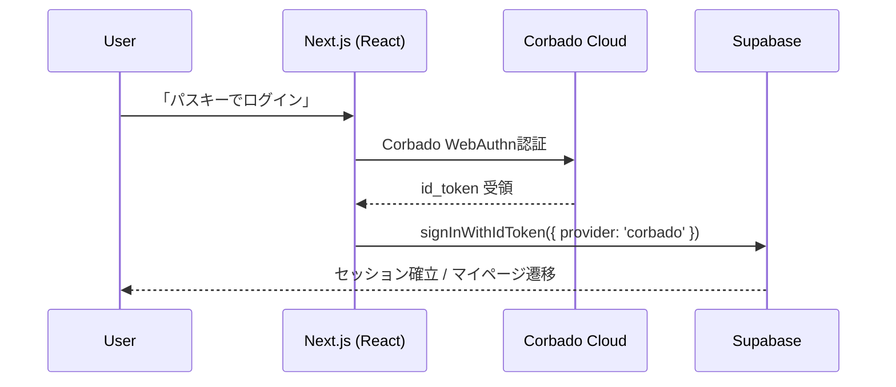
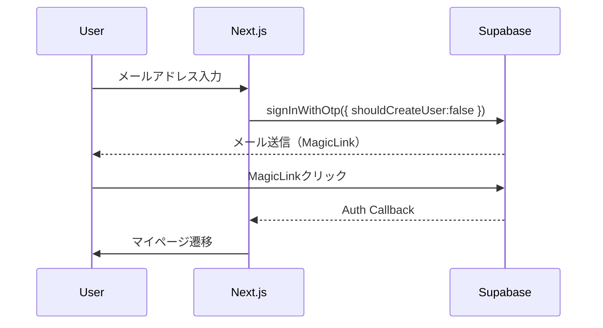

# HarmoNet 技術スタック定義書 v4.1

**Document ID:** HARMONET-TECH-STACK-V4.1
**Version:** 4.1
**Created:** 2025-11-11
**Author:** Tachikoma
**Reviewer:** TKD
**Status:** ✅ 初版

---

## 第1章 概要

本書は、HarmoNetプロジェクトにおける技術基盤を定義する。
v4.1では、認証基盤のCorbado構成を**HarmoNet独自UIを用いたハイブリッド構成**として正式化した。

変更目的は以下の通り：

* Corbado公式UI構成（@corbado/react）を採用せず、PasskeyButton(A-02) による自前UIを明示。
* Corbado SDKはトークン管理およびWebAuthn処理のみに利用。
* 長期運用時の外部依存更新リスクを最小化。

---

## 第2章 技術スタック構成

### 2.1 フロントエンド

| 項目        | 採用技術                         | 備考                  |
| --------- | ---------------------------- | ------------------- |
| フレームワーク   | Next.js 16 (App Router)      | Server Components対応 |
| 言語        | TypeScript 5.6               | 型安全                 |
| ライブラリ     | React 19                     | use client対応        |
| スタイル      | TailwindCSS 3.4              | Appleカタログ風トーン       |
| 状態管理      | React Hooks                  | 軽量構成                |
| 国際化       | StaticI18nProvider           | JSON辞書方式            |
| ビルド       | Turbopack                    | Next.js標準ビルド        |
| テスト       | Jest + React Testing Library | コンポーネント単位検証         |
| UIコンポーネント | lucide-react                 | 線形アイコン採用            |

---

### 2.2 バックエンド

| 項目    | 採用技術                                  | 備考                                                       |
| ----- | ------------------------------------- | -------------------------------------------------------- |
| BaaS  | Supabase v2.43                        | PostgreSQLベース                                            |
| 言語    | TypeScript / SQL                      | Prisma + SQL直記述併用                                        |
| 認証基盤  | Supabase Auth + Corbado SDK（Hybrid構成） | Corbado: トークン・WebAuthn処理のみ利用、UIは自前PasskeyButton(A-02)で提供 |
| ORM   | Prisma                                | schema.prismaで管理                                         |
| DB    | PostgreSQL 17                         | Docker内Supabaseコンテナ                                      |
| キャッシュ | Redis (将来拡張)                          | 翻訳キャッシュ予定                                                |
| ストレージ | Supabase Storage                      | ファイル・画像保存                                                |
| メール   | Supabase Auth SMTP                    | MagicLink送信                                              |
| 外部API | Corbado Cloud / Mail SMTP             | Passkey・MagicLink                                        |

---

### 2.3 インフラ構成

| 項目     | 採用技術                    | 備考             |
| ------ | ----------------------- | -------------- |
| コンテナ基盤 | Docker Desktop          | ローカル開発環境       |
| 本番環境   | Supabase Cloud + Vercel | CI/CD統合        |
| モニタリング | Sentry / Supabase Logs  | 監査ログ取得         |
| セキュリティ | HTTPS必須・RLS適用           | Origin/RP ID固定 |
| テレメトリ  | Posthog (将来拡張)          | UX解析予定         |

---

## 第3章 認証構成（改訂）

### 3.1 HarmoNet ハイブリッド構成

| 層       | SDK                                                    | 役割                                  |
| ------- | ------------------------------------------------------ | ----------------------------------- |
| フロントエンド | `@corbado/web-js`                                      | WebAuthn認証およびトークン取得（UI制御はHarmoNet側） |
| サーバーサイド | `@corbado/node`                                        | JWT検証およびSupabase Auth連携             |
| Cookie  | `cbo_short_session`                                    | Corbado発行のセッションCookie               |
| API     | `/api/session`                                         | Corbado JWT検証＋Supabase連携            |
| 環境変数    | `NEXT_PUBLIC_CORBADO_PROJECT_ID`, `CORBADO_API_SECRET` | Corbadoダッシュボード発行値                   |

---

### 3.2 認証フロー（Passkeyハイブリッド構成）

---

### 3.3 認証フロー（MagicLink）

---

### 3.4 Supabase連携仕様

| 項目         | 内容                                           |
| ---------- | -------------------------------------------- |
| セッション検証    | Corbado JWTを @corbado/node で検証               |
| Supabase連携 | `signInWithIdToken({ provider: 'corbado' })` |
| 代替構成       | Supabase Admin API経由でユーザー作成                  |
| RLS制御      | CorbadoユーザーIDで行レベル制御                         |
| JWT有効期限    | <1h（Corbado）＋自動更新（Supabase側）                 |

---

## 第4章 環境変数設定

| 変数名                            | 用途                        |
| ------------------------------ | ------------------------- |
| NEXT_PUBLIC_CORBADO_PROJECT_ID | CorbadoプロジェクトID           |
| CORBADO_API_SECRET             | Corbado APIシークレット（サーバー専用） |
| NEXT_PUBLIC_SUPABASE_URL       | Supabase URL              |
| NEXT_PUBLIC_SUPABASE_ANON_KEY  | Supabase匿名キー              |
| SUPABASE_SERVICE_ROLE_KEY      | Supabaseサービスキー（API用）      |
| NEXT_PUBLIC_APP_URL            | 環境URL（CORS設定用）            |

---

## 第5章 セキュリティ方針

・HTTPS通信必須（WebAuthn要件）
・Origin/RP IDをCorbado管理画面で固定
・Corbado Cookie (cbo_short_session) は Secure/Lax 設定
・Supabase RLSを全テーブルで有効化
・SupabaseポリシーにCorbado JWT連携を明示
・CORS許可ドメインを NEXT_PUBLIC_APP_URL のみに限定

---

## 第6章 多言語対応

| 項目      | 設計方針                                 |
| ------- | ------------------------------------ |
| フレームワーク | StaticI18nProvider                   |
| データ構成   | `/public/locales/{lang}/common.json` |
| 標準言語    | ja, en, zh                           |
| 適用範囲    | 全ログイン系UI（MagicLink / PasskeyButton）  |

---

## 第7章 メンテナンス・拡張性

1.SDKバージョンを月次監視（Corbado / Supabase）
2.Corbado公式リポジトリ passkeys-nextjs の更新追随
3.テレメトリ・ログ監視をSentryで一元管理
4.サービスロールキーのローテーションを半年周期で実施

---

## 第8章 変更履歴

| Version  | Date           | Author              | Description                                                                |
| -------- | -------------- | ------------------- | -------------------------------------------------------------------------- |
| v3.9     | 2025-11-07     | TKD / Tachikoma     | 初期Corbado導入版（@corbado/web-js）                                              |
| v4.0     | 2025-11-10     | TKD / Tachikoma     | Corbado公式構成（@corbado/react + @corbado/node）へ移行。@corbado/web-jsを廃止。認証フロー更新。 |
| **v4.1** | **2025-11-11** | **TKD / Tachikoma** | **Corbado公式UI構成を廃止し、PasskeyButton(A-02)による独自UIとのハイブリッド構成に改訂。**             |

---

## 第9章 参考資料

・Corbado公式 GitHub: passkeys-nextjs
・Qiita: Next.jsとCorbadoを使用したパスキー実装 #TypeScript
・Corbado Docs
・Supabase Docs: Auth SignInWithIdToken
・Next.js 16 Docs

Document Status: ✅ 完成
Approved by: TKD
