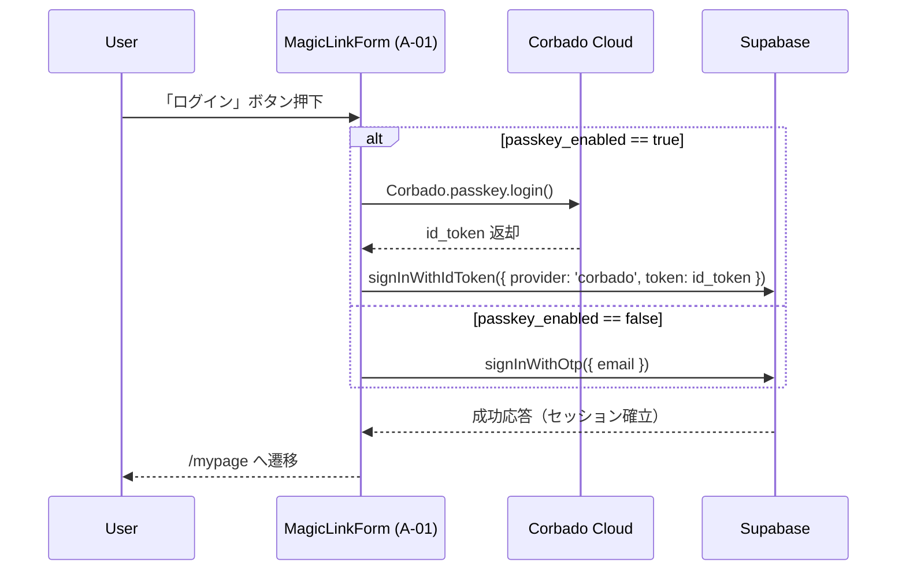

# HarmoNet 技術スタック定義書 v4.2

**Document ID:** HARMONET-TECH-STACK-V4.2
**Version:** 4.2
**Supersedes:** v4.1（修正版）
**Created:** 2025-11-12
**Author:** Tachikoma
**Reviewer:** TKD
**Status:** ✅ Phase9 正式統合版（MagicLink + Passkey 自動認証対応）

---

## 第1章 概要

本書は HarmoNet プロジェクトの技術基盤を体系的に定義するものである。
v4.2では、A‑02 PasskeyButton を廃止し、A‑01 MagicLinkForm に Passkey 自動判定ロジックを統合した正式仕様へ更新した。
Corbado公式UIは使用せず、HarmoNet独自UI構成によるパスワードレス認証を実現する。

---

## 第2章 アーキテクチャ概要

| 層          | 採用技術                                      | 目的                       |
| ---------- | ----------------------------------------- | ------------------------ |
| **UI層**    | Next.js 16 + React 19                     | Appleカタログ風UI / SSR対応     |
| **認証層**    | Supabase Auth + Corbado Web SDK           | MagicLink + Passkey 自動認証 |
| **国際化層**   | StaticI18nProvider (C‑03)                 | JSON辞書による多言語化            |
| **バックエンド** | Supabase (PostgreSQL 17 / Edge Functions) | RLS / tenant_id分離        |
| **CI/CD**  | GitHub Actions + Windsurf + Vitest        | 自動テスト・デプロイ連携             |

---

## 第3章 技術スタック構成

| カテゴリ     | 採用技術                                                  | バージョン        | 用途                   |
| -------- | ----------------------------------------------------- | ------------ | -------------------- |
| フレームワーク  | Next.js                                               | 16.x         | App Router対応         |
| 言語       | TypeScript                                            | 5.6          | 静的型付け・ESM構成          |
| UI / CSS | React 19 + TailwindCSS 3.4 + shadcn/ui                | 最新           | HarmoNet共通トーン        |
| BaaS     | Supabase                                              | v2.43        | Auth / Storage / RLS |
| ORM      | Prisma                                                | v6.x         | スキーマ定義・マイグレーション      |
| 認証SDK    | Corbado Web SDK (`@corbado/web-js` + `@corbado/node`) | v2.x         | WebAuthn / Passkey対応 |
| アイコン     | lucide-react                                          | v0.320       | 線形アイコン標準             |
| 国際化      | StaticI18nProvider                                    | v1.0         | 多言語辞書 (ja/en/zh)     |
| テスト      | Vitest + RTL                                          | 最新           | 単体 / 結合テスト           |
| ビルド      | Turbopack                                             | Next.js標準ビルド |                      |

---

## 第4章 SDK仕様

| SDK名               | 使用箇所                               | 機能               | 備考                                        |
| ------------------ | ---------------------------------- | ---------------- | ----------------------------------------- |
| Supabase JS SDK    | MagicLinkForm, AuthCallbackHandler | OTP / IDトークン認証   | `signInWithOtp()` + `signInWithIdToken()` |
| Corbado Web SDK    | MagicLinkForm (A‑01)               | Passkey認証呼出      | UI非依存構成 (`Corbado.passkey.login()`)       |
| Corbado Node SDK   | サーバーサイド検証                          | トークン検証 / JWT署名確認 | API連携専用                                   |
| Prisma ORM         | DB層                                | スキーマ管理 / RLS整合   | Supabase連携                                |
| StaticI18nProvider | UI層                                | 多言語化             | JSON辞書形式                                  |

---

## 第5章 認証フロー概要

---

## 第6章 通信・API仕様

| 区分               | 呼出元           | メソッド                  | 概要            |
| ---------------- | ------------- | --------------------- | ------------- |
| Supabase Auth    | MagicLinkForm | `signInWithOtp()`     | メールリンク送信      |
| Supabase Auth    | MagicLinkForm | `signInWithIdToken()` | Corbadoトークン連携 |
| Corbado Web SDK  | MagicLinkForm | `passkey.login()`     | WebAuthn起動    |
| Corbado Node SDK | Server        | `verify()`            | トークン署名検証      |

---

## 第7章 セキュリティ指針

* HTTPS通信必須（WebAuthn要件）
* Origin / RP ID を `harmonet.app` で固定
* Supabase RLS: `tenant_id = (auth.jwt() ->> 'tenant_id')`
* Corbado APIキー (`CORBADO_API_SECRET`) は Vault管理
* CORS許可ドメイン: `NEXT_PUBLIC_APP_URL` のみ
* JWT有効期限: 10分
* Secure / HttpOnly Cookie採用

---

## 第8章 RLS・マルチテナント設計

| テーブル          | 主キー       | RLS式                                   | 備考                |
| ------------- | --------- | -------------------------------------- | ----------------- |
| users         | id        | tenant_id = (auth.jwt()->>'tenant_id') | 共通ユーザー基盤          |
| user_profiles | user_id   | tenant_id一致制御                          | passkey_enabled含む |
| tenant_config | tenant_id | is_active = true                       | Corbado設定含む       |

---

## 第9章 運用・拡張性

1. Corbado / Supabase SDK更新を毎月監視。
2. Feature Flag により Passkey機能の段階的リリースを制御。
3. SecretsをGitHub Actions Secrets / Vaultで暗号化管理。
4. CI/CDで `.env.production` を自動生成・破棄。
5. Windsurfによる自動自己採点レポートを活用し、平均スコア9.0以上を維持。

---

## 第10章 関連設計書

| 分類     | ファイル名                                                          | 内容                  |
| ------ | -------------------------------------------------------------- | ------------------- |
| 詳細設計   | `/01_docs/04_詳細設計/01_ログイン画面/MagicLinkForm-detail-design_v1.1/` | MagicLinkForm統合仕様書群 |
| 共通部品   | `StaticI18nProvider-detail-design_v1.0.md`                     | i18n基盤仕様            |
| セキュリティ | `harmonet-security-policy_v3.0.md`                             | 安全基準・脅威モデル          |
| データベース | `schema.prisma` / `enable_rls_policies.sql`                    | RLS実装仕様             |

---

## 第11章 改訂履歴

| Version  | Date           | Author              | Summary                                                              |
| -------- | -------------- | ------------------- | -------------------------------------------------------------------- |
| v4.0     | 2025-11-10     | TKD / Tachikoma     | Corbado公式構成（@corbado/react）導入前構成。                                    |
| v4.1     | 2025-11-12     | TKD / Tachikoma     | A‑02廃止・MagicLinkForm統合。SDK構成を `@corbado/web-js + @corbado/node` に修正。 |
| **v4.2** | **2025-11-12** | **TKD / Tachikoma** | **正式11章構成化。Phase9完全統合仕様として確定。**                                      |

---

**Document Status:** ✅ Phase9 正式版（MagicLink + Passkey 自動認証対応・技術基盤確定）
