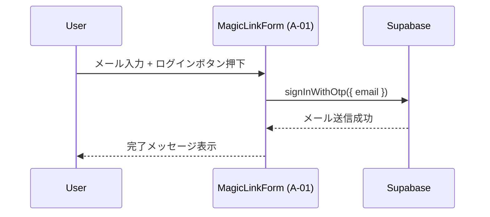

# HarmoNet 技術スタック定義書

**Document ID:** HARMONET-TECH-STACK-V4.4
**Version:** 4.4
**Supersedes:** v4.3
**Created:** 2025-11-19
**Author:** Tachikoma
**Reviewer:** TKD
**Status:** MagicLink 認証専用 / Google Cloud TTS 正式採用版

---

## 第1章 概要

本書は HarmoNet プロジェクト全体で使用する **正式な技術スタック定義書** として記載する。

---

## 第2章 アーキテクチャ概要

| 層          | 採用技術                                  | 用途                                |
| ---------- | ------------------------------------- | --------------------------------- |
| **UI 層**   | Next.js 16 / React 19                 | App Router・CSR/SSR・Apple カタログ風 UI |
| **認証層**    | **Supabase Auth（MagicLink）**          | パスワードレス認証（OTP メール）                |
| **国際化**    | StaticI18nProvider                    | JSON 辞書切替、3言語（JA/EN/ZH）           |
| **翻訳（動的）** | Google Translation API v3             | 投稿・お知らせの多言語翻訳                     |
| **音声**     | **Google Cloud Text-to-Speech (TTS)** | ja/en/zh の多言語音声読み上げ               |
| **バックエンド** | Supabase（PostgreSQL 17, RLS）          | テナント分離・DB管理                       |
| **CI/CD**  | GitHub Actions / Windsurf             | テスト・静的解析・自動実装                     |

---

## 第3章 技術スタック構成

### 3.1 フロントエンド

| カテゴリ      | 技術                 | バージョン | 用途               |
| --------- | ------------------ | ----- | ---------------- |
| Framework | Next.js            | 16.x  | App Router       |
| Language  | TypeScript         | 5.6   | 型安全、ESM          |
| UI        | React 19           | 最新    | Client Component |
| Styling   | TailwindCSS        | 3.4   | UI トーン統一         |
| Icons     | lucide-react       | 最新    | 線形アイコン           |
| i18n      | StaticI18nProvider | v1.1  | スタティック辞書         |
| Testing   | Vitest + RTL       | 最新    | 単体・結合テスト         |

### 3.2 バックエンド

| カテゴリ | 技術         | バージョン | 用途                   |
| ---- | ---------- | ----- | -------------------- |
| BaaS | Supabase   | v2.43 | Auth / Storage / RLS |
| DB   | PostgreSQL | 17    | テナント分離               |
| ORM  | Prisma     | v6.x  | スキーマ管理               |

### 3.3 外部 API / サービス

| 区分 | 技術                              | 用途                  |
| -- | ------------------------------- | ------------------- |
| 翻訳 | **Google Translate API v3**     | 投稿/お知らせのリアルタイム翻訳    |
| 音声 | **Google Cloud Text-to-Speech** | 多言語音声読み上げ（ja/en/zh） |

---

## 第4章 認証方式

### 4.1 MagicLink 認証フロー

### 4.2 MagicLink の特徴

* パスワードレス
* OS 依存 UI が無い
* メールリンクのみで安全なセッション確立
* `/auth/callback` による PKCE / セッション設定

---

## 第5章 音声読み上げ方式（Google Cloud TTS）

### 5.1 採用理由

* 精度の高い多言語 TTS（ja/en/zh）
* Supabase Storage との相性がよくキャッシュ容易
* VOICEVOX と異なり、ブラウザ依存なし
* API 経由で安定運用可能

### 5.2 方式概要

* Next.js API Route（例：`/api/tts`）で Google TTS をラップ
* Supabase Storage にキャッシュ（`tts_cache`）
* UI 再生は `<audio>` ベース

### 5.3 テーブル関連

* `tts_cache`（schema.prisma に定義済み）

---

## 第6章 翻訳方式（Google Translation API）

* 静的ラベルは StaticI18nProvider（common.json）で処理
* 投稿・お知らせなど動的コンテンツは Google 翻訳 API 経由
* 3言語対応（ja/en/zh）
* Supabase Storage / translation_cache でキャッシュ

---

## 第7章 通信・API 構成

| 呼出元           | API/SDK          | メソッド              | 概要     |
| ------------- | ---------------- | ----------------- | ------ |
| MagicLinkForm | Supabase JS SDK  | `signInWithOtp()` | OTP 送信 |
| TTS API       | Google Cloud TTS | `text:synthesize` | 音声生成   |
| 翻訳 API        | Google Translate | `translateText`   | 翻訳     |

---

## 第8章 セキュリティ指針

* **HTTPS/TLS 必須**
* MagicLink 認証は Supabase Auth が管理
* セッション Cookie は HttpOnly / Secure
* RLS により **tenant_id 完全分離**
* 外部 API Key はすべて環境変数で管理

---

## 第9章 RLS / マルチテナント

* JWT Claim の `tenant_id` を基準に全データ行をフィルタ
* Supabase RLS ポリシーで完全分離管理
* Prisma モデルは schema.prisma（最新版）に準拠

---

## 第10章 関連設計書

| 種別         | ファイル名                                    | 内容               |
| ---------- | ---------------------------------------- | ---------------- |
| 詳細設計（A-01） | MagicLinkForm-detail-design_v1.3.md      | MagicLink 専用フォーム |
| 基本設計       | LoginPage-basic-design_v1.0.md           | ログイン UI          |
| 詳細設計       | LoginPage-detail-design_v1.3.md          | ログイン画面構成         |
| 共通部品       | StaticI18nProvider-detail-design_v1.1.md | i18n             |
| 共通部品       | AppHeader/AppFooter/LanguageSwitch       | 共通 UI            |

---

## 第11章 改訂履歴

| Version | Date       | Author        | Summary                                                            |
| ------- | ---------- | ------------- | ------------------------------------------------------------------ |
| v4.4    | 2025-11-19 | Tachikoma     | **Passkey 完全廃止。VOICEBOX 完全廃止。MagicLink + Google TTS に正式統一。全章再構築。** |
| v4.3    | 2025-11-16 | Tachikoma     | MagicLink/Passkey 並列方式版                                            |
| v4.2    | 2025-11-12 | Tachikoma     | MagicLinkForm 内統合版（廃止）                                             |
| v4.1    | 2025-11-12 | TKD/Tachikoma | PasskeyButton 廃止案（未採用）                                             |
| v4.0    | 2025-11-10 | TKD/Tachikoma | 旧仕様                                                                |

---

**End of Document**
