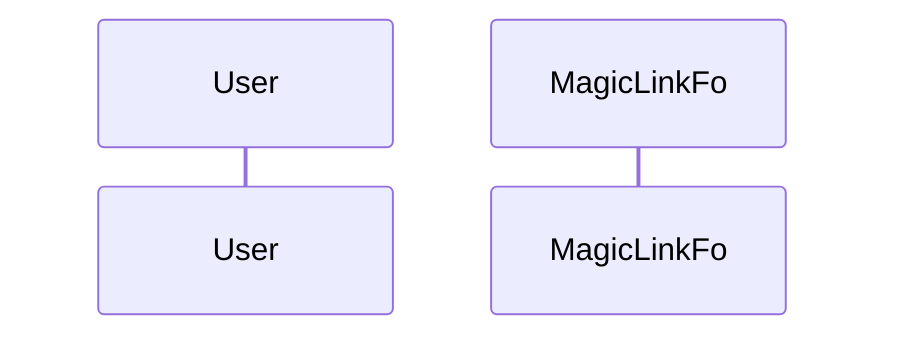

# HarmoNet 技術スタック定義書

**Document ID:** HARMONET-TECH-STACK-V4.5
**Version:** 4.5
**Supersedes:** v4.4
**Created:** 2025-11-19
**Author:** Tachikoma
**Reviewer:** TKD
**Status:** MagicLink 認証専用 / Google Cloud TTS + OpenAI Moderation 採用版

---

## 第1章 概要

本書は HarmoNet プロジェクト全体で使用する **正式な技術スタック定義書** として記載する。

---

## 第2章 アーキテクチャ概要

| 層           | 採用技術                                       | 用途                               |
| ----------- | ------------------------------------------ | -------------------------------- |
| フロントエンド     | Next.js (App Router) / React 19 / Tailwind | UI レイヤ、画面遷移、フォーム、i18n、音声読み上げのトリガ |
| バックエンド(API) | Supabase Auth / Supabase Edge Functions    | 認証・権限・DB 連携・MagicLink            |
| DB/RLS      | Supabase PostgreSQL + Prisma               | スキーマ管理・マルチテナント RLS               |
| 外部サービス      | Google Cloud APIs / OpenAI API             | 翻訳・音声合成・AIモデレーション                |

---

## 第3章 技術スタック一覧

### 3.1 フロントエンド

| カテゴリ      | 技術                 | バージョン | 用途               |
| --------- | ------------------ | ----- | ---------------- |
| Framework | Next.js            | 16.x  | App Router       |
| Language  | TypeScript         | 5.6   | 型安全、ESM          |
| UI        | React 19           | 最新    | Client Component |
| Styling   | TailwindCSS        | 3.4   | UI トーン統一         |
| Icons     | lucide-react       | 最新    | 線形アイコン           |
| i18n      | StaticI18nProvider | v1.1  | スタティック辞書         |
| Testing   | Vitest + RTL       | 最新    | 単体・結合テスト         |

### 3.2 バックエンド

| カテゴリ | 技術         | バージョン | 用途                   |
| ---- | ---------- | ----- | -------------------- |
| BaaS | Supabase   | v2.43 | Auth / Storage / RLS |
| DB   | PostgreSQL | 17    | テナント分離               |
| ORM  | Prisma     | v6.x  | スキーマ管理               |

### 3.3 外部 API / サービス

| 区分 | 技術                                                   | 用途                          |
| -- | ---------------------------------------------------- | --------------------------- |
| 翻訳 | **Google Translate API v3**                          | 投稿/お知らせのリアルタイム翻訳            |
| 音声 | **Google Cloud Text-to-Speech**                      | 多言語音声読み上げ（ja/en/zh）         |
| AI | **OpenAI Moderation API (`omni-moderation-latest`)** | 掲示板投稿内容のAIモデレーション（不適切投稿の抑止） |

---

## 第4章 認証方式

### 4.1 MagicLink 認証フロー

※ 認証フローの詳細は LoginPage/MagicLinkForm 詳細設計書を参照。

---

## 第5章 翻訳・多言語対応

* Google Cloud Translation API v3 を利用し、ja/en/zh の 3か国語に対応
* StaticI18nProvider で UI ラベルを静的辞書から供給
* 投稿本文は動的翻訳（API 呼び出し）＋キャッシュ（Supabase）で運用

---

## 第6章 音声読み上げ

* Google Cloud Text-to-Speech を利用
* ja/en/zh の 3言語に対応
* VOICEBOX は採用しない（廃止）

---

## 第7章 ログ / モニタリング

* Supabase ログと Vercel ログを利用
* Sentry 等の外部モニタリングサービスは導入しない
* ログは主に障害解析・問い合わせ対応に使用

---

## 第8章 セキュリティ指針

* **HTTPS/TLS 必須**
* MagicLink 認証は Supabase Auth が管理
* セッション Cookie は HttpOnly / Secure
* RLS により **tenant_id 完全分離**
* 外部 API Key はすべて環境変数で管理
* OpenAI Moderation API 用の `OPENAI_API_KEY` は Back-end 環境変数としてのみ保持し、ブラウザには一切露出しない
* 掲示板投稿内容のうち、AI モデレーション対象となるテキストのみを OpenAI API に送信し、添付ファイル本体は送信しない

---

## 第9章 RLS / マルチテナント

* JWT Claim の `tenant_id` を基準に全データ行をフィルタ
* Supabase RLS ポリシーで完全分離管理
* Prisma モデルは schema.prisma（最新版）に準拠

---

## 第10章 関連設計書

| 種別         | ファイル名                                                       | 内容                       |
| ---------- | ----------------------------------------------------------- | ------------------------ |
| 詳細設計（A-01） | MagicLinkForm-detail-design_v1.3.md                         | MagicLink 専用フォーム         |
| 基本設計       | LoginPage-basic-design_v1.0.md                              | ログイン画面 基本設計              |
| 詳細設計（B-03） | B-03_BoardPostForm-detail-design-ch08-ai-moderation_v1.1.md | 掲示板投稿フォーム AI モデレーション詳細設計 |

---

## 第11章 改訂履歴

| Version | Date       | Author        | Summary                                                            |
| ------- | ---------- | ------------- | ------------------------------------------------------------------ |
| v4.5    | 2025-11-23 | Tachikoma/TKD | **AI モデレーション基盤として OpenAI Moderation API を正式採用。技術スタック/セキュリティ章を更新。** |
| v4.4    | 2025-11-19 | Tachikoma     | **Passkey 完全廃止。VOICEBOX 完全廃止。MagicLink + Google TTS に正式統一。全章再構築。** |
| v4.3    | 2025-11-16 | Tachikoma     | MagicLink/Passkey 並列方式版                                            |
| v4.2    | 2025-11-12 | Tachikoma     | MagicLinkForm 内統合版（廃止）                                             |
| v4.1    | 2025-11-12 | TKD/Tachikoma | PasskeyButton 廃止案（未採用）                                             |
| v4.0    | 2025-11-10 | TKD/Tachikoma | 旧仕様                                                                |

---

**End of Document**
