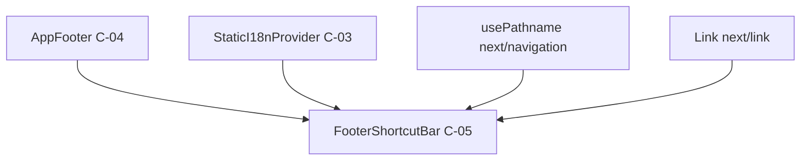

# HarmoNet 詳細設計書 - FooterShortcutBar (C-05) v1.0

**Document ID:** HARMONET-COMPONENT-C05-FOOTERSHORTCUTBAR  
**Version:** 1.0  
**Created:** 2025-11-09  
**Component ID:** C-05  
**Component Name:** FooterShortcutBar  
**Category:** 共通部品（Common Components）  
**Difficulty:** 3  
**Safe Steps:** 4  

---

## ch01: 概要

### 1.1 目的

FooterShortcutBar（C-05）は、HarmoNetアプリケーションのログイン後画面において、  
ユーザーの権限（`system_admin` / `tenant_admin` / `general_user`）に応じた  
主要機能へのショートカットリンクを提供する共通部品である。

本コンポーネントは画面最下部に固定表示され、頻繁にアクセスする機能への  
効率的なナビゲーションを実現する。

---

### 1.2 役割

| 役割 | 説明 |
|------|------|
| **権限別表示制御** | ユーザーロールに基づき表示するショートカットを切り替える |
| **アクティブ状態表示** | 現在表示中の画面に対応するボタンを視覚的に強調 |
| **効率的ナビゲーション** | 主要機能への1タップ/1クリックアクセスを提供 |
| **翻訳対応** | StaticI18nProvider経由で多言語表示を実現 |

---

### 1.3 前提条件

| 項目 | 内容 |
|------|------|
| **フレームワーク** | Next.js 16.0.1（App Router） / React 19 |
| **スタイリング** | Tailwind CSS のみ使用 |
| **翻訳** | StaticI18nProvider (C-03) 経由の `t(key)` 使用 |
| **ルーティング** | `next/link` によるクライアントサイド遷移 |
| **状態管理** | Stateless component（propsで権限受け取り） |
| **パス判定** | `usePathname()` でアクティブ状態を自動判定 |

---

### 1.4 適用範囲

- ✅ ログイン後の全画面（ホーム・掲示板・施設予約・マイページなど）
- ❌ ログイン画面（未認証状態では非表示）
- ❌ エラー画面・メンテナンス画面

---

## ch02: 依存関係

### 2.1 依存コンポーネント



| 依存先 | 種別 | 用途 |
|--------|------|------|
| **AppFooter (C-04)** | 親コンポーネント | FooterShortcutBarを配置する親コンテナ |
| **StaticI18nProvider (C-03)** | Context | 翻訳関数 `t(key)` の取得 |
| **next/navigation** | Next.js API | `usePathname()` でアクティブ判定 |
| **next/link** | Next.js API | `<Link>` によるルーティング |

---

### 2.2 認証情報の取得方法

FooterShortcutBar は **Stateless component** として設計される。  
認証情報（`role`）は親コンポーネント（例: MainLayout）で取得し、  
props経由で受け取る。

**推奨実装パターン:**

```tsx
// app/layout.tsx または MainLayout.tsx
import { useAuth } from '@/hooks/useAuth';
import { FooterShortcutBar } from '@/components/common/FooterShortcutBar';

export default function MainLayout({ children }) {
  const { user } = useAuth(); // Supabase Auth Context経由
  const userRole = user?.role || 'general_user';

  return (
    <>
      <main>{children}</main>
      <FooterShortcutBar role={userRole} />
    </>
  );
}
```

**理由:**
- コンポーネントの責務を明確化（表示のみ）
- Auth Context への直接依存を回避
- テスタビリティの向上

---

### 2.3 翻訳キー構造

StaticI18nProvider (C-03) から取得する翻訳キーは以下の命名規則に従う。

| 翻訳キー | 日本語 | 英語 | 中国語 |
|----------|--------|------|--------|
| `shortcut.board` | 掲示板 | Board | 公告板 |
| `shortcut.facility` | 施設予約 | Facility | 设施预约 |
| `shortcut.settings` | 設定 | Settings | 设置 |
| `shortcut.tenants` | テナント管理 | Tenants | 租户管理 |
| `shortcut.logs` | ログ | Logs | 日志 |
| `shortcut.survey` | アンケート | Survey | 问卷调查 |
| `shortcut.mypage` | マイページ | My Page | 我的页面 |

**翻訳ファイル配置:**
- `/public/locales/ja/common.json`
- `/public/locales/en/common.json`
- `/public/locales/zh/common.json`

---

## ch03: Props定義

### 3.1 TypeScript型定義

```typescript
/**
 * FooterShortcutBar のProps定義
 */
export interface FooterShortcutBarProps {
  /**
   * ユーザー権限（親コンポーネントから受け取る）
   * - system_admin: システム管理者
   * - tenant_admin: テナント管理者
   * - general_user: 一般ユーザー
   */
  role: 'system_admin' | 'tenant_admin' | 'general_user';

  /**
   * カスタムクラス名（任意）
   * Tailwind CSSのユーティリティクラスを追加可能
   */
  className?: string;

  /**
   * テストID（任意）
   * E2Eテストやunit test用の識別子
   * @example "footer-shortcut-bar"
   */
  testId?: string;
}
```

---

### 3.2 Props詳細説明

#### 3.2.1 `role` (必須)

| 値 | 説明 | 表示されるショートカット |
|----|------|-------------------------|
| `system_admin` | システム管理者 | 設定 / テナント管理 / ログ |
| `tenant_admin` | テナント管理者 | 掲示板 / 施設予約 / 設定 |
| `general_user` | 一般ユーザー | 掲示板 / アンケート / マイページ |

**バリデーション:**
- 必須項目（undefined不可）
- 上記3つの値以外はTypeScriptコンパイルエラー

---

#### 3.2.2 `className` (任意)

親コンポーネントから追加のスタイルクラスを注入可能。

**使用例:**
```tsx
<FooterShortcutBar 
  role="general_user" 
  className="shadow-lg border-t-2" 
/>
```

**注意事項:**
- Tailwind CSSのユーティリティクラスのみ使用可能
- 既存のスタイルを上書きしないよう設計
- レイアウト破壊を防ぐため、`position` / `z-index` の変更は非推奨

---

#### 3.2.3 `testId` (任意)

テスト自動化用の識別子。

**使用例:**
```tsx
<FooterShortcutBar 
  role="tenant_admin" 
  testId="footer-shortcut-bar" 
/>
```

**推奨値:**
- `"footer-shortcut-bar"` （デフォルト）
- E2Eテストでは `data-testid` 属性として出力

---

### 3.3 イベント定義

FooterShortcutBar は **純粋な表示コンポーネント** であり、  
カスタムイベントは発火しない。

ナビゲーションは `next/link` の標準動作に委譲する。

---

## ch04: UI構成

### 4.1 レイアウト仕様

```
┌─────────────────────────────────────────────────────┐
│  📄掲示板   │   📅施設予約   │   ⚙️設定              │
│  (active)   │               │                      │
└─────────────────────────────────────────────────────┘
```

| 項目 | 値 |
|------|-----|
| **高さ** | 64px（固定） |
| **背景色** | `#FFFFFF` |
| **ボーダー** | `1px solid #E5E7EB`（上部のみ） |
| **配置** | `fixed bottom-0 left-0 right-0` |
| **z-index** | 950（AppFooter:1000より下） |
| **レイアウト** | `flex justify-around items-center` |

---

### 4.2 ボタン仕様

#### 4.2.1 通常状態

| 項目 | 値 |
|------|-----|
| **アイコンサイズ** | 24px × 24px |
| **アイコン色** | `#6B7280`（gray-500） |
| **ラベル色** | `#6B7280`（gray-500） |
| **ラベルサイズ** | 12px |
| **フォント** | BIZ UD ゴシック |
| **配置** | 縦並び（flex-col） |
| **余白** | `px-4 py-2` |

---

#### 4.2.2 アクティブ状態

| 項目 | 値 |
|------|-----|
| **アイコン色** | `#2563EB`（blue-600） |
| **ラベル色** | `#2563EB`（blue-600） |
| **ラベル太さ** | 600（Semibold） |
| **上部ボーダー** | `2px solid #2563EB` |

---

#### 4.2.3 ホバー状態（PC/タブレット）

| 項目 | 値 |
|------|-----|
| **背景色** | `#F9FAFB`（gray-50） |
| **角丸** | `rounded-md` (8px) |
| **遷移時間** | 150ms |

---

### 4.3 権限別ショートカット定義

#### 4.3.1 システム管理者（system_admin）

| アイコン | ラベル | 遷移先 | 翻訳キー |
|---------|--------|--------|----------|
| ⚙️ | 設定 | `/settings` | `shortcut.settings` |
| 🏢 | テナント管理 | `/admin/tenants` | `shortcut.tenants` |
| 📊 | ログ | `/admin/logs` | `shortcut.logs` |

---

#### 4.3.2 テナント管理者（tenant_admin）

| アイコン | ラベル | 遷移先 | 翻訳キー |
|---------|--------|--------|----------|
| 💬 | 掲示板 | `/board` | `shortcut.board` |
| 📅 | 施設予約 | `/facility` | `shortcut.facility` |
| ⚙️ | 設定 | `/settings` | `shortcut.settings` |

---

#### 4.3.3 一般ユーザー（general_user）

| アイコン | ラベル | 遷移先 | 翻訳キー |
|---------|--------|--------|----------|
| 💬 | 掲示板 | `/board` | `shortcut.board` |
| 📋 | アンケート | `/survey` | `shortcut.survey` |
| 👤 | マイページ | `/mypage` | `shortcut.mypage` |

---

### 4.4 アクセシビリティ

#### 4.4.1 セマンティックHTML

```html
<nav role="navigation" aria-label="ショートカットナビゲーション">
  <Link href="/board" aria-label="掲示板" aria-current="page">
    <!-- アクティブな場合 aria-current="page" を付与 -->
  </Link>
</nav>
```

---

#### 4.4.2 キーボード操作

| 操作 | 動作 |
|------|------|
| **Tab** | 次のショートカットボタンへフォーカス移動 |
| **Shift + Tab** | 前のショートカットボタンへフォーカス移動 |
| **Enter / Space** | リンク先へ遷移 |

---

#### 4.4.3 スクリーンリーダー対応

- `role="navigation"` でナビゲーション領域を明示
- `aria-label` で各ボタンの目的を説明
- `aria-current="page"` でアクティブ状態を通知
- アイコンには `aria-hidden="true"` を設定（装飾扱い）

---

#### 4.4.4 コントラスト比

| 状態 | 前景色 | 背景色 | 比率 | WCAG準拠 |
|------|--------|--------|------|----------|
| 通常 | `#6B7280` | `#FFFFFF` | 5.6:1 | ✅ AA |
| アクティブ | `#2563EB` | `#FFFFFF` | 8.6:1 | ✅ AAA |

---

### 4.5 レスポンシブ対応

#### 4.5.1 小画面（< 375px）

| 項目 | 通常 | 小画面 |
|------|------|--------|
| **アイコンサイズ** | 24px | 20px |
| **ラベルサイズ** | 12px | 11px |
| **余白** | `px-4` | `px-2` |

---

#### 4.5.2 タブレット・PC（≥ 768px）

```css
@media (min-width: 768px) {
  .footer-shortcut-bar {
    max-width: 768px;
    left: 50%;
    transform: translateX(-50%);
  }
}
```

最大幅を制限し、中央寄せで表示。

---

## ch05: ロジック構造

### 5.1 アクティブ状態の判定

#### 5.1.1 実装方針

`usePathname()` から取得した現在のパスと、各ショートカットの遷移先を比較し、  
前方一致する場合にアクティブ状態とする。

**実装例:**

```typescript
import { usePathname } from 'next/navigation';

const pathname = usePathname();

const isActive = (href: string): boolean => {
  return pathname.startsWith(href);
};
```

---

#### 5.1.2 判定ロジックの詳細

| 現在のパス | 遷移先 | 判定結果 |
|-----------|--------|----------|
| `/board` | `/board` | ✅ アクティブ |
| `/board/123` | `/board` | ✅ アクティブ |
| `/facility` | `/board` | ❌ 非アクティブ |
| `/settings/profile` | `/settings` | ✅ アクティブ |

**注意点:**
- ルートパス `/` との前方一致を避けるため、  
  ルートは `/home` にリダイレクトする設計を推奨

---

### 5.2 権限別表示制御

#### 5.2.1 ショートカットマップの定義

```typescript
const SHORTCUT_ITEMS = {
  system_admin: [
    { href: '/settings', icon: '⚙️', labelKey: 'shortcut.settings' },
    { href: '/admin/tenants', icon: '🏢', labelKey: 'shortcut.tenants' },
    { href: '/admin/logs', icon: '📊', labelKey: 'shortcut.logs' },
  ],
  tenant_admin: [
    { href: '/board', icon: '💬', labelKey: 'shortcut.board' },
    { href: '/facility', icon: '📅', labelKey: 'shortcut.facility' },
    { href: '/settings', icon: '⚙️', labelKey: 'shortcut.settings' },
  ],
  general_user: [
    { href: '/board', icon: '💬', labelKey: 'shortcut.board' },
    { href: '/survey', icon: '📋', labelKey: 'shortcut.survey' },
    { href: '/mypage', icon: '👤', labelKey: 'shortcut.mypage' },
  ],
} as const;
```

---

#### 5.2.2 表示ロジック

```typescript
const FooterShortcutBar: React.FC<FooterShortcutBarProps> = ({ 
  role, 
  className, 
  testId = 'footer-shortcut-bar' 
}) => {
  const pathname = usePathname();
  const { t } = useI18n(); // StaticI18nProvider経由

  const items = SHORTCUT_ITEMS[role];

  const isActive = (href: string) => pathname.startsWith(href);

  return (
    <nav 
      role="navigation" 
      aria-label={t('common.shortcut_navigation')}
      data-testid={testId}
      className={cn(
        'fixed bottom-0 left-0 right-0',
        'h-16 bg-white border-t border-gray-200',
        'flex justify-around items-center z-[950]',
        className
      )}
    >
      {items.map((item) => (
        <Link
          key={item.href}
          href={item.href}
          aria-label={t(item.labelKey)}
          aria-current={isActive(item.href) ? 'page' : undefined}
          className={cn(
            'flex flex-col items-center justify-center',
            'px-4 py-2 rounded-md transition-colors duration-150',
            isActive(item.href)
              ? 'text-blue-600 font-semibold border-t-2 border-blue-600'
              : 'text-gray-500 hover:bg-gray-50'
          )}
        >
          <span aria-hidden="true" className="text-2xl mb-1">
            {item.icon}
          </span>
          <span className="text-xs">{t(item.labelKey)}</span>
        </Link>
      ))}
    </nav>
  );
};
```

---

### 5.3 翻訳の取得

StaticI18nProvider (C-03) が提供する `useI18n()` Hook を使用。

```typescript
import { useI18n } from '@/contexts/I18nContext';

const { t } = useI18n();

// 使用例
const label = t('shortcut.board'); // "掲示板" / "Board" / "公告板"
```

---

## ch06: テスト観点

### 6.1 単体テスト（Jest + RTL）

#### 6.1.1 テストケース一覧

| テストID | テスト内容 | 期待結果 |
|----------|-----------|----------|
| **T-C05-01** | system_admin権限で表示 | 3つのショートカット表示（設定/テナント管理/ログ） |
| **T-C05-02** | tenant_admin権限で表示 | 3つのショートカット表示（掲示板/施設予約/設定） |
| **T-C05-03** | general_user権限で表示 | 3つのショートカット表示（掲示板/アンケート/マイページ） |
| **T-C05-04** | アクティブ状態の判定 | 現在パスに対応するボタンにactive classが付与される |
| **T-C05-05** | 翻訳ラベルの表示 | 各ショートカットに翻訳されたラベルが表示される |
| **T-C05-06** | aria-label属性の存在 | すべてのリンクにaria-labelが設定されている |
| **T-C05-07** | aria-current属性 | アクティブなリンクに`aria-current="page"`が設定される |
| **T-C05-08** | カスタムclassNameの適用 | propsで渡したclassNameが適用される |
| **T-C05-09** | testIdの適用 | data-testid属性が正しく設定される |

---

#### 6.1.2 テスト実装例

```typescript
import { render, screen } from '@testing-library/react';
import { FooterShortcutBar } from './FooterShortcutBar';
import { I18nProvider } from '@/contexts/I18nContext';

// Mock usePathname
jest.mock('next/navigation', () => ({
  usePathname: jest.fn(() => '/board'),
}));

describe('FooterShortcutBar', () => {
  const renderWithI18n = (ui: React.ReactElement) => {
    return render(
      <I18nProvider locale="ja">
        {ui}
      </I18nProvider>
    );
  };

  describe('T-C05-01: system_admin権限', () => {
    it('3つのショートカットが表示される', () => {
      renderWithI18n(<FooterShortcutBar role="system_admin" />);

      expect(screen.getByLabelText('設定')).toBeInTheDocument();
      expect(screen.getByLabelText('テナント管理')).toBeInTheDocument();
      expect(screen.getByLabelText('ログ')).toBeInTheDocument();
    });
  });

  describe('T-C05-02: tenant_admin権限', () => {
    it('3つのショートカットが表示される', () => {
      renderWithI18n(<FooterShortcutBar role="tenant_admin" />);

      expect(screen.getByLabelText('掲示板')).toBeInTheDocument();
      expect(screen.getByLabelText('施設予約')).toBeInTheDocument();
      expect(screen.getByLabelText('設定')).toBeInTheDocument();
    });
  });

  describe('T-C05-03: general_user権限', () => {
    it('3つのショートカットが表示される', () => {
      renderWithI18n(<FooterShortcutBar role="general_user" />);

      expect(screen.getByLabelText('掲示板')).toBeInTheDocument();
      expect(screen.getByLabelText('アンケート')).toBeInTheDocument();
      expect(screen.getByLabelText('マイページ')).toBeInTheDocument();
    });
  });

  describe('T-C05-04: アクティブ状態の判定', () => {
    it('現在パスに対応するボタンにactive classが付与される', () => {
      renderWithI18n(<FooterShortcutBar role="general_user" />);

      const boardLink = screen.getByLabelText('掲示板');
      expect(boardLink).toHaveClass('text-blue-600', 'border-t-2', 'border-blue-600');
      expect(boardLink).toHaveAttribute('aria-current', 'page');
    });
  });

  describe('T-C05-08: カスタムclassNameの適用', () => {
    it('propsで渡したclassNameが適用される', () => {
      const { container } = renderWithI18n(
        <FooterShortcutBar role="general_user" className="shadow-lg" />
      );

      const nav = container.querySelector('nav');
      expect(nav).toHaveClass('shadow-lg');
    });
  });
});
```

---

### 6.2 E2Eテスト（Playwright）

#### 6.2.1 テストシナリオ

```typescript
test.describe('FooterShortcutBar E2E', () => {
  test('一般ユーザーでログイン後、ショートカットから掲示板へ遷移できる', async ({ page }) => {
    // ログイン
    await page.goto('/login');
    await page.fill('[name="email"]', 'user@example.com');
    await page.fill('[name="password"]', 'password123');
    await page.click('button[type="submit"]');

    // ホーム画面に遷移したことを確認
    await page.waitForURL('/home');

    // フッターショートカットバーの存在確認
    const shortcutBar = page.locator('[data-testid="footer-shortcut-bar"]');
    await expect(shortcutBar).toBeVisible();

    // 掲示板ボタンをクリック
    await page.click('[aria-label="掲示板"]');

    // 掲示板画面に遷移したことを確認
    await page.waitForURL('/board');
    await expect(page.locator('h1')).toContainText('掲示板');

    // アクティブ状態の確認
    const boardLink = page.locator('[aria-label="掲示板"][aria-current="page"]');
    await expect(boardLink).toBeVisible();
  });
});
```

---

### 6.3 アクセシビリティテスト

#### 6.3.1 テスト項目

| テストID | テスト内容 | 期待結果 |
|----------|-----------|----------|
| **A11Y-01** | キーボード操作 | Tabキーで全ショートカットにフォーカス可能 |
| **A11Y-02** | スクリーンリーダー | aria-label / aria-current が正しく読み上げられる |
| **A11Y-03** | コントラスト比 | WCAG 2.1 レベルAA準拠（4.5:1以上） |
| **A11Y-04** | フォーカス表示 | フォーカス時に視覚的なアウトラインが表示される |

---

#### 6.3.2 axe-coreによる自動テスト

```typescript
import { render } from '@testing-library/react';
import { axe, toHaveNoViolations } from 'jest-axe';
import { FooterShortcutBar } from './FooterShortcutBar';

expect.extend(toHaveNoViolations);

test('FooterShortcutBarにアクセシビリティ違反がない', async () => {
  const { container } = render(
    <I18nProvider locale="ja">
      <FooterShortcutBar role="general_user" />
    </I18nProvider>
  );

  const results = await axe(container);
  expect(results).toHaveNoViolations();
});
```

---

## ch07: Storybook構成

### 7.1 ストーリー構成

#### 7.1.1 基本ストーリー

```typescript
import type { Meta, StoryObj } from '@storybook/react';
import { FooterShortcutBar } from './FooterShortcutBar';
import { I18nProvider } from '@/contexts/I18nContext';

const meta: Meta<typeof FooterShortcutBar> = {
  title: 'Common/FooterShortcutBar',
  component: FooterShortcutBar,
  decorators: [
    (Story) => (
      <I18nProvider locale="ja">
        <div style={{ paddingTop: '100px', minHeight: '200px' }}>
          <Story />
        </div>
      </I18nProvider>
    ),
  ],
  parameters: {
    layout: 'fullscreen',
  },
};

export default meta;
type Story = StoryObj<typeof FooterShortcutBar>;
```

---

#### 7.1.2 権限別ストーリー

```typescript
// システム管理者
export const SystemAdmin: Story = {
  args: {
    role: 'system_admin',
  },
};

// テナント管理者
export const TenantAdmin: Story = {
  args: {
    role: 'tenant_admin',
  },
};

// 一般ユーザー
export const GeneralUser: Story = {
  args: {
    role: 'general_user',
  },
};
```

---

#### 7.1.3 アクティブ状態のストーリー

```typescript
// 掲示板がアクティブな状態
export const ActiveBoard: Story = {
  args: {
    role: 'general_user',
  },
  decorators: [
    (Story) => {
      // usePathnameをモック
      jest.spyOn(require('next/navigation'), 'usePathname')
        .mockReturnValue('/board');
      
      return (
        <I18nProvider locale="ja">
          <Story />
        </I18nProvider>
      );
    },
  ],
};
```

---

#### 7.1.4 多言語対応ストーリー

```typescript
// 英語表示
export const EnglishLocale: Story = {
  args: {
    role: 'general_user',
  },
  decorators: [
    (Story) => (
      <I18nProvider locale="en">
        <Story />
      </I18nProvider>
    ),
  ],
};

// 中国語表示
export const ChineseLocale: Story = {
  args: {
    role: 'general_user',
  },
  decorators: [
    (Story) => (
      <I18nProvider locale="zh">
        <Story />
      </I18nProvider>
    ),
  ],
};
```

---

### 7.2 インタラクション機能

#### 7.2.1 ホバーエフェクトの確認

```typescript
export const HoverEffect: Story = {
  args: {
    role: 'general_user',
  },
  play: async ({ canvasElement }) => {
    const canvas = within(canvasElement);
    const boardLink = canvas.getByLabelText('掲示板');

    // ホバー時の背景色変化を確認
    await userEvent.hover(boardLink);
    await expect(boardLink).toHaveClass('hover:bg-gray-50');
  },
};
```

---

### 7.3 レスポンシブ対応の確認

```typescript
export const Mobile: Story = {
  args: {
    role: 'general_user',
  },
  parameters: {
    viewport: {
      defaultViewport: 'mobile1',
    },
  },
};

export const Tablet: Story = {
  args: {
    role: 'tenant_admin',
  },
  parameters: {
    viewport: {
      defaultViewport: 'tablet',
    },
  },
};

export const Desktop: Story = {
  args: {
    role: 'system_admin',
  },
  parameters: {
    viewport: {
      defaultViewport: 'desktop',
    },
  },
};
```

---

## ch08: 今後の拡張

### 8.1 動的権限管理

現在の実装では、権限は固定的な3種類（system_admin / tenant_admin / general_user）  
のみを想定しているが、将来的には以下の拡張が考えられる。

#### 8.1.1 カスタム権限の追加

```typescript
// 例: テナントごとに独自の権限を定義
export interface CustomRole {
  id: string;
  name: string;
  shortcuts: ShortcutItem[];
}

// Props定義の拡張
export interface FooterShortcutBarProps {
  role: 'system_admin' | 'tenant_admin' | 'general_user' | CustomRole;
  // ...
}
```

---

### 8.2 ショートカットのカスタマイズ

#### 8.2.1 ユーザーごとのショートカット設定

管理画面で各ユーザーが表示するショートカットを選択できる機能。

**想定仕様:**
- 最大5つまでのショートカットを選択可能
- 表示順序のカスタマイズ
- アイコン・ラベルのカスタマイズ

**必要な実装:**
- ユーザー設定テーブルの追加（`user_shortcut_settings`）
- 管理画面の追加（`/settings/shortcuts`）
- FooterShortcutBarへのprops追加（`customShortcuts?: ShortcutItem[]`）

---

### 8.3 バッジ通知機能

#### 8.3.1 未読件数の表示

掲示板・アンケートなどに未読件数バッジを表示する機能。

```typescript
export interface ShortcutItem {
  href: string;
  icon: string;
  labelKey: string;
  badgeCount?: number; // 未読件数
}
```

**実装イメージ:**
```tsx
{item.badgeCount && item.badgeCount > 0 && (
  <span className="absolute top-0 right-0 bg-red-500 text-white text-xs rounded-full px-1">
    {item.badgeCount > 99 ? '99+' : item.badgeCount}
  </span>
)}
```

---

### 8.4 アニメーション強化

#### 8.4.1 スムーズな遷移アニメーション

現在の実装では即座に画面遷移するが、  
Framer Motion などを使用したスムーズなアニメーションの追加。

```typescript
import { motion } from 'framer-motion';

<motion.nav
  initial={{ y: 100, opacity: 0 }}
  animate={{ y: 0, opacity: 1 }}
  transition={{ duration: 0.3 }}
>
  {/* ... */}
</motion.nav>
```

---

### 8.5 パフォーマンス最適化

#### 8.5.1 ショートカット情報のメモ化

```typescript
const memoizedItems = useMemo(() => SHORTCUT_ITEMS[role], [role]);
```

#### 8.5.2 動的インポートによるコード分割

```typescript
const FooterShortcutBar = dynamic(
  () => import('./FooterShortcutBar'),
  { ssr: false }
);
```

---

### 8.6 テナント別表示制御

#### 8.6.1 テナント設定による表示/非表示切り替え

テナント設定で特定のショートカットを非表示にする機能。

**想定データ構造:**
```json
{
  "tenant_id": "tenant-001",
  "disabled_shortcuts": ["survey", "logs"]
}
```

**実装方針:**
- テナント設定テーブルから `disabled_shortcuts` を取得
- props経由で `disabledShortcuts: string[]` を受け取る
- 該当するショートカットを非表示にする

---

## 関連ドキュメント

| ドキュメント名 | 説明 |
|--------------|------|
| `common-footer_v1_1.md` | フッター領域の全体設計 |
| `common-design-system_v1_1.md` | HarmoNetデザインシステム |
| `common-i18n_v1_0.md` | 翻訳機能の詳細仕様 |
| `common-accessibility_v1_0.md` | アクセシビリティ要件 |
| `harmonet-naming-matrix_v2_0.md` | 命名規則 |
| `harmonet-coding-standard_v1_1.md` | コーディング規約 |

---

**文書管理**
- 文書ID: HARMONET-COMPONENT-C05-FOOTERSHORTCUTBAR
- バージョン: 1.0
- 作成日: 2025-11-09
- 更新日: 2025-11-09
- 作成者: Claude (設計AI)
- 承認者: TKD (Project Owner)
- デザインシステム: HarmoNet Design System v1
