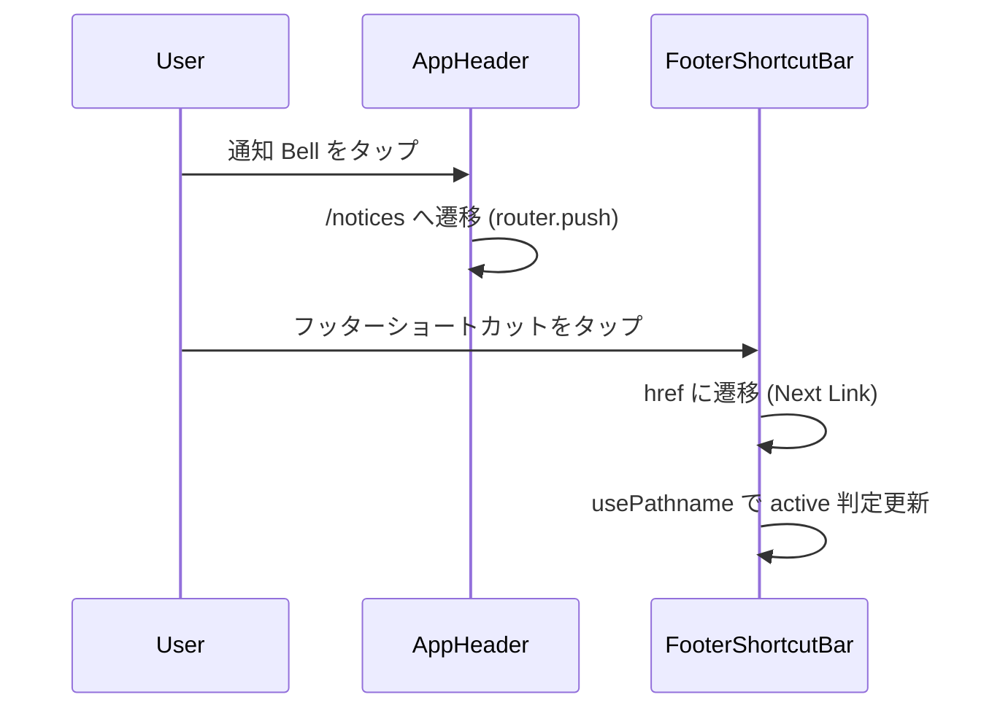
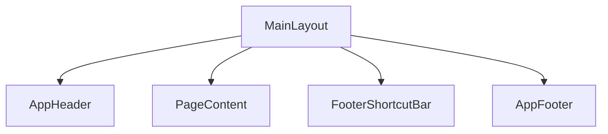

# HarmoNet 詳細設計書 - 共通フレームコンポーネント統合版（AppHeader / AppFooter / FooterShortcutBar）

**Document Path (正書):**
`/01_docs/04_詳細設計/00_共通部品/02_ログイン画面以外の共通部品詳細設計/common-frame-components_detail-design_v1.0.md`

**Version:** 1.0
**Created:** 2025-11-20
**Author:** Tachikoma（TKD 指示にもとづく統合版）
**Reviewer:** TKD

---

# 第1章 概要

## 1.1 目的

本書は、HarmoNet アプリケーションにおける **全画面共通フレーム** を構成する以下 3 コンポーネントの詳細仕様を統合して定義する。

* **AppHeader**（共通ヘッダー）
* **AppFooter**（共通フッター）
* **FooterShortcutBar**（フッターショートカットナビ）

これらはログイン後の全画面で共通して使用される UI フレームであり、
レイアウト・スタイリング・i18n・アクセシビリティ・役割分担を統一することで、
実装（Windsurf）と将来の保守作業の一貫性を確保することを目的とする。

## 1.2 スコープ

本詳細設計書のスコープは以下とする。

* ヘッダー・フッター・フッターショートカットバーの **UI / ロジック仕様**
* StaticI18nProvider / LanguageSwitch との連携ポイント
* ログイン後画面共通のフレーム構造

以下は本書のスコープ外とし、別設計書に委譲する。

* LanguageSwitch（言語切替コンポーネント）の詳細仕様
  → `/01_docs/04_詳細設計/00_共通部品/01_ログイン画面共通部品詳細設計/ch02_LanguageSwitch_v1.1.md`
* StaticI18nProvider（i18n基盤）の詳細仕様
  → `/01_docs/04_詳細設計/00_共通部品/01_ログイン画面共通部品詳細設計/ch03_StaticI18nProvider_v1.1.md`
* テナント別フッターショートカット構成（DB スキーマ / RLS ポリシー）
  → TKD 作成のスキーマ・ポリシー設計書（別途）

## 1.3 前提技術

* フレームワーク: Next.js 16（App Router）
* UI ライブラリ: React 19
* 言語: TypeScript 5.x
* スタイリング: Tailwind CSS 3.4.x
* アイコン: lucide-react
* i18n: StaticI18nProvider v1.1
* デザインシステム: HarmoNet 共通デザインシステム v1.2
* 認証: Supabase Auth（MagicLink）

## 1.4 関連資料（フルパス参照）

* 技術スタック定義書
  `/01_docs/01_要件定義/harmonet-technical-stack-definition_v4.4.md`
* 共通デザインシステム基本設計書
  `/01_docs/03_基本設計/01_共通部品/common-design-system_v1.2.md`
* ログイン画面 詳細設計書（フレーム利用側）
  `/01_docs/04_詳細設計/01_ログイン画面/A-00LoginPage-detail-design_v1.4.md`
* LanguageSwitch 詳細設計書
  `/01_docs/04_詳細設計/00_共通部品/01_ログイン画面共通部品詳細設計/ch02_LanguageSwitch_v1.1.md`
* StaticI18nProvider 詳細設計書
  `/01_docs/04_詳細設計/00_共通部品/01_ログイン画面共通部品詳細設計/ch03_StaticI18nProvider_v1.1.md`
* 共通フッター基本設計書
  `/01_docs/03_基本設計/01_共通部品/common-footer_v1.3.md`

---

# 第2章 機能設計

## 2.1 コンポーネント別の役割

### 2.1.1 AppHeader

* アプリ共通の **上部フレーム領域**。
* 左側にアプリ名（またはロゴ）、右側に **通知 Bell** と LanguageSwitch を配置する。
* 認証状態に応じてログイン後画面で常時表示する。
* 通知 Bell は `/notices` へのナビゲーションを提供する。未読バッジは将来拡張とし、本書では UI 骨格のみ定義する。

### 2.1.2 AppFooter

* アプリ共通の **最下部フッター領域**。
* コピーライト文言のみを表示し、他の機能 UI を持たない。
* 画面内容に依存せず、全画面で共通表示する。

### 2.1.3 FooterShortcutBar

* ログイン後画面における **主要機能ショートカットナビゲーション**。
* 画面下部（AppFooter の直上）に固定表示する。
* 表示項目・表示順序は **テナント設定およびユーザー権限** に依存し、
  プレゼンテーション層として与えられた項目リストを表示するのみとする（DB 参照は親コンテナ側の責務）。

## 2.2 入出力仕様（Props / Hooks）

### 2.2.1 AppHeader

* Props: なし（現時点）
* 入力: StaticI18nProvider からの `t()`、ルーティングコンテキスト
* 出力: JSX（ヘッダー DOM）

### 2.2.2 AppFooter

* Props: なし（現時点）
* 入力: StaticI18nProvider からの `t()`
* 出力: JSX（フッター DOM）

### 2.2.3 FooterShortcutBar

```ts
export type FooterShortcutKey =
  | 'home'
  | 'board'
  | 'facility'
  | 'mypage'
  | 'logout'
  | string; // 将来拡張用。

export interface FooterShortcutItem {
  key: FooterShortcutKey;      // 論理キー（feature_key と対応）
  labelKey: string;            // i18n キー（例: 'nav.home'）
  href: string;                // 遷移先 URL
  icon: string;                // lucide-react のアイコン名（例: 'Home'）
}

export interface FooterShortcutBarProps {
  /** 表示するショートカットアイテム（テナント＆権限適用後） */
  items: FooterShortcutItem[];

  /** 追加スタイルクラス（任意） */
  className?: string;

  /** E2E / RTL 用の識別子 */
  testId?: string;
}
```

* 入力: 親コンテナ（MainLayout 等）から渡される `items` 配列
* 出力: JSX（ナビゲーション DOM）
* 依存 Hook: `usePathname()` によるアクティブ判定

## 2.3 処理フロー（概要）



## 2.4 依存関係

* StaticI18nProvider: `t(key)` による翻訳文言取得
* next/navigation: `usePathname()` による現在パス取得
* lucide-react: アイコン描画
* MainLayout: FooterShortcutBar に `items` を提供する親コンテナ

## 2.5 副作用と再レンダー

* AppHeader: ルーティング変化時に再レンダー。外部副作用なし。
* AppFooter: 副作用なし。翻訳辞書切り替え時のみ再レンダー。
* FooterShortcutBar: `pathname` 変化・`items` 変更時に再レンダー。

## 2.6 UT 観点（統合）

* ヘッダーにロゴ・通知 Bell・LanguageSwitch が表示されること。
* フッターにコピーライトが常時表示されること。
* FooterShortcutBar が `items` の内容に従って正しく表示されること。
* 現在パスに応じてアクティブ状態が正しく切り替わること。

---

# 第3章 構造設計

## 3.1 全体レイアウト構成



* MainLayout が全ページ共通フレームとして AppHeader / FooterShortcutBar / AppFooter を包む。
* PageContent は画面ごとのコンテンツ（HOME, 掲示板, お知らせ など）。

## 3.2 AppHeader 構造

```tsx
<header>
  <div className="left">
    {/* ロゴ / タイトル */}
  </div>
  <div className="right">
    {/* 通知 Bell */}
    {/* LanguageSwitch */}
  </div>
</header>
```

* 左ブロック: アプリ名（"HarmoNet"）など。
* 右ブロック: 通知 Bell（/notices）と LanguageSwitch（JA/EN/ZH）。

## 3.3 FooterShortcutBar 構造

```tsx
<nav>
  <ul>
    {items.map(item => (
      <li key={item.key}>
        {/* アイコン + ラベル */}
      </li>
    ))}
  </ul>
</nav>
```

* `items` 配列をループしてボタンを表示する。
* active 状態は `pathname` と `item.href` の一致で判定する。

## 3.4 AppFooter 構造

```tsx
<footer>
  <p>© 2025 HarmoNet. All rights reserved.</p>
</footer>
```

## 3.5 Context / Provider 連携

* StaticI18nProvider は `app/layout.tsx` でルートに配置される。
* Header / Footer / FooterShortcutBar は `useI18n()` を通じて `t()` を利用する。

## 3.6 i18n キー仕様（本書対象分）

* Header 通知 Bell ラベル: `nav.notices`
* FooterShortcutBar ラベル（例）：

  * `nav.home`
  * `nav.board`
  * `nav.facility`
  * `nav.mypage`
  * `nav.logout`
* Footer コピーライト: `common.copyright`

---

# 第4章 実装設計

## 4.1 ディレクトリ構成

```text
src/
  components/
    common/
      AppHeader/
        AppHeader.tsx
        AppHeader.types.ts
        index.ts

      AppFooter/
        AppFooter.tsx
        AppFooter.types.ts
        index.ts

      FooterShortcutBar/
        FooterShortcutBar.tsx
        FooterShortcutBar.types.ts
        index.ts
```

## 4.2 AppHeader 実装要点

* `AppHeader` は `use client` コンポーネント。
* 通知 Bell は Next.js の `useRouter` もしくは `<Link href='/notices'>` で遷移。
* LanguageSwitch は右端に配置する。

## 4.3 FooterShortcutBar 実装要点

* `FooterShortcutBar` は `usePathname()` を利用し、現在パスと `item.href` を比較してアクティブ状態を決定する。
* `items` は親から渡されるため、コンポーネント内でテナントや権限を判定しない。

## 4.4 AppFooter 実装要点

* `AppFooter` は stateless かつ純粋 UI。
* コピーライト文言のみを描画する。

## 4.5 エラーハンドリング

* i18n キーが存在しない場合、StaticI18nProvider 側のフォールバック挙動（key をそのまま表示）に任せる。
* FooterShortcutBar は API 呼び出しを持たないため、内部で try/catch を持たない。

## 4.6 セキュリティ

* 本フレーム層では認証・認可ロジックを持たない。
* `/notices` ページ側で認可チェックを行う前提とする。

## 4.7 パフォーマンス

* FooterShortcutBar の `items` は parent でメモ化（原則として頻繁に変わらない）
* `pathname` の取得以外に重い処理を行わない。

---

# 第5章 UI仕様（コンポーネント別）

## 5.1 AppHeader UI 仕様

### 5.1.1 DOM 構造

```tsx
<header
  role="banner"
  className="fixed top-0 left-0 right-0 h-14 bg-white border-b border-gray-200 flex items-center px-4 z-[960]"
>
  <div className="text-base font-semibold text-gray-900">HarmoNet</div>
  <div className="ml-auto flex items-center gap-4">
    {/* 通知 Bell */}
    {/* LanguageSwitch */}
  </div>
</header>
```

### 5.1.2 通知 Bell UI

* アイコン: lucide-react の `Bell`
* 配置: 右上（LanguageSwitch の左隣）
* タップ領域: 最小 44x44px
* A11y:

  * `aria-label="お知らせ"`（i18n 対応）

## 5.2 FooterShortcutBar UI 仕様

### 5.2.1 DOM 構造

```tsx
<nav
  role="navigation"
  aria-label={t('common.shortcut_navigation')}
  className="fixed bottom-12 left-0 right-0 h-16 bg-white border-t border-gray-200 flex justify-around items-center z-[950]"
>
  {items.map(...)}
</nav>
```

* AppFooter の上に重なるレイヤ（z-[950]）。
* モバイル前提の高さ 64px 程度（Tailwind h-16）。

### 5.2.2 アイコン・ラベル表示

* アイコンサイズ: 24px (Tailwind `text-2xl` 相当)
* ラベル: `text-xs` / システムフォント / `leading-tight`
* レイアウト: `flex flex-col items-center justify-center gap-1`

### 5.2.3 アクティブ状態

* active 条件: `pathname.startsWith(item.href)` が true
* active 時:

  * 文字色: `text-blue-600`
  * 上枠線: `border-t-2 border-blue-600`
  * フォント: `font-semibold`

### 5.2.4 表示項目一覧（例：標準テナント構成）

> ※ 実際の構成はテナント設定に依存し、以下は標準例とする。

| key        | アイコン (lucide)   | i18nキー         | href        | 説明          |
| ---------- | --------------- | -------------- | ----------- | ----------- |
| `home`     | `Home`          | `nav.home`     | `/home`     | ホーム         |
| `board`    | `MessageSquare` | `nav.board`    | `/boards`   | 掲示板         |
| `facility` | `Calendar`      | `nav.facility` | `/facility` | 施設予約        |
| `mypage`   | `User`          | `nav.mypage`   | `/mypage`   | マイページ       |
| `logout`   | `LogOut`        | `nav.logout`   | `/login`    | ログアウト（画面遷移） |

### 5.2.5 アクセシビリティ

* `<nav role="navigation">`
* 各リンクに `aria-label={t(item.labelKey)}`
* アクティブな項目に `aria-current="page"`

## 5.3 AppFooter UI 仕様

### 5.3.1 DOM 構造

```tsx
<footer
  role="contentinfo"
  aria-label="フッター領域"
  className="fixed bottom-0 left-0 right-0 h-12 bg-white border-t border-gray-200 flex items-center justify-center z-[900]"
>
  <p className="text-xs text-gray-400 leading-relaxed">
    {t('common.copyright')}
  </p>
</footer>
```

* 高さ: 48px（h-12）
* テキスト色: `text-gray-400`
* 背景: `bg-white`

---

# 第6章 ロジック仕様

## 6.1 AppHeader（通知 Bell）

### 6.1.1 処理フロー

1. ユーザーが Bell アイコンをタップ
2. `router.push('/notices')` を呼び出し、お知らせ一覧画面へ遷移
3. お知らせ画面で既読/未読を管理（別設計書）

### 6.1.2 エラー時挙動

* ルーティング失敗時は Next.js 側のエラー処理に委譲

## 6.2 FooterShortcutBar

### 6.2.1 アクティブ判定

```ts
const pathname = usePathname();
const isActive = (href: string) => pathname.startsWith(href);
```

### 6.2.2 クリック処理

* `<Link href={item.href}>` によりクライアントサイド遷移
* 追加ロジック（ログ記録など）は親レイヤで行う（本コンポーネントは UI 専用）

### 6.2.3 テナント別構成

* `items` は親コンテナ（MainLayout）がテナント設定・ユーザー権限に基づいて構成する。
* 本コンポーネントは `items` の中身を信頼して描画のみ行う。

## 6.3 AppFooter

* ロジックなし（常に同一表示）

## 6.4 状態遷移

* Header / Footer は状態遷移なし
* FooterShortcutBar は `pathname` と `items` に依存した描画のみ

## 6.5 ロジック単体テスト観点

* `isActive('/boards')` が `/boards`, `/boards/123` で true になること
* `items` が空配列の場合でもエラーなく何も表示しないこと

## 6.6 セキュリティ

* 認証・認可判定は行わず、リンク先ページ側に委譲
* ログアウトボタン押下時の実際のログアウト処理は、親側（別コンポーネント）で実装し、
  FooterShortcutBar からはログアウト画面遷移のみを提供する実装方針も許容する。

## 6.7 パフォーマンス

* 不要再レンダーを避けるため、親から渡す `items` は極力安定した参照（useMemo 等）を推奨

---

# 第7章 結合・運用

## 7.1 MainLayout との結合

* `app/layout.tsx` もしくは `app/(app)/layout.tsx`（実装構成に依存）にて、
  AppHeader / FooterShortcutBar / AppFooter を共通で読み込む。
* FooterShortcutBar にはテナント設定から構成した `items` を渡す。

## 7.2 SSR / CSR

* AppHeader / AppFooter は SSR/CSR 両対応。
* FooterShortcutBar の active 判定は `usePathname()` に依存するため CSR 前提だが、
  初期描画時に SSR による違和感が出ないよう留意する。

## 7.3 ログ出力方針

* 本フレームコンポーネントから直接ログは出力しない。
* ナビゲーション操作ログが必要な場合は、親コンテナや専用 Hook にて記録する。

## 7.4 Storybook / E2E

* Header / Footer / FooterShortcutBar をそれぞれ個別に Storybook で確認する。
* FooterShortcutBar は `items` を差し替えて、テナント別構成例を表示できる Story を用意する。

## 7.5 リスク・制約

* FooterShortcutBar の `items` 構成が誤っている場合、UI にそのまま反映されるため、
  テナント設定側のバリデーションが重要となる。

---

# 第8章 メタ情報

## 8.1 用語定義

* **共通フレーム**: 全画面で共通して表示されるヘッダー・フッター・ショートカットバーの総称。
* **FooterShortcutBar**: 下部固定の主要機能ショートカットバー。

## 8.2 関連資料

* `/01_docs/03_基本設計/01_共通部品/common-design-system_v1.2.md`
* `/01_docs/04_詳細設計/01_ログイン画面/A-00LoginPage-detail-design_v1.4.md`
* `/01_docs/04_詳細設計/00_共通部品/01_ログイン画面共通部品詳細設計/ch02_LanguageSwitch_v1.1.md`
* `/01_docs/04_詳細設計/00_共通部品/01_ログイン画面共通部品詳細設計/ch03_StaticI18nProvider_v1.1.md`

## 8.3 ChangeLog

| Version | Date       | Author    | Summary                                                    |
| ------- | ---------- | --------- | ---------------------------------------------------------- |
| 1.0     | 2025-11-20 | Tachikoma | AppHeader/AppFooter/FooterShortcutBar を統合し、共通フレーム詳細設計を一本化。 |

---

**End of Document**
