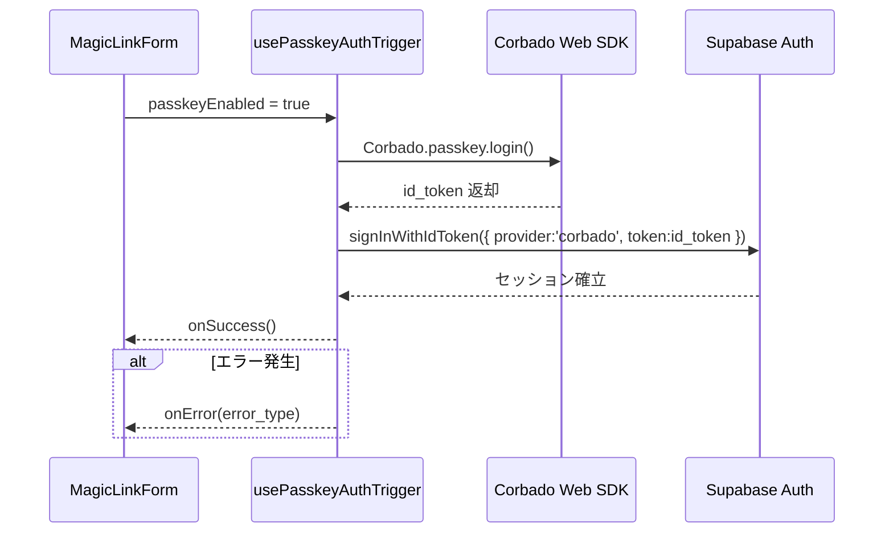

# HarmoNet 詳細設計書 - PasskeyAuthTrigger (A-02) ch02 v1.1

**Document ID:** HARMONET-COMPONENT-A02-PASSKEYAUTHTRIGGER-CH02
**Version:** 1.1
**Created:** 2025-11-12
**Author:** Tachikoma
**Reviewer:** TKD
**Status:** ✅ Phase9 正式版（技術スタック v4.2 / MagicLinkForm 統合対応）

---

## 第2章 機能設計

### 2.1 機能要約

PasskeyAuthTrigger (A-02) は、MagicLinkForm (A-01) 内で動作する **非UIロジックモジュール** であり、Corbado SDK を利用して Passkey 認証を実行し、Supabase Auth へセッションを確立する。
UI操作を持たず、`passkeyEnabled` が真の場合に自動発火する。ユーザーは MagicLinkForm のボタンを押すだけで、PasskeyまたはOTPのいずれかで自動的に認証される。
Phase9 では `@corbado/web-js` + `@corbado/node` の構成を採用し、従来の `@corbado/react` 構成は廃止された。

---

### 2.2 入出力仕様（Options / Hooks / Error構造）

#### 2.2.1 PasskeyAuthTriggerOptions 定義

```typescript
export interface PasskeyAuthTriggerOptions {
  /** Passkey 認証を有効化するか */
  passkeyEnabled?: boolean;
  /** 認証成功時の通知コールバック */
  onSuccess?: () => void;
  /** 認証失敗時の通知コールバック */
  onError?: (error: PasskeyAuthError) => void;
}
```

#### 2.2.2 PasskeyAuthError 構造

```typescript
export interface PasskeyAuthError {
  code: string;             // Corbado / Network / Origin / User取消
  message: string;          // StaticI18nProvider による翻訳文言
  type: 'error_network' | 'error_denied' | 'error_origin' | 'error_auth';
}
```

#### 2.2.3 フック返却構造

```typescript
export interface UsePasskeyAuthTriggerResult {
  execute: () => Promise<void>;  // 認証実行関数
}
```

---

### 2.3 処理フロー（Mermaid）



---

### 2.4 依存関係設計

| 区分       | モジュール／コンポーネント                       | 用途                                           |
| -------- | ----------------------------------- | -------------------------------------------- |
| 認証SDK    | `@corbado/web-js`                   | Passkey 認証のトリガ呼出 (`Corbado.passkey.login()`) |
| サーバー検証   | `@corbado/node`                     | `/api/corbado/session` でトークン検証               |
| 認証バックエンド | Supabase Auth (`signInWithIdToken`) | セッション確立                                      |
| 翻訳       | StaticI18nProvider (C-03)           | i18nキー `error.*` / `auth.passkey.*`          |
| 例外制御     | ErrorHandlerProvider (C-16)         | エラー通知 / 分類                                   |
| 呼出元      | MagicLinkForm (A-01)                | フォールバック制御とUI表示                               |

---

### 2.5 処理仕様概要

1. MagicLinkForm がログインボタン押下をトリガ。
2. `passkeyEnabled` が有効な場合、PasskeyAuthTrigger が起動。
3. Corbado SDK が WebAuthn 認証を実行し、`id_token` を取得。
4. `Supabase.signInWithIdToken()` で認証情報を送信し、セッション確立。
5. 成功時：`onSuccess()` が発火。
6. 失敗時：`classifyError()` によりエラー種別を分類し、`onError()` が通知される。
7. MagicLinkForm 側が UI を更新（状態・文言・再試行）。

---

### 2.6 状態遷移設計

| 現在状態       | トリガ          | 遷移先        | 結果                | 備考                    |
| ---------- | ------------ | ---------- | ----------------- | --------------------- |
| idle       | execute() 呼出 | processing | Corbado SDK 初期化開始 | Lazyロード構成             |
| processing | 成功           | success    | Supabase セッション確立  | onSuccess() 通知        |
| processing | 失敗           | error      | エラー分類             | onError() 通知          |
| error      | 再試行          | processing | 再試行               | MagicLinkForm 側ボタン再押下 |

---

### 2.7 UT観点（ロジック呼出ベース）

| 観点ID      | 操作                   | 期待結果               | テスト目的        |
| --------- | -------------------- | ------------------ | ------------ |
| UT-A02-01 | passkeyEnabled=true  | Supabase セッション確立   | 正常経路確認       |
| UT-A02-02 | passkeyEnabled=false | 何も実行されない           | フォールバック確認    |
| UT-A02-03 | NotAllowedError      | `error_denied` 通知  | ユーザーキャンセル確認  |
| UT-A02-04 | OriginMismatch       | `error_origin` 通知  | セキュリティ検証     |
| UT-A02-05 | 通信断                  | `error_network` 通知 | 通信障害処理確認     |
| UT-A02-06 | Supabase エラー         | `error_auth` 通知    | 認証失敗ハンドリング確認 |

---

### 2.8 副作用と再試行設計

| 処理              | 実装箇所                  | 副作用制御                  | 備考       |
| --------------- | --------------------- | ---------------------- | -------- |
| Corbado SDK 初期化 | usePasskeyAuthTrigger | Lazyロード構成（execute時のみ）  | 再実行可     |
| Supabase 連携     | 同上                    | `async/await` による非同期制御 | 成功時に自動解放 |
| エラー分類           | classifyError()       | 再試行前に state リセット       | UI側で反映   |

---

### 2.9 ChangeLog

| Version | Date           | Summary                                                              |
| ------- | -------------- | -------------------------------------------------------------------- |
| 1.0     | 2025-11-11     | 旧 PasskeyButton 構成（UIボタン中心）                                          |
| **1.1** | **2025-11-12** | **PasskeyAuthTrigger 構成へ変更。非UIモジュール化・MagicLinkForm統合・技術スタックv4.2準拠。** |

---

**Document Path:** `/01_docs/04_詳細設計/01_ログイン画面/02_PasskeyAuthTrigger-detail-design/PasskeyAuthTrigger-detail-design_ch02_v1.1.md`
**Compliance:** harmoNet-detail-design-agenda-standard_v1.0
