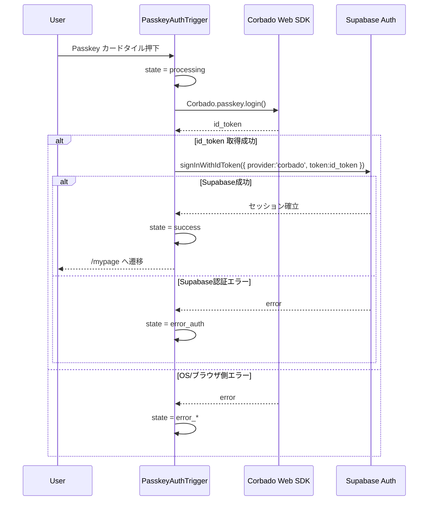

# PasskeyAuthTrigger 詳細設計書 - 第3章：ロジック設計（v1.3）

**Document ID:** HARMONET-COMPONENT-A02-PASSKEYAUTHTRIGGER-CH03**
**Version:** 1.3
**Supersedes:** v1.2（MagicLink統合残存・非UI構造の欠落）
**Status:** MagicLinkForm v1.3 と完全対称の最新仕様に再構築

---

## 3.1 コンポーネント階層（A-00 / A-01 と対称）

PasskeyAuthTrigger は **UI + 認証ロジックを持つ独立カードタイル**であり、旧仕様（MagicLinkForm 内の非UIフック）は完全廃止する。

```
LoginPage (A-00)
 ├─ MagicLinkForm (A-01)   ← 左タイル
 └─ PasskeyAuthTrigger (A-02)  ← 右タイル
```

A-02 は MagicLink とは独立し、WebAuthn → Corbado → Supabase の認証処理を担当する。

---

## 3.2 認証フロー（最新仕様）



---

## 3.3 コアロジック

UI とロジックが A-02 内に統合され、MagicLinkForm への依存はない。

```ts
const handlePasskey = async () => {
  setState('processing');
  setBanner(null);

  logInfo('auth.login.start', {
    screen: 'LoginPage',
    method: 'passkey',
  });

  try {
    await Corbado.load({ projectId: process.env.NEXT_PUBLIC_CORBADO_PROJECT_ID! });
    const result = await Corbado.passkey.login();
    if (!result?.id_token) throw new Error('NO_TOKEN');

    const { error } = await supabase.auth.signInWithIdToken({
      provider: 'corbado',
      token: result.id_token,
    });

    if (error) throw error;

    logInfo('auth.login.success.passkey', { screen: 'LoginPage' });
    setState('success');
    onSuccess?.();
    window.location.href = '/mypage';
  } catch (err: any) {
    const e = classifyError(err, t);
    setState(e.type);
    setBanner({ kind: 'error', message: e.message });

    logError(`auth.login.fail.passkey.${e.type.replace('error_', '')}`, {
      screen: 'LoginPage',
      code: e.code,
    });

    onError?.(e);
  }
};
```

---

## 3.4 エラー分類（A-01 と対称）

```ts
function classifyError(err: any, t: (k: string) => string): PasskeyAuthError {
  if (err?.name === 'NotAllowedError')
    return { code: 'NOT_ALLOWED', type: 'error_denied', message: t('auth.login.passkey.error_denied') };

  if (String(err?.message).includes('ORIGIN'))
    return { code: 'ORIGIN', type: 'error_origin', message: t('auth.login.passkey.error_origin') };

  if (String(err?.message).includes('NETWORK'))
    return { code: 'NETWORK', type: 'error_network', message: t('auth.login.passkey.error_network') };

  if (err?.code)
    return { code: err.code, type: 'error_auth', message: t('auth.login.passkey.error_auth') };

  return { code: 'UNEXPECTED', type: 'error_unexpected', message: t('auth.login.passkey.error_unexpected') };
}
```

### ✔ A-01 のエラー体系と完全一致

* MagicLink：error_input / error_network / error_auth / error_unexpected
* Passkey：error_denied / error_origin / error_network / error_auth / error_unexpected

---

## 3.5 状態遷移（A-01 と対称の粒度）

| 状態               | 説明                |
| ---------------- | ----------------- |
| idle             | 初期状態              |
| processing       | Passkey 認証進行中     |
| success          | 認証成功（即 `/mypage`） |
| error_denied     | キャンセル（NotAllowed） |
| error_origin     | Origin mismatch   |
| error_network    | 通信障害              |
| error_auth       | Supabase 認証失敗     |
| error_unexpected | 想定外例外             |

---

## 3.6 ログ仕様（A-01 と共通）

| タイミング  | イベント                                 | レベル   |
| ------ | ------------------------------------ | ----- |
| カード押下  | `auth.login.start`                   | INFO  |
| 成功     | `auth.login.success.passkey`         | INFO  |
| キャンセル  | `auth.login.fail.passkey.denied`     | ERROR |
| Origin | `auth.login.fail.passkey.origin`     | ERROR |
| ネットワーク | `auth.login.fail.passkey.network`    | ERROR |
| 認証失敗   | `auth.login.fail.passkey.auth`       | ERROR |
| 想定外    | `auth.login.fail.passkey.unexpected` | ERROR |

ログイベント体系は A-01 MagicLinkForm と完全に一致させてある。

---

## 3.7 外部依存関係

| モジュール              | 用途                             |
| ------------------ | ------------------------------ |
| Corbado Web SDK    | WebAuthn 認証起動（id_token 取得）     |
| Supabase Auth      | `signInWithIdToken` によるセッション確立 |
| StaticI18nProvider | i18n キーの取得                     |
| 共通ログユーティリティ        | APログ出力                         |

---

## 3.8 UT 観点

| UT ID     | シナリオ            | 期待状態              |
| --------- | --------------- | ----------------- |
| UT-A02-01 | 成功              | success → /mypage |
| UT-A02-02 | キャンセル           | error_denied      |
| UT-A02-03 | Origin mismatch | error_origin      |
| UT-A02-04 | 通信障害            | error_network     |
| UT-A02-05 | 認証失敗            | error_auth        |
| UT-A02-06 | 想定外             | error_unexpected  |

---

## 3.9 ChangeLog

| Version | Summary                                                       |
| ------- | ------------------------------------------------------------- |
| 1.2     | MagicLinkForm v1.2 に整合した最小限更新（旧構造）                            |
| **1.3** | **A-01 と完全対称のロジック構成へ全面刷新。非UI構造を廃止し、カードタイル UI と統合された最新仕様へ更新。** |
