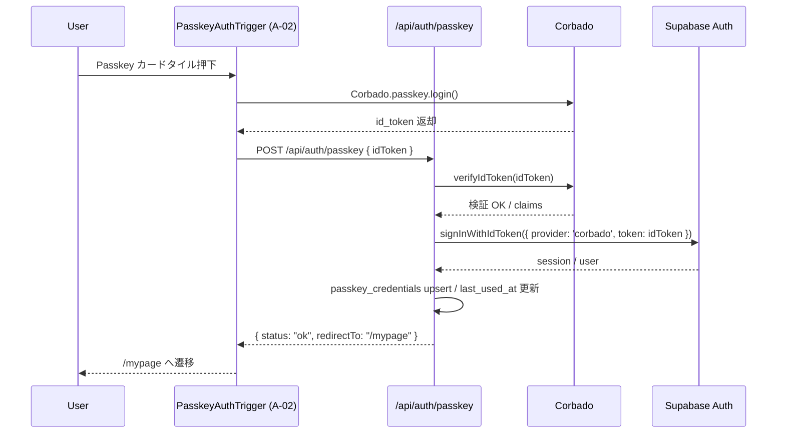

# HarmoNet 詳細設計書 - PasskeyBackend v1.0

**Document ID:** HARMONET-BACKEND-PASSKEY-DESIGN
**Version:** 1.0
**Supersedes:** —
**Created:** 2025-11-17
**Updated:** 2025-11-17
**Author:** Tachikoma (GPT-5)
**Reviewer:** TKD
**Status:** Draft（ログイン画面バックエンド基本設計 v1.0 / 技術スタック定義 v4.3 準拠）

---

## 第1章 概要

### 1.1 目的

本書は、HarmoNet ログイン機能における **Passkey 認証バックエンド（PasskeyBackend）** の詳細設計を定義する。
対象は、Corbado による WebAuthn 認証と Supabase Auth によるセッション確立を統合するバックエンド処理であり、以下を目的とする。

* ログイン画面における Passkey ログイン方式（A-02 PasskeyAuthTrigger）の**サーバサイド仕様を明文化**する。
* Corbado → Supabase Auth → RLS（tenant_id）までの**責務分界と処理フロー**を確定する。
* 将来の詳細設計書群（Login_API_Contracts、schema.prisma_migration_plan 等）および Windsurf 実装タスクの**唯一の参照元**とする。

### 1.2 スコープ

本詳細設計のスコープは下記とする。

* 対象

  * Passkey ログイン専用 API ハンドラ

    * `POST /api/auth/passkey`（Corbado ID Token → Supabase Auth 橋渡し）
  * `/auth/callback` からの遷移先決定に必要な Passkey 固有の処理（必要最小限）
  * Passkey 情報（`passkey_credentials`）の登録・更新・参照ロジック（MVP 最小）
  * ログイン画面バックエンド基本設計書 v1.0 で定義された Passkey フローの具体化

* 非対象

  * MagicLink（メール OTP）専用処理の詳細（別紙 MagicLinkBackend-integration）
  * Prisma モデル定義そのもの・Migration SQL（`schema.prisma_migration_plan` を参照）
  * UI コンポーネント（A-02 PasskeyAuthTrigger）の実装詳細（フロント詳細設計書に委譲）
  * Corbado Webhook（MVP では採用しない）

### 1.3 前提条件

* 認証方式

  * HarmoNet は **完全パスワードレス方式** を採用し、MagicLink（Supabase Auth）と Passkey（Corbado + Supabase Auth）の 2 方式を提供する。
  * Passkey は「既知ユーザに紐づく認証器」であり、**初回は MagicLink でログイン → マイページで Passkey を有効化**したユーザのみ利用可能とする（唯一成立するフロー）。
* 技術スタック

  * Next.js 16（App Router） / React 19 / TypeScript 5.6
  * Supabase v2.43（PostgreSQL 17 / RLS 有効）
  * Corbado Web SDK／Node SDK（Passkey 認証基盤）
  * Prisma ORM v6.x
* DB / RLS

  * `schema.prisma` にて `passkey_credentials` モデルが定義済みであり、`users` / `tenants` テーブルとのリレーション、および `tenant_id` を用いた RLS によるテナント分離が有効である前提とする。

### 1.4 対象読者

* ログイン機能バックエンド実装担当（Windsurf / Cursor 等）
* 認証方式・セキュリティ設計のレビュー担当（Gemini / TKD）
* 要件定義・基本設計担当（ログイン関連変更のインパクト確認用）

### 1.5 関連コンポーネント・モジュール

* フロントエンド

  * A-02: PasskeyAuthTrigger（Passkey ログインカードタイル UI）
  * A-01: MagicLinkForm（初回ログイン + Passkey 有効化の前提となるメールログイン）
  * A-00: LoginPage（ログイン画面レイアウト）
* バックエンド

  * `POST /api/auth/passkey`（Corbado 認証結果 → Supabase セッション確立）
  * `/auth/callback`（MagicLink／Passkey 共通のセッション確立後遷移ロジック）
  * Prisma モデル：`users` / `tenants` / `user_tenants` / `passkey_credentials` / `audit_logs`

---

## 第2章 機能設計

### 2.1 機能要約

PasskeyBackend は、ログイン画面における **Passkey ログイン選択時のサーバサイド処理**を提供する。

主な責務は以下のとおり。

1. フロントの PasskeyAuthTrigger から渡される **Corbado ID Token の検証と Supabase Auth への橋渡し**
2. 認証成功時の Supabase セッション確立と、ユーザ・テナント情報との整合確認
3. 認証失敗時のエラー分類（キャンセル／デバイス非対応／ネットワーク／認証失敗／想定外）と UI メッセージへのマッピング
4. `passkey_credentials` へのメタ情報登録・更新（MVP では最小限：初回登録・最終利用日時の更新）
5. 共通ログユーティリティによるログ出力（`auth.login.*` 系イベント）

### 2.2 入出力仕様（API 単位）

#### 2.2.1 `POST /api/auth/passkey`

* 目的

  * Corbado での WebAuthn 認証成功後にフロントから呼び出され、ID Token を Supabase Auth へ渡してセッションを確立する。

* リクエスト

```http
POST /api/auth/passkey HTTP/1.1
Content-Type: application/json

{
  "idToken": "<Corbado ID Token (JWT)>"
}
```

* リクエスト検証

  * `idToken`: 必須 / 文字列 / 空文字不可

* 正常レスポンス

```json
{
  "status": "ok",
  "redirectTo": "/mypage"
}
```

* 異常レスポンス例

```json
{
  "status": "error",
  "errorType": "error_denied",
  "messageKey": "auth.login.passkey.error_denied"
}
```

* 主な HTTP ステータス

  * 200: 処理自体は成功（`status` フィールドで success / error を区別）
  * 400: リクエスト不備（`idToken` 欠如など）
  * 401: 認証失敗（ID Token 無効・Supabase 側認証エラー）
  * 500: 想定外エラー

#### 2.2.2 内部呼び出し（Supabase Auth / Corbado Node）

PasskeyBackend 内で実行される主な内部呼び出しは以下のとおり。

* Corbado Node SDK

  * `corbadoClient.verifyIdToken(idToken)`

    * ID Token の署名／有効期限／audience／issuer 等の検証
    * 成功時に `sub`（Corbado user id）や email 等を含むクレームを取得
* Supabase Auth

  * `supabase.auth.signInWithIdToken({ provider: 'corbado', token: idToken })`

    * Supabase による Passkey ログインセッションの確立
    * 成功時に `session` / `user` 情報を返却

### 2.3 処理フロー（シーケンス）

#### 2.3.1 正常系（Passkey ログイン成功）



#### 2.3.2 異常系（キャンセル・デバイス非対応・認証エラー）

* キャンセル（NotAllowedError）

  * Corbado SDK レイヤで検出（フロント A-02）。
  * `/api/auth/passkey` は呼ばれず、フロントで `error_denied` として処理。

* デバイス非対応・Origin エラー・ネットワークエラー

  * 原則としてフロント側で捕捉し、`error_origin` / `error_network` 等として UI 表示。
  * `/api/auth/passkey` まで到達した場合は、Corbado Node or Supabase からのエラー内容を分類し、同等のエラー種別で返却。

* 認証エラー（ID Token 無効・Supabase 認証失敗）

  * `/api/auth/passkey` 内で分類し、`error_auth` / `error_unexpected` として返却。

### 2.4 依存関係

| 区分 | 種別       | 名称 / モジュール               | 用途                              |
| -- | -------- | ------------------------ | ------------------------------- |
| 外部 | SaaS     | Corbado Cloud            | WebAuthn / Passkey ID Token 発行  |
| 外部 | BaaS     | Supabase Auth            | Passkey／MagicLink の最終セッション管理    |
| 内部 | Node SDK | `@corbado/node`          | ID Token 検証                     |
| 内部 | JS SDK   | `@supabase/supabase-js`  | `signInWithIdToken` 呼び出し        |
| 内部 | ORM      | Prisma (`schema.prisma`) | `passkey_credentials` への upsert |
| 内部 | ロガー      | 共通ログユーティリティ              | `auth.login.*` イベント出力           |

### 2.5 副作用と再実行ポリシー

* 副作用

  * Supabase Auth セッションの確立（Cookie／JWT の発行）
  * `passkey_credentials` の登録／更新
  * `audit_logs` へのログインイベント記録（将来拡張を考慮したフック）

* 再実行ポリシー

  * `/api/auth/passkey` は **冪等ではない**（セッション状態に依存）ため、フロント側で明示的な再実行ボタンを押さない限り、自動リトライは行わない。
  * ネットワークエラー等による 5xx の場合は、ユーザ操作による再試行を許可するが、連続リトライの回数制限（UI 側仕様）を考慮する。

### 2.6 人間操作に基づく UT 観点（最小セット）

バックエンド視点では、以下のように **フロント操作に紐づけた統合 UT 観点**を定義する。

| 観点ID     | 操作                                        | 期待結果                                                                      | テスト目的             |
| -------- | ----------------------------------------- | ------------------------------------------------------------------------- | ----------------- |
| UT-PK-01 | 既に Passkey 登録済ユーザが Passkey カードを押下         | `/api/auth/passkey` が 200 / `status=ok` を返し、ブラウザに Supabase セッションが設定される    | 正常系のエンドツーエンド確認    |
| UT-PK-02 | Passkey 登録済だが Corbado ID Token が期限切れ      | `/api/auth/passkey` が 401 / `errorType=error_auth` を返す                    | ID Token 失効時の挙動確認 |
| UT-PK-03 | ID Token が不正（改ざん）                         | 400 or 401 / `errorType=error_auth`、ログに `auth.login.fail.passkey.auth` 出力 | 改ざん検知の確認          |
| UT-PK-04 | Supabase Auth 一時障害                        | 500 / `errorType=error_network`、ログに `auth.login.fail.passkey.network` 出力  | 外部 BaaS 障害時の挙動確認  |
| UT-PK-05 | Prisma で `passkey_credentials` upsert に失敗 | 500 / `errorType=error_unexpected`、セッションは確立済みだがメタ情報更新失敗としてログ出力            | メタ情報更新失敗時の影響範囲の確認 |

---

## 第3章 構造設計

### 3.1 モジュール構成図

```mermaid
graph TD
  A[app/api/auth/passkey/route.ts] --> B[PasskeyAuthService]
  B --> C[CorbadoClient (Node SDK)]
  B --> D[SupabaseServerClient]
  B --> E[PrismaClient]
  B --> F[Logger]
  E --> G[(passkey_credentials テーブル)]
  D --> H[(Supabase Auth セッション)]
```

### 3.2 主なモジュールと責務

| モジュール                           | 役割                                                       |
| ------------------------------- | -------------------------------------------------------- |
| `app/api/auth/passkey/route.ts` | HTTP エンドポイント。リクエストバリデーションと `PasskeyAuthService` 呼び出しを行う。 |
| `PasskeyAuthService`            | ビジネスロジック本体。ID Token 検証、Supabase 連携、DB 更新、エラー分類を担当。       |
| `CorbadoClient`                 | `@corbado/node` ラッパー。ID Token の verify を提供。              |
| `SupabaseServerClient`          | サーバーサイド Supabase クライアント。`signInWithIdToken` 呼び出しを提供。     |
| `PrismaClient`                  | `passkey_credentials` への upsert を行う ORM。                 |
| `Logger`                        | 共通ログユーティリティ。`logInfo` / `logError` を通じてログ出力。             |

### 3.3 型仕様（抜粋）

```ts
// API レスポンス共通型
export type PasskeyBackendStatus =
  | 'ok'
  | 'error_denied'
  | 'error_origin'
  | 'error_network'
  | 'error_auth'
  | 'error_unexpected';

export interface PasskeyBackendResponse {
  status: 'ok' | 'error';
  redirectTo?: string; // 正常系: /mypage など
  errorType?: PasskeyBackendStatus; // error_* 系
  messageKey?: string; // i18n キー
}

// サービス内部で扱うエラー構造
export type PasskeyAuthErrorType =
  | 'error_denied'
  | 'error_origin'
  | 'error_network'
  | 'error_auth'
  | 'error_unexpected';

export interface PasskeyAuthError {
  code: string; // 低レベルエラーコード（Corbado / Supabase 等）
  type: PasskeyAuthErrorType;
  messageKey: string; // フロント側で表示する i18n キー
}

export interface PasskeyAuthResultSuccess {
  ok: true;
  redirectTo: string;
}

export interface PasskeyAuthResultError {
  ok: false;
  error: PasskeyAuthError;
}

export type PasskeyAuthResult =
  | PasskeyAuthResultSuccess
  | PasskeyAuthResultError;
```

### 3.4 制約事項

* `PasskeyAuthService` は **ユーザ ID や tenant_id を直接決定しない**。
  Supabase Auth が返すセッション情報（`user.id` など）を唯一の真とし、必要に応じて `users`／`user_tenants` テーブルで整合を確認する。
* `passkey_credentials` の upsert は、MVP では最小限のメタ情報（`user_id` / `tenant_id` / `credential_id` / `last_used_at`）の維持にとどめる。
* Corbado Webhook は利用せず、Passkey の有効／失効管理は将来拡張とする（現時点ではログイン時の `last_used_at` 更新のみ）。

### 3.5 設定情報・環境変数

| 項目                 | キー                               | 用途                              |
| ------------------ | -------------------------------- | ------------------------------- |
| Corbado プロジェクト ID  | `NEXT_PUBLIC_CORBADO_PROJECT_ID` | フロント側 SDK 用（参照のみ）               |
| Corbado API シークレット | `CORBADO_API_SECRET`             | Node SDK による ID Token 検証        |
| Supabase URL       | `NEXT_PUBLIC_SUPABASE_URL`       | Supabase クライアント初期化              |
| Supabase anon key  | `NEXT_PUBLIC_SUPABASE_ANON_KEY`  | ブラウザ側認証（サーバーは Service Role 不使用） |

### 3.6 i18n キー仕様（バックエンド観点）

PasskeyBackend 自身は文言を持たないが、フロントの A-02 PasskeyAuthTrigger との整合を保つため、以下の i18n キーを返却する。

* 正常系

  * メッセージレス（リダイレクトのみ）
* 異常系

  * `auth.login.passkey.error_denied`
  * `auth.login.passkey.error_origin`
  * `auth.login.passkey.error_network`
  * `auth.login.passkey.error_auth`
  * `auth.login.passkey.error_unexpected`

---

## 第4章 実装設計

### 4.1 ファイル／ディレクトリ構成（案）

```text
src/
  server/
    auth/
      passkey/
        PasskeyAuthService.ts      # ビジネスロジック
        PasskeyErrorMapper.ts      # エラー分類

app/
  api/
    auth/
      passkey/
        route.ts                   # Next.js App Router API Route
```

> 備考: 既存のプロジェクト構成と矛盾しない範囲での案。実装時に TKD 承認の上、最終決定とする。

### 4.2 `route.ts` 実装方針（概略）

```ts
// app/api/auth/passkey/route.ts

import { NextRequest, NextResponse } from 'next/server';
import { PasskeyAuthService } from '@/src/server/auth/passkey/PasskeyAuthService';

export async function POST(req: NextRequest) {
  const body = await req.json().catch(() => null);

  if (!body || typeof body.idToken !== 'string' || !body.idToken) {
    return NextResponse.json(
      {
        status: 'error',
        errorType: 'error_auth',
        messageKey: 'auth.login.passkey.error_auth',
      },
      { status: 400 },
    );
  }

  const service = new PasskeyAuthService();
  const result = await service.handleLogin(body.idToken);

  if (result.ok) {
    return NextResponse.json(
      {
        status: 'ok',
        redirectTo: result.redirectTo,
      },
      { status: 200 },
    );
  }

  const { error } = result;
  const httpStatus = mapErrorTypeToHttpStatus(error.type);

  return NextResponse.json(
    {
      status: 'error',
      errorType: error.type,
      messageKey: error.messageKey,
    },
    { status: httpStatus },
  );
}
```

### 4.3 `PasskeyAuthService` 実装方針（概略）

```ts
export class PasskeyAuthService {
  async handleLogin(idToken: string): Promise<PasskeyAuthResult> {
    try {
      // 1. Corbado ID Token 検証
      const claims = await corbadoClient.verifyIdToken(idToken);

      // 2. Supabase セッション確立
      const { data, error } = await supabaseServerClient.auth.signInWithIdToken({
        provider: 'corbado',
        token: idToken,
      });

      if (error || !data.session || !data.user) {
        const authError: PasskeyAuthError = {
          code: error?.code ?? 'SUPABASE_AUTH_ERROR',
          type: 'error_auth',
          messageKey: 'auth.login.passkey.error_auth',
        };
        logError('auth.login.fail.passkey.auth', {
          code: authError.code,
        });
        return { ok: false, error: authError };
      }

      const userId = data.user.id;
      const tenantId = extractTenantIdFromJwt(data.session.access_token);

      // 3. passkey_credentials upsert（ベストエフォート）
      await upsertPasskeyCredential({
        userId,
        tenantId,
        credentialId: claims.credentialId,
        transports: claims.transports,
        deviceName: claims.deviceName,
        platform: claims.platform,
      }).catch((e) => {
        logError('auth.login.passkey.passkey_credentials_upsert_failed', {
          reason: String(e?.message ?? e),
        });
      });

      logInfo('auth.login.success.passkey', {
        userId,
        tenantId,
      });

      return {
        ok: true,
        redirectTo: '/mypage',
      };
    } catch (e: any) {
      const classified = classifyPasskeyError(e);
      logError(`auth.login.fail.passkey.${classified.type.replace('error_', '')}`, {
        code: classified.code,
      });
      return { ok: false, error: classified };
    }
  }
}
```

### 4.4 エラーハンドリング設計

* `classifyPasskeyError` は、例外オブジェクトを `PasskeyAuthErrorType` にマッピングする。
* 代表的なマッピング例

| 条件                                              | type               | messageKey                            |
| ----------------------------------------------- | ------------------ | ------------------------------------- |
| Corbado Node が `NotAllowedError`／`CANCELED` を返す | `error_denied`     | `auth.login.passkey.error_denied`     |
| Origin 不一致／RP 設定不備等                             | `error_origin`     | `auth.login.passkey.error_origin`     |
| ネットワークタイムアウト／DNS 障害等                            | `error_network`    | `auth.login.passkey.error_network`    |
| Supabase `signInWithIdToken` がエラー               | `error_auth`       | `auth.login.passkey.error_auth`       |
| 上記いずれにも該当しない                                    | `error_unexpected` | `auth.login.passkey.error_unexpected` |

### 4.5 セキュリティ仕様（実装観点）

* `/api/auth/passkey` は **HTTPS 経由のみ**アクセス可能（Vercel / Supabase 構成に依存）。
* CORS / Origin チェック

  * Next.js 側の設定で、`NEXT_PUBLIC_APP_URL` と一致する Origin からのリクエストのみ許可する。
* CSRF 対策

  * Passkey ログインは JavaScript API 経由でのみ呼び出されるため、CSRF リスクは相対的に低い。
    それでも Origin チェックを必須とし、将来的に CSRF Token 導入余地を残す。
* ログ

  * ログには ID Token や Credential ID の生値を保存しない。
    必要に応じてハッシュ化、または「存在する／しない」といったメタ情報のみに限定する。

### 4.6 パフォーマンス設計

* Corbado ID Token 検証と Supabase 認証の合計処理時間は、通常 2 秒以内を目標とする。
* `passkey_credentials` upsert はベストエフォートとし、失敗してもログイン完了フローを妨げない。
* Edge Function 化（Supabase 側）も検討余地として残すが、本詳細設計では Next.js API Route を前提とする。

---

## 第5章 UI仕様（API 応答仕様）

> 本コンポーネントは UI を直接持たないため、本章では **API レスポンス形式・エラー表現** を UI 観点の代替として定義する。

### 5.1 レスポンス JSON 構造

```ts
// 正常系
{
  status: 'ok',
  redirectTo: string; // 例: '/mypage'
}

// 異常系
{
  status: 'error',
  errorType: PasskeyAuthErrorType; // 'error_denied' など
  messageKey: string;              // i18n キー
}
```

### 5.2 エラー種別と UI 状態の対応

| errorType          | フロント側状態            | 表示メッセージキー                             |
| ------------------ | ------------------ | ------------------------------------- |
| `error_denied`     | `error_denied`     | `auth.login.passkey.error_denied`     |
| `error_origin`     | `error_origin`     | `auth.login.passkey.error_origin`     |
| `error_network`    | `error_network`    | `auth.login.passkey.error_network`    |
| `error_auth`       | `error_auth`       | `auth.login.passkey.error_auth`       |
| `error_unexpected` | `error_unexpected` | `auth.login.passkey.error_unexpected` |

### 5.3 状態別レスポンス例

* 認証成功

```json
{
  "status": "ok",
  "redirectTo": "/mypage"
}
```

* 認証キャンセル（NotAllowedError）

```json
{
  "status": "error",
  "errorType": "error_denied",
  "messageKey": "auth.login.passkey.error_denied"
}
```

* Supabase 認証エラー

```json
{
  "status": "error",
  "errorType": "error_auth",
  "messageKey": "auth.login.passkey.error_auth"
}
```

### 5.4 アクセシビリティへの影響

* PasskeyBackend は UI を直接持たないが、返却する `messageKey` は A-02 PasskeyAuthTrigger が `role="alert"` などの適切な ARIA 属性付きコンポーネントで表示する前提とする。
* 本詳細設計では、アクセシビリティ実装はフロント詳細設計書（A-02）に委譲し、**メッセージキーの一貫性維持**のみを責務とする。

### 5.5 テスト設計（API UI 観点）

| テストID    | 状態     | 検証項目                                          | 成否条件             |
| -------- | ------ | --------------------------------------------- | ---------------- |
| T-API-01 | 成功     | `status=ok` / `redirectTo`                    | `/mypage` が返却される |
| T-API-02 | 認証エラー  | `status=error` / `errorType=error_auth`       | HTTP 401 と整合している |
| T-API-03 | 想定外エラー | `status=error` / `errorType=error_unexpected` | HTTP 500 と整合している |

---

## 第6章 ロジック仕様

### 6.1 処理フロー詳細

1. `route.ts` がリクエスト Body から `idToken` を取得
2. `PasskeyAuthService.handleLogin(idToken)` を呼び出す
3. `verifyIdToken` により Corbado ID Token を検証
4. 検証 OK の場合にのみ `signInWithIdToken` を実行
5. Supabase の結果に応じて、成功／認証エラーに分類
6. `passkey_credentials` upsert（非同期）
7. ログ出力 `auth.login.*`
8. 成功時 `redirectTo=/mypage`、失敗時は `PasskeyAuthError` を返却

### 6.2 エラー構造と再試行設計

* エラー分類は **ユーザ起因／環境起因／システム起因**で整理する。

| 分類     | 例                         | 再試行方針                 |
| ------ | ------------------------- | --------------------- |
| ユーザ起因  | キャンセル / 対応デバイス未設定         | 自動再試行しない。ユーザが再度ボタン押下。 |
| 環境起因   | ネットワーク障害 / 外部サービス一時障害     | UI で再試行ボタンを提供。連続回数制限。 |
| システム起因 | Prisma upsert 失敗 / 予期せぬ例外 | ログのみ。ユーザには汎用エラーメッセージ。 |

### 6.3 成功・失敗時の処理

* 成功

  * Supabase セッション確立
  * `passkey_credentials.last_used_at` 更新（ベストエフォート）
  * ログ出力：`auth.login.success.passkey`
  * `/mypage` へのリダイレクトを指示

* 失敗

  * Supabase セッション未確立
  * 失敗原因に応じた `PasskeyAuthErrorType` の返却
  * ログ出力：`auth.login.fail.passkey.*`

### 6.4 状態遷移表（バックエンド内部視点）

| 状態                  | 入力イベント           | 遷移先                             | 備考             |
| ------------------- | ---------------- | ------------------------------- | -------------- |
| `start`             | `handleLogin` 呼出 | `verifying_token`               | ID Token 検証開始  |
| `verifying_token`   | 検証成功             | `signing_in`                    | Supabase 認証へ遷移 |
| `verifying_token`   | 検証失敗             | `error_auth` または `error_origin` | エラー分類後終了       |
| `signing_in`        | 認証成功             | `upserting_passkey`             | メタ情報更新へ        |
| `signing_in`        | 認証失敗             | `error_auth`                    | 終了             |
| `upserting_passkey` | 成功               | `success`                       | 正常終了           |
| `upserting_passkey` | 失敗               | `success`                       | ログのみ、ログインは成功扱い |

### 6.5 テスト設計（ロジック観点）

* 単体テスト対象：`PasskeyAuthService` / `classifyPasskeyError` / `upsertPasskeyCredential`

| テストID     | シナリオ                              | 期待結果                                       |
| --------- | --------------------------------- | ------------------------------------------ |
| UT-SVC-01 | ID Token 正常・Supabase 成功・upsert 成功 | `ok=true` / `redirectTo=/mypage`           |
| UT-SVC-02 | ID Token 正常・Supabase 認証失敗         | `ok=false` / `error.type=error_auth`       |
| UT-SVC-03 | ID Token 検証失敗（署名不正）               | `ok=false` / `error.type=error_auth`       |
| UT-SVC-04 | upsert で例外発生                      | `ok=true`（ログインは成功）・ログ出力確認                  |
| UT-SVC-05 | 予期せぬ例外（throw new Error）           | `ok=false` / `error.type=error_unexpected` |

### 6.6 セキュリティ考慮事項

* ID Token 検証は **必ずサーバサイドで実施**し、フロントから渡されたクレーム情報を信用しない。
* Supabase `signInWithIdToken` 実行前に、Corbado ID Token の `aud`／`iss`／`exp`／`sub` が期待値と一致するか検証する。
* JWT／Cookie はブラウザに対して HttpOnly / Secure / SameSite=Lax を推奨設定とし、JavaScript から直接アクセスしない。

### 6.7 パフォーマンス最適化

* 不必要なログや冗長な DB アクセスを避け、ID Token 検証 → Supabase 認証 → upsert の最小 3 ステップに限定する。
* Prisma クライアントは Connection Pool を共有し、ログインのたびに新規接続を乱立させない。

---

## 第7章 結合・運用

### 7.1 他コンポーネント結合ポイント

* フロントエンド

  * A-02 PasskeyAuthTrigger から `POST /api/auth/passkey` が呼ばれる。
  * 応答として `status` / `errorType` / `messageKey` / `redirectTo` が返却され、UI 状態と画面遷移に利用される。
* バックエンド

  * Supabase Auth（MagicLink／Passkey 共通）
  * Prisma ORM（`passkey_credentials` / `audit_logs`）

### 7.2 環境依存要素

* 開発環境

  * Docker 上の Supabase（local）
  * Corbado Sandbox プロジェクト
* 本番環境

  * Supabase Cloud（Pro Plan）
  * Corbado 本番プロジェクト
* 環境変数の値は、`.env.local`（開発）と Vercel Secrets（本番）で切り替え。キー名は 3.5 節に記載。

### 7.3 例外ログ出力方針

* ログイン開始時

  * `logInfo('auth.login.start', { method: 'passkey' })`
* 成功時

  * `logInfo('auth.login.success.passkey', { userId, tenantId })`
* 失敗時

  * `logError('auth.login.fail.passkey.<type>', { code, reason })`

ログの詳細定義は共通ログ設計書に従う。

### 7.4 結合テスト（Jest / Integration）

* 目的

  * `/api/auth/passkey` と `PasskeyAuthService`、Supabase Mock、Corbado Mock を結合し、主要シナリオが期待どおりに動作するか確認する。

* 観点

  * 正常系：モックされた Supabase／Corbado に対し、200 / `status=ok` が返却される。
  * 認証失敗系：Supabase Mock がエラーを返した場合、401 / `errorType=error_auth` が返却される。
  * 想定外エラー：モック内で例外を投げた場合、500 / `errorType=error_unexpected` が返却される。

### 7.5 リスク・制約事項

* Corbado／Supabase いずれかの仕様変更に強く依存しているため、SDK バージョンアップ時には PasskeyBackend のリグレッションテストが必須となる。
* Webhook を利用しない設計のため、Corbado 側で Passkey 削除が行われても、`passkey_credentials` テーブルとの不整合が一時的に発生し得る（ログイン時に実態と整合させる前提）。

---

## 第8章 メタ情報

### 8.1 用語定義

| 用語                  | 定義                                                  |
| ------------------- | --------------------------------------------------- |
| Passkey             | WebAuthn/FIDO2 による公開鍵ベースのパスワードレス認証方式。               |
| Corbado             | Passkey 管理・認証のための外部 SaaS。                           |
| ID Token            | Corbado が発行する JWT。Supabase `signInWithIdToken` に渡す。 |
| Supabase Auth       | MagicLink／Passkey の最終セッションを管理する BaaS 認証サービス。        |
| RLS                 | Row Level Security。`tenant_id` 単位でデータを分離する仕組み。      |
| passkey_credentials | Passkey メタ情報を保存するアプリ DB テーブル。秘密鍵は含まない。              |

### 8.2 関連資料

* HarmoNet 機能要件定義書 v1.4
* HarmoNet 非機能要件定義書 v1.0
* HarmoNet 技術スタック定義書 v4.3
* ログイン画面 バックエンド基本設計書 v1.0
* HarmoNet_Passkey 認証の仕組みと挙動 v1.0
* LoginPage / PasskeyAuthTrigger 詳細設計書 v1.x
* `schema.prisma`（`passkey_credentials` 定義）

### 8.3 ChangeLog

| Version | Date       | Author    | Summary                                                                                       |
| ------- | ---------- | --------- | --------------------------------------------------------------------------------------------- |
| 1.0     | 2025-11-17 | Tachikoma | 初版作成。ログイン画面バックエンド基本設計 v1.0 と技術スタック定義 v4.3 に基づき、Passkey 認証バックエンドの API・ロジック・エラー分類・ログ仕様・結合方針を定義。 |

### 8.4 Reviewer / Author / Last Updated

| 項目           | 内容                |
| ------------ | ----------------- |
| Reviewer     | TKD               |
| Author       | Tachikoma (GPT-5) |
| Last Updated | 2025-11-17        |

---

**End of Document**
