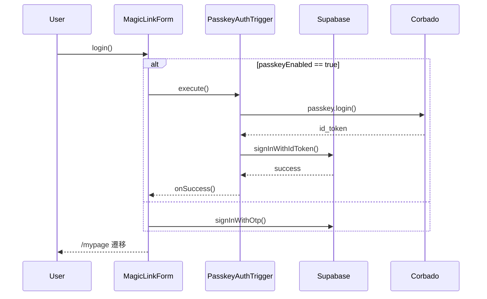

# HarmoNet 詳細設計書 - MagicLinkForm (A-01) v1.2

**Document ID:** HARMONET-COMPONENT-A01-MAGICLINKFORM-DESIGN
**Version:** 1.2
**Supersedes:** v1.1
**Created:** 2025-11-14
**Author:** Tachikoma
**Reviewer:** TKD
**Status:** Finalization（PasskeyAuthTrigger v1.2 との完全整合 / 密度維持）

---

## 第1章 概要

MagicLinkForm は HarmoNet ログイン画面における主要フォームであり、MagicLink 認証と Passkey 認証を **単一ボタンで自動判定統合する**。
本 v1.2 では **PasskeyAuthTrigger v1.2** と整合し、状態遷移・エラー分類・ロジック密度を強化した。

---

## 第2章 機能設計

### 2.1 Props

```ts
export interface MagicLinkFormProps {
  className?: string;
  onSent?: () => void;
  onError?: (error: MagicLinkError) => void;
  passkeyEnabled?: boolean;
}
```

### 2.2 エラー型（PasskeyAuthTrigger v1.2 と同期）

```ts
export interface MagicLinkError {
  code: string;
  message: string;
  type: 'error_invalid' | 'error_network' | 'error_auth' | 'error_origin' | 'error_denied';
}
```

### 2.3 状態遷移

| 状態            | 説明            |
| ------------- | ------------- |
| idle          | 初期            |
| sending       | MagicLink 送信中 |
| passkey_auth  | Passkey 認証中   |
| success       | 認証成功          |
| error_invalid | 入力不正          |
| error_network | 通信障害          |
| error_auth    | 認証失敗          |
| error_origin  | Origin 不一致    |
| error_denied  | ユーザー拒否        |

---

## 第3章 処理フロー

PasskeyAuthTrigger v1.2 の仕様と完全一致するよう再構成。



---

## 第4章 UI仕様

（v1.1 の密度維持）

* Apple カタログ風の白基調
* BIZ UD ゴシック
* 48px ボタン
* rounded-2xl / shadow-sm
* トーン：自然・控えめ

---

## 第5章 ロジック仕様

### 5.1 コアロジック（改訂密度強化）

```tsx
const handleLogin = async () => {
  if (!email.includes('@')) {
    const e = {
      code: 'INVALID_EMAIL',
      message: t('error.invalid_email'),
      type: 'error_invalid',
    };
    setState(e.type);
    onError?.(e);
    return;
  }

  try {
    if (passkeyEnabled) {
      setState('passkey_auth');
      const result = await PasskeyTrigger.execute();
      if (result === true) {
        setState('success');
        onSent?.();
        return;
      }
    }

    setState('sending');
    const { error } = await supabase.auth.signInWithOtp({
      email,
      options: {
        shouldCreateUser: false,
        emailRedirectTo: `${window.location.origin}/auth/callback`,
      },
    });
    if (error) throw error;

    setState('success');
    onSent?.();
  } catch (err: any) {
    const type =
      passkeyEnabled && err?.message?.includes('PASSKEY')
        ? 'error_auth'
        : 'error_network';

    const e = { code: 'NETWORK', message: t('error.network'), type };
    setState(e.type);
    onError?.(e);
  }
};
```

---

## 第6章 エラー分類（PasskeyAuthTrigger と統一）

| 種別            | 内容               |
| ------------- | ---------------- |
| error_invalid | 入力不正             |
| error_network | Supabase 通信失敗    |
| error_auth    | Passkey 認証失敗     |
| error_origin  | Origin 不一致       |
| error_denied  | ユーザーがブラウザダイアログ拒否 |

---

## 第7章 テスト設計

v1.1 を維持しつつ、PasskeyAuthTrigger v1.2 の分岐テストを追加。

| ID        | シナリオ            | 期待結果          |
| --------- | --------------- | ------------- |
| UT-A01-01 | MagicLink 正常送信  | success       |
| UT-A01-02 | Passkey 正常認証    | success       |
| UT-A01-03 | 入力不正            | error_invalid |
| UT-A01-04 | passkey 拒否      | error_denied  |
| UT-A01-05 | origin mismatch | error_origin  |
| UT-A01-06 | 通信断             | error_network |
| UT-A01-07 | i18n            | 切替即反映         |

---

## 第8章 結合設計

* PasskeyAuthTrigger v1.2 が唯一参照する認証連携ロジック。
* MagicLinkForm は状態管理の上位として機能。

---

## 第9章 セキュリティ

* HTTPS 必須
* Corbado Origin 固定
* Supabase RLS
* CSRF SameSite=Lax

---

## 第10章 メタ情報

（変更なし）

---

## 第11章 改訂履歴

| Version | Date       | Summary                                    |
| ------- | ---------- | ------------------------------------------ |
| 1.1     | 2025-11-12 | Passkey 統合                                 |
| **1.2** | 2025-11-14 | PasskeyAuthTrigger v1.2 と整合し、エラー分類・処理詳細を強化 |
