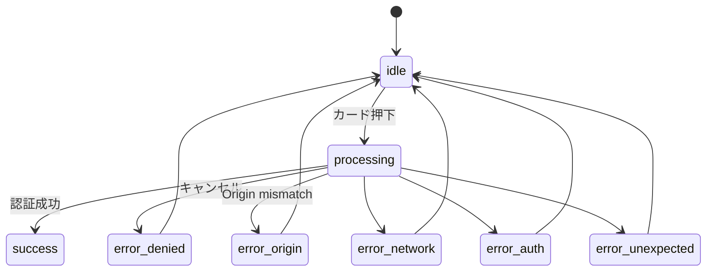

# HarmoNet 詳細設計書 - PasskeyAuthTrigger (A-02) v1.4

**Document ID:** HARMONET-COMPONENT-A02-PASSKEYAUTHTRIGGER-DESIGN
**Version:** 1.4
**Supersedes:** v1.3
**Created:** 2025-11-16
**Updated:** 2025-11-16
**Author:** Tachikoma
**Reviewer:** TKD
**Status:** Vitest対応版 / MagicLink 独立方式（A1 基本設計）完全準拠 / 技術スタック v4.3 整合版

---

# 第1章 概要

### 1.1 目的

PasskeyAuthTrigger（A-02）は、**ログイン画面における「Passkey ログイン」カードタイル UI + WebAuthn 認証ロジック**を提供する独立コンポーネントである。

v1.3 では、下記の最新仕様に完全準拠した再定義を行う：

* **MagicLink と Passkey の統合方式を廃止**（独立カードタイル化）
* MagicLinkForm v1.3 と **UI構造・メッセージ仕様・ログ仕様を完全統一**
* 技術スタック定義書 v4.3（MagicLink/Passkey 二方式並列）への整合
* A1 ログイン画面基本設計（左右2枚カードタイル UI）の正式反映

PasskeyAuthTrigger は **右側カードタイル UI** として MagicLink タイルと並列に表示され、押下により Corbado → Supabase の認証を実行し、成功すれば `/mypage` へ遷移する。

---

# 第2章 機能設計

### 2.1 コンポーネントの責務

| 区分    | 内容                                                                   |
| ----- | -------------------------------------------------------------------- |
| UI    | 右側に配置される「Passkey ログイン」カードタイル                                         |
| ロジック  | Corbado.passkey.login() → id_token → supabase.auth.signInWithIdToken |
| 状態管理  | idle / processing / success / error_* 系                              |
| メッセージ | エラー発生時にカード内にバナー表示（A-00/A-01 のメッセージ体系と共通）                             |
| ログ    | MagicLinkForm と同形式で logInfo/logError を発行                             |

### 2.2 Props 定義

```ts
export interface PasskeyAuthTriggerProps {
  className?: string;        // レイアウト調整
  onSuccess?: () => void;    // 認証成功
  onError?: (error: PasskeyAuthError) => void; // 重要エラー時
  testId?: string;
}
```

### 2.3 エラー型（MagicLinkForm と共通思想）

```ts
export type PasskeyAuthErrorType =
  | 'error_network'
  | 'error_denied'
  | 'error_origin'
  | 'error_auth'
  | 'error_unexpected';

export interface PasskeyAuthError {
  code: string;
  message: string;
  type: PasskeyAuthErrorType;
}
```

### 2.4 状態遷移

| 状態               | 説明                   |
| ---------------- | -------------------- |
| idle             | 初期状態                 |
| processing       | Corbado/WebAuthn 認証中 |
| success          | 認証成功 → /mypage へ遷移   |
| error_denied     | NotAllowed（キャンセル）    |
| error_origin     | Origin mismatch      |
| error_network    | 通信障害                 |
| error_auth       | 認証エラー                |
| error_unexpected | 想定外エラー               |

状態遷移図：



---

# 第3章 構造設計

### 3.1 コンポーネント階層

```mermaid
graph TD
  A[LoginPage (A-00)] --> B[MagicLinkForm (A-01)]
  A --> C[PasskeyAuthTrigger (A-02)]
```

### 3.2 Props / 依存関係

| 依存対象               | 用途                |
| ------------------ | ----------------- |
| Corbado Web SDK    | passkey.login()   |
| Supabase Auth JS   | signInWithIdToken |
| StaticI18nProvider | メッセージ取得           |
| 共通ログユーティリティ        | ログ出力              |

### 3.3 i18n キー（例）

```
auth.login.passkey.title
auth.login.passkey.description
auth.login.passkey.button
auth.login.passkey.error_denied
auth.login.passkey.error_origin
auth.login.passkey.error_network
auth.login.passkey.error_auth
auth.login.passkey.error_unexpected
```

---

# 第4章 実装設計

### 4.1 カード UI（MagicLinkForm と同形式）

```tsx
<div
  className={cardClassName}
  data-testid={testId}
  onClick={handlePasskey}
  role="button"
  aria-busy={state === 'processing'}
>
  <div className="flex items-start gap-3">
    <KeyRound className="w-7 h-7 text-gray-500" aria-hidden="true" />
    <div>
      <h2 className="text-base font-medium text-gray-900">
        {t('auth.login.passkey.title')}
      </h2>
      <p className="mt-1 text-sm text-gray-600">
        {t('auth.login.passkey.description')}
      </p>
    </div>
  </div>

  {banner && (
    <AuthErrorBanner kind={banner.kind} message={banner.message} />
  )}
</div>
```

### 4.2 認証処理

```ts
const handlePasskey = async () => {
  setState('processing');
  setBanner(null);

  logInfo('auth.login.start', {
    screen: 'LoginPage',
    method: 'passkey',
  });

  try {
    await Corbado.load({ projectId: process.env.NEXT_PUBLIC_CORBADO_PROJECT_ID! });
    const result = await Corbado.passkey.login();
    if (!result?.id_token) throw new Error('NO_TOKEN');

    const { error } = await supabase.auth.signInWithIdToken({
      provider: 'corbado',
      token: result.id_token,
    });

    if (error) throw error;

    logInfo('auth.login.success.passkey', { screen: 'LoginPage' });
    setState('success');
    onSuccess?.();
    window.location.href = '/mypage';
  } catch (err: any) {
    const classified = classifyError(err, t);

    setState(classified.type);
    setBanner({ kind: 'error', message: classified.message });

    logError(`auth.login.fail.passkey.${classified.type.replace('error_', '')}`, {
      screen: 'LoginPage',
      code: classified.code,
    });

    onError?.(classified);
  }
};
```

### 4.3 エラー分類

```ts
function classifyError(err: any, t: (k: string) => string): PasskeyAuthError {
  if (err?.name === 'NotAllowedError')
    return { code: 'NOT_ALLOWED', type: 'error_denied', message: t('auth.login.passkey.error_denied') };

  if (String(err?.message).includes('ORIGIN'))
    return { code: 'ORIGIN', type: 'error_origin', message: t('auth.login.passkey.error_origin') };

  if (String(err?.message).includes('NETWORK'))
    return { code: 'NETWORK', type: 'error_network', message: t('auth.login.passkey.error_network') };

  if (err?.code)
    return { code: err.code, type: 'error_auth', message: t('auth.login.passkey.error_auth') };

  return { code: 'UNEXPECTED', type: 'error_unexpected', message: t('auth.login.passkey.error_unexpected') };
}
```

---

# 第5章 UI仕様

### 5.1 トーン

* rounded-2xl
* shadow-[0_1px_2px_rgba(0,0,0,0.06)]
* 高さ 80〜92px
* Appleカタログ風の控えめデザイン（MagicLink と統一）

### 5.2 状態別表示

| 状態         | UI                 |
| ---------- | ------------------ |
| idle       | 通常カード              |
| processing | 透過 50% + busy aria |
| error_*    | バナー表示              |

---

# 第6章 ロジック仕様

### 6.1 イベントログ

| タイミング           | event                                | レベル   |
| --------------- | ------------------------------------ | ----- |
| カード押下           | `auth.login.start`                   | INFO  |
| 認証成功            | `auth.login.success.passkey`         | INFO  |
| キャンセル           | `auth.login.fail.passkey.denied`     | ERROR |
| origin mismatch | `auth.login.fail.passkey.origin`     | ERROR |
| 通信障害            | `auth.login.fail.passkey.network`    | ERROR |
| 認証エラー           | `auth.login.fail.passkey.auth`       | ERROR |
| 想定外             | `auth.login.fail.passkey.unexpected` | ERROR |

### 6.2 セキュリティ

* HTTPS 必須
* Passkey はデバイス内セキュア領域に保存（Corbado/WebAuthn 標準）
* id_token は遷移後即破棄
* RLS により tenant_id を分離

---

# 第7章 テスト仕様

### 7.1 単体テスト（Vitest + React Testing Library）

PasskeyAuthTrigger コンポーネントの単体テストは、Vitest + RTL で以下の観点を確認する。

| ID        | シナリオ            | 期待結果               |
| --------- | --------------- | ------------------ |
| UT-A02-01 | 正常系：認証成功        | success → /mypage  |
| UT-A02-02 | キャンセル           | error_denied + バナー |
| UT-A02-03 | Origin mismatch | error_origin       |
| UT-A02-04 | NETWORK エラー     | error_network      |
| UT-A02-05 | 認証エラー           | error_auth         |
| UT-A02-06 | 想定外エラー          | error_unexpected   |
| UT-A02-07 | i18n 切替         | 文言が全て切替            |

---

# 第8章 メタ情報

### 8.1 用語定義

* Passkey：WebAuthn によるパスワードレス認証
* Corbado：WebAuthn プロバイダ SDK
* id_token：WebAuthn 認証成功時のトークン

### 8.2 関連資料

* MagicLinkForm-detail-design_v1.3
* LoginPage-detail-design_v1.2
* harmomet-technical-stack-definition_v4.3
* HarmoNet_Passkey認証の仕組みと挙動_v1.0

### 8.3 ChangeLog

| Version | Date       | Summary                                                               |
| ------- | ---------- | --------------------------------------------------------------------- |
| 1.4     | 2025-11-16 | Vitest対応版。第7章にテストフレームワーク「Vitest + React Testing Library」を明記。他設計書と統一。 |
| 1.3     | 2025-11-16 | Passkey 独立カートタイル方式に全面更新。MagicLinkForm v1.3 と完全整合。ログ仕様・UI仕様・状態遷移を全面刷新。 |

---

**End of Document**