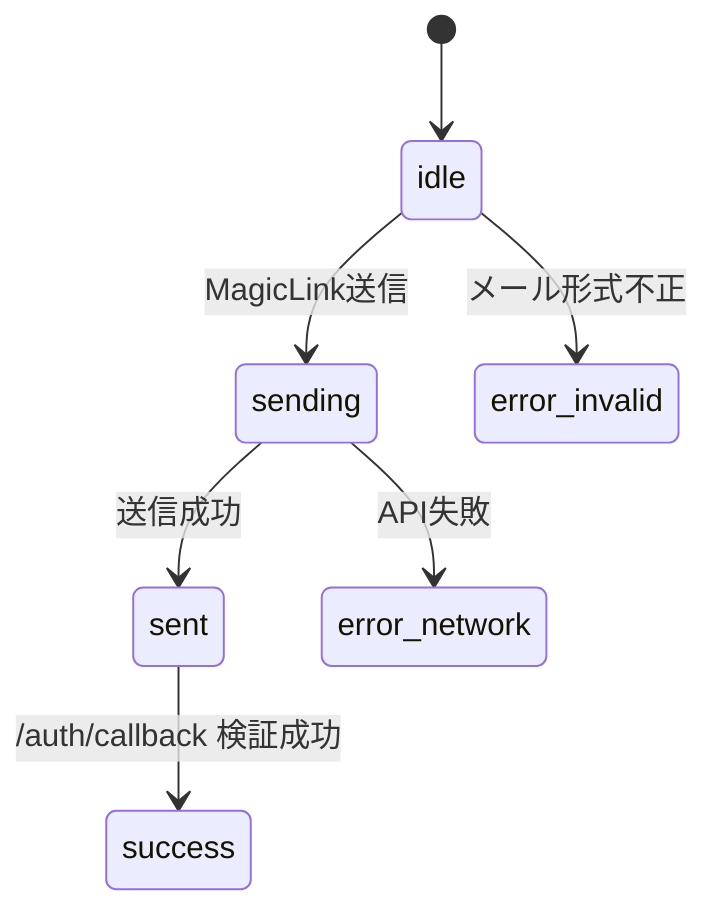
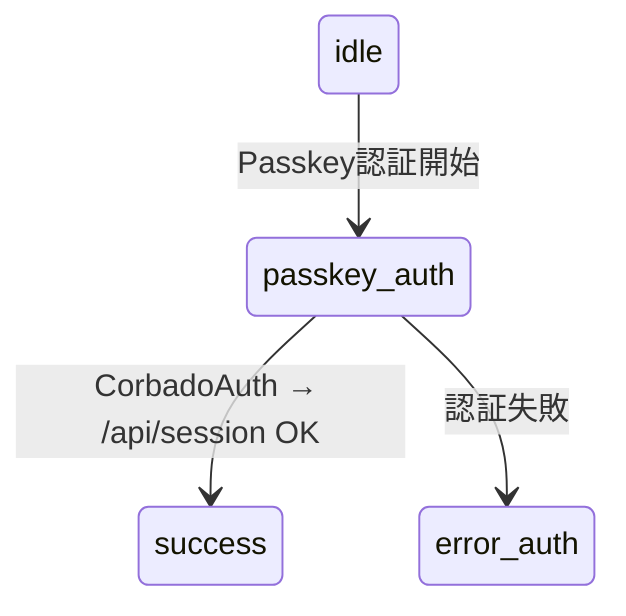
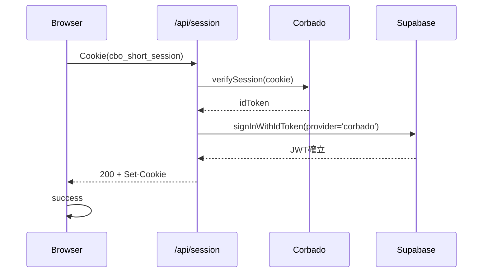

# A-00 LoginPage 詳細設計書 ch02：状態管理 v1.1

**Document ID:** HARMONET-COMPONENT-A00-LOGINPAGE-CH02-STATE
**Component ID:** A-00
**Based On:** login-feature-design-ch02-state_v1.0（再編＋A-00命名統合）
**Standard:** harmonet-detail-design-agenda-standard_v1.0

---

## 第1章 概要

本章では **A-00 LoginPage が受け取る状態／画面に反映される状態** を体系化する。LoginPage 自体は状態を管理しないが、A-01 MagicLinkForm と A-02 PasskeyAuthTrigger が発行する状態を UI に反映する責務を持つ。本章はその「橋渡し仕様」を定義する。

A-00 のポイント：

* 状態を “持たない” が “受け取る”
* 画面に何が表示されるかの責務を持つ
* 認証フローの主役は A-01 / A-02
* LoginPage は認証成功・失敗・中間状態の UI 反映に専念

---

## 第2章 状態モデル全体像

### 2.1 状態一覧（A-01 と A-02 の統合）

LoginPage に影響を及ぼす状態は以下：

| 状態ID          | 発生源       | 意味            | LoginPage での表示 |
| ------------- | --------- | ------------- | -------------- |
| idle          | A-01      | 初期状態          | 通常フォーム表示       |
| sending       | A-01      | MagicLink送信中  | ボタンがローディング     |
| sent          | A-01      | MagicLink送信成功 | 成功メッセージ表示      |
| error_invalid | A-01      | 入力メール形式不正     | エラー表示          |
| error_network | A-01      | 通信断・API失敗     | エラー表示          |
| error_auth    | A-01/A-02 | 認証失敗          | エラー表示          |
| passkey_auth  | A-02      | Passkey認証進行中  | 認証中表示（A-01内部）  |
| success       | A-01/A-02 | 認証完了          | 遷移準備（画面切り替え）   |

※ A-00 自体は「状態を判断しない」。完全に A-01 および A-02 の状態を受け取って UI に反映するだけである。

---

## 第3章 状態遷移フロー

### 3.1 フロントエンド（A-01 MagicLinkForm 由来）



### 3.2 フロントエンド（A-02 PasskeyAuthTrigger 由来）



### 3.3 サーバ側遷移（/api/session シーケンス）



---

## 第4章 LoginPage の責務（状態反映）

### 4.1 LoginPage が行うこと

* MagicLinkForm から通知される状態を **画面要素に反映**
* 成功（success）時は、認証後画面への遷移を許容
* エラー状態ではカード下部にメッセージ表示
* loading/sending の視覚的変化は A-01 側が担当

### 4.2 LoginPage が行わないこと

* 認証ロジックの実行（A-01/A-02 に委譲）
* Passkey ロジックの判定（A-01 内部）
* 例外分類の責務（A-01/A-02 内部）
* Supabase API への直接アクセス

---

## 第5章 状態 → UI マッピング仕様

### 5.1 状態別表示方針

| 状態            | 表示仕様                                      |
| ------------- | ----------------------------------------- |
| idle          | 通常フォームのみ                                  |
| sending       | フォーム内ボタンがローディング（A-01側）。LoginPageは追加変化なし   |
| sent          | `login.status.success` をカード下部に表示          |
| error_invalid | 文言：`login.status.error`、色：`text-red-600`  |
| error_network | 文言：`login.status.error`、通信失敗である旨の補足可      |
| error_auth    | 文言：`login.status.error`（認証失敗）             |
| passkey_auth  | LoginPage側表示は変更なし（A-01内部で visual loading） |
| success       | 即遷移するため LoginPage 停留なし                    |

### 5.2 login-status 領域の責務

LoginPage に置く `login-status` 領域は：

* 高さ固定（最小 1.5rem）で、状態に応じ表示/非表示を切替
* `aria-live="polite"` で読み上げ対応
* A-01 側で渡されるメッセージをそのまま表示

---

## 第6章 再レンダー設計（高密度仕様）

### 6.1 LoginPage の再レンダー条件

LoginPage は極力再レンダーさせない。起こりうる再描画は：

1. StaticI18nProvider の辞書変更（言語切替）
2. A-01 の state 更新による React 再描画伝搬

A-00 自身で state を持たないため、不要リレンダーの危険は最小化されている。

### 6.2 MagicLinkForm 側の再レンダー要点

* メール入力・送信状態・エラーは A-01 内の useState に閉じ込める
* LoginPage は **値を渡さず、受け取るだけ** のため、再レンダーは伝搬に制限される

### 6.3 PasskeyAuthTrigger 側の再レンダー要点

* Passkey 認証はモーダル/別ページ（/login/passkey）で行うため、LoginPage を直接再描画しない
* A-01 内で Passkey 状態を結合するため、A-00 の再描画負担はゼロに等しい

---

## 第7章 イベント伝播設計

### 7.1 A-01 → A-00 イベントフロー

A-01 は次のイベントを A-00 へ通知する：

* 状態変化（state: idle / sending / sent / error / success）
* 表示すべき文言（success/error）

LoginPage は通知を受け、`login-status` にテキストを表示するだけで、処理ロジックは一切持たない。

### 7.2 A-02 → A-00 イベントフロー

* PasskeyAuthTrigger は /login/passkey へ遷移するのみ
* 画面戻り時（認証成功後）は `/mypage` へ遷移するため、LoginPage は関与しない

---

## 第8章 エラー分類（高精度分類）

### 8.1 MagicLink 側

| エラー種別         | 例              | 表示                 |
| ------------- | -------------- | ------------------ |
| error_invalid | メール形式不正        | login.status.error |
| error_network | Supabase API異常 | login.status.error |

### 8.2 Passkey 側

| エラー種別         | 例            | 表示                 |
| ------------- | ------------ | ------------------ |
| error_auth    | Corbado 認証失敗 | login.status.error |
| error_network | 通信断          | login.status.error |

### 8.3 LoginPage 側の責務

LoginPage は「どのエラーか」を判断せず、**画面に反映するだけ**。分類の責務は A-01 / A-02 にある。

---

## 第9章 フォールバック導線

* MagicLink が失敗しても Passkey は独立して動作可能
* Passkey が失敗しても MagicLink が使える
* 両方式とも失敗した場合のみ、ユーザーは「再試行」へ戻る

(※ フォールバックロジックの実体は A-01 / A-02 側)

---

## 第10章 実装抜粋（概念コード）

```tsx
// login-status を LoginPage が反映するイメージ
function LoginStatusMessage({ state, message }) {

```
## 改訂履歴

| Version | Date       | Author          | Summary |
|---------|------------|-----------------|---------|
| v1.0    | 2025-11-11 | TKD / Tachikoma | login-feature-design-ch02-state_v1.0 として初版作成 |
| v1.1    | 2025-11-15 | TKD / Tachikoma | A-00 命名規則へ統合。MagicLinkForm v1.1 / PasskeyAuthTrigger v1.1 に整合し、状態体系を全面再定義。LoginPage は「状態を持たず受け取る」方針を明文化。状態→UI マッピング・エラー分類・再レンダー要件を高密度化して再構築。 |
