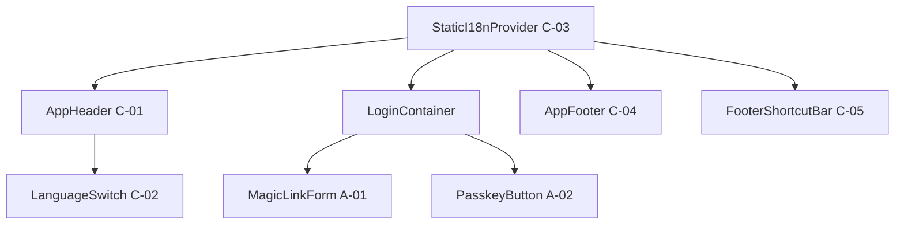

# HarmoNet 詳細設計書（ログイン画面）ch01 - 画面UI構成 v1.0（アジェンダ標準出力）

**Document ID:** HARMONET-LOGIN-DESIGN-CH01  
**Version:** 1.0  
**Updated:** 2025-11-10  
**Supersedes:** -  
**ContextKey:** HarmoNet_LoginDocs_Realign_v4.0_Update  
**Standard:** harmonet-detail-design-agenda-standard_v1.0（安全テンプレートモード適用）

**File名（PJナレッジ準拠）:** login-feature-design-ch-01_v1.0.md

---

## 第1章：概要
本章では、HarmoNetログイン画面の**UI構成・要素配置・共通部品連携構造**を定義する。Phase9仕様に準拠し、Magic Link + Passkeyの2認証方式を統合した最終版構成とする。

---

## 第2章：技術前提
| 項目 | 内容 |
|------|------|
| フレームワーク | Next.js 16.0.1（App Router） |
| UI技術 | React 19.0.0 / TypeScript 5.6 |
| スタイリング | Tailwind CSS 3.4 / shadcn/ui |
| アイコン | lucide-react |
| 認証基盤 | Supabase Auth 2.43 + Corbado WebAuthn SDK 2.x |
| 翻訳基盤 | StaticI18nProvider (C-03) |
| 共通UI | AppHeader, LanguageSwitch, AppFooter, FooterShortcutBar |
| デザイン基調 | 白基調 / Appleカタログ風 / BIZ UDゴシック / rounded-2xl |

---

## 第3章：レイアウト構成
```
┌──────────────────────────────────────────────┐
│ AppHeader（C-01） │
│ └─ LanguageSwitch（C-02） │
├──────────────────────────────────────────────┤
│ StaticI18nProvider（C-03） │
│ ├─ LoginContainer │
│ │ ├─ ロゴ表示領域 │
│ │ ├─ MagicLinkForm（A-01） │
│ │ ├─ Divider ("または") │
│ │ ├─ PasskeyButton（A-02） │
│ │ └─ 利用規約・プライバシー文言 │
│ └─ AppFooter（C-04） │
└──────────────────────────────────────────────┘
```
認証後画面では FooterShortcutBar（C-05）を追加

---

## 第4章：コンポーネント構造
| 層 | コンポーネント | ID | 役割 |
|----|----------------|----|------|
| ヘッダー層 | AppHeader | C-01 | ロゴ＋言語切替 |
| 言語層 | LanguageSwitch | C-02 | 3言語切替（ja/en/zh） |
| 認証UI層 | MagicLinkForm | A-01 | メールOTP送信フォーム |
| 認証UI層 | PasskeyButton | A-02 | 登録済みパスキーによるログイン |
| 翻訳層 | StaticI18nProvider | C-03 | 翻訳辞書と`t()`提供 |
| フッター層 | AppFooter | C-04 | コピーライト表示 |
| ショートカット層 | FooterShortcutBar | C-05 | 認証後ロール別メニュー |

---

## 第5章：コンポーネント連携図


---

## 第6章：UIデザイン仕様
### 6.1 レイアウト仕様
| 項目 | 値 |
| ---- | ---- |
| 最大幅 | 420px |
| コンテナ | `flex flex-col items-center justify-center h-screen` |
| 背景色 | `bg-white` |
| 余白 | 上下48px / 左右16px |
| フォント | BIZ UDゴシック Regular |
| コーナー | `rounded-2xl` |
| シャドウ | `shadow-sm` |

### 6.2 コンポーネント配置仕様
| 要素 | 配置 | 内容 |
| ---- | ---- | ---- |
| ロゴ | 上部中央 | `/public/images/logo.svg` |
| 言語切替 | 右上（AppHeader内） | ja / en / zh |
| Magic Linkフォーム | 中央 | E-mail入力 + 送信ボタン |
| Divider | MagicLinkForm下部 | 「または」水平線 |
| PasskeyButton | Divider下 | Corbado連携ボタン（キーアイコン） |
| 注意文言 | 下部 | 利用規約 / プライバシーポリシーリンク |
| フッター | 画面最下部固定 | コピーライト表示 |
| 認証後 | FooterShortcutBar追加 | role別ショートカットリンク |

---

## 第7章：i18nキー構造
| 区分 | キー | 日本語 | 英語 | 中国語 |
| ---- | ---- | ---- | ---- | ---- |
| 見出し | `login.title` | ログイン | Sign In | 登录 |
| Divider | `login.or` | または | or | 或者 |
| MagicLinkForm | `login.email_placeholder` | メールアドレス | Email | 邮箱 |
| PasskeyButton | `login.passkey_button` | パスキーでログイン | Sign in with Passkey | 使用通行密钥登录 |
| フッター | `common.copyright` | © 2025 HarmoNet | © 2025 HarmoNet | © 2025 HarmoNet |

---

## 第8章：ルーティング構成
| パス | 画面 | 認証要否 | 備考 |
| ---- | ---- | ---- | ---- |
| `/login` | ログイン画面 | 不要 | Magic Link + Passkey |
| `/auth/callback` | コールバック | 不要 | Supabase OTP復帰 |
| `/mypage` | マイページ | 要認証 | Passkey登録設定含む |
| `/policy` | 利用規約 | 不要 | 外部リンク可 |

---

## 第9章：関連ドキュメント
| 種別 | ファイル名 | 内容 |
| ---- | ---- | ---- |
| 技術基盤 | `harmonet-technical-stack-definition_v3.9.md` | 技術構成基準 |
| 認証仕様 | `login-feature-design-ch-05_v1.1.md` | セキュリティ・RLS |
| 詳細設計 | `PasskeyButton-detail-design_v1.0.md` | Corbado Passkey連携設計 |
| 共通部品 | `ch01_AppHeader_v1.0.md` 他 | AppHeader〜Footer共通仕様 |

---

## 第10章：改訂履歴
| Version | Date | Summary |
| ---- | ---- | ---- |
| 1.0 | 2025-11-10 | 初版（MagicLink + Passkey導入、Phase9仕様整合化） |

