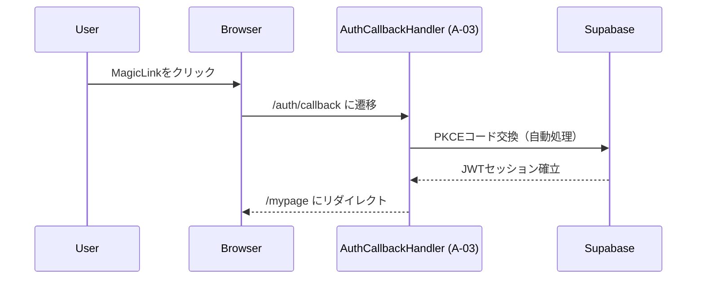

# A-00 LoginPage 詳細設計書 ch04：SessionHandler（MagicLink専用） v1.1

**Document ID:** HARMONET-A00-CH04-SESSION**
**Version:** 1.1
**Status:** MagicLink専用・実装準拠

---

# 第1章：概要

本章は **MagicLink 認証におけるセッション確立と LoginPage の関係** を定義する。LoginPage はセッション処理を保持せず、
`/auth/callback` の認証確立処理は **AuthCallbackHandler（A-03）** が担当する。

---

# 第2章：MagicLink セッション確立フロー

LoginPage はこの処理に関与せず、**認証前の UI 容器**として機能する。

---

# 第3章：LoginPage の責務

### 3.1 行うこと

* MagicLinkForm（A-01）の配置
* MagicLinkForm が発行する状態の UI 反映（成功／エラー表示枠）

### 3.2 行わないこと（禁止）

* Supabase Auth SDK の呼び出し
* PKCE の処理
* Cookie/JWT の参照または判定
* `/mypage` への遷移制御

LoginPage は **認証ロジックゼロ** を厳守する。

---

# 第4章：AuthCallbackHandler（A-03）の前提（A-00観点）

| 項目     | 内容                                               |
| ------ | ------------------------------------------------ |
| 役割     | MagicLink のセッション確立処理を担当                          |
| 方式     | Client Component（onAuthStateChange / getSession） |
| 成功     | `/mypage` に遷移                                    |
| 失敗     | `/login?error=auth_failed` に戻る                   |
| A-00責務 | 認証前画面の UI を提供するのみ                                |

---

# 第5章：セッション状態と LoginPage の表示

LoginPage はセッションを **判定しない**。

| 状態（Supabase側） | LoginPage表示                    |
| ------------- | ------------------------------ |
| 未認証           | `/login` を表示                   |
| 認証中           | `/auth/callback` へ遷移中のため表示されない |
| 認証成功          | `/mypage` に遷移済みで表示されない         |

---

# 第6章：セキュリティ前提

* MagicLink は Supabase Auth（PKCE）準拠
* HTTPS 必須
* Cookie 属性：`HttpOnly` / `Secure` / `SameSite=Lax`
* LoginPage は Cookie や JWT を扱わない
* 文言は StaticI18nProvider のみ利用

---

# 第7章：禁止事項

* `supabase.auth.signInWithOtp` を A-00 に追加しない
* `/auth/callback` のロジックを A-00 に実装しない
* `document.cookie` などの Cookie 読み取り禁止
* `router.push('/mypage')` の直接実行禁止

---

# 第8章：Windsurf 実装指針

* A-00 は UI コンテナのみ（ロジック編集不可）
* A-01・A-03 の責務境界を変更しない
* import パス統一のみ編集対象

---

# 第9章：改訂履歴

| Version | Summary                                    |
| ------- | ------------------------------------------ |
| v1.1    | Passkey/Corbado 関連を全削除し MagicLink専用として再構築。 |
| v1.0    | 旧仕様（Corbado / /api/session）版。              |

---

**End of Document**
