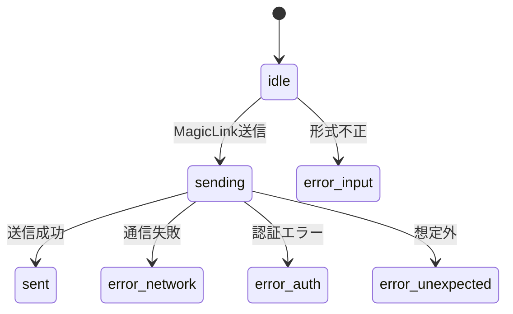

# A-00 LoginPage 詳細設計書 ch02：状態管理 v1.2

**Document ID:** HARMONET-A00-CH02-STATE**
**Version:** 1.2
**Supersedes:** v1.1
**Status:** MagicLink専用
---

# 第1章 概要

本章では **A-00 LoginPage が画面として反映する状態（UI状態）** を整理する。
LoginPage 自体は **状態を持たず**、A-01 MagicLinkForm が発行する状態のみを受け取り、画面に反映する。

---

# 第2章 状態一覧（A-01 が発行する状態のみ）

LoginPage に影響を与える状態は **MagicLinkForm（A-01）由来の4種**のみ。

| 状態ID      | 発生源  | 意味             | LoginPage の表示     |
| --------- | ---- | -------------- | ----------------- |
| `idle`    | A-01 | 初期状態／未入力       | 通常フォーム表示          |
| `sending` | A-01 | MagicLink送信中   | ボタンはローディング（A-01側） |
| `sent`    | A-01 | MagicLink送信成功  | 画面下部に成功メッセージ      |
| `error_*` | A-01 | 入力・通信・認証・例外すべて | エラーメッセージ表示        |

※ A-00 は **状態判定を行わず**、A-01 が提供する状態値をそのまま描画に反映するだけとする。

---

# 第3章 状態遷移フロー（MagicLink専用）

A-00 はこの状態遷移を **参照するのみ** であり、遷移ロジックは A-01 に存在する。

---

# 第4章 LoginPage の責務（UI反映のみ）

### 4.1 LoginPage が行うこと

* A-01 の状態に応じて **成功／失敗メッセージの表示領域（login-status）を更新**
* レイアウトの維持（中央寄せ・max-w-md・白基調）
* A-01 の UI を正しく配置

### 4.2 LoginPage が行わないこと

* MagicLink ロジックの実行
* サーバとの通信
* エラー分類（input / network / auth / unexpected）
* 状態遷移の管理

---

# 第5章 状態→UI マッピング

| 状態ID             | LoginPage の画面表示                  |
| ---------------- | -------------------------------- |
| idle             | MagicLinkForm のみ表示（statusなし）     |
| sending          | A-01 内のボタンがローディング。LoginPageは変化なし |
| sent             | 画面下部に `login.status.success` を表示 |
| error_input      | エラーメッセージ（赤系）を表示                  |
| error_network    | 一般エラーメッセージを表示                    |
| error_auth       | 一般エラーメッセージを表示                    |
| error_unexpected | 想定外エラーメッセージを表示                   |

※ 文言は A-01 の翻訳キーをそのまま利用。

---

# 第6章 再レンダー設計

### 6.1 LoginPage の再レンダー条件

LoginPage は state を持たないため再描画は限定的：

1. StaticI18nProvider の locale 変更
2. A-01 からの state 変化により React が再描画

### 6.2 設計意図

* LoginPage は最小限の DOM（Header / Card / Footer）を描画し、余計な計算を持たない
* 状態管理は A-01 のみで閉じる

---

# 第7章 イベント伝播

### 7.1 A-01 → A-00

A-01 が `state` と `message` を通知し、LoginPage は `login-status` に文言を反映する。

### 7.2 A-00 で追加のロジックを持たない理由

* 責務境界を明確化
* Windsurf によるコード生成を安定化
* エラー分類の二重管理を避ける

---

# 第8章 エラー分類（A-01でのみ保持）

LoginPage は次の分類を **そのまま UI に表示するだけ**：

| A-01 エラー種別       | 意味            |
| ---------------- | ------------- |
| error_input      | メール形式不正       |
| error_network    | 通信失敗          |
| error_auth       | Supabase 認証失敗 |
| error_unexpected | 想定外エラー        |

LoginPage は分類ロジックを持たない。

---

# 第9章 状態反映領域（login-status）

* 高さ固定：**min-h-[1.5rem]**
* 位置：MagicLinkForm の下部
* ロール：`aria-live="polite"`
* 表示内容：A-01 より渡された翻訳済み文言
* 非表示時：高さのみ保持しレイアウトの揺れを防ぐ

---

# 第10章 改訂履歴

| Version | Summary                                            |
| ------- | -------------------------------------------------- |
| v1.2    | Passkey 状態・API 連携・A-02 関連を完全削除。MagicLink専用状態体系へ刷新。 |
| v1.1    | LoginPage は状態を持たず UI 反映のみと定義。分類・再レンダー観点を整理。        |
| v1.0    | 旧仕様（MagicLink＋Passkey混在）の状態管理案。                    |

---

**End of Document**
