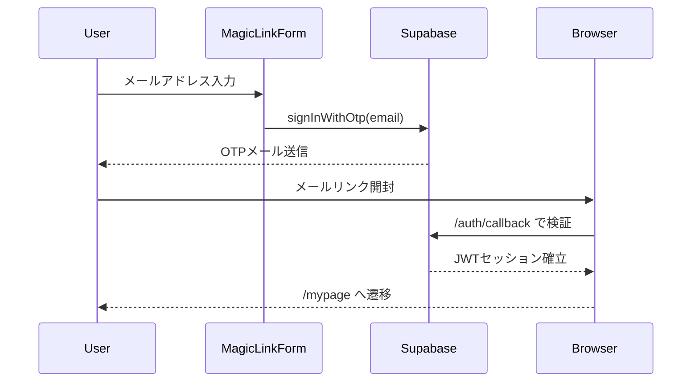
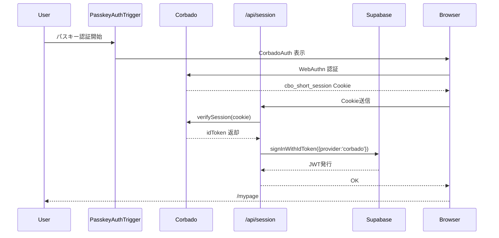

# A-00 LoginPage 詳細設計書 ch03：認証構成 v1.1

**Document ID:** HARMONET-COMPONENT-A00-LOGINPAGE-CH03-AUTH
**Component ID:** A-00
**Based On:** login-feature-design-ch03-auth_v1.0（A-00命名統合・v4.2技術スタック適用）
**Standard:** harmonet-detail-design-agenda-standard_v1.0

---

# 第1章 概要

本章は、HarmoNet ログイン画面（A-00）における **統合認証構成** を定義する。
MagicLink（Supabase）と Passkey（Corbado）という 2 方式を **1つの LoginPage 内で自然に共存させる** ための認証基盤の全体設計であり、A-01 MagicLinkForm と A-02 PasskeyAuthTrigger（ロジック）を束ねる "認証レイヤーの正書" に位置づけられる。

A-00 は認証ロジックを直接実行しないが、**認証方式の統合フローを正しく受け入れ、UI と遷移が破綻しないための中核的役割** を持つ。

本章では次を明確にする：

* MagicLink（Supabase OTP）と Passkey（Corbado WebAuthn）の **責務境界**
* `/auth/callback` と `/api/session` の **役割の違い**
* Supabase と Corbado の **セッション・トークンの同期方式**
* RLS（Row Level Security）とテナント境界の成立条件
* 技術スタック v4.2 に基づく公式・安全な認証レイヤー

---

# 第2章 認証レイヤーの全体像

HarmoNet のログイン認証は次の 3 層構造で成立している：

```
[UI層]         LoginPage / MagicLinkForm / PasskeyAuthTrigger
[認証層]       Supabase Auth（OTP） / Corbado WebAuthn（idToken, cookie）
[検証・整合層] /auth/callback（OTP） /api/session（Passkey→Supabase同期）
```

* UI は LoginPage および A-01 / A-02
* 認証は Supabase または Corbado
* 検証は Supabase または Next.js Server Route

この **3レイヤー分離により、UI とロジック、認証方式間の責務が完全に分離**される。
特に、**Passkey の認証処理が `/api/session` へ完全委譲される**点が、v4.2 の特徴である。

---

# 第3章 MagicLink（Supabase OTP）構成

MagicLink 方式は、Supabase Auth の `signInWithOtp()` を利用する。
この方式はメールアドレスを入力し、OTP（ワンタイムコード）を受け取り、`/auth/callback` に復帰してセッションを確立する。

## 3.1 認証フロー（MagicLink）



## 3.2 LoginPage（A-00）側の責務

* OTP送信完了（sent）ステータスの表示
* `/auth/callback` で復帰した後に AppHeader / AppFooter を通じて画面が正しく構築されることを保証
* エラー表示（error_network / error_invalid）の受け取り

LoginPage 自身は MagicLink の成否を判断せず、あくまで **A-01 が発行する状態の受け手** となる。

## 3.3 Supabase の仕様と制約

* `shouldCreateUser: false`（ユーザー自動生成禁止）
* TTL は 60 秒固定
* 認証が成功すると Supabase が JWT を発行し、ブラウザ Cookie に保存
* RLS の境界キーは `auth.jwt() ->> 'sub'` で users.id と一致する必要がある

---

# 第4章 Passkey（Corbado WebAuthn）構成

Passkey（A-02）は、MagicLink とは別系統として動作するが、最終的に **Supabase セッションへ接続される**。
この方式は "Corbado が認証し、Next.js が検証し、Supabase がセッション化する" という 3段階構造で進む。

## 4.1 認証フロー（Passkey）



## 4.2 LoginPage（A-00）側の責務

* Passkey ロジックは一切保持しない
* Passkey 遷移開始後は `/login/passkey` に画面遷移するだけ
* 認証成否は `/api/session` と Supabase で完了し、A-00 は介入しない

## 4.3 Corbado の仕様と制約

* 認証はすべて Corbado Auth（`@corbado/react`）で実行
* 結果は `cbo_short_session` Cookie で返される
* Cookie を `/api/session` へ転送して検証
* origin mismatch の場合は自動的に拒否

## 4.4 Supabase との連携

Passkey は Supabase へ直接渡されない。必ず `/api/session` が仲介する：

1. Corbado の `idToken` を server route が受領
2. Supabase の `signInWithIdToken(provider:'corbado')` を実行
3. Supabase セッション確立（JWT 発行）
4. 以後は Supabase セッションでアプリ全域を認証

---

# 第5章 二方式統合フロー

MagicLink（OTP）と Passkey（WebAuthn）は完全に別方式だが、LoginPage では **統一 UI として共存** させる必要がある。
そのための “統合フロー” を次に示す。

## 5.1 統合シーケンス（UI視点）

```mermaid
graph TD
  A[LoginPage] --> B[MagicLinkForm (A-01)]
  A --> C[PasskeyAuthTrigger (A-02)]
  B --> D[/auth/callback]
  C --> E[/login/passkey]
  E --> F[/api/session]
  D --> G[/mypage]
  F --> G[/mypage]
```

## 5.2 LoginPage が必要とする「整合条件」

* MagicLink → /auth/callback の UI は LoginPage レイアウトと互換性があること
* Passkey → /login/passkey → /api/session → /mypage の画面遷移が自然であること
* 認証に成功した場合、**いずれの方式でも Supabase セッションへ収束する** こと

---

# 第6章 トークン・Cookie・RLS

## 6.1 トークン体系

| 種類                | 発行主体     | 用途          | 有効範囲      |
| ----------------- | -------- | ----------- | --------- |
| OTPリンク            | Supabase | MagicLink   | 60秒（1回限り） |
| cbo_short_session | Corbado  | Passkey認証結果 | 15分       |
| Supabase JWT      | Supabase | アプリ全域の認証    | 数時間（可変）   |

## 6.2 Cookie 設計

* `HttpOnly`
* `Secure`
* `SameSite=Lax`
* `Max-Age=900s`（Corbado）
* Passkey の Cookie は **ブラウザ JS から参照不可**（セキュリティ要件）

## 6.3 RLS（Row Level Security）

Supabase でのテナント境界は：

```
auth.jwt() ->> 'tenant_id'
auth.jwt() ->> 'sub' == users.id
```

Passkey の場合、`users.id` は Corbado 側のユーザーIDと Supabase 側を紐付ける必要がある。
この紐付けは初回ログイン時、/api/session で `signInWithIdToken` を呼び出した際に Supabase が内部的に行う。

---

# 第7章 エラー分類・ハンドリング方針

認証エラーは、発生レイヤーごとに分類し、それぞれの責務を明確化する。A-00 LoginPage は「どのエラーか」を識別せず、A-01 / A-02 / /api/session から受け取った **人間可読メッセージを UI に表示するだけ** とする。

## 7.1 エラー分類（論理レベル）

| エラー種別           | 発生レイヤー                 | 代表的な例                            | LoginPage での表示方針               |
| --------------- | ---------------------- | -------------------------------- | ------------------------------ |
| `error_invalid` | A-01（クライアント検証）         | メールアドレス形式エラー、必須項目未入力             | 入力欄直下 + login.status.error     |
| `error_network` | A-01/A-02/API          | ネットワーク断、Supabase/CORBADO API エラー | カード下部に汎用エラーメッセージ表示             |
| `error_auth`    | A-01/A-02              | OTP 無効、Passkey 認証拒否、セッション不整合     | カード下部に「認証に失敗しました」表示            |
| `error_origin`  | Passkey + /api/session | Origin 不一致、RP ID 誤設定             | 開発・運用向けログのみ。ユーザーには一般的なエラーとして表示 |
| `error_rate`    | 認証基盤（Supabase/Corbado） | レート制限到達、連続試行過多                   | 「しばらく待ってから再度お試しください」系の文言       |
| `error_unknown` | いずれか                   | 想定外例外、型不一致、予期しないレスポンス            | 一般的なエラー文言 + 再試行案内              |

## 7.2 A-01（MagicLink）側エラーと UI

A-01 MagicLinkForm は、入力検証と OTP 送信結果に応じてエラー種別を決定する。

* メール形式不正 → `error_invalid`
* Supabase からのエラー（タイムアウト / 4xx / 5xx） → `error_network`
* OTP 無効・有効期限切れ → `error_auth`

LoginPage は、A-01 から渡される `errorType`（例：`error_invalid`）と `message` に基づき、

* フォーム直下：フィールド固有のメッセージ（A-01 内部で表示）
* カード下部：画面レベルの `login.status.error` 表示

を行う。エラーテキスト自体は StaticI18nProvider と A-01 側で管理し、A-00 は「表示位置」だけを管理する。

## 7.3 A-02（PasskeyAuthTrigger）側エラーと UI

A-02 は主に Corbado の結果を受けてエラー種別を判定する。

* `NotAllowedError`（ユーザーキャンセル） → `error_auth`
* ネットワークエラー → `error_network`
* Origin 不一致（デバッグ中に発生） → `error_origin`

ただし、A-00 LoginPage は Passkey UI を持たず、A-02 の処理は `/login/passkey` / `/api/session` を経由して完結するため、
**LoginPage 上に直接 Passkey エラーを表示する責務はない**。
Passkey エラーの UI 表示は、将来的に `/login/passkey` 側の設計書で定義する（本章では責務から除外）。

## 7.4 /api/session レベルのエラー

`/api/session` は Passkey 認証結果を Supabase セッションに変換するゲートとして、以下のエラーを返しうる：

| HTTP ステータス       | 意味                  | 取り扱い                      |
| ---------------- | ------------------- | ------------------------- |
| 401 Unauthorized | Cookie 不正 / セッションなし | `/login` へリダイレクト（再ログイン要求） |
| 403 Forbidden    | JWT 不整合・RLS 不一致     | `/error/auth`（専用エラー画面）へ遷移 |
| 500 Error        | Corbado 通信失敗等       | 汎用エラー画面 or 再試行案内          |

これらの画面遷移は **LoginPage ではなくルーティング層の責務** であり、A-00 は `/login` 画面描画時に「未認証状態」としてふるまうだけでよい。

---

# 第8章 セキュリティ・技術スタックとの整合

認証構成は、技術スタック定義書 v4.2 およびセキュリティ設計（ch05）と完全に同期している必要がある。ここでは、A-00 視点で特に重要なポイントを列挙する。

## 8.1 技術スタック v4.2 との対応

* Next.js 16 / React 19 / TypeScript 5.6
* Supabase Auth v2.43（OTP + signInWithIdToken）
* Corbado Web SDK v2.x（`@corbado/web-js`, `@corbado/react`, `@corbado/node`）
* StaticI18nProvider (C-03) による i18n

A-00 はこれらを **直接知らなくても動作する設計** だが、

* A-01 / A-02 / `/api/session` がこれらのバージョン前提で記述されているため、
  LoginPage 側のインターフェース（props・イベント・ルーティング）がずれないように注意する。

## 8.2 CSRF・XSS・Origin 対策との関係

A-00 自体はフォーム POST を持たず、すべての認証リクエストは以下のいずれかで発生する：

* Supabase クライアント SDK の `signInWithOtp`
* CorbadoAuth（内部的な WebAuthn API 呼び出し）
* `/api/session` への fetch（GET）

これにより、

* CSRF トークンを LoginPage 側で扱う必要はない
* XSS 対策は主に共通エラーメッセージのエスケープで十分
* Origin チェックは Corbado 側とブラウザ実装に依存し、A-00 ではエラー結果の UI 表示だけを行う

## 8.3 RLS（Row Level Security）との整合

本章で定義したフローにより、最終的に Supabase が発行する JWT は以下を満たす：

* `auth.jwt() ->> 'sub'` が `users.id` と一致
* `auth.jwt() ->> 'tenant_id'` が現在のテナントと一致

この条件が満たされる前に UI を "認証済み" と誤解させないことが重要である。
LoginPage は **Supabase セッションが確立する前にアプリ全体の認可を進めない** ため、RLS と矛盾しない。

---

# 第9章 Windsurf 実装指針（認証構成観点）

Windsurf による実装タスクでは、次の点を厳守する：

1. A-00 LoginPage は **認証ロジックを持たない**

   * `supabase.auth.signInWithOtp` や `Corbado` への直接アクセスを追加しない
   * ロジックを追加したい場合は、必ず A-01 / A-02 / `/api/session` の設計書側で検討する

2. ルーティングの固定

   * MagicLink: `/login` → `/auth/callback` → `/mypage`
   * Passkey: `/login` → `/login/passkey` → `/api/session` → `/mypage`
   * `router.push` の変更や追加ルート定義は別タスクとする

3. エラー文言の扱い

   * 文言は StaticI18nProvider から取得し、直書きしない
   * 新しいエラー文言が必要な場合は i18n 辞書の更新タスクとして別途設計する

4. 変更禁止範囲

   * A-01 / A-02 / `/api/session` の責務境界を変更しない
   * Supabase / Corbado SDK のバージョンを勝手に上げない

---

# 第10章 改訂履歴

| Version | Date       | Author          | Summary                                                                                                                                                           |
| ------- | ---------- | --------------- | ----------------------------------------------------------------------------------------------------------------------------------------------------------------- |
| v1.0    | 2025-11-11 | TKD / Tachikoma | login-feature-design-ch03-auth_v1.0 として MagicLink + Passkey 統合認証構成を初版定義                                                                                           |
| v1.1    | 2025-11-15 | TKD / Tachikoma | A-00 命名規則および技術スタック v4.2 へ統合。PasskeyButton の UI 依存を廃止し、PasskeyAuthTrigger + `/api/session` 構成に整理。A-00 の責務を「認証ロジック非保持・フロー統合の正書」として再定義し、状態・エラー分類・RLS/セキュリティとの整合を明文化。 |
