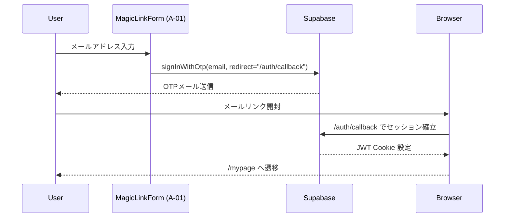

# A-00 LoginPage 詳細設計書 ch03：認証構成 v1.1

**Document ID:** HARMONET-A00-CH03-AUTH**
**Version:** 1.1
**Supersedes:** v1.0
**Status:** MagicLink専用

---

# 第1章 概要

本章は **A-00 LoginPage** における **認証構成（フロー・責務・境界）** を定義する。
LoginPage は認証ロジックを保持せず、**A-01 MagicLinkForm** および **/auth/callback（AuthCallbackHandler）** を通じて MagicLink 認証フローを成立させる。

---

# 第2章 認証レイヤー全体像

HarmoNet のログイン認証は、次の 2 レイヤーで成立する：

```
[UI層]     A-00 LoginPage / A-01 MagicLinkForm
[認証層]   Supabase Auth（MagicLink）
```

A-00 LoginPage は UI レイアウト構成のみを担当し、認証フローはすべて下位レイヤー（A-01 および Supabase）が実行する。

---

# 第3章 MagicLink（Supabase OTP）認証構成

MagicLink は **メールアドレス＋OTP リンク** によるパスワードレス認証方式である。
Supabase の `signInWithOtp()` を呼び出し、利用者がメールに届くリンクを踏むことで `/auth/callback` に復帰し、セッションを確立する。

## 3.1 認証フロー（画面視点）



## 3.2 A-00 LoginPage の責務

* 認証ロジックは **一切実行しない**。
* A-01 が発行する状態（idle / sending / sent / error）を **画面に反映するだけ**。
* `/auth/callback` から復帰した際、AppHeader / AppFooter を含むレイアウトが正しく表示されるよう UI を維持する。

## 3.3 Supabase 仕様（A-00 が前提とすべき部分）

* `shouldCreateUser: false`（アプリ側ユーザマスタ前提）
* セッションは **Supabase Auth Cookie** により管理
* JWT の `sub` は `public.users.id` と一致する必要がある（RLS 要件）
* A-00 はこれらの仕様に依存するが、実装・判定はすべて下位（A-01 / AuthCallbackHandler）で行う

---

# 第4章 /auth/callback の役割（A-03）

MagicLink 認証は `/auth/callback` でセッション確立処理が行われる。
本章の対象外だが、A-00 のレイアウト整合性として次だけ把握する：

* `/auth/callback` は **Client Component（AuthCallbackHandler）** が担当
* Supabase の PKCE 処理（code 交換）は AuthCallbackHandler が実行
* 成功後、`/mypage` へリダイレクト
* A-00 は **復帰した時点で未認証／認証中の UI を表示しない**

※ `/auth/callback` の詳細は A-03 詳細設計書で定義する。

---

# 第5章 LoginPage の責務境界（MagicLink 専用）

## 5.1 LoginPage が行うこと

* MagicLinkForm（A-01）をページ内に正しく配置する
* A-01 から渡された状態に応じて `login-status` を表示する
* Header / Footer を含む UI コンテナとして動作する

## 5.2 LoginPage が行わないこと

* Supabase Auth SDK の呼び出し
* PKCE の処理
* `/auth/callback` の実行
* 認証成功/失敗の判定
* 認証方式の分岐（MagicLink **のみ**）

→ LoginPage は **“認証ロジック非保持”** を厳格に遵守する。

---

# 第6章 MagicLink 専用フローとの整合要件

LoginPage は MagicLinkForm と密接に連携するため、次の整合条件が必須となる：

| 区分   | 要件                                            |
| ---- | --------------------------------------------- |
| UI配置 | MagicLinkForm を中央カード内に配置（max-w-md）            |
| 状態反映 | sent / error を画面下部の `login-status` に表示        |
| i18n | 画面レベル文言（login.status.*）は LoginPage、詳細文言は A-01 |
| 遷移   | 認証後 `/mypage` へ遷移（A-03 の責務）                   |
| ログ   | LoginPage はログ出力しない（A-01 が担当）                  |

---

# 第7章 エラー取り扱い（MagicLink 専用）

LoginPage が扱うべきエラーは **すべて A-01 から通知されるもの** のみ。

| 種別               | 例                | LoginPage の扱い            |
| ---------------- | ---------------- | ------------------------ |
| error_input      | メール形式不正          | `login.status.error` を表示 |
| error_network    | Supabase API エラー | 同上（内容は A-01 が判定）         |
| error_auth       | OTP無効／期限切れ       | 同上                       |
| error_unexpected | 想定外例外            | 同上                       |

LoginPage は分類ロジックを持たず、「表示位置」を提供するだけである。

---

# 第8章 セキュリティ前提（A-00 観点）

A-00 はセキュリティロジックを直接扱わないが、認証構成との整合として次を満たす：

* すべての通信は HTTPS で行われる前提
* 認証されていない状態で `/mypage` にアクセスした場合は、サーバ側リダイレクトで `/login` へ戻る
* A-00 は Cookie を読まず、Supabase に依存する
* XSS対策：文言は StaticI18nProvider 経由のみ

---

# 第9章 Windsurf 実装指針（ch03 観点）

* LoginPage に認証ロジックを追加しない
* MagicLinkForm の Props や内部構造を変更しない
* `/auth/callback` への遷移は A-01 が実施するため、A-00 側で `router.push` を追加しない
* 認証方式に関する条件分岐を A-00 に置かない（MagicLink専用）

---

# 第10章 改訂履歴

| Version | Summary                                                                                       |
| ------- | --------------------------------------------------------------------------------------------- |
| v1.1    | Passkey/Corbado/WebAuthn 記述を全削除。MagicLink専用設計に刷新。LoginPage の責務を「UIコンテナ＋状態反映」に限定し、認証構成の境界を再定義。 |
| v1.0    | 旧仕様（MagicLink + Passkey併記）版。                                                                  |

---

**End of Document**
