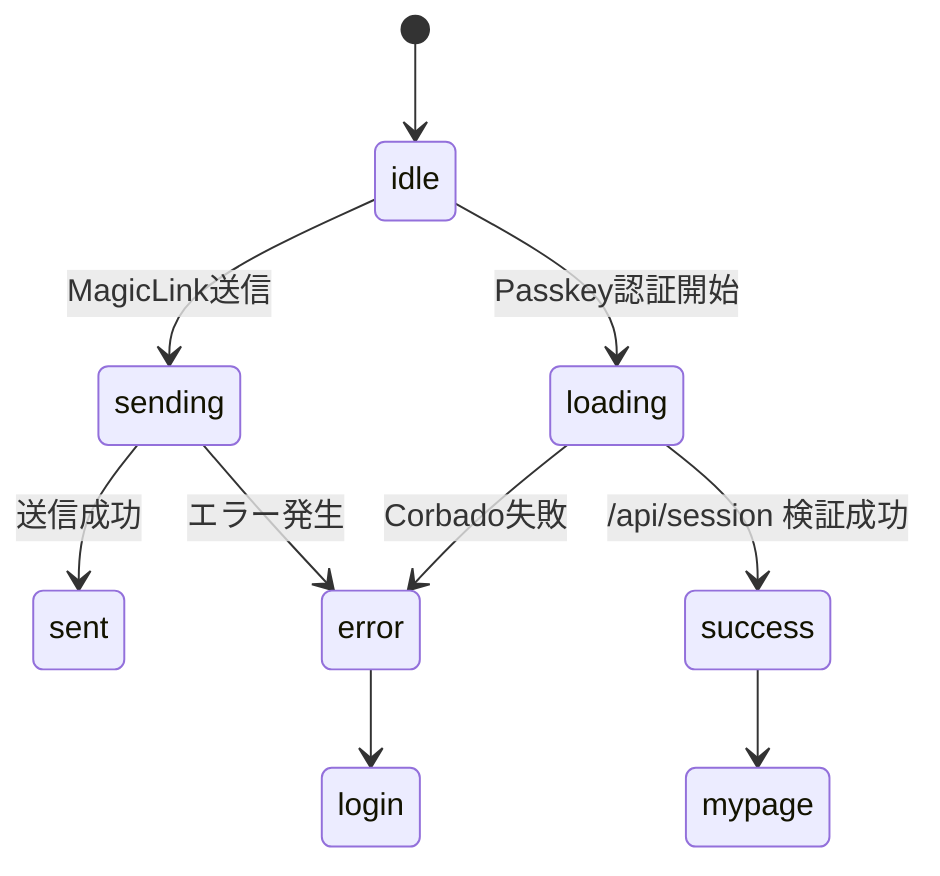
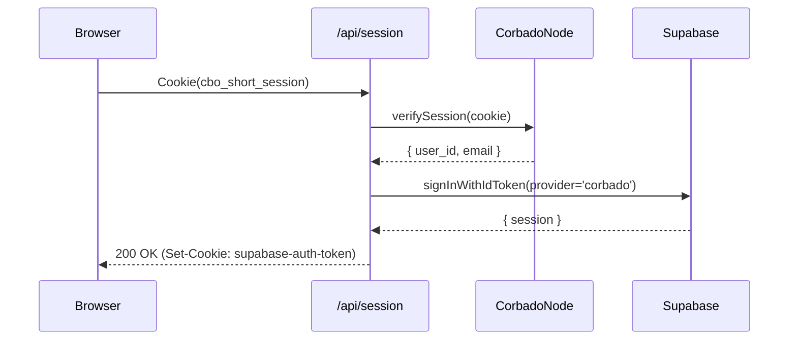

# HarmoNet 詳細設計書（ログイン画面）ch02 - 状態管理とフォーム動作仕様 v1.0

**Document ID:** HNM-LOGIN-FEATURE-CH02
**Version:** 1.0
**Created:** 2025-11-11
**Updated:** 2025-11-11
**Supersedes:** 旧方式（Supabase直呼び構成）
**ContextKey:** HarmoNet_LoginDocs_Realign_v4.0_Update
**Standard:** harmonet-detail-design-agenda-standard_v1.0（安全テンプレートモード適用）

---

## 第1章：概要

本章では、ログイン画面(`/login`)および認証コールバック(`/auth/callback`)における
**Magic Link + Passkey（Corbado公式構成）** の状態管理、フォーム動作、イベント遷移、再レンダー仕様を定義する。

Phase9以降、HarmoNetは完全パスワードレス認証へ移行し、

* Magic Link → Supabase Auth（OTPメール）
* Passkey → Corbado公式構成（`@corbado/react`, `@corbado/node`, `/api/session`）
  の二系統を採用する。

---

## 第2章：レイアウト構造

```mermaid
graph TD
  A[AppHeader (C-01)] --> B[StaticI18nProvider (C-03)]
  B --> C[MagicLinkForm (A-01)]
  B --> D[CorbadoAuthTrigger (A-02)]
  B --> E[AuthErrorBanner (A-05)]
  B --> F[AuthLoadingIndicator (A-04)]
  F --> G[AppFooter (C-04)]
  G --> H[FooterShortcutBar (C-05 認証後のみ)]
```

---

## 第3章：MagicLinkForm（A-01）

| 項目          | 内容                                                             |
| ----------- | -------------------------------------------------------------- |
| **目的**      | メールOTPによるログイン（Supabase Auth）                                   |
| **依存**      | `@supabase/supabase-js`, `StaticI18nProvider`                  |
| **イベント**    | `onSubmit()` → `supabase.auth.signInWithOtp()`                 |
| **バリデーション** | メール形式(`/.+@.+\..+/`)、空欄禁止                                      |
| **状態**      | `idle` → `sending` → `sent` / `error`                          |
| **遷移後**     | `/auth/callback`                                               |
| **翻訳キー**    | `login.email_label`, `login.send_button`, `login.sent_message` |

```typescript
const handleMagicLink = async () => {
  setState({ status: 'sending' });
  const { error } = await supabase.auth.signInWithOtp({
    email,
    options: { shouldCreateUser: false, emailRedirectTo: `${window.location.origin}/auth/callback` },
  });
  if (error) setState({ status: 'error', errorMessage: error.message });
  else setState({ status: 'sent' });
};
```

---

## 第4章：PasskeyAuthTrigger（A-02）

### 4.1 概要

旧「PasskeyButton」は廃止し、Corbado公式構成の `<CorbadoAuth />` をトリガーとして使用する。

* **UI構成:** `<CorbadoProvider><CorbadoAuth /></CorbadoProvider>`
* **セッション管理:** `/api/session` 経由でサーバ側（@corbado/node）検証
* **Cookie:** `cbo_short_session`（HttpOnly, Secure, SameSite=Lax）

### 4.2 動作仕様

| イベント      | 処理内容                                        | 遷移        |
| --------- | ------------------------------------------- | --------- |
| onClick() | `setState('loading')` → Corbado認証UI表示       | -         |
| 成功        | `/api/session` にリクエストしJWT検証・Supabaseセッション同期 | `/mypage` |
| 失敗        | `setState('error', message)`                | `/login`  |

```typescript
const handleOpenCorbadoAuth = () => {
  setState({ status: 'loading' });
  router.push('/login/passkey'); // CorbadoAuthページへ遷移
};
```

CorbadoAuth ページ側では以下構成を使用する。

```tsx
import { CorbadoProvider, CorbadoAuth } from '@corbado/react';

export default function PasskeyLogin() {
  return (
    <CorbadoProvider projectId={process.env.NEXT_PUBLIC_CORBADO_PROJECT_ID!}>
      <CorbadoAuth />
    </CorbadoProvider>
  );
}
```

---

## 第5章：状態遷移仕様

### 5.1 フロントエンド状態フロー（Mermaid）



### 5.2 サーバ処理フロー（/api/session）



---

## 第6章：Props仕様

| Prop              | 型                                                             | 必須 | デフォルト  | 説明                |
| ----------------- | ------------------------------------------------------------- | -- | ------ | ----------------- |
| email             | string                                                        | ✓  | -      | MagicLink用メールアドレス |
| state             | 'idle' / 'sending' / 'sent' / 'error' / 'loading' / 'success' | ✓  | 'idle' | UI状態              |
| errorMessage      | string                                                        | -  | ''     | エラーメッセージ          |
| onSendMagicLink   | function                                                      | ✓  | -      | メール送信ハンドラ         |
| onOpenCorbadoAuth | function                                                      | ✓  | -      | PasskeyAuthトリガ    |

---

## 第7章：再レンダー設計

* `state` 変更時のみ再レンダー（`useState` / `useReducer`利用）。
* SupabaseおよびCorbado操作は非同期処理として分離（UIはsuspense対象外）。
* `/api/session` 完了後に`useRouter().push()`を呼び出すため、SSR側での再描画は不要。
* `AuthLoadingIndicator`は`React.memo`で固定化。

---

## 第8章：ユニットテスト観点

| テストID | テスト目的         | 操作内容                      | 期待結果                             |
| ----- | ------------- | ------------------------- | -------------------------------- |
| UT-01 | MagicLink送信成功 | メール入力→送信                  | `/auth/callback` に遷移し「確認メール送信」表示 |
| UT-02 | MagicLink送信失敗 | 無効メール入力                   | `AuthErrorBanner` にエラー表示         |
| UT-03 | Passkey成功     | Passkeyボタン押下→CorbadoUI→成功 | `/mypage` に遷移                    |
| UT-04 | Passkey失敗     | 通信断・Origin不一致             | `AuthErrorBanner` に表示            |
| UT-05 | 多言語切替         | ja↔en↔zh                  | 文言が即時切替                          |
| UT-06 | 再レンダー抑制       | 連打操作                      | 状態不変・二重送信なし                      |

---

## 第9章：多言語・アクセシビリティ

| 項目     | 内容                                |
| ------ | --------------------------------- |
| 多言語    | StaticI18nProviderで即時切替（ja/en/zh） |
| ARIA   | 全操作要素に`aria-label`付与              |
| コントラスト | WCAG 2.1 AA以上                     |
| フォーカス  | Tab/Enter操作対応                     |
| ローディング | `aria-live="polite"` 表示更新         |

---

## 第10章：デザインスタイル

| 項目      | 値                                  |
| ------- | ---------------------------------- |
| 背景      | `#F9FAFB`                          |
| 角丸      | `1.5rem` (`rounded-2xl`)           |
| フォント    | BIZ UDゴシック                         |
| メインカラー  | `#2563EB`                          |
| 影       | `shadow-sm`                        |
| トランジション | `transition-all 200ms ease-in-out` |

---

## 第11章：関連ファイル

| 種別         | ファイル                                       | 用途           |
| ---------- | ------------------------------------------ | ------------ |
| 共通Header   | `ch01_AppHeader_v1.0.md`                   | ロゴ＋言語切替      |
| 翻訳Provider | `ch03_StaticI18nProvider_v1.0.md`          | i18n辞書管理     |
| Footer     | `ch04_AppFooter_v1.0.md`                   | コピーライト表示     |
| Component  | `PasskeyAuthTrigger-detail-design_v1.0.md` | Passkey UI仕様 |
| Spec       | `Claude実行指示書_C-07_SecuritySpec_v1.0.md`    | 認証制御仕様       |

---

## 第12章：改訂履歴

| Version | Date       | Author          | Summary                                                                           |
| ------- | ---------- | --------------- | --------------------------------------------------------------------------------- |
| 1.0     | 2025-11-11 | TKD + Tachikoma | 初版。Corbado公式構成（@corbado/react + @corbado/node + /api/session）統一対応。旧Supabase直呼び削除。 |
