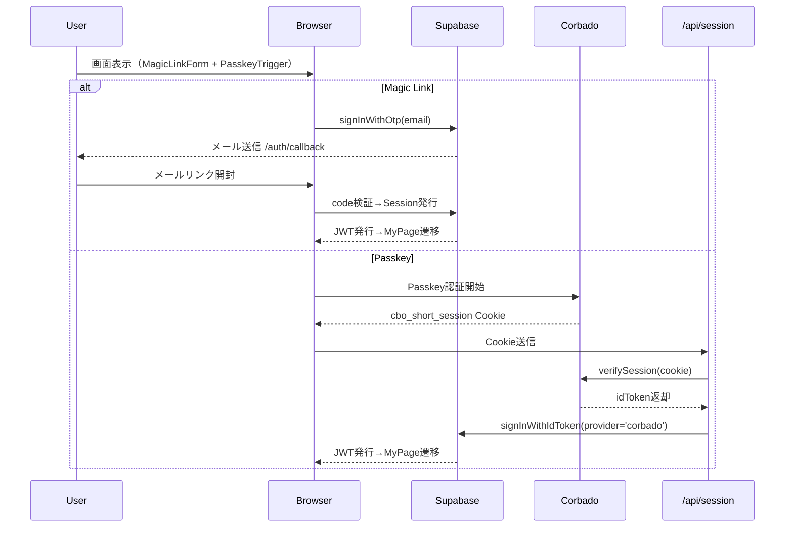

# HarmoNet 詳細設計書（ログイン画面）ch03 - 認証構成（Magic Link + Passkey統合） v1.0

**Document ID:** HNM-LOGIN-FEATURE-CH03
**Version:** 1.0
**Created:** 2025-11-11
**Updated:** 2025-11-11
**Supersedes:** Passkey専用構成（初版）
**ContextKey:** HarmoNet_LoginDocs_Realign_v4.0_Update
**Standard:** harmonet-detail-design-agenda-standard_v1.0（安全テンプレートモード適用）

---

## 第1章：概要

本章は、HarmoNetログイン機能における **Magic Link + Passkey（Corbado連携）** の統合認証構成を定義する。
ch02（状態管理）で定義されたフォーム動作と連携し、SupabaseおよびCorbadoによる**完全パスワードレス認証基盤**を形成する。

### 1.1 目的

* Magic Link と Passkey の両方式を同一画面で自然に統合
* 認証UIを Corbado公式構成で統一（@corbado/react + /api/session）
* Supabase AuthとRLSを利用し、セッション共有・認可分離を両立

### 1.2 責務・役割

| 区分    | 責任主体      | 内容                          |
| ----- | --------- | --------------------------- |
| 設計書作成 | Tachikoma | MagicLink + Passkey 統合構成の設計 |
| レビュー  | Gemini    | 整合性・安全性・可読性レビュー             |
| 実装    | Windsurf  | UI・API連携を本設計に基づきコード生成       |

---

## 第2章：統合認証構成概要

### 2.1 構成要素

| 区分   | 方式                 | 提供主体               | 機能概要                             |
| ---- | ------------------ | ------------------ | -------------------------------- |
| A-01 | Magic Link         | Supabase Auth      | OTPメール送信 / `/auth/callback` 検証   |
| A-02 | PasskeyAuthTrigger | Corbado SDK + Node | WebAuthn認証 / `/api/session` 検証   |
| 共通   | Supabase RLS       | PostgreSQL         | tenant_id + corbado_user_id 認可制御 |

### 2.2 統合認証フロー（Mermaid）



### 2.3 状態・遷移概要

| 状態      | イベント       | 次状態     | 処理                        |
| ------- | ---------- | ------- | ------------------------- |
| idle    | メール送信      | sending | signInWithOtp() 実行        |
| sending | Supabase応答 | sent    | /auth/callback 遷移         |
| idle    | Passkey開始  | loading | CorbadoAuth 起動            |
| loading | 成功         | success | /api/session → Supabase同期 |
| error   | 失敗         | idle    | AuthErrorBanner 表示        |

---

## 第3章：機能詳細

### 3.1 Magic Link（Supabase）

```ts
const handleMagicLink = async (email: string) => {
  const { error } = await supabase.auth.signInWithOtp({
    email,
    options: {
      shouldCreateUser: false,
      emailRedirectTo: `${window.location.origin}/auth/callback`,
    },
  });
  if (error) throw new Error(error.message);
};
```

* TTL: 60秒、単回利用（リプレイ無効）
* `/auth/callback` で JWT検証後 `/mypage` 遷移

### 3.2 Passkey（Corbado公式構成）

```tsx
import { CorbadoProvider, CorbadoAuth } from '@corbado/react';

export default function PasskeyLogin() {
  return (
    <CorbadoProvider projectId={process.env.NEXT_PUBLIC_CORBADO_PROJECT_ID!}>
      <CorbadoAuth />
    </CorbadoProvider>
  );
}
```

* `/api/session` にて Cookie (`cbo_short_session`) を検証
* 成功時のみ Supabase に signInWithIdToken() 実行

### 3.3 Supabase連携

| 項目  | 内容                                        |
| --- | ----------------------------------------- |
| 認証  | MagicLink / Passkey どちらも Supabaseセッションを共有 |
| 認可  | RLS: `tenant_id + corbado_user_id` 条件で適用  |
| JWT | Supabase管理。Corbado発行トークンはサーバ検証後破棄         |

---

## 第4章：副作用・再レンダー設計

* MagicLinkForm と PasskeyAuthTrigger はそれぞれ独立状態を保持。
* 成功・失敗イベントは共通の Context（AuthContext）で監視。
* CorbadoAuth の再レンダーを最小化するため、Providerはルート階層で固定。

---

## 第5章：セキュリティとテスト観点

### 5.1 セキュリティ制約

* HTTPS必須、Cookieは HttpOnly + Secure + SameSite=Lax + Max-Age=900s
* Magic Link TTL = 60秒、CorbadoSession TTL = 15分
* JWT検証はCorbadoNode / Supabase双方で二段階実施

### 5.2 UT観点

| テストID    | シナリオ          | 操作            | 期待結果                |
| -------- | ------------- | ------------- | ------------------- |
| UT-03-01 | MagicLink送信成功 | メール入力→送信      | `/auth/callback` 遷移 |
| UT-03-02 | MagicLink失敗   | 無効メール         | エラー表示               |
| UT-03-03 | Passkey成功     | CorbadoAuth認証 | `/mypage` 遷移        |
| UT-03-04 | Passkey失敗     | 通信断           | AuthErrorBanner表示   |
| UT-03-05 | 並行利用          | 両ボタン押下        | 片方のみ有効動作            |

---

## 第6章：関連ファイル

| 種別        | ファイル                                | 用途                   |
| --------- | ----------------------------------- | -------------------- |
| 状態管理      | `login-feature-design-ch02_v1.0.md` | MagicLinkForm + 状態管理 |
| セッション管理   | `login-feature-design-ch04_v1.0.md` | /api/session設計       |
| セキュリティ    | `login-feature-design-ch05_v1.0.md` | Cookie・RLS方針         |
| PasskeyUI | `login-feature-design-ch06_v1.0.md` | PasskeyトリガUI         |

---

## 第7章：改訂履歴

| Version | Date       | Author          | Summary                                                            |
| ------- | ---------- | --------------- | ------------------------------------------------------------------ |
| 1.0     | 2025-11-11 | TKD + Tachikoma | Magic Link + Passkey統合構成に改訂。Supabase OTPおよびCorbadoAuth双方のフローを正式定義。 |
