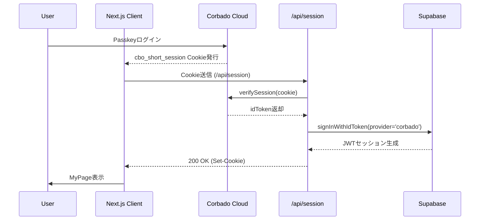

# HarmoNet 詳細設計書（ログイン画面）ch04 - SessionHandler設計 v1.0

**Document ID:** HNM-LOGIN-FEATURE-CH04
**Version:** 1.0
**Created:** 2025-11-11
**Updated:** 2025-11-11
**Supersedes:** 初版（簡易CorbadoService構成）
**ContextKey:** HarmoNet_LoginDocs_Realign_v4.0_Update
**Standard:** harmonet-detail-design-agenda-standard_v1.0（安全テンプレートモード適用）

---

## 第1章：概要

本章は、ログイン機能における **セッション管理および状態遷移制御** の詳細設計を示す。
Phase9仕様および技術スタックv4.0に準拠し、Corbado公式構成（@corbado/react + @corbado/node + Supabase RLS）へ統合されている。

### 1.1 改訂目的

| 改訂項目       | 内容                                                    |
| ---------- | ----------------------------------------------------- |
| 認証管理       | CorbadoSDK.verifySession(cookie) による統一検証              |
| Supabase連携 | RLS適用専用、Auth責務分離                                      |
| トークン交換     | signInWithIdToken() のサーバ限定実行                          |
| Cookie     | HttpOnly, Secure, SameSite=Lax, Max-Age=900s          |
| セッション状態    | 5分類（loading / authenticated / expired / error / none） |

---

## 第2章：処理設計

### 2.1 セッションフロー（Mermaid）



### 2.2 状態分類

| 状態            | 説明         | 対応アクション          |
| ------------- | ---------- | ---------------- |
| loading       | 検証中        | ローディング表示         |
| authenticated | セッション有効    | `/mypage` 遷移     |
| expired       | Cookie期限切れ | `/login` へ戻る     |
| error         | JWT不整合     | `/error/auth` 遷移 |
| none          | 未ログイン      | `/login` 表示      |

### 2.3 セッション検証API（/api/session）

```typescript
import { NextResponse } from 'next/server';
import { CorbadoSDK } from '@corbado/node';
import { createClient } from '@/lib/supabase/server';

export async function GET(req: Request) {
  const cookie = req.headers.get('cookie');
  const sdk = new CorbadoSDK(process.env.CORBADO_API_SECRET!);
  const verification = await sdk.verifySession(cookie);

  if (!verification) {
    return NextResponse.json({ error: 'unauthorized' }, { status: 401 });
  }

  const supabase = createClient();
  await supabase.auth.signInWithIdToken({ provider: 'corbado', token: verification.idToken });

  return NextResponse.json({ ok: true, user: verification.userId });
}
```

---

## 第3章：クライアント側セッション管理フック

```typescript
'use client';
import { useEffect, useState } from 'react';

export default function useSession() {
  const [session, setSession] = useState(null);
  const [loading, setLoading] = useState(true);
  const [error, setError] = useState(false);

  useEffect(() => {
    async function fetchSession() {
      try {
        const res = await fetch('/api/session');
        if (!res.ok) {
          setError(true);
          setSession(null);
        } else {
          const data = await res.json();
          setSession(data);
        }
      } catch {
        setError(true);
      } finally {
        setLoading(false);
      }
    }
    fetchSession();
  }, []);

  return { session, loading, error };
}
```

---

## 第4章：Supabase連携仕様

| 項目    | 内容                                         |
| ----- | ------------------------------------------ |
| 目的    | CorbadoユーザーIDをRLS認可キーに利用                   |
| 接続    | `createClient()` でサーバ側接続                   |
| 認証    | `/api/session` 内で `signInWithIdToken()` 実行 |
| JWT期限 | 900秒（Corbado側）                             |
| 責務分離  | Corbado＝Auth、Supabase＝RLS                  |

---

## 第5章：エラーハンドリング

| ケース                | 原因          | 対応                |
| ------------------ | ----------- | ----------------- |
| 401 Unauthorized   | セッション未確立    | `/login` に戻す      |
| 403 Forbidden      | JWT不整合      | `/error/auth` へ遷移 |
| 500 Internal Error | Corbado通信失敗 | リトライ表示            |
| Cookie期限切れ         | 有効期限超過      | 再ログイン要求           |
| 通信断                | ネットワーク障害    | オフライン通知           |

---

## 第6章：セキュリティ仕様

* HTTPS必須。
* 環境変数管理：

  * `NEXT_PUBLIC_CORBADO_PROJECT_ID`
  * `CORBADO_API_SECRET`
  * `SUPABASE_SERVICE_ROLE_KEY`
* Cookie属性：`HttpOnly`, `Secure`, `SameSite=Lax`, `Max-Age=900s`。
* RLS条件：`user_id = corbado_user_id`。
* CORBADO_API_SECRETはEdge Function非対応。

---

## 第7章：アクセシビリティ・UX方針

* 状態に応じた `AuthLoadingIndicator` / `AuthErrorBanner` を共通UIとして使用。
* 表示トーン：「やさしく・自然・控えめ（Appleカタログ風）」。
* セッション確認中は`aria-live="polite"`で動的更新を通知。

---

## 第8章：テスト観点

| テストID     | 項目                  | 期待結果              |
| --------- | ------------------- | ----------------- |
| T-CH04-01 | `/api/session` 正常応答 | JWT返却確認           |
| T-CH04-02 | 未ログイン               | 401レスポンス          |
| T-CH04-03 | 有効セッション             | `/mypage` 遷移      |
| T-CH04-04 | Cookie期限切れ          | `/login` に戻る      |
| T-CH04-05 | 不正トークン改ざん           | `/error/auth` に遷移 |
| T-CH04-06 | Corbado通信断          | エラー通知             |

---

## 第9章：関連ファイル

| 種別        | ファイル                                       | 用途            |
| --------- | ------------------------------------------ | ------------- |
| トリガUI     | `ch02_login-state_v1.0.md`                 | ログイン状態管理仕様    |
| Passkey認証 | `ch03_passkey-auth_v1.0.md`                | CorbadoAuth仕様 |
| コンポーネント   | `PasskeyAuthTrigger-detail-design_v1.0.md` | UI連携部品        |
| API       | `/app/api/session/route.ts`                | セッション検証実装     |
| Spec      | `Claude実行指示書_C-07_SecuritySpec_v1.0.md`    | セキュリティ仕様      |

---

## 第10章：改訂履歴

| Version | Date       | Author          | Summary                                                                       |
| ------- | ---------- | --------------- | ----------------------------------------------------------------------------- |
| 1.0     | 2025-11-11 | TKD + Tachikoma | `/api/session` 実装をCorbadoSDK.verifySession構成に統一。状態遷移5分類化、Cookie属性詳細化、UIトーン整合。 |
