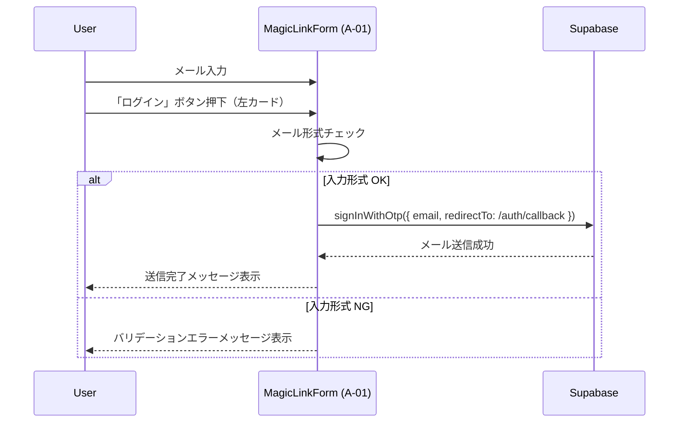

# HarmoNet 詳細設計書 - MagicLinkForm (A-01) ch00 Index

**Document ID:** HARMONET-DETAIL-A01-MAGICLINKFORM-CH00
**Version:** 1.2
**Supersedes:** v1.1
**Created:** 2025-11-12
**Updated:** 2025-11-16
**Author:** Tachikoma
**Reviewer:** TKD
**Status:** MagicLink 専用カードタイル方式 / 技術スタック v4.3 / Passkey 独立構成 反映版

---

## 第0章 目的と適用範囲

本書は HarmoNet ログイン画面における **A-01 MagicLinkForm** の詳細設計書群（ch01〜ch09）の **索引（インデックス）** であり、各章の構成・参照関係を示す。

本 ch00 が担う役割は以下のとおり：

* MagicLinkForm の詳細設計書（ch01〜ch09）の構成と参照関係を示す
* Windsurf が参照すべき分割ファイル一覧の提示
* 本コンポーネントに適用される技術基盤の定義
* 章立てと記述密度のガイドライン提示

> **注意**：
>
> * 本設計書は「最新版」の仕様のみを記述する。
> * 過去バージョンの説明・移行理由・改訂内容などは **ch09（ChangeLog）にのみ記載し、本文には一切含めない。**
> * 旧ファイルは `##_old` 配下で管理されるため、本書内に歴史的経緯を書く必要はない。

---

## 第1章 対象ファイル一覧

A-01 MagicLinkForm の詳細設計は、以下 10 ファイルで構成される。Windsurf および他 AI エージェントは、**本一覧に記載されたファイルのみを唯一の正として参照する。**

| 章番号  | ファイル名                                               | 概要                              |
| ---- | --------------------------------------------------- | ------------------------------- |
| ch00 | `MagicLinkForm-detail-design_ch00-index_v1.2.md`    | 本索引（目的・構成・関連ドキュメント）             |
| ch01 | `MagicLinkForm-detail-design_ch01-overview_*.*.md`  | 概要・目的・責務・画面内での役割                |
| ch02 | `MagicLinkForm-detail-design_ch02-props_*.*.md`     | Props / State / イベント定義          |
| ch03 | `MagicLinkForm-detail-design_ch03-logic_*.*.md`     | MagicLink ロジック・Supabase 連携      |
| ch04 | `MagicLinkForm-detail-design_ch04-ui_*.*.md`        | カードタイル UI 構成・Tailwind 設計        |
| ch05 | `MagicLinkForm-detail-design_ch05-error_*.*.md`     | エラーハンドリング・メッセージ仕様・ログ連携          |
| ch06 | `MagicLinkForm-detail-design_ch06-i18n_*.*.md`      | StaticI18nProvider 連携・i18n キー定義 |
| ch07 | `MagicLinkForm-detail-design_ch07-security_*.*.md`  | セキュリティ・非機能要件（クライアント側観点）         |

> ※ `*.*` ワイルドカードはバージョン番号を示し、最新版（例: `_v1.2.md`）のみを使用する。旧版は `## _old` 配下に退避する。

---

## 第2章 技術基盤（準拠）

MagicLinkForm の実装は、以下の技術スタック定義に準拠する。

| 項目           | 値                                                   |
| ------------ | --------------------------------------------------- |
| Framework    | Next.js 16 + React 19                               |
| Language     | TypeScript 5.6                                      |
| UI Stack     | Tailwind CSS 3.4 + shadcn/ui                        |
| Auth SDK     | Supabase JS SDK v2.43                               |
| 対象認証方式       | **MagicLink のみ（Passkey は A-02 が担当）**                |
| 国際化          | StaticI18nProvider v1.0（JSON 辞書ベース）                 |
| テスト          | Vitest + React Testing Library                      |
| セキュリティ / RLS | Supabase + Prisma / `schema.prisma` / RLS ポリシー定義に準拠 |
| TechRef      | `harmonet-technical-stack-definition_v4.3.md`       |

Passkey 認証（WebAuthn / Corbado SDK）は、本 A-01 では扱わない。右側カードタイルを構成する **A-02 PasskeyAuthTrigger** の詳細設計書（別ファイル）に委譲する。

---

## 第3章 構成概要

### 3.1 ログイン画面内での位置付け

MagicLinkForm は、ログイン画面（A-00 LoginPage）の中央カードコンテナ内で、以下のように配置される：

* 左側カードタイル：MagicLinkForm（A-01）
* 右側カードタイル：PasskeyAuthTrigger（A-02）

LoginPage 自体はレイアウトのみを担当し、認証ロジックやメッセージ表示は、A-01 / A-02 側の責務とする。

### 3.2 MagicLink 認証フロー概要

Passkey 認証フローは、A-02 PasskeyAuthTrigger 詳細設計書にて別途定義される。

### 3.3 ログ出力との関係

MagicLinkForm は、共通ログユーティリティ（`logInfo` / `logError`）を利用し、以下のイベントを出力する。

* `auth.login.start`（MagicLink ログイン開始）
* `auth.login.success.magiclink`（MagicLink ログイン成功）
* `auth.login.fail.input` / `auth.login.fail.supabase.network` / `auth.login.fail.supabase.auth` / `auth.login.fail.unexpected`

具体的なログ仕様は「HarmoNet 共通ログユーティリティ 詳細設計書 v1.1」に従う。A-01 側では、これらのイベントを **どのタイミングで呼び出すか** を ch03 / ch05 内で詳細定義する。

---

## 第4章 関連ドキュメント

| 分類          | 名称                                               | 参照パス（論理名）                                |
| ----------- | ------------------------------------------------ | ---------------------------------------- |
| 技術スタック      | `harmonet-technical-stack-definition_v4.3.md`    | `/01_docs/01_要件定義/技術スタック/`               |
| 詳細設計標準      | `harmonet-detail-design-agenda-standard_v1.0.md` | `/01_docs/00_プロジェクト管理/01_運用ガイドライン/`      |
| 画面基本設計      | `A1 Login Screen Basic Design_v1.0.md`           | `/01_docs/03_基本設計/01_ログイン画面/`            |
| MagicLink基本 | `MagicLink Basic Design_v1.0.md`                 | `/01_docs/03_基本設計/01_ログイン画面/`            |
| Passkey基本   | `Passkey Basic Design_v1.0.md`                   | `/01_docs/03_基本設計/01_ログイン画面/`            |
| Passkey挙動   | `HarmoNet_Passkey認証の仕組みと挙動_v1.0.md`              | `/01_docs/01_要件定義/技術補足/`                 |
| ログ基本設計      | `harmonet-log-design_v1.1.md`                    | `/01_docs/03_基本設計/02_非機能設計/`             |
| ログ詳細設計      | `HarmoNet 共通ログユーティリティ 詳細設計書_v1.1.md`             | `/01_docs/04_詳細設計/00_共通部品/`              |
| Passkey詳細   | `PasskeyAuthTrigger-detail-design_*.*.md`        | `/01_docs/04_詳細設計/01_ログイン画面/02_Passkey/` |

---

## 第5章 改訂履歴

| Version | Date       | Author              | Summary                                                                                                                             |
| ------- | ---------- | ------------------- | ----------------------------------------------------------------------------------------------------------------------------------- |
| 1.0     | 2025-11-09 | Tachikoma           | 初版（Phase8 構成、MagicLink + PasskeyButton 二重構成の旧仕様）                                                                                    |
| 1.1     | 2025-11-12 | Tachikoma / TKD     | 技術スタック v4.2 への整合。Passkey を MagicLinkForm 内に自動統合する旧仕様に基づくインデックスとして再構成。                                                               |
| **1.2** | 2025-11-16 | **Tachikoma / TKD** | **MagicLink / Passkey の統合方式を廃止し、MagicLinkForm を「メール専用カードタイル」として再定義。技術スタック v4.3 / ログ設計 v1.1 / A1 ログイン画面基本設計 v1.0 に完全整合する最新インデックス版。** |

---

**End of Document**
