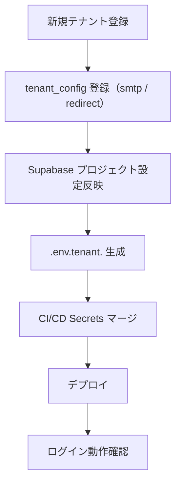

# MagicLinkForm 詳細設計書 - 第7章：環境設定

**Document ID:** HARMONET-COMPONENT-A01-MAGICLINKFORM-CH07
**Version:** 1.2
**Supersedes:** v1.1（Passkey 統合版）
**Status:** 正式版（MagicLink 専用フォーム / Passkey 完全分離後の最新仕様）

---

## 7.1 章の目的

本章では、A-01 **MagicLinkForm（v1.3）** の実行に必要な **環境変数・設定ファイル・テナント設定・CI/CD連携・i18n設定・セキュリティ要件** を、最新ログイン方式（MagicLink / Passkey 完全独立）に基づいて定義する。

**重要更新点（v1.3）**：

* Passkey は A-02 に完全分離。MagicLinkForm が触れるべき環境変数は **Supabase OTP 認証のみ**。
* Corbado / Passkey に関する設定は一切含めない。
* `passkey_enabled` や `NEXT_PUBLIC_CORBADO_*` など旧仕様の変数は削除。
* MagicLinkForm は **MagicLink 専用カードタイル** として構築され、環境設定もそれに限定する。

---

## 7.2 必須環境変数

MagicLinkForm が利用するのは **Supabase OTP 認証に必要な環境変数のみ** である。

```bash
# Supabase 認証設定
NEXT_PUBLIC_SUPABASE_URL=https://<project>.supabase.co
NEXT_PUBLIC_SUPABASE_ANON_KEY=<anon-key>

# MagicLink リダイレクト設定（/auth/callback 固定）
NEXT_PUBLIC_MAGICLINK_REDIRECT=/auth/callback
```

### 運用ルール（必須）

* `NEXT_PUBLIC_SUPABASE_URL` / `NEXT_PUBLIC_SUPABASE_ANON_KEY` は **クライアント側で使用**するため Public Prefix が必要。
* リダイレクト先（MagicLink コールバック URL）は常に `/auth/callback`。テナント別に上書きする場合は **app/auth/callback/page.tsx** で吸収する。
* OTP ログインの実行は `signInWithOtp()` のみで、追加設定は不要。

---

## 7.3 テナント設定（MagicLinkForm が利用する項目）

MagicLinkForm は **MagicLink に必要な最小構成のみ参照**する。

### 7.3.1 テナント設定モデル（MagicLink版）

```ts
interface TenantConfig {
  tenant_id: string;
  tenant_name: string;

  # MagicLink のみ
  magiclink_redirect: string;   // /auth/callback に固定推奨
  smtp_domain: string;          // Supabase SMTP 設定
  smtp_sender_name: string;     // 送信者名（ブランド表示）

  created_at: Date;
  updated_at: Date;
}
```

### 7.3.2 サンプル

| tenant_id | tenant_name | magiclink_redirect                                                                   | smtp_domain   | smtp_sender_name  |
| --------- | ----------- | ------------------------------------------------------------------------------------ | ------------- | ----------------- |
| T001      | Alpha管理組合   | [https://alpha.harmonet.app/auth/callback](https://alpha.harmonet.app/auth/callback) | mail.alpha.jp | HarmoNet通知（Alpha） |
| T002      | Bravo管理組合   | [https://bravo.harmonet.app/auth/callback](https://bravo.harmonet.app/auth/callback) | mail.bravo.jp | HarmoNet通知（Bravo） |

### 7.3.3 ポリシー

* **MagicLink に Passkey 関連項目は存在しない**。
* テナント固有 URL を利用する場合、MagicLink リンク生成側（Supabase ダッシュボード）も合わせて設定する。

---

## 7.4 環境ファイル構造（MagicLink 専用版）

MagicLinkForm が参照するのは Public Prefix のみであるため、実際の構造は以下のとおり最低限でよい。

```
.env.local
.env.staging
.env.production
.env.tenant.<tenant_id>
```

### `.env.production` の例

```bash
NEXT_PUBLIC_SUPABASE_URL=https://api.harmonet.app
NEXT_PUBLIC_SUPABASE_ANON_KEY=${{ secrets.SUPABASE_ANON_KEY }}
NEXT_PUBLIC_MAGICLINK_REDIRECT=/auth/callback
```

### `.env.tenant.T001` の例

```bash
TENANT_ID=T001
NEXT_PUBLIC_MAGICLINK_REDIRECT=https://alpha.harmonet.app/auth/callback
SMTP_SENDER_NAME=HarmoNet通知（Alpha管理組合）
```

---

## 7.5 Supabase MagicLink 認証設定

MagicLinkForm v1.3 は Supabase の OTP 認証 API のみ利用する。

| 設定項目               | 内容         | 推奨値                   |
| ------------------ | ---------- | --------------------- |
| `signInWithOtp()`  | OTP メール送信  | Supabase JS SDK v2.43 |
| `shouldCreateUser` | 自動ユーザー作成可否 | false（管理者が事前登録）       |
| `emailRedirectTo`  | リンク遷移先     | tenant_config / 固定値   |
| `RLS_POLICY`       | 行レベルセキュリティ | 有効（tenant_id による分離）   |
| `SESSION_EXPIRY`   | JWT 有効期限   | 10 分以内                |

### 7.5.1 MagicLink リダイレクトの扱い

MagicLinkForm 内では値を保持せず、Supabase 側で以下のように指定する：

```ts
supabase.auth.signInWithOtp({
  email,
  options: {
    shouldCreateUser: false,
    emailRedirectTo: `${window.location.origin}/auth/callback`
  }
});
```

---

## 7.6 i18n 設定（MagicLinkForm 専用）

MagicLinkForm v1.3 の i18n キーは **すべて common.json の `auth.login.magiclink.*`** に統一される。（詳細は ch06 参照）

### リソース構造

```
/public/locales/
 ├─ ja/common.json
 ├─ en/common.json
 └─ zh/common.json
```

### MagicLinkForm が使用するキー（抜粋）

```json
{
  "auth": {
    "login": {
      "magiclink": {
        "title": "メールでログイン",
        "button_login": "ログイン",
        "button_sending": "送信中…"
      },
      "magiclink_sent": "ログイン用リンクを送信しました。",
      "error": {
        "email_invalid": "メールアドレスの形式が正しくありません。",
        "network": "通信エラーが発生しました。",
        "auth": "認証に失敗しました。",
        "unexpected": "予期しないエラーが発生しました。"
      }
    }
  }
}
```

---

## 7.7 CI/CD・Secrets 管理（MagicLink 専用版）

MagicLinkForm では Passkey / Corbado Secrets を一切利用しないため、Secrets 構成は大幅に簡略化される。

| 項目                | 内容                          | 管理方針                      |
| ----------------- | --------------------------- | ------------------------- |
| Supabase鍵         | ANON_KEY / SERVICE_ROLE_KEY | GitHub Secrets / Vault 管理 |
| MagicLink設定       | tenant_config に保存           | DB 側から読み込む                |
| `.env.production` | CI で Secrets をマージして生成       | Public Prefix のみ出力        |

### CI で生成される `.env.production`（例）

```bash
NEXT_PUBLIC_SUPABASE_URL=$SUPABASE_URL
NEXT_PUBLIC_SUPABASE_ANON_KEY=$SUPABASE_ANON_KEY
NEXT_PUBLIC_MAGICLINK_REDIRECT=/auth/callback
```

---

## 7.8 セキュリティ運用要件

MagicLinkForm は Public API を使用するため、以下を最低限満たす必要がある。

### **7.8.1 MagicLinkForm が守るべき要件**

* `.env*` は Git 管理対象外とする。
* Public Prefix（NEXT_PUBLIC_*）の値のみ参照する。
* MagicLink リンクのパラメータを露出しない（トークンは Supabase 側で処理される）。
* Supabase Auth の OTP トークンはクライアント側では一切扱わない。

### **7.8.2 サーバー・CI 側の要件（MagicLinkForm 観点）**

* SMTP ドメイン・送信者名は tenant_config に保存し、アプリ側にハードコードしない。
* Secrets は AES256 または Vault で暗号化管理。
* 半期ごとに認証キーの再発行を推奨。

---

## 7.9 テナント展開フロー（MagicLink 専用）

MagicLinkForm で必要なのは **コールバック URL と SMTP 設定のみ**。



---

## Change Log

| Version | Date       | Summary                              |
| ------- | ---------- | ------------------------------------ |
| 1.1     | 2025-11-12 | Passkey 統合版（旧仕様）。                    |
| **1.2** | 2025-11-16 | **MagicLink 専用環境設定として全面再構築。Passkey/C |
