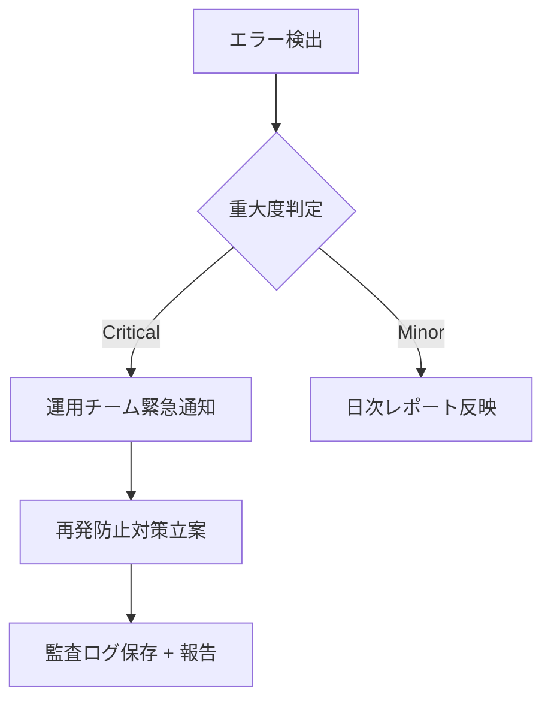

# MagicLinkForm 詳細設計書 - 第8章：監査・保守指針（v1.1）

**Document ID:** HARMONET-COMPONENT-A01-MAGICLINKFORM-CH08  
**Version:** 1.1  
**Updated:** 2025-11-10  
**Based on:** harmonet-technical-stack-definition_v4.0 / MagicLinkForm-detail-design_v1.1.md  
**Reviewer:** TKD  
**Status:** Phase9 正式整合版  

---

## 第8章 監査・保守指針

### 8.1 監査方針

MagicLinkForm は、Supabase Auth を基盤とするため、  
運用監査の中心は「送信イベント」「成功/失敗ログ」「レート制限検知」に置く。  
PII（個人情報）はハッシュ化して扱い、外部出力を最小限にする。  

---

### 8.2 ログ監査設計

| ログ種別 | 記録内容 | 保存期間 | 出力先 |
|-----------|-----------|-----------|----------|
| 認証イベント | tenant_id, masked_email, result, IP, timestamp | 1年 | Supabase audit schema |
| エラーログ | error_code, message, trace_id, timestamp | 1年 | Supabase storage / Cloud Logging |
| Rate制限 | tenant_id, IP, count, blocked_flag | 90日 | WAFログ |
| 管理操作 | operator_id, action, timestamp | 1年 | Admin Portal Audit |

**補足**  
- `masked_email` は `xxxx@example.com` のようにローカル部をマスク。  
- `trace_id` は Supabase Functions / Edge Logから継承。  
- 全ログは UTC基準。  

---

### 8.3 監査データ構造（例）

```sql
CREATE TABLE audit_magiclink_events (
  id uuid PRIMARY KEY DEFAULT gen_random_uuid(),
  tenant_id text NOT NULL,
  masked_email text NOT NULL,
  result text CHECK (result IN ('success','fail')),
  ip_address text,
  user_agent text,
  error_code text,
  created_at timestamptz DEFAULT now()
);
```

---

### 8.4 保守運用体制

| 項目 | 内容 |
|------|------|
| 運用主体 | システム管理者（または指定テナント管理者） |
| 対応時間 | 平日 9:00〜18:00（緊急時24h） |
| 監視間隔 | 5分間隔で Supabase エラーログを集計 |
| 通知方法 | Slack / Email による自動通知 |
| 重大障害時 | リカバリ手順を実施し、再発防止分析を行う |

---

### 8.5 月次メンテナンス項目

| 区分 | 項目 | 内容 |
|------|------|------|
| バージョン管理 | Supabase JS / SDK | 最新安定版への更新確認 |
| セキュリティ | 環境変数 / トークン | 期限切れチェック・再発行 |
| メール送信 | SPF/DKIM/DMARC | 到達率レポート確認 |
| RLSポリシー | tenant_config | テナント紐付け再検証 |
| 監査テーブル | audit_magiclink_events | サイズ・整合性チェック |

---

### 8.6 インシデント対応フロー



---

### 8.7 定期監査チェックリスト

| チェック項目 | 目的 | 頻度 |
|---------------|------|------|
| メール送信ログ整合性 | 不達・重複送信検知 | 月次 |
| テナント別Rate制限 | スパム抑止・公平性維持 | 週次 |
| Supabase RLS設定 | テナント間アクセス遮断確認 | 四半期 |
| auth.callback動作 | メールリンク遷移検証 | 月次 |
| CI/CD Secrets | 漏洩防止チェック | 月次 |

---

### 8.8 障害復旧ポリシー

- **軽度障害**（一部テナントで送信失敗）  
　→ 送信キューをクリア後、再試行。影響ログを記録。  
- **中度障害**（全体送信停止）  
　→ Supabase Auth のステータス確認、再認証テスト。  
- **重大障害**（リンク改ざん・トークン流出）  
　→ 緊急停止（Feature Flag `AUTH_DISABLED=true`）、キー再発行＋全テナント報告。  

---

### 🧾 ChangeLog
| Version | Date | Summary |
|----------|------|----------|
| v1.0 | 2025-11-10 | 初版（Phase8仕様） |
| v1.1 | 2025-11-10 | Phase9準拠。監査テーブル設計・月次保守・監視体制・インシデント対応を追加。 |

---

**文書ステータス:** ✅ Phase9 正式整合版  
**次のアクション:** 第9章 ChangeLog（ch09）へ進む
