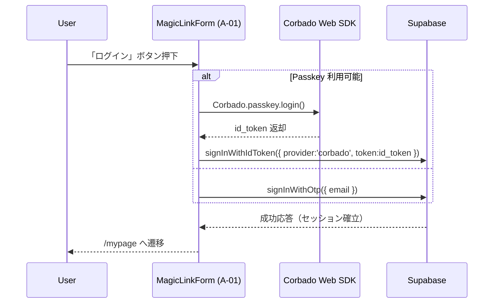

# HarmoNet 詳細設計書 - MagicLinkForm (A-01) ch00 Index

**Document ID:** HARMONET-DETAIL-A01-MAGICLINKFORM-CH00-V1.1
**Version:** 1.1
**Created:** 2025-11-12
**Author:** Tachikoma
**Reviewer:** TKD
**Status:** ✅ Phase9 正式仕様（技術スタック v4.2 対応・Passkey自動認証統合）

---

## 第0章 目的と適用範囲

本書は、HarmoNetログイン画面における **A-01 MagicLinkForm** の詳細設計群（ch01〜ch09）の索引である。
v1.1では、**技術スタック v4.2** に基づき、以下の設計統合を行った。

* A-02 PasskeyButton を廃止
* MagicLinkForm 内に Passkey 自動判定ロジックを統合
* Supabase と Corbado を単一フォームで切替動作
* Corbado UI は不採用（独自UI構成）
* `signInWithOtp()` と `signInWithIdToken()` による統合認証フローを確立

---

## 第1章 対象ファイル一覧

| 章番号  | ファイル名                                               | 概要                         |
| ---- | --------------------------------------------------- | -------------------------- |
| ch00 | `MagicLinkForm-detail-design_ch00-index_v1.1.md`    | 本索引                        |
| ch01 | `MagicLinkForm-detail-design_ch01-overview_*.*.md`  | 概要・目的・責務                   |
| ch02 | `MagicLinkForm-detail-design_ch02-props_*.*.md`     | Props・State定義              |
| ch03 | `MagicLinkForm-detail-design_ch03-logic_*.*.md`     | 認証フロー・Supabase / Corbado連携 |
| ch04 | `MagicLinkForm-detail-design_ch04-ui_*.*.md`        | UI構成・Tailwind定義            |
| ch05 | `MagicLinkForm-detail-design_ch05-error_*.*.md`     | ErrorHandlerProvider連携     |
| ch06 | `MagicLinkForm-detail-design_ch06-i18n_*.*.md`      | StaticI18nProvider連携       |
| ch07 | `MagicLinkForm-detail-design_ch07-security_*.*.md`  | HTTPS / JWT / RLS対応        |
| ch08 | `MagicLinkForm-detail-design_ch08-test_*.*.md`      | UT観点・Storybook構成           |
| ch09 | `MagicLinkForm-detail-design_ch09-changelog_*.*.md` | 改訂履歴・バージョン管理               |

---

## 第2章 技術基盤（準拠）

| 項目              | 値                                           |
| --------------- | ------------------------------------------- |
| **Framework**   | Next.js 16 + React 19                       |
| **Auth SDK**    | Supabase v2.43 + Corbado Web SDK v2.x       |
| **Integration** | MagicLink + Passkey 自動認証                    |
| **Language**    | TypeScript 5.6                              |
| **UI Stack**    | TailwindCSS 3.4 + shadcn/ui                 |
| **Test**        | Vitest + RTL                                |
| **Security**    | HTTPS / JWT 10min / tenant_id RLS           |
| **TechRef**     | harmonet-technical-stack-definition_v4.2.md |

---

## 第3章 構成概要

### 認証フロー図

---

## 第4章 関連ドキュメント

| 分類     | 名称                                             | 参照パス                          |
| ------ | ---------------------------------------------- | ----------------------------- |
| 技術基盤   | harmoNet-technical-stack-definition_v4.2.md    | `/01_docs/01_要件定義/`           |
| 詳細設計標準 | harmonet-detail-design-agenda-standard_v1.0.md | `/01_docs/00_project/`        |
| 認証画面構成 | login-feature-design-ch00-index_v1.1.md        | `/01_docs/03_基本設計/01_ログイン画面/` |
| 共通部品   | StaticI18nProvider-detail-design_v1.0.md       | `/01_docs/04_詳細設計/00_共通部品/`   |
| データ層   | schema.prisma / enable_rls_policies.sql        | `/01_docs/02_環境構成/`           |

---

## 第5章 改訂履歴

| Version | Date           | Author              | Summary                              |
| ------- | -------------- | ------------------- | ------------------------------------ |
| 1.0     | 2025-11-09     | Tachikoma           | 初版（Phase8構成）                         |
| **1.1** | **2025-11-12** | **Tachikoma / TKD** | **技術スタックv4.2整合・Passkey自動認証統合・正式仕様化** |

---

**Document Status:** ✅ Phase9 Finalized
**ContextKey:** HarmoNet_TechStack_v4_2
