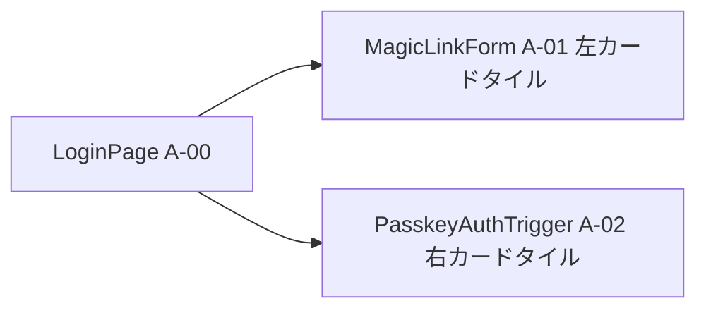

# MagicLinkForm 詳細設計書 - 第1章：概要（v1.2）

**Document ID:** HARMONET-COMPONENT-A01-MAGICLINKFORM-CH01
**Version:** 1.2
**Supersedes:** v1.1
**Created:** 2025-11-12
**Updated:** 2025-11-16
**Author:** Tachikoma
**Reviewer:** TKD
**Status:** 最新仕様（MagicLink 専用カードタイル方式 / 技術スタック v4.3 整合）

---

## 第1章 概要

### 1.1 目的

**MagicLinkForm（A-01）** の役割は、HarmoNet ログイン画面（A-00）において、
ユーザーがメールアドレスを入力し **Magic Link（メールリンク認証）でログインするための UI とロジック** を提供することである。

本コンポーネントは **メールログイン専用** であり、Passkey 認証は A-02 PasskeyAuthTrigger に完全分離されている。MagicLinkForm は、ログイン画面中央に配置される **左側カードタイル** として機能し、メール入力欄・ログインボタン・状態表示（送信中 / 成功 / エラー）を扱う。

MagicLinkForm の中心的な目的は以下のとおり：

* ユーザーがメールアドレスを入力し、MagicLink 認証を開始できる UI を提供する
* Supabase Auth の `signInWithOtp()` を使用した安全な OTP ログイン処理を実行する
* 入力チェック・通信エラー・認証エラー等の UI 表示とログ出力を行う
* LoginPage(A-00) 内で、PasskeyAuthTrigger(A-02) と左右対称のカード構成を形成する

---

### 1.2 設計方針

MagicLinkForm の設計は、以下の原則に基づく：

1. **メールログイン専用の責務分離**
   認証方式の選択や自動判定は行わず、MagicLink のみを扱う。Passkey 認証は一切実装せず、A-02 側に完全委譲する。

2. **カードタイル UI（A1 ログイン基本設計準拠）**

   * 左側カードタイルとして配置される。
   * rounded-2xl、控えめなシャドウ、Appleカタログ風の自然で静かなデザインを採用。

3. **状態管理の明確化**
   状態は `idle / sending / sent / error_*` の最小構成に整理し、UI とロジックの一貫性を保つ。

4. **ログ仕様の徹底遵守**
   共通ログユーティリティ（logInfo / logError）を使用し、MagicLink の開始・成功・失敗を正確に記録する。

5. **記述密度と分割（Windsurf最適化）**
   章ごとに役割を分離し、余計な説明を排除しながらも、Windsurf が迷わない粒度で明確に設計情報を記述する。

---

### 1.3 コンポーネント識別情報

| 項目                     | 内容                                                 |
| ---------------------- | -------------------------------------------------- |
| **Component ID**       | A-01                                               |
| **Component Name**     | MagicLinkForm                                      |
| **Category**           | ログイン画面 UI（Authentication）                          |
| **Placement**          | LoginPage（A-00）の左側カードタイル                           |
| **Framework**          | Next.js 16 / React 19                              |
| **Language**           | TypeScript 5.6                                     |
| **Auth Method**        | Supabase MagicLink（OTP）専用                          |
| **Dependencies**       | StaticI18nProvider / Supabase JS SDK / log utility |
| **Related Components** | A-00 LoginPage / A-02 PasskeyAuthTrigger           |

---

### 1.4 MagicLinkForm の役割

MagicLinkForm の主な役割は以下のとおり：

* メールアドレスの入力欄を提供する
* 入力値の形式チェックを行う
* Supabase の MagicLink 送信 API（signInWithOtp）を発行する
* 成功時のメッセージ（「メールを送信しました」）を表示する
* エラー種別（入力・通信・認証・想定外）に応じた UI 表示を行う
* 各イベントを共通ログユーティリティへ記録する

MagicLinkForm は、Passkey 認証ボタンを保持せず、認証ロジックも持たない。
A-02 PasskeyAuthTrigger が提供する右側カードタイルと分離することで、責務の明確化と保守性の向上を実現する。

---

### 1.5 配置構成（A-00 LoginPage 内）

以下に、MagicLinkForm がログイン画面内でどのように配置されるかを示す：

LoginPage はレイアウトのみを担当し、MagicLinkForm の認証ロジックや UI 状態は本コンポーネントが完全に制御する。

---

### 1.6 関連ドキュメント

| 種別       | 名称                                          | 用途                 |
| -------- | ------------------------------------------- | ------------------ |
| 基本設計     | A1 Login Screen Basic Design v1.0           | ログイン画面のUI/UX仕様     |
| 詳細設計標準   | harmonet-detail-design-agenda-standard_v1.0 | 本設計書の章構成標準         |
| 認証仕様     | MagicLink Basic Design v1.0                 | MagicLink機能の基礎仕様   |
| 認証仕様     | Passkey Basic Design v1.0                   | PasskeyはA-02側仕様    |
| 技術基盤     | harmonet-technical-stack-definition_v4.3    | 採用技術の基準            |
| メッセージ/ログ | harmoNet 共通ログユーティリティ詳細設計書 v1.1              | auth.login.* のログ仕様 |

---

### 1.7 本章の位置付け

本章（ch01）は **MagicLinkForm の全体像・責務・目的・関連要素** をまとめたものであり、詳細な仕様は以下の章に分割される：

* ch02：Props / State 定義
* ch03：MagicLink ロジック仕様
* ch04：UI / Tailwind 定義
* ch05：エラーハンドリング / メッセージ仕様
* ch06：i18n キー仕様
* ch07：セキュリティ仕様
* ch08：UT / Storybook / E2E
* ch09：ChangeLog

---

**End of Document**
