# MagicLinkForm 詳細設計書 - 第2章：機能設計（v1.1）

**Document ID:** HARMONET-COMPONENT-A01-MAGICLINKFORM-CH02
**Version:** 1.1
**Supersedes:** v1.0（Phase9構成）
**Created:** 2025-11-12
**Author:** Tachikoma
**Reviewer:** TKD
**Status:** ✅ 承認提案版（Passkey自動統合対応）

---

## 第2章 機能設計

### 2.1 機能要約

MagicLinkForm は、ユーザーが入力したメールアドレスを基に、**Supabase Auth** および **Corbado SDK** を連携させ、パスワードレス認証を自動的に切り替える統合コンポーネントである。
本章では、Props／State 構造、状態遷移、依存関係、およびユニットテスト観点を定義する。

* `passkey_enabled` が **true** の場合 → Corbado SDK による WebAuthn 認証を実行。
* `passkey_enabled` が **false** の場合 → Supabase Auth の `signInWithOtp()` によるメールリンク送信を実行。

---

### 2.2 入出力仕様（Props／State／Error構造）

#### 2.2.1 Props 定義

```typescript
export interface MagicLinkFormProps {
  /** 外部からクラス名を拡張指定（任意） */
  className?: string;

  /** ログイン成功時（MagicLink / Passkey問わず）に呼び出される */
  onSent?: () => void;

  /** 認証失敗・通信エラー時のハンドリング用コールバック */
  onError?: (error: MagicLinkError) => void;

  /** Supabase user_profiles 由来の passkey 使用可否 */
  passkeyEnabled?: boolean;
}
```

#### 2.2.2 State 定義

```typescript
type MagicLinkState =
  | 'idle'            // 初期状態
  | 'sending'         // Supabaseリクエスト中
  | 'sent'            // MagicLink送信成功
  | 'passkey_auth'    // Passkey認証中
  | 'success'         // 認証完了
  | 'error_invalid'   // 入力形式不正
  | 'error_network'   // 通信・API失敗
  | 'error_auth';     // Passkey認証失敗
```

#### 2.2.3 MagicLinkError 構造

```typescript
export interface MagicLinkError {
  /** Supabase または Corbado からのエラーコード */
  code: string;

  /** 表示メッセージ（StaticI18nProviderで翻訳） */
  message: string;

  /** 状態型に対応する分類 */
  type: MagicLinkState;
}
```

---

### 2.3 処理フロー（Mermaid）

```mermaid
sequenceDiagram
  participant U as User
  participant F as MagicLinkForm
  participant S as Supabase
  participant C as Corbado

  U->>F: メールアドレス入力 + ログイン押下
  F->>F: 入力検証（@形式）
  alt passkeyEnabled == true
    F->>C: Corbado.load() + passkey.login()
    C-->>F: id_token 返却
    F->>S: signInWithIdToken(provider: 'corbado', token: id_token)
    S-->>F: 成功 → 状態=success
  else passkeyEnabled == false
    F->>S: signInWithOtp({ email, options })
    S-->>F: 成功 → 状態=sent
  end
  F->>U: 成功メッセージ or リダイレクト(`/mypage`)
  F->>Parent: onSent()
```



---

### 2.4 依存関係設計

| 区分   | モジュール／コンポーネント                                                | 用途                                              |
| ---- | ------------------------------------------------------------ | ----------------------------------------------- |
| 認証   | `@supabase/supabase-js`                                      | `signInWithOtp()`, `signInWithIdToken()` 呼出     |
| 認証補助 | `@corbado/web-js`                                            | `passkey.login()` によりWebAuthn起動                 |
| UI   | `@/components/ui`                                            | ボタン／入力部共通利用                                     |
| i18n | `StaticI18nProvider (C-03)`                                  | 翻訳キー管理 `auth.*`                                 |
| アイコン | `lucide-react`                                               | 状態別アイコン表示（Mail／Loader2／CheckCircle／AlertCircle） |
| 環境   | `NEXT_PUBLIC_CORBADO_PROJECT_ID`, `NEXT_PUBLIC_SUPABASE_URL` | Corbado / Supabase設定                            |

---

### 2.5 コンポーネント構造

```
MagicLinkForm
 ├─ <input type="email"> （メール入力欄）
 ├─ <button> （ログイントリガー）
 │   ├─ Loader2（sending / passkey_auth）
 │   ├─ CheckCircle（success）
 │   ├─ AlertCircle（error_*）
 │   └─ Mail（idle）
 └─ <p>（完了／エラーメッセージ）
```

---

### 2.6 状態遷移設計

| 現在状態                       | トリガー | 遷移先                          | 結果            | 備考                |
| -------------------------- | ---- | ---------------------------- | ------------- | ----------------- |
| `idle`                     | クリック | `sending` または `passkey_auth` | API呼出開始       | passkeyEnabledで分岐 |
| `sending`                  | 成功   | `sent`                       | MagicLink送信成功 | -                 |
| `passkey_auth`             | 成功   | `success`                    | 認証完了          | Corbado経由         |
| `sending` / `passkey_auth` | 通信失敗 | `error_network`              | エラー表示         | onError通知         |
| `passkey_auth`             | 認証拒否 | `error_auth`                 | エラー表示         | onError通知         |
| `idle`                     | 入力不正 | `error_invalid`              | i18nエラー表示     | @形式検証             |
| `error_*`                  | 再送信  | `sending` / `passkey_auth`   | 再試行開始         | -                 |

---

### 2.7 UT観点（人間操作に基づく）

| 観点ID | 操作                               | 期待結果                    | テスト目的           |
| ---- | -------------------------------- | ----------------------- | --------------- |
| UT01 | passkeyEnabled=false でメール入力→ログイン | Supabase呼出→メール送信完了      | 正常（MagicLink）確認 |
| UT02 | passkeyEnabled=true でログイン        | Corbado→Supabaseセッション確立 | 正常（Passkey）確認   |
| UT03 | 入力不正                             | `error_invalid` 表示      | フォーマット検証        |
| UT04 | 通信断                              | `error_network` 表示      | API例外ハンドリング     |
| UT05 | Passkey拒否                        | `error_auth` 表示         | 認証キャンセル処理確認     |
| UT06 | 言語切替                             | 翻訳文言即時反映                | i18n動作確認        |
| UT07 | 再送信                              | 状態リセット後正常復帰             | 再試行動作確認         |

---

### 2.8 副作用と再レンダー制御

| 処理          | 実装箇所             | 再レンダー制御                                     | 備考         |
| ----------- | ---------------- | ------------------------------------------- | ---------- |
| Supabase初期化 | `createClient()` | 外部モジュール単位（再生成なし）                            | useMemo化不要 |
| Corbado初期化  | `Corbado.load()` | 呼出時のみ実行                                     | 再ログイン時再呼出可 |
| 状態管理        | `useState`       | 個別状態のみ更新                                    | UI最適化済     |
| 送信処理        | `useCallback`    | 依存配列 `[email, passkeyEnabled, supabase, t]` | 再生成防止      |
| 翻訳取得        | `useI18n()`      | Context変化時のみ更新                              | 多言語即時反映    |

---

### 🧾 Change Log

| Version  | Date           | Summary                                      |
| -------- | -------------- | -------------------------------------------- |
| v1.0     | 2025-11-11     | 初版（MagicLinkForm単体構成）                        |
| **v1.1** | **2025-11-12** | **Passkey統合版。Props/State拡張、Corbado連携・UT拡充。** |
