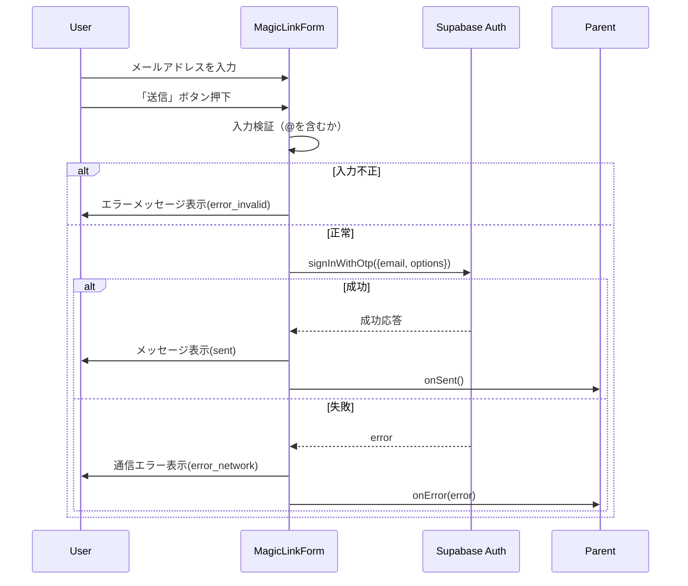

# MagicLinkForm 詳細設計書 - 第2章：機能設計（v1.0）

**Document ID:** HARMONET-COMPONENT-A01-MAGICLINKFORM-CH02
**Version:** 1.0
**Created:** 2025-11-11
**Component ID:** A-01
**Component Name:** MagicLinkForm
**Category:** ログイン画面コンポーネント（Authentication Components）
**Status:** ✅ Phase9 正式整合版（技術スタック v4.0 準拠）
**ContextKey:** HarmoNet_LoginDocs_Realign_v4.0_Update

---

## 第2章 機能設計

### 2.1 機能要約

MagicLinkForm は、ユーザーが入力したメールアドレスを基に **Supabase Auth** の `signInWithOtp()` を呼び出し、Magic Link（ワンタップログイン用URL）を送信する役割を担う。
本章では、Props／State構造・依存関係・状態遷移および入出力フローを定義する。
UIは PasskeyButton (A-02) と統一デザインで構築され、静的翻訳（StaticI18nProvider）を利用して3言語に対応する。

---

### 2.2 入出力仕様（Props／State／Error構造）

#### 2.2.1 Props 定義

```typescript
export interface MagicLinkFormProps {
  /**
   * 外部からクラス名を拡張指定（任意）
   */
  className?: string;

  /**
   * メール送信成功時に親コンポーネントへ通知
   */
  onSent?: () => void;

  /**
   * 送信失敗（通信／入力不正など）時のハンドリング用コールバック
   */
  onError?: (error: MagicLinkError) => void;
}
```

#### 2.2.2 State 定義

```typescript
type MagicLinkState =
  | 'idle'           // 初期状態
  | 'sending'        // Supabaseへリクエスト中
  | 'sent'           // 成功（メール送信完了）
  | 'error_invalid'  // 入力形式不正
  | 'error_network'  // 通信・API失敗
  | 'error_unknown'; // その他例外
```

#### 2.2.3 MagicLinkError 構造

```typescript
export interface MagicLinkError {
  /** Supabase またはクライアント定義のエラーコード */
  code: string;

  /** 表示メッセージ（StaticI18nProviderで翻訳） */
  message: string;

  /** 状態型に対応する分類 */
  type: MagicLinkState;
}
```

---

### 2.3 処理フロー（Mermaid）



---

### 2.4 依存関係設計

| 区分   | 依存モジュール／コンポーネント                                              | 用途／説明                                              |
| ---- | ------------------------------------------------------------ | -------------------------------------------------- |
| 認証   | `@supabase/supabase-js`                                      | `auth.signInWithOtp()` によるメールリンク送信                 |
| UI   | `@/components/ui`                                            | ボタン・インプットの共通部品利用                                   |
| i18n | `StaticI18nProvider (C-03)`                                  | 翻訳キー `auth.*` に基づく国際化処理                            |
| アイコン | `lucide-react`                                               | 状態ごとのビジュアル表示（Mail／Loader2／CheckCircle／AlertCircle） |
| 環境   | `NEXT_PUBLIC_SUPABASE_URL` / `NEXT_PUBLIC_SUPABASE_ANON_KEY` | クライアント初期化に利用                                       |

---

### 2.5 コンポーネント構造

```
MagicLinkForm
 ├─ <input type="email"> （メール入力欄）
 ├─ <button> （送信トリガー）
 │   ├─ Loader2（送信中）
 │   ├─ CheckCircle（成功）
 │   ├─ AlertCircle（失敗）
 │   └─ Mail（初期状態）
 └─ <p>（補足／完了メッセージ）
```

---

### 2.6 状態遷移設計

| 現在状態      | トリガー    | 遷移先             | 結果               | 備考          |
| --------- | ------- | --------------- | ---------------- | ----------- |
| `idle`    | ボタンクリック | `sending`       | Supabase API呼出開始 | -           |
| `sending` | 成功応答    | `sent`          | メール送信完了          | onSent()実行  |
| `sending` | 通信失敗    | `error_network` | APIエラー表示         | onError()通知 |
| `idle`    | 入力不正    | `error_invalid` | i18nエラー表示        | `@`形式検証     |
| `error_*` | 再入力・再送信 | `sending`       | 再試行開始            | -           |

---

### 2.7 UT観点（人間操作に基づく）

| 観点ID | 操作           | 期待結果                            | テスト目的                  |
| ---- | ------------ | ------------------------------- | ---------------------- |
| UT01 | メールアドレス入力→送信 | Supabase API呼出→成功メッセージ表示        | 正常系動作確認                |
| UT02 | 不正形式入力       | 入力エラーが即時表示される                   | バリデーション検証              |
| UT03 | 通信断時         | エラーメッセージ `error.network` が表示される | 例外ハンドリング検証             |
| UT04 | 言語切替         | 表示文言が即時更新される                    | StaticI18nProvider連携確認 |
| UT05 | 再送信          | 前回エラー状態から正常復帰する                 | 状態再遷移テスト               |

---

### 2.8 副作用と再レンダー制御

| 処理          | 実装箇所             | 再レンダー制御                                      | 備考             |
| ----------- | ---------------- | -------------------------------------------- | -------------- |
| Supabase初期化 | `createClient()` | 外部モジュール単位（再作成なし）                             | useMemo化不要     |
| 状態更新        | `useState`       | フック毎に限定                                      | 必要最小限の再描画のみ    |
| 送信処理        | `useCallback`    | 依存配列 `[email, supabase, t, onError, onSent]` | 不要再生成を防止       |
| 翻訳取得        | `useI18n()`      | Provider単位                                   | Context変化時のみ更新 |

---

### 🧾 Change Log

| Version | Date       | Summary                                         |
| ------- | ---------- | ----------------------------------------------- |
| v1.0    | 2025-11-11 | 初版（Phase9準拠：Props／State拡張、状態遷移表・UT観点追加、記述密度統一版） |
