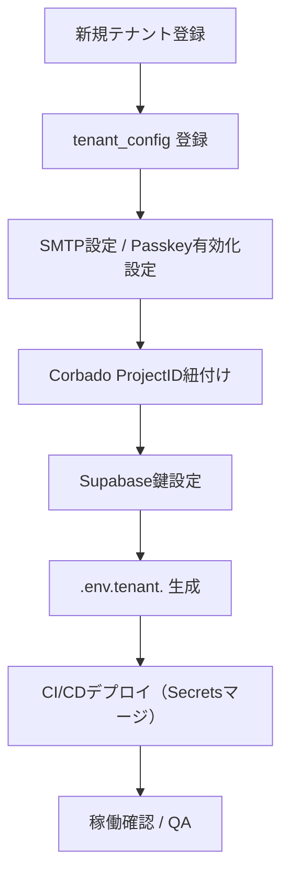

# MagicLinkForm 詳細設計書 - 第7章：環境設定（v1.1）

**Document ID:** HARMONET-COMPONENT-A01-MAGICLINKFORM-CH07
**Version:** 1.1
**Supersedes:** v1.0（Phase9構成）
**Created:** 2025-11-12
**Author:** Tachikoma
**Reviewer:** TKD
**Status:** ✅ 承認提案版（Corbado統合対応・環境設定拡張）

---

## 第7章 環境設定

### 7.1 環境構成概要

MagicLinkForm (A-01) は、**Supabase Auth** と **Corbado Passkey SDK** を統合するため、両方の環境変数・テナント設定・Secrets管理を厳密に運用する必要がある。
本章では、開発／本番環境における環境変数、テナント別設定、CI/CD連携、i18n構成、Secrets保護ポリシーを定義する。

---

### 7.2 Supabase / Corbado 接続設定

```bash
# Supabase 認証設定
NEXT_PUBLIC_SUPABASE_URL=https://<project>.supabase.co
NEXT_PUBLIC_SUPABASE_ANON_KEY=<anon-key>
SUPABASE_SERVICE_ROLE_KEY=<service-role-key>

# Corbado Passkey設定
NEXT_PUBLIC_CORBADO_PROJECT_ID=<corbado-project-id>
CORBADO_API_SECRET=<corbado-api-secret>

# 共通設定
NEXT_PUBLIC_MAGICLINK_REDIRECT=/auth/callback
DISABLE_AUTH_FLOW=false
```

**運用ルール**

* `CORBADO_API_SECRET` は必ずサーバーサイド専用。GitHub Secrets / Vaultで暗号化管理。
* SupabaseとCorbadoのキーは環境毎に分離（`stg` / `prod`）。
* `.env.production` はCI/CD時に Secrets から自動展開される。
* `DISABLE_AUTH_FLOW` フラグにより、緊急時にすべてのログイン機能を一時停止可能。

---

### 7.3 テナント設定（tenant_config）

#### 7.3.1 モデル構造

```typescript
interface TenantConfig {
  tenant_id: string;
  tenant_name: string;
  supabase_project_ref: string;
  corbado_project_id?: string;
  passkey_enabled: boolean;
  magiclink_redirect: string;
  smtp_domain: string;
  smtp_sender_name: string;
  created_at: Date;
  updated_at: Date;
}
```

#### 7.3.2 サンプル設定

| tenant_id | tenant_name | passkey_enabled | corbado_project_id | magiclink_redirect                                                                   | smtp_domain   | supabase_project_ref |
| --------- | ----------- | --------------- | ------------------ | ------------------------------------------------------------------------------------ | ------------- | -------------------- |
| T001      | Alpha管理組合   | true            | crb_proj_alpha     | [https://alpha.harmonet.app/auth/callback](https://alpha.harmonet.app/auth/callback) | mail.alpha.jp | proj_alpha           |
| T002      | Bravo管理組合   | false           | (null)             | [https://bravo.harmonet.app/auth/callback](https://bravo.harmonet.app/auth/callback) | mail.bravo.jp | proj_bravo           |

**設定ポリシー**

* Passkey利用有無を `passkey_enabled` で明示管理。
* 各テナントの `corbado_project_id` はCorbado管理コンソール発行値を登録。
* Supabase/Corbado両設定が不整合な場合、ログインAPI呼出を拒否。
* MagicLink送信URLとSMTPドメインはテナント固有設定。

---

### 7.4 環境ファイル構造

```
.env.local                # 開発環境
.env.staging              # ステージング
.env.production           # 本番環境
.env.tenant.<tenant_id>   # テナント別設定
```

#### 例：`.env.production`

```bash
NEXT_PUBLIC_ENV=production
NEXT_PUBLIC_SUPABASE_URL=https://api.harmonet.app
NEXT_PUBLIC_CORBADO_PROJECT_ID=crb_prod_main
CORBADO_API_SECRET=${{ secrets.CORBADO_API_SECRET }}
SUPABASE_SERVICE_ROLE_KEY=${{ secrets.SUPABASE_SERVICE_ROLE_KEY }}
```

#### 例：`.env.tenant.T001`

```bash
TENANT_ID=T001
PASSKEY_ENABLED=true
NEXT_PUBLIC_MAGICLINK_REDIRECT=https://alpha.harmonet.app/auth/callback
NEXT_PUBLIC_CORBADO_PROJECT_ID=crb_proj_alpha
SMTP_DOMAIN=mail.alpha.jp
SMTP_SENDER_NAME=HarmoNet通知（Alpha管理組合）
```

---

### 7.5 認証設定詳細

| 設定項目                       | 内容              | 推奨値                   |
| -------------------------- | --------------- | --------------------- |
| `shouldCreateUser`         | ユーザー自動作成可否      | false（管理者登録制）         |
| `emailRedirectTo`          | メールリンクリダイレクト    | tenant_config優先       |
| `auth.signInWithOtp()`     | Supabaseメールログイン | Supabase JS SDK v2.43 |
| `auth.signInWithIdToken()` | Passkey認証用      | provider='corbado' 指定 |
| `RLS_POLICY`               | 行レベルセキュリティ      | 有効（tenant_id分離）       |
| `SESSION_EXPIRY`           | JWT期限           | 10分以内                 |

---

### 7.6 i18n 設定

#### リソース構成

```
/public/locales/
 ├─ ja/common.json
 ├─ en/common.json
 └─ zh/common.json
```

#### 共通キー例

```json
{
  "auth": {
    "login": "ログイン",
    "magiclink": {
      "enter_email": "メールアドレスを入力",
      "sending": "送信中...",
      "sent": "メールを送信しました"
    },
    "passkey": {
      "login": "パスキー認証を実行中...",
      "success": "パスキー認証が完了しました",
      "denied": "パスキー認証が拒否されました"
    }
  }
}
```

**ルール**

* `auth.passkey.*` を `auth.magiclink.*` と同ファイルに統合。
* StaticI18nProvider (C-03) が `/public/locales/{locale}/common.json` をロード。
* テナント固有文言は `/public/locales/{tenant_id}/{lang}/common.json` で上書き可能。

---

### 7.7 CI/CD・Secrets管理

| 項目         | 内容                             | 管理方針                       |
| ---------- | ------------------------------ | -------------------------- |
| Secrets管理  | GitHub Actions Secrets / Vault | Corbado / Supabase 鍵を暗号化保存 |
| CI環境統合     | `.env.production` 自動展開         | Secretsマージ時にCIで生成          |
| Supabase設定 | `auth.config.toml`             | CI実行時に反映                   |
| Corbado設定  | `corbado.config.json`          | ProjectID / RP ID を記載      |
| 署名鍵        | Vault管理                        | APIキー暗号化保持                 |

---

### 7.8 セキュリティ運用要件

* `.env*` ファイルは **Git追跡外** とし、暗号化管理（AES256）を推奨。
* `CORBADO_API_SECRET` および `SUPABASE_SERVICE_ROLE_KEY` はVaultで集中管理。
* CI/CD実行後はSecretsを即時破棄。
* FeatureFlagにより `passkey_enabled` をテナント単位で制御可能。
* 半期ごとにSecrets再発行・環境変数整合性レビューを実施。

---

### 7.9 テナント展開フロー（運用指針）



---

### 🧾 Change Log

| Version  | Date           | Summary                                          |
| -------- | -------------- | ------------------------------------------------ |
| v1.0     | 2025-11-11     | 初版（Supabase環境構成・マルチテナント対応）                       |
| **v1.1** | **2025-11-12** | **Corbado統合対応。環境変数・tenant_config・Secrets管理を拡張。** |
