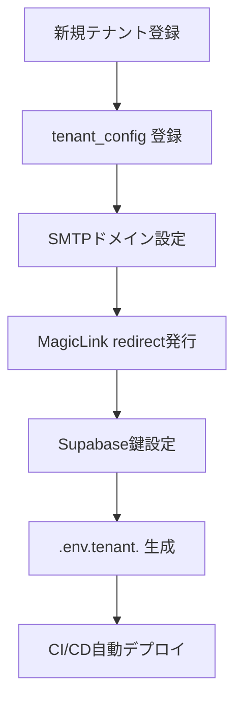

# MagicLinkForm 詳細設計書 - 第7章：環境設定（v1.0）

**Document ID:** HARMONET-COMPONENT-A01-MAGICLINKFORM-CH07
**Version:** 1.0
**Created:** 2025-11-11
**Component ID:** A-01
**Component Name:** MagicLinkForm
**Category:** ログイン画面コンポーネント（Authentication Components）
**Status:** ✅ Phase9 正式整合版（技術スタック v4.0 準拠）
**ContextKey:** HarmoNet_LoginDocs_Realign_v4.0_Update

---

## 第7章 環境設定

### 7.1 環境構成概要

MagicLinkForm は Supabase 認証基盤を利用するため、**環境変数・テナント設定・CI/CD連携**を正確に管理する必要がある。
本章では、開発／本番環境・テナント別構成・i18nリソース・Secrets管理を含む設定ルールを定義する。

---

### 7.2 Supabase 接続設定

```bash
# Supabase 認証設定
NEXT_PUBLIC_SUPABASE_URL=https://<project>.supabase.co
NEXT_PUBLIC_SUPABASE_ANON_KEY=<anon-key>

# 管理用（バックエンド専用）
SUPABASE_SERVICE_ROLE_KEY=<service-role-key>

# Magic Link リダイレクト設定
NEXT_PUBLIC_MAGICLINK_REDIRECT=/auth/callback
```

**運用ルール**

* `SUPABASE_SERVICE_ROLE_KEY` はサーバー環境でのみ使用（フロントに露出禁止）。
* `.env.local` は個人開発用、`.env.production` は CI/CD デプロイ用として明確分離。
* `emailRedirectTo` の実体値は `tenant_config` から動的に参照。

---

### 7.3 テナント設定（tenant_config）

#### 7.3.1 モデル構造

```typescript
interface TenantConfig {
  tenant_id: string;
  tenant_name: string;
  supabase_project_ref: string;
  corbado_project_id?: string;
  magiclink_redirect: string;
  smtp_domain: string;
  smtp_sender_name: string;
  created_at: Date;
  updated_at: Date;
}
```

#### 7.3.2 サンプル設定

| tenant_id | tenant_name | magiclink_redirect                                                                   | smtp_domain   | supabase_project_ref |
| --------- | ----------- | ------------------------------------------------------------------------------------ | ------------- | -------------------- |
| T001      | Alpha管理組合   | [https://alpha.harmonet.app/auth/callback](https://alpha.harmonet.app/auth/callback) | mail.alpha.jp | proj_alpha           |
| T002      | Bravo管理組合   | [https://bravo.harmonet.app/auth/callback](https://bravo.harmonet.app/auth/callback) | mail.bravo.jp | proj_bravo           |

**設定ポリシー**

* すべてのテナントに `magiclink_redirect` および `smtp_domain` を必須登録。
* MagicLink送信時は、`tenant_context` から該当設定を参照してURL生成。
* テナント単位でSMTP署名と差出人名を明示管理。

---

### 7.4 環境ファイル構造

```
.env.local                # 開発環境
.env.staging              # ステージング
.env.production           # 本番環境
.env.tenant.<tenant_id>   # テナント別設定
```

#### 例：`.env.production`

```bash
NEXT_PUBLIC_ENV=production
NEXT_PUBLIC_SUPABASE_URL=https://api.harmonet.app
NEXT_PUBLIC_SUPABASE_ANON_KEY=<anon-key>
NEXT_PUBLIC_MAGICLINK_REDIRECT=/auth/callback
```

#### 例：`.env.tenant.T001`

```bash
TENANT_ID=T001
NEXT_PUBLIC_MAGICLINK_REDIRECT=https://alpha.harmonet.app/auth/callback
SMTP_DOMAIN=mail.alpha.jp
SMTP_SENDER_NAME=HarmoNet通知（Alpha管理組合）
```

---

### 7.5 認証設定詳細

| 設定項目                   | 内容         | 推奨値                               |
| ---------------------- | ---------- | --------------------------------- |
| `shouldCreateUser`     | 自動ユーザー作成可否 | false（管理者登録制）                     |
| `emailRedirectTo`      | メールリンク先    | `/auth/callback`（tenant_config優先） |
| `auth.signInWithOtp()` | 認証API      | Supabase JS SDK v2.43             |
| `RLS_POLICY`           | 行レベルセキュリティ | 有効（tenant_id分離）                   |
| `SESSION_EXPIRY`       | JWT期限      | 10分以内                             |

---

### 7.6 i18n 設定

#### リソース配置構成

```
/public/locales/
 ├─ ja/common.json
 ├─ en/common.json
 └─ zh/common.json
```

#### 共通キー例

```json
{
  "auth": {
    "magiclink": {
      "enter_email": "メールアドレスを入力",
      "send": "Magic Linkを送信",
      "sent": "メールを送信しました",
      "check_email": "メールをご確認ください"
    }
  }
}
```

**ルール**

* JSON構造は `auth.magiclink.*` をトップ階層とする。
* StaticI18nProvider (C-03) が `/public/locales/{locale}/common.json` を読み込む。
* テナント固有翻訳が必要な場合は `/public/locales/{tenant_id}/{lang}/common.json` で上書き可能。

---

### 7.7 CI/CD・Secrets 管理

| 項目         | 内容                                        | 管理方針                             |
| ---------- | ----------------------------------------- | -------------------------------- |
| Secrets管理  | GitHub Actions の Encrypted Secrets        | `SUPABASE_SERVICE_ROLE_KEY` 等を登録 |
| 環境統合       | `.env.production` + `.env.tenant.*` 自動マージ | テナント配布時に統合                       |
| Supabase設定 | `auth.config.toml`                        | CIで自動反映（APIキー含まず）                |
| 秘密ファイル除外   | `.gitignore`                              | `.env*`, `*.key` を除外             |
| 署名鍵        | Supabase Secret 管理                        | 外部ストレージ登録禁止                      |

---

### 7.8 セキュリティ運用要件

* `.env` ファイルは **Git未追跡**、ローカル暗号化管理を義務化。
* `NEXT_PUBLIC_*` のみをフロント側に展開。
* Secretsは Vault / Supabase Secrets機能で保持。
* CI/CDジョブ実行時は Build サーバーに一時ロードし、完了後削除。
* RLS設定・メール署名鍵は半期ごとに再発行。

---

### 7.9 テナント展開フロー（運用指針）



---

### 🧾 Change Log

| Version | Date       | Summary                                     |
| ------- | ---------- | ------------------------------------------- |
| v1.0    | 2025-11-11 | 初版（Phase9仕様：マルチテナント対応／CI/CD統合／Secrets管理標準化） |
