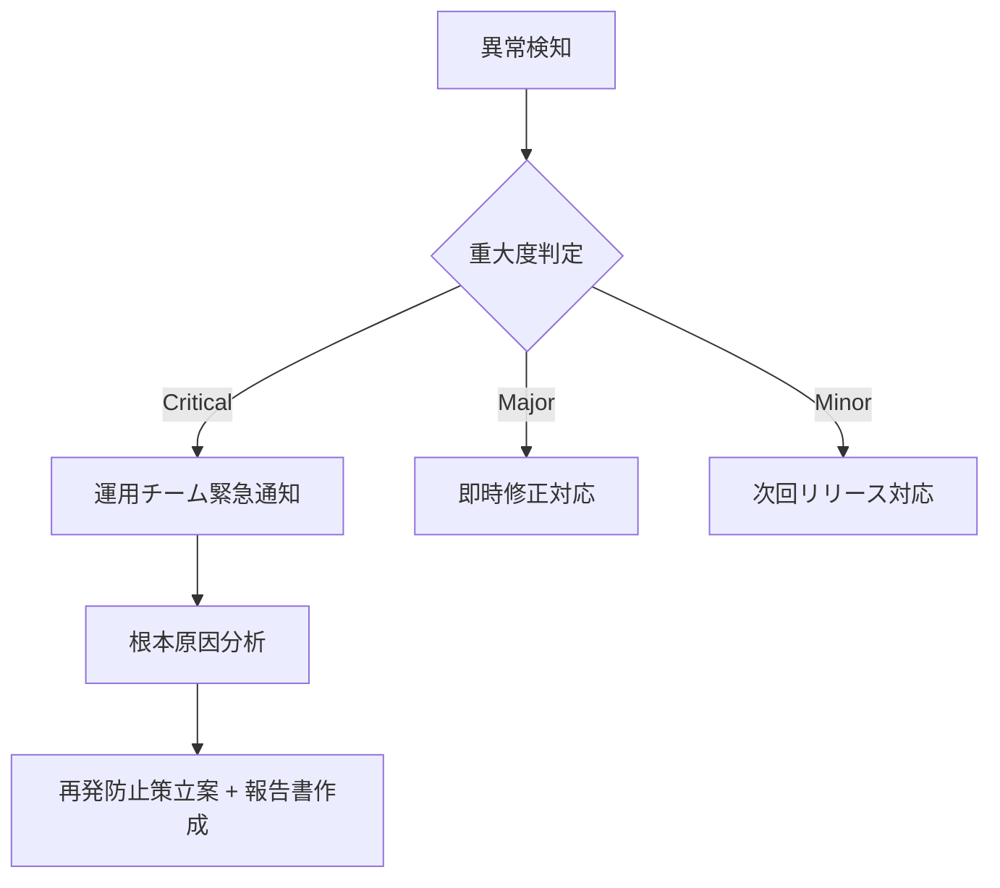

# MagicLinkForm 詳細設計書 - 第8章：監査・保守設計（v1.0）

**Document ID:** HARMONET-COMPONENT-A01-MAGICLINKFORM-CH08
**Version:** 1.0
**Created:** 2025-11-11
**Component ID:** A-01
**Component Name:** MagicLinkForm
**Category:** ログイン画面コンポーネント（Authentication Components）
**Status:** ✅ Phase9 正式整合版（技術スタック v4.0 準拠）
**ContextKey:** HarmoNet_LoginDocs_Realign_v4.0_Update

---

## 第8章 監査・保守設計

### 8.1 概要

本章では、MagicLinkForm コンポーネントにおける**監査設計・運用監視・障害対応方針**を定義する。
Phase9 環境では Supabase Auth を中心に構成されるため、ログ基盤・レート制御・インシデント分析を含む一貫した運用モデルを採用する。

---

### 8.2 監査方針

* **対象範囲**：メール送信イベント、Supabase Auth 成功／失敗応答、Rate制限、管理操作。
* **目的**：認証不具合・不正試行・パフォーマンス劣化の検出。
* **設計原則**：

  * 個人情報（PII）はマスク処理 (`masked_email`) で保持。
  * ログ出力は Supabase audit schema に統一。
  * 全時刻は UTC 基準で保存。
  * Rate制限・失敗イベントは監査レポートで独立管理。

---

### 8.3 ログ構造定義

```sql
CREATE TABLE audit_magiclink_events (
  id uuid PRIMARY KEY DEFAULT gen_random_uuid(),
  tenant_id text NOT NULL,
  masked_email text NOT NULL,
  result text CHECK (result IN ('success','fail')),
  ip_address text,
  user_agent text,
  error_code text,
  created_at timestamptz DEFAULT now()
);
```

| 項目                      | 説明                       | 取扱区分        |
| ----------------------- | ------------------------ | ----------- |
| tenant_id               | 操作テナント識別子                | 機密情報（RLS制御） |
| masked_email            | `xxxxx@example.com`形式で保持 | 匿名化済みPII    |
| result                  | 成否区分（success / fail）     | 統計分析用       |
| error_code              | Supabase返却コード            | 技術情報のみ      |
| ip_address / user_agent | 攻撃検知分析用                  | 90日保持       |
| created_at              | UTCタイムスタンプ               | 監査基準時間      |

---

### 8.4 監査ログ運用

| 種別     | 保存先                              | 保存期間 | 目的        |
| ------ | -------------------------------- | ---- | --------- |
| 認証イベント | Supabase audit schema            | 1年   | 送信成功/失敗記録 |
| エラーログ  | Supabase Storage / Cloud Logging | 1年   | 不具合再現調査   |
| Rate制限 | WAF / Supabase Edge Log          | 90日  | スパム対策分析   |
| 管理操作   | Admin Portal Audit               | 1年   | 権限変更追跡    |

* ログ転送は Supabase → GCP Cloud Logging 経由で自動同期。
* 監査レポート生成は月次バッチ（Supabase Function）により自動実行。

---

### 8.5 保守運用体制

| 項目   | 内容                            |
| ---- | ----------------------------- |
| 運用責任 | システム管理者（HarmoNet PMO）         |
| 対応時間 | 平日 9:00〜18:00（緊急時24h対応）       |
| 監視頻度 | 5分間隔（Supabase Logs監視ジョブ）      |
| 通知方法 | Slack Webhook / Email通知       |
| 障害分類 | Critical / Major / Minor の3段階 |

* 重大障害（Critical）は即時エスカレーション。
* 監視タスクは GitHub Actions + Supabase Functions により実行。

---

### 8.6 定期メンテナンス項目

| 区分      | 項目                     | 内容             | 頻度  |
| ------- | ---------------------- | -------------- | --- |
| バージョン管理 | Supabase SDK / JS      | 最新安定版への更新      | 月次  |
| 認証構成    | MagicLink / Passkey連携  | Callback動作確認   | 月次  |
| セキュリティ  | Secrets / トークン更新       | 有効期限確認         | 半期  |
| メール到達性  | SPF/DKIM/DMARC検証       | 配信レポート解析       | 月次  |
| RLS検証   | tenant_config 整合       | テナントアクセス確認     | 四半期 |
| 監査テーブル  | audit_magiclink_events | サイズ最適化 / アーカイブ | 四半期 |

---

### 8.7 インシデント対応フロー



**報告書テンプレート**：

* 発生日／対応担当／影響範囲／暫定対応／恒久対策／再発防止策
* Supabase / Corbado / Next.js の各責任分界点を明示する。

---

### 8.8 定期監査チェックリスト

| チェック項目          | 目的                  | 頻度  |
| --------------- | ------------------- | --- |
| メール送信ログ整合       | 重複・不達送信の確認          | 月次  |
| Rate制限分析        | スパム抑止・公平性維持         | 週次  |
| RLSポリシー確認       | テナント分離確認            | 四半期 |
| Auth Callback検証 | MagicLinkリダイレクト正常動作 | 月次  |
| CI/CD Secrets監査 | 秘密情報露出検知            | 月次  |

---

### 8.9 障害復旧方針

* **軽度障害（個別テナント）**：送信キュークリア後再試行。影響ログ記録。
* **中度障害（全体遅延）**：Supabase Auth ステータス確認＋再初期化。
* **重大障害（トークン改ざん・漏洩）**：Feature Flag `AUTH_DISABLED=true` により即時停止。キー再発行＋全テナントへ通達。

---

### 8.10 保守効率化計画

* 監査レポートを自動生成（Supabase Function + CRON）。
* 主要メトリクスを Supabase Studio にダッシュボード化。
* 将来的に CloudWatch / Datadog 連携を追加し、異常検知を自動化。
* 冗長ログのサンプリング削減でコスト最適化。

---

### 🧾 Change Log

| Version | Date       | Summary                                  |
| ------- | ---------- | ---------------------------------------- |
| v1.0    | 2025-11-11 | 初版（Phase9仕様：監査構造・運用体制・定期点検・インシデントフローを統合） |
