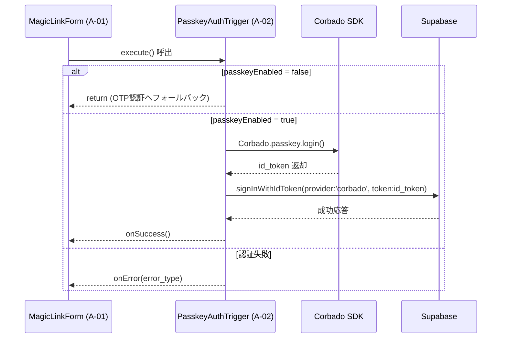

# HarmoNet 詳細設計書 - PasskeyAuthTrigger (A-02) ch05 v1.1

**Document ID:** HARMONET-COMPONENT-A02-PASSKEYAUTHTRIGGER-CH05
**Version:** 1.1
**Created:** 2025-11-12
**Author:** Tachikoma
**Reviewer:** TKD
**Status:** ✅ Phase9 正式版（技術スタック v4.2 / MagicLinkForm 統合対応）

---

## 第5章 ロジック仕様（MagicLinkForm統合）

### 5.1 概要

本章では、PasskeyAuthTrigger (A-02) の内部ロジック仕様を定義する。
UI描画は MagicLinkForm (A-01) 側に統合されているため、本モジュールは **認証トリガ・非同期処理・例外分類・再試行** のみを担当する。
`execute()` メソッドをコアとし、Promiseベースで Supabase 認証完了を返却する。

---

### 5.2 状態モデル

| 状態名          | 内容                           | 管理主体          | 備考               |
| ------------ | ---------------------------- | ------------- | ---------------- |
| `idle`       | 初期状態。未認証。                    | MagicLinkForm | Triggerは何も実行しない  |
| `processing` | Passkey認証中。Corbado SDK通信実行中。 | Trigger内部     | 重複実行防止フラグ付き      |
| `success`    | Supabase認証成功。セッション確立済み。      | MagicLinkForm | onSuccess通知でUI反映 |
| `error`      | 認証失敗。再試行待機状態。                | Trigger内部     | onError発火後、再試行可能 |

> **備考:** 状態遷移の描画は MagicLinkForm 側で実施（UI責務分離）。

---

### 5.3 処理シーケンス

---

### 5.4 関数設計

| 関数名               | 役割                         | 引数                                | 戻り値                | 備考            |
| ----------------- | -------------------------- | --------------------------------- | ------------------ | ------------- |
| `execute()`       | Passkey認証を開始し結果をPromiseで返す | なし                                | `Promise<void>`    | メイン処理関数       |
| `classifyError()` | 例外を分類・i18nキー変換             | `err: any, t: (k:string)=>string` | `PasskeyAuthError` | エラーハンドラ呼出前に実行 |
| `handleError()`   | ErrorHandlerProvider 経由で通知 | `message: string`                 | void               | UI通知は上位層で処理   |

---

### 5.5 例外分類仕様

| 例外タイプ           | 発生条件                        | 対応メッセージキー               | 通知先                  |
| --------------- | --------------------------- | ----------------------- | -------------------- |
| `error_network` | ネットワーク断・通信エラー               | `error.network`         | ErrorHandlerProvider |
| `error_denied`  | `NotAllowedError`（ユーザー取消）   | `error.passkey_denied`  | 同上                   |
| `error_origin`  | RP ID / Origin 不整合          | `error.origin_mismatch` | 同上                   |
| `error_auth`    | Supabase内部エラー / Corbado検証失敗 | `error.network`         | 同上                   |

---

### 5.6 再試行設計

* 失敗時は MagicLinkForm 側の「ログイン再試行」ボタン押下をトリガに再実行。
* 内部状態を `error → processing` に戻して再試行できる設計。
* Corbado SDK 初期化 (`Corbado.load()`) は Lazy再ロード構成。
* Supabase 側エラー時も例外分類後にUI層でリトライ可能。

---

### 5.7 呼出制御仕様

| 呼出元           | 呼出タイミング    | 条件                     | 動作                              |
| ------------- | ---------- | ---------------------- | ------------------------------- |
| MagicLinkForm | ログインボタン押下時 | passkeyEnabled = true  | PasskeyAuthTrigger.execute() 実行 |
| MagicLinkForm | 認証中断または失敗時 | passkeyEnabled = false | OTP 認証へフォールバック                  |

---

### 5.8 コールバック制御仕様

| コールバック           | タイミング         | 内容                      | 呼出箇所        |
| ---------------- | ------------- | ----------------------- | ----------- |
| `onSuccess()`    | Supabase認証完了時 | MagicLinkFormへ成功通知      | execute()内部 |
| `onError(error)` | 認証例外検出時       | MagicLinkFormへ分類済みエラー通知 | catch節      |

---

### 5.9 UT観点（ロジックレベル）

| テストID     | 観点        | 入力                  | 期待結果                   | 備考       |
| --------- | --------- | ------------------- | ---------------------- | -------- |
| UT-A02-01 | 成功経路      | passkeyEnabled=true | onSuccess()が発火         | 正常動作確認   |
| UT-A02-02 | キャンセル     | NotAllowedError     | onError(error_denied)  | ユーザー取消確認 |
| UT-A02-03 | Origin不整合 | Corbado不整合          | onError(error_origin)  | セキュリティ検証 |
| UT-A02-04 | 通信断       | ネットワーク障害            | onError(error_network) | 回線障害確認   |
| UT-A02-05 | 認証失敗      | Supabaseエラー         | onError(error_auth)    | 失敗分類確認   |

---

### 5.10 ChangeLog

| Version | Date           | Author              | Summary                                                     |
| ------- | -------------- | ------------------- | ----------------------------------------------------------- |
| 1.0     | 2025-11-11     | Tachikoma           | 旧 PasskeyButton UI仕様（ボタン押下）                                 |
| **1.1** | **2025-11-12** | **Tachikoma / TKD** | **PasskeyAuthTrigger 構成へ変更。UI削除・MagicLinkForm連携・非同期ロジック化。** |

---

**Document Path:** `/01_docs/04_詳細設計/01_ログイン画面/02_PasskeyAuthTrigger-detail-design/PasskeyAuthTrigger-detail-design_ch05_v1.1.md`
**Compliance:** harmoNet-detail-design-agenda-standard_v1.0
