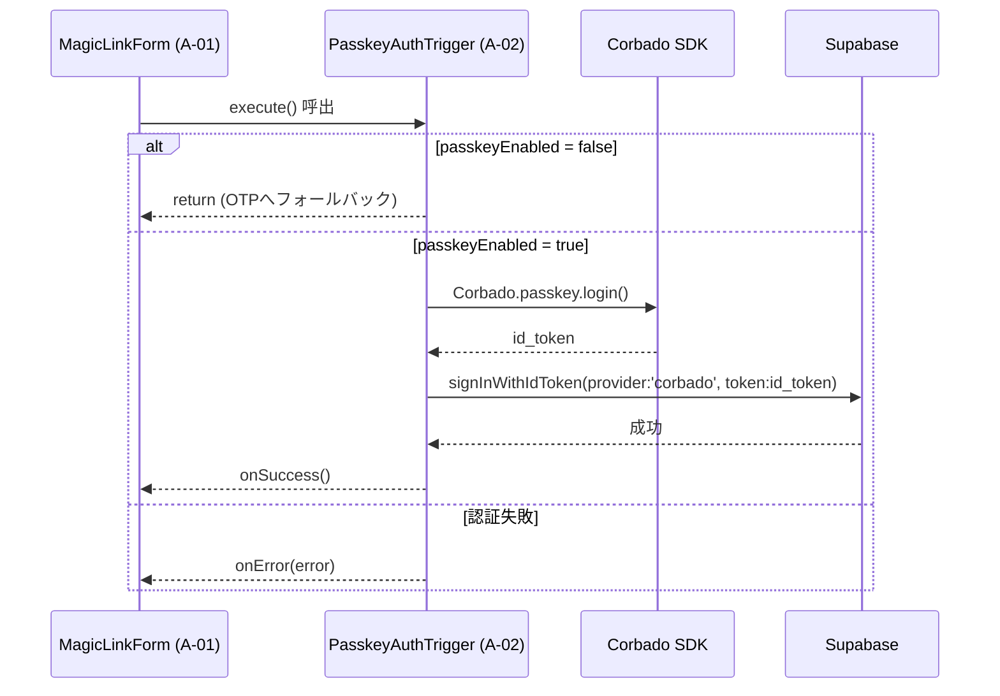

# PasskeyAuthTrigger 詳細設計書 - 第5章：ロジック仕様（v1.2）

**Document ID:** HARMONET-COMPONENT-A02-PASSKEYAUTHTRIGGER-CH05
**Version:** 1.2
**Supersedes:** v1.1
**Status:** MagicLinkForm v1.2 整合（i18n 最新化・最小限更新）

---

## 5.1 概要

PasskeyAuthTrigger (A-02) は MagicLinkForm (A-01) 内で実行される **非UIロジックモジュール**であり、Passkey 認証開始・例外分類・Supabase連携を担当する。UI描画や状態管理はすべて MagicLinkForm 側に委譲される。

本章では、`execute()` を中心としたロジック構造、例外分類、UT観点を定義する。v1.2 では **i18n エラーキー体系を最新仕様へ統一** した。

---

## 5.2 状態モデル

| 状態名          | 内容                    | 管理主体          | 備考                |
| ------------ | --------------------- | ------------- | ----------------- |
| `idle`       | 初期状態                  | MagicLinkForm | Triggerは未実行       |
| `processing` | Passkey認証中（Corbado通信） | Trigger内部     | 多重実行防止フラグ         |
| `success`    | Supabase認証成功          | MagicLinkForm | onSuccess() で通知   |
| `error`      | 認証失敗                  | Trigger内部     | onError() でUI側へ通知 |

> MagicLinkForm が UIと状態制御を担当し、Trigger は結果のみ返す。

---

## 5.3 処理シーケンス

---

## 5.4 関数設計

| 関数名               | 役割             | 引数      | 戻り値              | 備考          |
| ----------------- | -------------- | ------- | ---------------- | ----------- |
| `execute()`       | Passkey認証開始    | なし      | Promise<void>    | メイン処理       |
| `classifyError()` | 例外分類（i18nキー変換） | err, t  | PasskeyAuthError | onError前に実行 |
| `handleError()`   | UI通知（C-16）     | message | void             | UIは上位層担当    |

---

## 5.5 例外分類仕様（v1.2 最新化）

MagicLinkForm (A-01) v1.2 の i18n体系に合わせ、PasskeyAuthTrigger も以下に統一する。

| 例外タイプ           | 発生条件                         | 対応メッセージキー               | 通知先                  |
| --------------- | ---------------------------- | ----------------------- | -------------------- |
| `error_network` | ネットワーク断・通信失敗                 | `error.network`         | ErrorHandlerProvider |
| `error_denied`  | `NotAllowedError`（ユーザー取消）    | `error.denied`          | 同上                   |
| `error_origin`  | RP ID / Origin 不整合           | `error.origin_mismatch` | 同上                   |
| `error_auth`    | Supabase 内部エラー / Corbado検証失敗 | `error.auth`            | 同上                   |

> ※ 旧キー `error.passkey_denied` は廃止。

---

## 5.6 再試行設計

* 失敗後は MagicLinkForm 側で「再試行」操作が可能。
* 状態は `error → processing` に遷移し再実行を許可。
* Corbado.load() は Lazy 再初期化。
* Supabase 側のエラーも classifyError() 経由で安全に再試行できる。

---

## 5.7 呼出制御仕様

| 呼出元           | タイミング  | 条件                   | 動作            |
| ------------- | ------ | -------------------- | ------------- |
| MagicLinkForm | ログイン押下 | passkeyEnabled=true  | execute() 実行  |
| MagicLinkForm | 失敗時    | passkeyEnabled=false | OTP認証へフォールバック |

---

## 5.8 コールバック制御仕様

| コールバック           | タイミング        | 内容                       | 呼出箇所      |
| ---------------- | ------------ | ------------------------ | --------- |
| `onSuccess()`    | Supabase認証成功 | MagicLinkFormへ成功通知       | execute() |
| `onError(error)` | 認証例外時        | MagicLinkFormへ分類済みエラーを通知 | catch節    |

---

## 5.9 UT観点（v1.2 整合）

| テストID     | 観点        | 入力                  | 期待結果                     | 備考   |
| --------- | --------- | ------------------- | ------------------------ | ---- |
| UT-A02-01 | 成功        | passkeyEnabled=true | onSuccess() 発火           | 正常動作 |
| UT-A02-02 | 取消        | NotAllowedError     | onError(`error_denied`)  | 最新キー |
| UT-A02-03 | Origin不整合 | Corbado不整合          | onError(`error_origin`)  | 最新キー |
| UT-A02-04 | 通信断       | 回線障害                | onError(`error_network`) | 最新キー |
| UT-A02-05 | 認証失敗      | Supabase内部エラー       | onError(`error_auth`)    | 最新キー |

---

## 5.10 ChangeLog

| Version | Date       | Summary                          |
| ------- | ---------- | -------------------------------- |
| 1.2     | 2025-11-14 | i18n 最新キー体系に統一。UT/例外分類の整合。最小限更新。 |
| 1.1     | 2025-11-12 | 非UIロジック化・MagicLinkForm統合版への移行。   |
