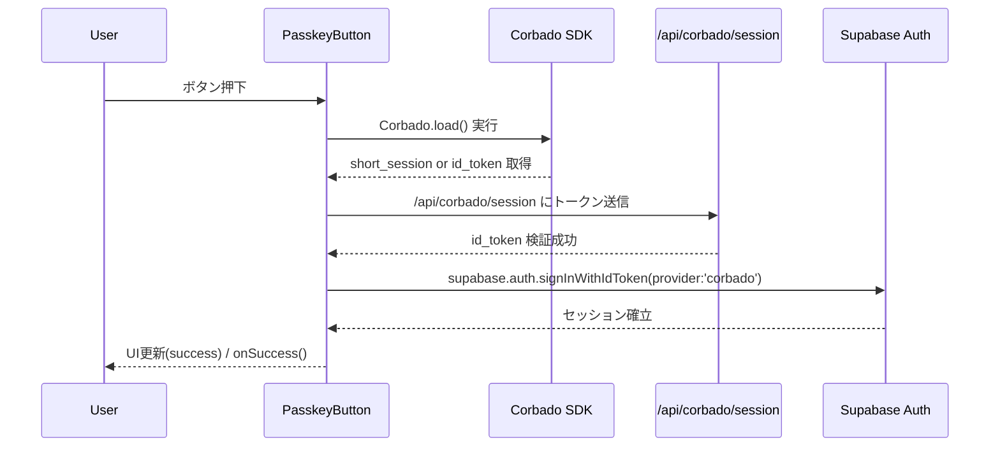

# HarmoNet 詳細設計書 - PasskeyButton (A-02) ch02 機能設計 v1.0

**Document ID:** HARMONET-COMPONENT-A02-PASSKEYBUTTON-CH02
**Version:** 1.0
**Created:** 2025-11-11
**Author:** Tachikoma
**Reviewer:** TKD
**Status:** ✅ Phase9 正式版（技術スタック v4.0 準拠）

---

## 第2章 機能設計

### 2.1 機能要約

PasskeyButton (A-02) は、Corbado SDK によりユーザーが登録済みのパスキーを用いて認証を実行し、Supabase Auth にセッションを確立するコンポーネントである。
MagicLinkForm (A-01) と並列配置され、パスワードレス認証基盤を構成する。UIは共通トーンを保ち、StaticI18nProvider (C-03) 経由で3言語翻訳を提供する。

---

### 2.2 入出力仕様（Props／State／Error構造）

#### 2.2.1 Props 定義

```typescript
export interface PasskeyButtonProps {
  /** TailwindCSSクラス拡張 */
  className?: string;
  /** 認証成功時コールバック */
  onSuccess?: () => void;
  /** 認証失敗時コールバック */
  onError?: (error: PasskeyError) => void;
}
```

#### 2.2.2 State 定義

```typescript
type PasskeyState =
  | 'idle'      // 初期状態
  | 'loading'   // Corbado SDK初期化および認証中
  | 'success'   // Supabaseセッション確立
  | 'error';    // 通信・認証・その他エラー
```

#### 2.2.3 PasskeyError 構造

```typescript
export interface PasskeyError {
  /** エラーコード */
  code: string;
  /** 表示文言（StaticI18nProvider翻訳済み） */
  message: string;
  /** 分類 */
  type: 'error_network' | 'error_denied' | 'error_origin' | 'error_auth' | 'error_unknown';
}
```

---

### 2.3 処理フロー（Mermaid）



---

### 2.4 依存関係設計

| 区分       | モジュール／コンポーネント                      | 用途                                                      |
| -------- | ---------------------------------- | ------------------------------------------------------- |
| 認証SDK    | `@corbado/react` / `@corbado/node` | Passkey UI提供とトークン検証                                     |
| 認証バックエンド | `/api/corbado/session`             | Corbadoセッション検証・Supabase委譲                               |
| 認証連携     | `@supabase/supabase-js`            | `signInWithIdToken` によるセッション生成                          |
| 翻訳       | `StaticI18nProvider (C-03)`        | i18nキー `"auth.passkey.*"`                               |
| 例外制御     | `ErrorHandlerProvider (C-16)`      | UI例外通知・分類                                               |
| UI       | `lucide-react`                     | 状態別アイコン（KeyRound / Loader2 / CheckCircle / AlertCircle） |
| 環境       | `.env`                             | Corbado / Supabase 設定値                                  |

---

### 2.5 コンポーネント構造

```
PasskeyButton
 ├─ <button> （トリガー）
 │   ├─ Loader2（認証中）
 │   ├─ CheckCircle（成功）
 │   ├─ AlertCircle（エラー）
 │   └─ KeyRound（待機中）
 └─ State / Props 管理
```

---

### 2.6 状態遷移設計

| 現在状態    | トリガー    | 遷移先     | 結果               | 備考            |
| ------- | ------- | ------- | ---------------- | ------------- |
| idle    | ボタンクリック | loading | Corbado SDK初期化開始 | -             |
| loading | 認証成功    | success | Supabaseセッション確立  | onSuccess()発火 |
| loading | 通信失敗    | error   | ErrorHandler発火   | onError()通知   |
| error   | 再クリック   | loading | 再試行開始            | -             |

---

### 2.7 UT観点（人間操作に基づく）

| 観点ID | 操作        | 期待結果               | テスト目的                  |
| ---- | --------- | ------------------ | ---------------------- |
| UT01 | ボタン押下     | 認証UI起動             | 正常系動作確認                |
| UT02 | 認証完了      | Supabase セッション確立   | 成功シーケンス確認              |
| UT03 | 通信断       | `error_network` 表示 | 例外ハンドリング検証             |
| UT04 | 認証拒否      | `error_denied` 状態  | Corbadoキャンセル時確認        |
| UT05 | Origin不整合 | `error_origin` 状態  | セキュリティ検証               |
| UT06 | 言語切替      | 表示文言が即時更新          | StaticI18nProvider結合確認 |

---

### 2.8 副作用と再レンダー制御

| 処理         | 実装箇所        | 再レンダー制御                                  | 備考          |
| ---------- | ----------- | ---------------------------------------- | ----------- |
| Corbado初期化 | useCallback | 押下時のみ                                    | Lazyロード構成   |
| Supabase呼出 | useCallback | 依存配列 `[t, supabase, onError, onSuccess]` | 再生成抑止       |
| 状態管理       | useState    | UI状態最小更新                                 | -           |
| 翻訳取得       | useI18n     | Provider単位                               | locale変更時のみ |

---

### 2.9 ChangeLog

| Version | Date       | Summary                                             |
| ------- | ---------- | --------------------------------------------------- |
| 1.0     | 2025-11-11 | 初版。Corbado公式構成準拠、技術スタックv4.0整合版。状態遷移・UT観点・副作用設計を標準化。 |

---

**Document Path:** `/01_docs/04_詳細設計/01_ログイン画面/02_PasskeyButton-detail-design-ch02_v1.0.md`
**Compliance:** harmoNet_detail_design_agenda_standard_v1.0
