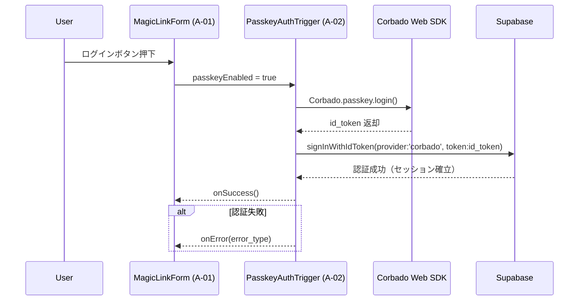

# HarmoNet 詳細設計書 - PasskeyAuthTrigger (A-02) ch01 v1.1

**Document ID:** HARMONET-COMPONENT-A02-PASSKEYAUTHTRIGGER-CH01
**Version:** 1.1
**Created:** 2025-11-12
**Author:** Tachikoma
**Reviewer:** TKD
**Status:** ✅ Phase9 正式版（技術スタック v4.2 / MagicLinkForm統合対応）

---

## 第1章 概要

### 1.1 目的

本章では、HarmoNet ログイン画面における **A-02: PasskeyAuthTrigger** の全体概要を定義する。
本コンポーネントは、従来の「PasskeyButton (A-02)」を置き換え、**MagicLinkForm (A-01)** 内部で動作する **非UI型の認証トリガーロジック** として設計される。
技術スタック v4.2 に準拠し、`Supabase Auth` と `Corbado Web SDK` の統合により、**パスワードレス認証の自動選択処理**を担う。

---

### 1.2 責務

| 項目        | 内容                                                                                                      |
| --------- | ------------------------------------------------------------------------------------------------------- |
| **主目的**   | MagicLinkForm 内で Passkey 認証トリガを実行する非UIロジックの提供                                                           |
| **主要タスク** | Corbado SDK 呼出、Supabase Auth 連携、例外分類通知、結果の MagicLinkForm への委譲                                           |
| **成功時**   | Supabase `signInWithIdToken()` によりセッションを確立し、`onSuccess()` を返す                                           |
| **失敗時**   | ErrorHandlerProvider (C-16) 経由で例外分類 (`error_network`, `error_denied`, `error_origin`, `error_auth`) を通知 |
| **統合範囲**  | MagicLinkForm (A-01) の内部で実行され、UI描画には関与しない                                                               |

---

### 1.3 前提・整合条件

* **フレームワーク:** Next.js 16 / React 19 / TypeScript 5.6
* **認証構成:** Supabase Auth + Corbado Web SDK (`@corbado/web-js` + `@corbado/node`)
* **動作モード:** MagicLinkForm 内から自動実行され、Passkey 利用可否に応じて OTP 認証へフォールバック
* **多言語:** StaticI18nProvider (C-03) による JSON 辞書構成（ja/en/zh）
* **例外処理:** ErrorHandlerProvider (C-16) により例外種別に応じたメッセージ通知
* **データ保護:** Supabase RLS により tenant_id 単位でアクセス制御
* **通信要件:** HTTPS 通信必須、JWT 有効期限 10分、CORS 許可ドメインは harmonet.app のみ

---

## 第2章 コンポーネント概要

### 2.1 構成位置付け

```
LoginPage
 └─ MagicLinkForm (A-01)
      └─ usePasskeyAuthTrigger (A-02)
          ├─ StaticI18nProvider (C-03)
          └─ ErrorHandlerProvider (C-16)
```

PasskeyAuthTrigger は MagicLinkForm 内でフックとして動作し、UI描画を伴わずに非同期処理として認証フローを実行する。
ユーザーが MagicLinkForm のログインボタンを押下した際、内部的に PasskeyAuthTrigger が呼び出され、利用可能な Passkey が存在する場合に自動ログインを実行する。

---

### 2.2 処理概要

1. MagicLinkForm 内で `usePasskeyAuthTrigger()` を呼び出す。
2. Passkey 利用が可能 (`passkeyEnabled = true`) の場合、Corbado SDK をロード。
3. `Corbado.passkey.login()` により WebAuthn 認証を実行。
4. 取得した `id_token` を `Supabase.signInWithIdToken()` に渡し、セッション確立。
5. 成功時は `onSuccess()`、失敗時は `onError(error)` を呼び出す。
6. MagicLinkForm 側で UI 表示を制御（ローディング・完了・再試行表示）。

---

### 2.3 認証フロー（Mermaid）



---

### 2.4 採用技術

| 分類      | 技術 / SDK                            | 用途                           |
| ------- | ----------------------------------- | ---------------------------- |
| フロントエンド | Next.js 16 + React 19               | App Router / Hooks構成         |
| 認証SDK   | Corbado Web SDK (`@corbado/web-js`) | WebAuthn処理実行                 |
| サーバー検証  | Corbado Node SDK (`@corbado/node`)  | `/api/corbado/session` JWT検証 |
| 認証連携    | Supabase Auth (`signInWithIdToken`) | セッション確立                      |
| 国際化     | StaticI18nProvider (C-03)           | 多言語辞書提供                      |
| 例外処理    | ErrorHandlerProvider (C-16)         | 例外捕捉と通知                      |

---

### 2.5 ブラウザ互換性

| ブラウザ    | バージョン | 状態                           |
| ------- | ----- | ---------------------------- |
| Chrome  | 最新安定版 | ✅ 対応                         |
| Edge    | 最新安定版 | ✅ 対応                         |
| Safari  | 17以降  | ⚠️ iCloud Keychain 利用必須      |
| Firefox | 最新    | ⚠️ WebAuthn Level 2 対応（部分実装） |

---

## 第3章 技術構成

### 3.1 環境変数

| 名称                               | 用途                     |
| -------------------------------- | ---------------------- |
| `NEXT_PUBLIC_CORBADO_PROJECT_ID` | Corbado プロジェクト識別子      |
| `CORBADO_API_SECRET`             | Corbado トークン検証シークレットキー |
| `NEXT_PUBLIC_SUPABASE_URL`       | Supabase URL           |
| `NEXT_PUBLIC_SUPABASE_ANON_KEY`  | Supabase 匿名キー          |

### 3.2 データフロー概要

```text
MagicLinkForm ─▶ PasskeyAuthTrigger
    ├─▶ Corbado SDK : WebAuthn 認証
    └─▶ Supabase Auth : IDトークン検証 + セッション確立
```

### 3.3 エラーハンドリング概要

| 種別            | 説明                 | 通知先                  |
| ------------- | ------------------ | -------------------- |
| error_network | 通信断・タイムアウト         | ErrorHandlerProvider |
| error_denied  | ユーザーが認証をキャンセル      | ErrorHandlerProvider |
| error_origin  | RP ID / Origin 不整合 | ErrorHandlerProvider |
| error_auth    | 一般的な認証失敗           | ErrorHandlerProvider |

---

## 第4章 ChangeLog

| Version | Date           | Author              | Summary                                                            |
| ------- | -------------- | ------------------- | ------------------------------------------------------------------ |
| 1.0     | 2025-11-11     | Tachikoma           | 旧 PasskeyButton 構成（UIボタン方式）                                        |
| **1.1** | **2025-11-12** | **Tachikoma / TKD** | **PasskeyAuthTrigger に改名。MagicLinkForm 統合対応・UI削除・技術スタック v4.2 準拠。** |

---

**Document Path:** `/01_docs/04_詳細設計/01_ログイン画面/02_PasskeyAuthTrigger-detail-design/PasskeyAuthTrigger-detail-design_ch01_v1.1.md`
**Compliance:** harmoNet-detail-design-agenda-standard_v1.0
