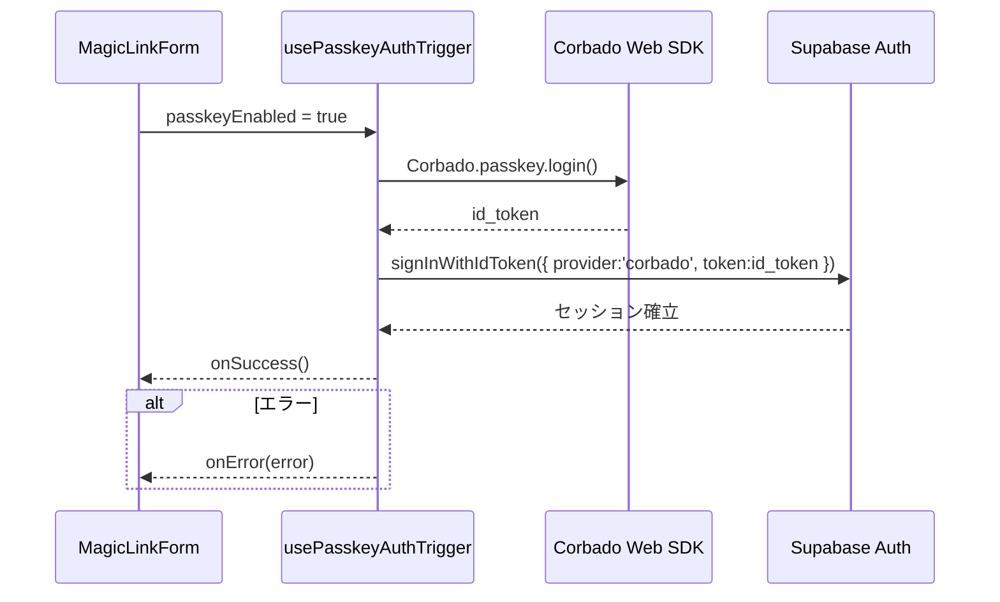

# PasskeyAuthTrigger 詳細設計書 - 第2章：機能設計（v1.2）

**Document ID:** HARMONET-COMPONENT-A02-PASSKEYAUTHTRIGGER-CH02**
**Version:** 1.2
**Supersedes:** v1.1
**Status:** MagicLinkForm v1.2 整合（error.* 体系へ最小限更新）

---

## 2.1 機能要約

PasskeyAuthTrigger (A-02) は MagicLinkForm (A-01) 内で動作する **非UIロジックモジュール** であり、Passkey（Corbado WebAuthn）を使用してセッションを確立する。UI 描画は一切行わず、MagicLinkForm の状態管理・UI表⽰に委譲される。`passkeyEnabled` が有効な場合に自動発火し、MagicLink と Passkey を統合したパスワードレス認証体験を提供する。

---

## 2.2 入出力仕様（Options / Hooks / Error構造）

### 2.2.1 PasskeyAuthTriggerOptions 定義

```ts
export interface PasskeyAuthTriggerOptions {
  passkeyEnabled?: boolean;
  onSuccess?: () => void;
  onError?: (error: PasskeyAuthError) => void;
}
```

### 2.2.2 PasskeyAuthError 構造

```ts
export interface PasskeyAuthError {
  code: string;
  message: string; // StaticI18nProvider による翻訳文言
  type: 'error_network' | 'error_denied' | 'error_origin' | 'error_auth';
}
```

### 2.2.3 フック返却構造

```ts
export interface UsePasskeyAuthTriggerResult {
  execute: () => Promise<void>;
}
```

---

## 2.3 処理フロー（Mermaid）



---

## 2.4 依存関係設計

| 区分    | モジュール                               | 用途                                      |
| ----- | ----------------------------------- | --------------------------------------- |
| 認証SDK | `@corbado/web-js`                   | Passkey 認証の実行                           |
| サーバ検証 | `@corbado/node`                     | `/api/corbado/session` で id_token 検証    |
| 認証基盤  | Supabase Auth (`signInWithIdToken`) | セッション確立                                 |
| 翻訳    | StaticI18nProvider (C-03)           | **i18n：error.* / success.* の最新キー体系を提供** |
| 例外処理  | ErrorHandlerProvider (C-16)         | 分類済みエラー文言を UI に通知                       |
| 呼出元   | MagicLinkForm (A-01)                | フォールバック制御と UI 更新                        |

---

## 2.5 処理仕様概要

1. MagicLinkForm がログイン押下をトリガ。
2. `passkeyEnabled` が true の場合、PasskeyAuthTrigger が起動。
3. Corbado SDK が WebAuthn 認証を実行し、`id_token` を返却。
4. Supabase `signInWithIdToken()` によりセッションを確立。
5. 成功：`onSuccess()` が発火。
6. 失敗：`classifyError()` が例外を分類し、`onError()` を発火。
7. MagicLinkForm 側が UI・状態遷移・文言更新を担当する。

---

## 2.6 状態遷移設計

| 現在状態       | トリガ       | 遷移先        | 結果               | 備考               |
| ---------- | --------- | ---------- | ---------------- | ---------------- |
| idle       | execute() | processing | Corbado SDK 初期化  | Lazy ロード         |
| processing | 成功        | success    | Supabase セッション確立 | onSuccess        |
| processing | 失敗        | error      | エラー分類            | onError          |
| error      | 再試行       | processing | 再実行              | MagicLinkForm側操作 |

---

## 2.7 UT観点（v1.2 整合）

| 観点ID      | 操作                   | 期待結果                    | テスト目的     |
| --------- | -------------------- | ----------------------- | --------- |
| UT-A02-01 | passkeyEnabled=true  | Supabase セッション確立        | 正常確認      |
| UT-A02-02 | passkeyEnabled=false | トリガ未実行                  | フォールバック確認 |
| UT-A02-03 | NotAllowedError      | `error.denied`          | 最新キー体系    |
| UT-A02-04 | OriginMismatch       | `error.origin_mismatch` | セキュリティ確認  |
| UT-A02-05 | 通信断                  | `error.network`         | 通信障害確認    |
| UT-A02-06 | Supabase エラー         | `error.auth`            | 認証失敗処理確認  |

---

## 2.8 副作用と再試行設計

| 処理              | 実装箇所                  | 副作用制御          | 備考       |
| --------------- | --------------------- | -------------- | -------- |
| Corbado SDK 初期化 | usePasskeyAuthTrigger | Lazyロード（実行時のみ） | 再試行可能    |
| Supabase連携      | usePasskeyAuthTrigger | 非同期制御          | 成功時は即時解放 |
| エラー分類           | classifyError         | state リセット     | 再試行前に安定化 |

---

## 2.9 ChangeLog

| Version | Date       | Summary                                            |
| ------- | ---------- | -------------------------------------------------- |
| 1.2     | 2025-11-14 | error.* 体系へ統一。auth.passkey.* の旧表記を削除。UT観点の最新化。     |
| 1.1     | 2025-11-12 | PasskeyAuthTrigger 構成へ変更、非UIロジック化、MagicLinkForm統合。 |
