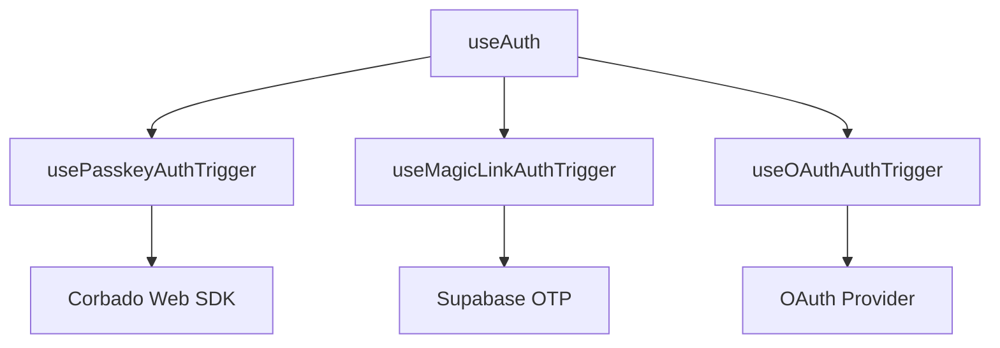

# HarmoNet 詳細設計書 - PasskeyAuthTrigger (A-02) ch09 v1.1

**Document ID:** HARMONET-COMPONENT-A02-PASSKEYAUTHTRIGGER-CH09
**Version:** 1.1
**Created:** 2025-11-12
**Author:** Tachikoma
**Reviewer:** TKD
**Status:** ✅ Phase9 正式版（技術スタック v4.2 / MagicLinkForm 統合対応）

---

## 第9章 将来拡張設計

### 9.1 拡張方針

PasskeyAuthTrigger は、MagicLinkForm 内で動作する非UIロジックモジュールとして設計されており、認証方式の抽象化・拡張を前提としている。
将来的な拡張方針は以下の通り：

1. **責務分離:** 認証トリガ・セッション確立・通知処理を明確に分離。
2. **拡張可能性:** Passkey / MagicLink / OAuth / SSO など複数認証方式を統合管理。
3. **再利用性:** `useAuth()` フックに統合し、アプリ全体から一貫した認証APIとして利用可能にする。
4. **セキュリティ強化:** Corbado / Supabase のバージョン更新に追随しつつ、RLS と JWT管理の厳格化を維持。
5. **自動選択認証:** 利用環境に応じて最適な認証方式（Passkey / OTP / OAuth）を自動選択する仕組みを採用。

---

### 9.2 モジュール構成拡張計画

#### 9.2.1 統合認証Hook群の導入

将来的に `usePasskeyAuthTrigger()`, `useMagicLinkAuthTrigger()`, `useOAuthAuthTrigger()` を抽象化した `useAuth()` フックを導入し、認証方式の差異を吸収する。



#### 9.2.2 Context統合

`AuthProvider` により認証状態と操作関数 (`login`, `logout`, `refreshSession`) をアプリ全体で共有する。

```tsx
<AuthProvider>
  <LoginPage />
  <MyPage />
</AuthProvider>
```

> この構成により、A-01 / A-02 の統合後も API変更なしで拡張認証方式を追加可能とする。

---

### 9.3 拡張ロードマップ

| フェーズ        | 拡張項目            | 概要                                          |
| ----------- | --------------- | ------------------------------------------- |
| **Phase10** | OAuth認証統合       | Google / Apple / LINE連携を追加し、Corbadoと併用可能にする |
| **Phase11** | Passkey共有機能     | デバイス間Passkey共有（FIDO2 Advanced準拠）を実装         |
| **Phase12** | Federated認証     | 管理者ロール専用の外部SSO対応（SAML / OpenID Connect）     |
| **Phase13** | AuthProvider最適化 | Supabase Edge Functions と組み合わせた高速セッション再認証   |

---

### 9.4 テナント分離・ロール別認証拡張

#### 9.4.1 テナント構成の動的切替

各テナントごとに Corbado プロジェクト ID を割当て、Supabase 側の認証キーを動的に紐付ける。
これにより、複数テナント間で安全に認証基盤を分離可能。

```typescript
interface TenantAuthConfig {
  tenant_id: string;
  corbado_project_id: string;
  supabase_ref: string;
}
```

#### 9.4.2 管理者・一般ユーザー分離

管理者アカウントは Corbado の独立プロジェクトで認証を行い、管理テナント専用ダッシュボードへ誘導。
RLS により `role` フィールドを参照してアクセス境界を強制する。

---

### 9.5 セキュリティアップグレード計画

* Corbado SDK v3.x での RP ID / Origin 厳格検証へ対応。
* Supabase `signInWithIdToken` 仕様更新に追随し、デグレ検証を自動化。
* JWT の有効期限を短縮（10 → 5分）し、リフレッシュトークン機構を導入。
* Sentry 連携により、ユーザーID・tenant_id 単位の認証トレースを強化。

---

### 9.6 パフォーマンス最適化構想

| 改善項目       | 概要                               | 対応計画      |
| ---------- | -------------------------------- | --------- |
| **SDK初期化** | `Corbado.load()` の非同期最適化         | Phase10実装 |
| **キャッシュ**  | Supabaseクライアント接続キャッシュ            | Phase10検証 |
| **再描画削減**  | useCallback / useMemo 最適化        | 継続実施      |
| **Edge移行** | 認証APIを Supabase Edge Functions 化 | Phase12構想 |

---

### 9.7 保守・監査方針

* **監査ログ:** Supabase Logs + Sentry で二重監査を実施。
* **SDK更新監視:** Corbado / Supabase のバージョンを月次確認。
* **CI/CD連携:** GitHub Actions + Windsurf 自動UTを継続実行。
* **フェイルオーバー:** Supabase 障害時はローカル開発環境を自動起動しバックアップ認証に切替。
* **ダッシュボード化:** 認証成功率・遷移時間・エラー種別を集計し、月次レポート化。

---

### 9.8 変更管理方針

* HarmoNet 全体の Phase 管理ではなく、**Component単位のVersioning** に移行。
* 各詳細設計書には `Version` と `Supersedes` を明記し、後方互換性を保持。
* Windsurf による `CodeAgent_Report` 出力を QA 証跡として保存。

---

### 9.9 ChangeLog

| Version | Date           | Author              | Summary                                                          |
| ------- | -------------- | ------------------- | ---------------------------------------------------------------- |
| 1.0     | 2025-11-11     | Tachikoma           | 旧 PasskeyButton 構成。UI拡張・ロードマップ中心。                                |
| **1.1** | **2025-11-12** | **Tachikoma / TKD** | **PasskeyAuthTrigger 構成へ改訂。MagicLinkForm 統合・非UI化・認証Hook群構想を反映。** |

---

**Document Path:** `/01_docs/04_詳細設計/01_ログイン画面/02_PasskeyAuthTrigger-detail-design/PasskeyAuthTrigger-detail-design_ch09_v1.1.md`
**Compliance:** harmoNet-detail-design-agenda-standard_v1.0
