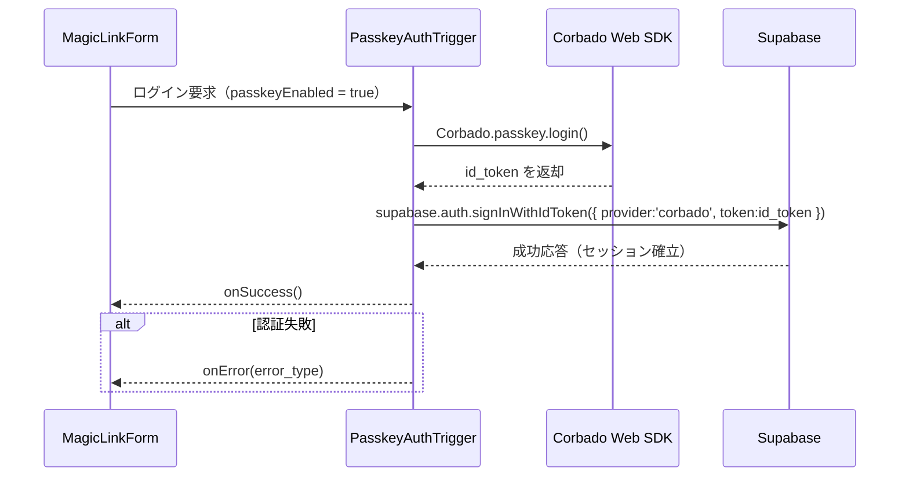

# HarmoNet 詳細設計書 - PasskeyAuthTrigger (A-02) v1.1

**Document ID:** HARMONET-COMPONENT-A02-PASSKEYAUTHTRIGGER
**Version:** 1.1
**Created:** 2025-11-12
**Author:** Tachikoma
**Reviewer:** TKD
**Status:** ✅ Phase9 正式仕様（技術スタック v4.2 対応 / MagicLinkForm統合ロジック）

---

## 第1章 概要

### 1.1 目的

本設計書は、HarmoNet ログイン画面における **A-02: PasskeyAuthTrigger** の詳細設計を定義する。
本コンポーネントは、`MagicLinkForm (A-01)` 内で動作する **Passkey認証トリガーロジック** として設計され、UI要素を持たずに WebAuthn (Corbado) による認証処理を非同期実行する。
技術スタック v4.2 に基づき、`Supabase Auth` と `Corbado Web SDK` を統合し、**パスワードレス認証を自動選択**する構成を担う。

---

### 1.2 責務

| 項目       | 内容                                                                                                      |
| -------- | ------------------------------------------------------------------------------------------------------- |
| **目的**   | Passkeyによる即時ログインをMagicLinkForm内で実行する                                                                    |
| **機能範囲** | Passkey利用判定・Corbado SDK呼出・Supabase Auth連携                                                               |
| **成功時**  | `signInWithIdToken()` により Supabase セッションを確立し、コールバック通知 (`onSuccess()`)                                   |
| **失敗時**  | 例外を分類 (`error_network`, `error_denied`, `error_origin`, `error_auth`) し、ErrorHandlerProvider (C-16) で通知 |
| **統合範囲** | MagicLinkForm (A-01) の内部関数として呼び出されるトリガーロジック                                                             |

---

### 1.3 前提・整合

* **技術基盤:** Next.js 16 / React 19 / TypeScript 5.6 / Tailwind 3.4 / lucide-react
* **認証構成:** Supabase Auth + Corbado Web SDK (`@corbado/web-js` + `@corbado/node`)
* **連携層:** MagicLinkForm (A-01) 経由で呼び出されるロジック関数（UI非依存）
* **多言語:** StaticI18nProvider (C-03) による JSON 辞書 (ja/en/zh)
* **データ境界:** Supabase RLS (tenant_id) により認証トークンがテナント単位で分離

---

## 第2章 機能設計

### 2.1 機能要約

PasskeyAuthTrigger は、MagicLinkForm でログインボタンが押下された際に、自動的に Passkey ログインを試行する。利用可能な Passkey が存在しない場合は即座に OTP 認証にフォールバックする。

### 2.2 入出力仕様

```ts
export interface PasskeyAuthTriggerOptions {
  /** 成功時の通知コールバック */
  onSuccess?: () => void;
  /** 失敗時の通知コールバック */
  onError?: (error: PasskeyAuthError) => void;
  /** Passkey認証を明示的に有効化するか */
  passkeyEnabled?: boolean;
}

export type PasskeyAuthErrorType =
  | 'error_network'
  | 'error_denied'
  | 'error_origin'
  | 'error_auth';

export interface PasskeyAuthError {
  code: string;
  message: string;
  type: PasskeyAuthErrorType;
}
```

* **入力:** passkeyEnabled（boolean）と、イベントハンドラ群。
* **出力:** 成功または失敗をコールバックで通知。

---

### 2.3 処理フロー（Mermaid）



---

### 2.4 副作用・再レンダー設計

| 項目        | 内容                                            |
| --------- | --------------------------------------------- |
| **副作用制御** | SDK初期化は遅延 (`lazy-load`)。`useEffect` による再試行なし。 |
| **状態管理**  | React state非依存。Promiseベースのハンドラロジックとして設計。      |
| **再レンダー** | MagicLinkForm の状態 (`useState`) によってのみUI更新。    |
| **ハンドラ**  | `useCallback` によりメモ化、再作成を防止。                  |

---

### 2.5 UT観点（人間操作ベース）

| 観点ID      | 操作                | 期待結果                | テスト目的     |
| --------- | ----------------- | ------------------- | --------- |
| UT-A02-01 | Passkey利用可状態でログイン | Supabaseセッション確立     | 正常経路確認    |
| UT-A02-02 | NotAllowedError発生 | `error_denied` を返却  | キャンセル動作確認 |
| UT-A02-03 | Origin不整合         | `error_origin` で停止  | セキュリティ検証  |
| UT-A02-04 | ネットワーク断           | `error_network` で通知 | 通信障害処理確認  |
| UT-A02-05 | 失敗後再試行            | 次回成功で onSuccess()   | リカバリ検証    |

---

## 第3章 構造設計

### 3.1 依存関係

```
MagicLinkForm (A-01)
 └─ PasskeyAuthTrigger (A-02)
     ├─ StaticI18nProvider (C-03)
     └─ ErrorHandlerProvider (C-16)
```

### 3.2 関連外部モジュール

| ライブラリ               | 用途                                       |
| ------------------- | ---------------------------------------- |
| `@corbado/web-js`   | Passkey認証の実行 (`Corbado.passkey.login()`) |
| `@corbado/node`     | `/api/corbado/session` にて JWT検証          |
| `@supabase/auth-js` | `signInWithIdToken()` によるセッション確立         |
| `lucide-react`      | 状態に応じたアイコンを MagicLinkForm に継承描画          |

---

## 第4章 実装設計

### 4.1 コード構成

```
src/hooks/auth/usePasskeyAuthTrigger.ts
```

### 4.2 実装例（フロント側）

```ts
import { createClient } from '@/lib/supabase/client';
import Corbado from '@corbado/web-js';
import { useErrorHandler } from '@/components/common/ErrorHandlerProvider';
import { useI18n } from '@/components/common/StaticI18nProvider';

export const usePasskeyAuthTrigger = ({ onSuccess, onError, passkeyEnabled }: PasskeyAuthTriggerOptions) => {
  const supabase = createClient();
  const { t } = useI18n();
  const handleError = useErrorHandler();

  const execute = async (): Promise<void> => {
    if (!passkeyEnabled) return; // MagicLinkへフォールバック
    try {
      await Corbado.load({ projectId: process.env.NEXT_PUBLIC_CORBADO_PROJECT_ID! });
      const result = await Corbado.passkey.login();
      if (!result?.id_token) throw new Error('NO_TOKEN');
      const { error } = await supabase.auth.signInWithIdToken({ provider: 'corbado', token: result.id_token });
      if (error) throw error;
      onSuccess?.();
    } catch (err: any) {
      const error = classifyError(err, t);
      handleError(error.message);
      onError?.(error);
    }
  };
  return { execute };
};

function classifyError(err: any, t: (k:string)=>string): PasskeyAuthError {
  if (err?.name === 'NotAllowedError') return { code: 'NOT_ALLOWED', message: t('error.passkey_denied'), type: 'error_denied' };
  if (String(err?.message || '').includes('ORIGIN')) return { code: 'ORIGIN_MISMATCH', message: t('error.origin_mismatch'), type: 'error_origin' };
  if (String(err?.message || '').includes('NETWORK')) return { code: 'NETWORK', message: t('error.network'), type: 'error_network' };
  return { code: 'AUTH_ERROR', message: t('error.network'), type: 'error_auth' };
}
```

### 4.3 サーバサイド検証 (`/api/corbado/session`)

```ts
import { verify } from '@corbado/node';
import { NextResponse } from 'next/server';

export async function POST(req: Request) {
  try {
    const { token } = await req.json();
    const result = await verify(token, process.env.CORBADO_API_SECRET!);
    if (!result.valid) throw new Error('INVALID_TOKEN');
    return NextResponse.json({ id_token: result.id_token });
  } catch (e) {
    return NextResponse.json({ error: 'verification_failed' }, { status: 400 });
  }
}
```

---

## 第5章 ロジック仕様

| 状態         | 入力イベント | 遷移先        | 備考               |
| ---------- | ------ | ---------- | ---------------- |
| idle       | 実行要求   | processing | 認証開始             |
| processing | 成功     | success    | Supabase セッション確立 |
| processing | 失敗     | error      | 例外分類・通知          |
| error      | 再実行    | processing | 再試行              |

**補足:** MagicLinkForm の State に `passkeyState` を統合して管理することで、UX と状態遷移を共通化する。

---

## 第6章 セキュリティ設計

* HTTPS 通信必須（WebAuthn要件）。
* Corbado SDK は `harmonet.app` の Origin に固定。
* `id_token` はローカル保存せず、セッション確立後即破棄。
* Supabase 側は RLS（tenant_id）でテナント分離。
* CSRF は `SameSite=Lax` Cookie 設定により防止。
* JWT有効期限: 10分。
* Secrets管理: GitHub Actions + Vault により暗号化保護。

---

## 第7章 結合・運用設計

* MagicLinkForm (A-01) から `usePasskeyAuthTrigger()` を呼び出す。
* StaticI18nProvider (C-03) / ErrorHandlerProvider (C-16) と連携。
* Storybook では擬似トリガを用いた認証フロー再現を確認。
* Windsurf での CodeAgent 実装時は `execute()` のテストを対象化。

---

## 第8章 改訂履歴

| Version | Date       | Author          | Summary                                           |
| ------- | ---------- | --------------- | ------------------------------------------------- |
| 1.1     | 2025-11-12 | Tachikoma / TKD | 初版。PasskeyButtonから名称変更。UI非依存ロジック化、技術スタックv4.2準拠構成。 |

---

**Document Status:** ✅ Phase9 Finalized
**ContextKey:** HarmoNet_TechStack_v4_2
