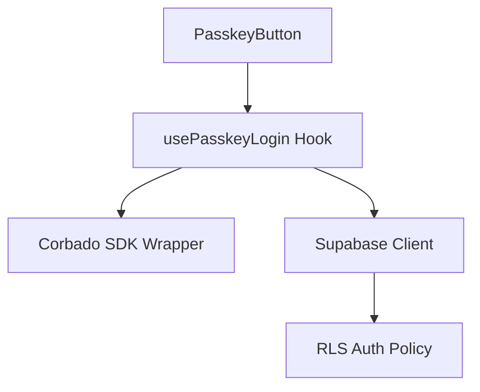

# PasskeyButton 詳細設計書 - 第9章：拡張可能性設計（v1.1 改訂版）

**Document ID:** HARMONET-COMPONENT-A02-PASSKEYBUTTON-CH09  
**Version:** 1.1  
**Updated:** 2025-11-10  
**Based on:** harmonet-technical-stack-definition_v4.0 / PasskeyButton-detail-design_v1.4.md  
**Reviewer:** TKD  
**Status:** Phase9 正式仕様整合版  

---

## 第9章：拡張可能性設計

### 9.1 拡張方針

PasskeyButtonは「Corbado SDK + Supabase連携」に基づく単一責務コンポーネントとして設計されている。  
今後の拡張では以下の原則を維持する：

- **責務分離**：UI／ロジック／外部連携を疎結合化する  
- **API抽象化**：CorbadoやSupabaseの変更をHook層で吸収  
- **国際化とテナント分離**：`StaticI18nProvider` と RLSを利用し多言語・多テナント両立を確保  
- **拡張互換性**：新しい認証方式追加時も既存APIを破壊しない構造を維持  

---

### 9.2 構成分離戦略

#### 9.2.1 Hooks構造の分離
PasskeyButtonは既に `usePasskeyLogin()` Hookを中心に設計されている。  
将来的に `useMagicLinkLogin()` や `useOTPLogin()` を追加し、共通のAuthContextで統合することを想定。



#### 9.2.2 Context統合
`AuthProvider` をアプリ全体に導入し、  
以下のように統合することで一貫性と再利用性を向上させる。

```typescript
<AuthProvider>
  <LoginScreen />
  <MyPage />
</AuthProvider>
```

---

### 9.3 再利用性設計

#### 9.3.1 共通化対象
| 層 | コンポーネント | 共通利用先 |
|----|----------------|------------|
| UI層 | PasskeyButton | Login / MyPage / Admin設定 |
| ロジック層 | usePasskeyLogin | 各ログイン方式共通フック |
| 翻訳層 | StaticI18nProvider | 全画面共通 |

#### 9.3.2 設定パラメータ化
`PasskeyButton` にプロパティ拡張を追加し、以下のような柔軟な利用を可能にする：

```tsx
<PasskeyButton
  variant="admin"
  redirectTo="/dashboard"
  provider="corbado"
/>
```

---

### 9.4 テナント拡張

#### 9.4.1 管理者ロール専用パスキー
Supabase RLSポリシーを活用し、テナント管理者は独立したCorbadoプロジェクトを割当可能とする。  
これによりマルチテナント環境下でも認証データを安全に分離できる。

#### 9.4.2 テナント識別スキーム
```typescript
interface TenantConfig {
  tenant_id: string;
  corbado_project_id: string;
  supabase_project_ref: string;
}
```

これを `AuthProvider` 初期化時に読み込み、認証基盤を動的に切り替える。

---

### 9.5 将来拡張API案

| 認証方式 | 概要 | 実装計画 |
|----------|------|----------|
| **FIDO2 Advanced** | Windows Hello / Touch ID 等ハードウェア連携 | Corbado SDK roadmap対応後 |
| **MagicLink連携** | Corbado + Supabase 共通基盤化 | 実験中 |
| **Passkey Link** | パスキー招待URL共有による家族ログイン | 将来検討 |
| **OAuth Provider対応** | Google / Apple / LINE認証追加 | Phase10候補 |

---

### 9.6 セキュリティアップグレード戦略

- Corbado SDK v3以降でのWebAuthn API拡張を逐次反映  
- Supabase Auth更新時は `signInWithIdToken` の非同期検証処理を再設計  
- JWT有効期限短縮（10分→5分）＋リフレッシュ対応  
- Role別にCorbadoプロジェクトを分離することでRLS負荷軽減  

---

### 🧾 ChangeLog
| Version | Date | Summary |
|----------|------|----------|
| v1.0 | 2025-01-10 | 初版（Storybook複製誤版） |
| v1.1 | 2025-11-10 | 拡張設計章として全面新規作成。Hooks分離・Context統合・RLSテナント構成を反映。 |

---

**文書ステータス:** ✅ Phase9 正式整合版  
**次のアクション:** Final Review 章作成
