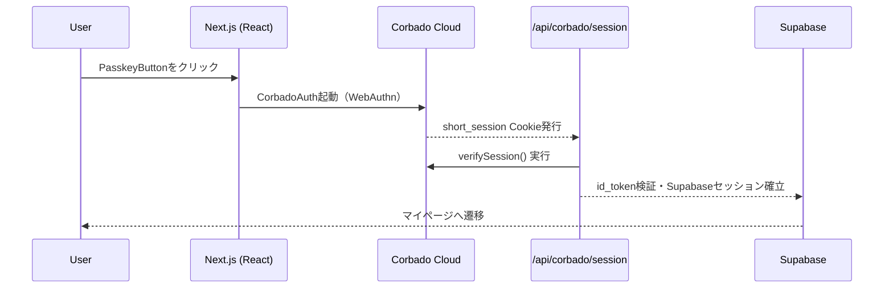

# HarmoNet 詳細設計書 - PasskeyButton (A-02) ch01 概要 v1.0

**Document ID:** HARMONET-COMPONENT-A02-PASSKEYBUTTON-CH01
**Version:** 1.0
**Created:** 2025-11-11
**Author:** Tachikoma
**Reviewer:** TKD
**Status:** ✅ Phase9 正式版

---

## 第1章 概要

### 1.1 目的

本章では、HarmoNet ログイン画面における **PasskeyButton (A-02)** コンポーネントの全体概要を示す。
本コンポーネントは、Corbado Passkey 認証を通じて安全かつパスワードレスなログイン体験を実現し、MagicLinkForm (A-01) と並列して構成される。Phase9 では Corbado 公式構成（@corbado/react + @corbado/node）を採用し、@corbado/web-js 方式は暫定互換モードとして維持する。

### 1.2 責務

| 項目        | 内容                                          |
| --------- | ------------------------------------------- |
| **主目的**   | Passkey（WebAuthn）を使用した認証トリガの提供              |
| **主要タスク** | Corbado 認証処理の呼び出しと Supabase へのセッション委譲       |
| **成功時**   | `signInWithIdToken()` により Supabase セッションを確立 |
| **失敗時**   | ErrorHandlerProvider (C-16) を介して例外を通知       |
| **UI設計**  | MagicLinkForm (A-01) とトーン・i18n構成を統一         |

### 1.3 前提・整合条件

* **フレームワーク:** Next.js 16 / React 19 / TypeScript 5.6
* **UI設計:** HarmoNet Design System v1（BIZ UDゴシック・Appleカタログ風）
* **認証基盤:** Corbado SDK（React + Node構成）
* **データ層:** Supabase Auth v2.43 / PostgreSQL 17 / tenant_idスコープRLS有効
* **国際化:** StaticI18nProvider (C-03) による JSON 辞書構成（ja/en/zh）
* **例外処理:** ErrorHandlerProvider (C-16) を使用

---

## 第2章 コンポーネント概要

### 2.1 コンポーネント位置付け

```
LoginPage
 ├─ MagicLinkForm (A-01)
 └─ PasskeyButton (A-02)
      ├─ StaticI18nProvider (C-03)
      └─ ErrorHandlerProvider (C-16)
```

PasskeyButton は MagicLinkForm と同列に配置され、ユーザーが選択的に Passkey 認証を行うためのボタンとして機能する。

### 2.2 構造上の特徴

* 独立した Stateless UI（入力フィールドを持たない）
* 認証処理は Corbado SDK に完全委譲（フロントではセッション確立のみ）
* Supabase 側との連携は `/api/corbado/session` 経由のトークン交換により実施

### 2.3 対応ブラウザ

| ブラウザ    | バージョン | 状態                          |
| ------- | ----- | --------------------------- |
| Chrome  | 最新安定版 | ✅ 対応                        |
| Edge    | 最新安定版 | ✅ 対応                        |
| Safari  | 17以降  | ⚠️ 一部制限（iCloud Keychain 要件） |
| Firefox | 最新    | ⚠️ 部分対応（WebAuthn Level 2）   |

---

## 第3章 技術構成

### 3.1 採用ライブラリ

| ライブラリ                   | バージョン | 用途                              |
| ----------------------- | ----- | ------------------------------- |
| `@corbado/react`        | ^2.x  | Passkey UI とセッションCookie発行       |
| `@corbado/node`         | ^2.x  | `/api/corbado/session` 内でトークン検証 |
| `@supabase/supabase-js` | ^2.43 | Supabase 認証連携                   |
| `lucide-react`          | 最新    | UI アイコン                         |
| `tailwindcss`           | ^3.4  | HarmoNet スタイル適用                 |
| `next/navigation`       | 内蔵    | ページ遷移制御                         |

### 3.2 環境変数

| 名称                               | 用途                      |
| -------------------------------- | ----------------------- |
| `NEXT_PUBLIC_CORBADO_PROJECT_ID` | Corbado プロジェクト識別子       |
| `CORBADO_API_SECRET`             | Corbado サーバー検証用シークレットキー |
| `NEXT_PUBLIC_SUPABASE_URL`       | Supabase 接続先 URL        |
| `NEXT_PUBLIC_SUPABASE_ANON_KEY`  | Supabase 匿名キー           |

### 3.3 認証フロー概要（Mermaid）



---

## 第4章 UIトーン・設計方針

### 4.1 デザイン指針

* HarmoNet UI統一原則：「やさしく・自然・控えめ」
* Appleカタログ風の余白設計、影・角丸はすべて共通トークン（`rounded-2xl`、`shadow-sm`）
* BIZ UDゴシックをベースフォントとし、英語・中国語も同等比率で表示

### 4.2 状態別スタイル

| 状態      | 背景                       | テキスト         | アイコン          |
| ------- | ------------------------ | ------------ | ------------- |
| idle    | `bg-blue-600`            | `text-white` | `KeyRound`    |
| loading | `bg-blue-600 opacity-80` | `text-white` | `Loader2`     |
| success | `bg-green-600`           | `text-white` | `CheckCircle` |
| error   | `bg-red-600`             | `text-white` | `AlertCircle` |

### 4.3 i18n対応

| キー                      | ja        | en                   | zh       |
| ----------------------- | --------- | -------------------- | -------- |
| `auth.passkey.login`    | パスキーでログイン | Sign in with Passkey | 使用通行密钥登录 |
| `auth.passkey.progress` | 認証中...    | Authenticating...    | 验证中...   |
| `auth.passkey.success`  | ログイン成功    | Login Successful     | 登录成功     |
| `auth.retry`            | 再試行       | Retry                | 重试       |

---

## 第5章 テスト要件概要

### 5.1 UT観点

| ID        | 観点  | 内容          | 期待結果                          |
| --------- | --- | ----------- | ----------------------------- |
| UT-A02-01 | 正常系 | Passkey認証成功 | Supabaseセッション作成               |
| UT-A02-02 | 異常系 | 通信断         | ErrorHandler発火（error_network） |
| UT-A02-03 | 異常系 | ユーザー取消      | ErrorHandler発火（error_denied）  |
| UT-A02-04 | 多言語 | locale切替    | 全文言が即時反映                      |

### 5.2 結合確認

* StaticI18nProvider (C-03) との i18n 結合確認
* ErrorHandlerProvider (C-16) 経由で例外 UI 確認
* Corbado SDK → `/api/corbado/session` → Supabase の通信完了確認

---

## 第6章 ChangeLog

| Version | Date       | Author    | Summary                                     |
| ------- | ---------- | --------- | ------------------------------------------- |
| 1.0     | 2025-11-11 | Tachikoma | 初版。Corbado公式構成採用、web-js互換モード維持。A-01とのUX統一化。 |

---

**Document Path:** `/01_docs/04_詳細設計/01_ログイン画面/02_PasskeyButton-detail-design-ch01_v1.0.md`
**Compliance:** harmoNet_detail_design_agenda_standard_v1.0
