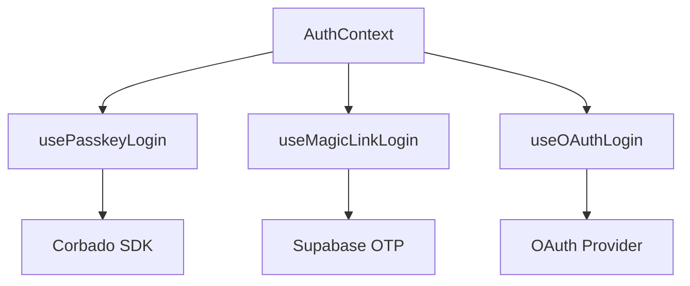

# HarmoNet 詳細設計書 - PasskeyButton (A-02) ch09 将来拡張設計 v1.0

**Document ID:** HARMONET-COMPONENT-A02-PASSKEYBUTTON-CH09
**Version:** 1.0
**Created:** 2025-11-11
**Author:** Tachikoma
**Reviewer:** TKD
**Status:** ✅ Phase9 正式版（技術スタック v4.0 / アジェンダ標準準拠）

---

## 第9章 将来拡張設計

### 9.1 拡張方針

PasskeyButton は「Corbado SDK + Supabase 認証連携」を前提に設計された単一責務コンポーネントである。今後の拡張では以下を原則とする。

1. **責務分離**：UI／ロジック／外部API連携をモジュール単位に分離。
2. **互換性維持**：SDK変更や認証方式追加時も既存実装を破壊しない。
3. **再利用性向上**：Hooks／Context層による抽象化を継続。
4. **多テナント整合**：RLSポリシーおよび `tenant_id` ベースの安全な境界維持。
5. **多言語・多ロール対応**：`StaticI18nProvider` による多言語切替を継続し、管理者・一般ユーザーで異なる認証エクスペリエンスを提供。

---

### 9.2 モジュール分離戦略

#### 9.2.1 Hook層分離

将来的に `usePasskeyLogin()`, `useMagicLinkLogin()`, `useOAuthLogin()` などを統合する認証Hook群を想定する。これにより、認証方式追加時の影響範囲を最小化できる。



#### 9.2.2 Context統合

`AuthProvider` により認証状態と操作関数を全画面へ配布。
`useAuth()` フックから認証状態・ユーザー情報を参照可能にする。

```tsx
<AuthProvider>
  <LoginScreen />
  <MyPage />
</AuthProvider>
```

---

### 9.3 再利用性強化

#### 9.3.1 共通化範囲

| 層     | コンポーネント／モジュール        | 利用先                  |
| ----- | -------------------- | -------------------- |
| UI    | PasskeyButton        | Login／MyPage／Admin設定 |
| ロジック  | usePasskeyLogin      | 認証方式共通処理             |
| 翻訳    | StaticI18nProvider   | 全画面共通                |
| エラー制御 | ErrorHandlerProvider | 全体例外通知               |

#### 9.3.2 柔軟な設定パラメータ化

将来的にパラメータ化により、画面別・ロール別の動作を切替可能とする。

```tsx
<PasskeyButton
  variant="admin"
  redirectTo="/dashboard"
  provider="corbado"
/>
```

---

### 9.4 テナント／ロール拡張

#### 9.4.1 テナント識別と設定分離

各テナントごとに Corbado プロジェクト ID を割当て、Supabase 側の認証キーと動的に紐付ける構成とする。

```ts
interface TenantConfig {
  tenant_id: string;
  corbado_project_id: string;
  supabase_project_ref: string;
}
```

> この設定は AuthProvider 初期化時にロードされ、`tenant_id` ごとに認証基盤を切替える。

#### 9.4.2 管理者専用認証

RLSポリシーにより管理者ロールは別の Corbado プロジェクトで認証可能とし、管理テナント分離を強化する。

---

### 9.5 拡張API・認証方式ロードマップ

| 認証方式                 | 概要                         | 実装計画                  |
| -------------------- | -------------------------- | --------------------- |
| **FIDO2 Advanced**   | Windows Hello / Touch ID対応 | Corbado SDK roadmap準拠 |
| **MagicLink Hybrid** | Corbado＋Supabase統合認証       | Phase10以降検証           |
| **Passkey Sharing**  | 家族・複数端末共有用                 | Phase11構想             |
| **OAuth Provider**   | Google / Apple / LINE連携    | Phase10実装候補           |

---

### 9.6 セキュリティアップグレード方針

* Corbado SDK v3 以降の WebAuthn 機能に追随（RP ID / Origin検証強化）。
* Supabase Auth 更新時に `signInWithIdToken` 呼出仕様を自動検証する。
* JWT 有効期限を 10分 → 5分へ短縮し、リフレッシュAPIを導入。
* ロール別Corbadoプロジェクト分離による認証負荷分散。
* Sentry連携により認証ログをトレース（user_id／tenant_id 単位）。

---

### 9.7 パフォーマンス／UX改善検討

| 改善項目        | 概要                         | 計画        |
| ----------- | -------------------------- | --------- |
| SDK初期化遅延    | Corbado.load() の遅延読込       | Phase10実装 |
| Prefetch最適化 | Supabaseクライアントキャッシュ化       | Phase10検証 |
| 再描画削減       | `useMemo`／`useCallback`最適化 | 継続対応      |
| ボタン応答速度     | クリック→UI反応まで100ms以内         | 定量指標維持    |

---

### 9.8 保守・監査方針

* **監査ログ**: Supabase Logs + Sentry で二重記録。
* **SDKバージョン監視**: 月次確認（Corbado / Supabase）。
* **CI/CDテスト**: GitHub Actions + Playwright。
* **設定バックアップ**: `tenant_config.json` を日次バックアップ。
* **フェイルオーバー**: Supabase Cloud 障害時はローカル開発環境へ自動切替。

---

### 9.9 ChangeLog

| Version | Date       | Author    | Summary                                           |
| ------- | ---------- | --------- | ------------------------------------------------- |
| 1.0     | 2025-11-11 | Tachikoma | 初版。Hooks/Context拡張・RLS連携・Corbadoロードマップ対応・保守方針を定義。 |

---

**Document Path:** `/01_docs/04_詳細設計/01_ログイン画面/02_PasskeyButton-detail-design-ch09_v1.0.md`
**Compliance:** harmoNet_detail_design_agenda_standard_v1.0
