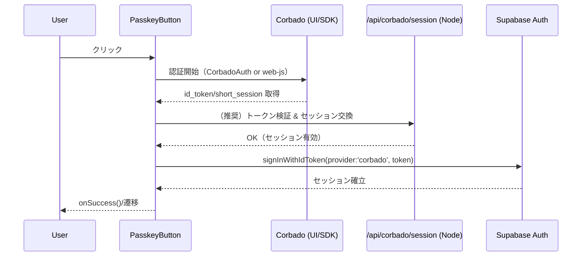

# HarmoNet 詳細設計書 - PasskeyButton (A-02) v1.0

**Document ID:** HARMONET-COMPONENT-A02-PASSKEYBUTTON
**Version:** 1.0
**Created:** 2025-11-11
**Author:** Tachikoma
**Reviewer:** TKD
**Status:** ✅ Phase9 正式仕様（Next.js 16 / React 19 / Supabase v2.43 / Corbado SDK整合版 / 技術スタックv4.0準拠）

---

## 第1章 概要

### 1.1 目的

本設計書は、HarmoNet ログイン画面における **A-02: PasskeyButton** の詳細設計を定義する。
本コンポーネントは **Corbado Passkey（WebAuthn）** によりワンタップ認証を実行し、成功時に **Supabase Auth** へセッションを委譲する。A-01: MagicLinkForm と並列配置し、**パスワードレス（MagicLink + Passkey）** の UX を確立する。

### 1.2 責務

| 項目   | 内容                                                           |
| ---- | ------------------------------------------------------------ |
| 目的   | 登録済みパスキーでのログイン開始・完了処理                                        |
| 成功時  | Supabase の `signInWithIdToken()` でセッション確立、`onSuccess()` 通知   |
| 失敗時  | 例外を分類し ErrorHandlerProvider (C-16) でユーザーに通知、`onError(e)` を発火 |
| UI統一 | MagicLinkForm と同一トーン・スタイル・i18nキー体系                           |

### 1.3 前提・整合

* **技術基盤:** Next.js 16 / React 19 / TypeScript 5.6 / Tailwind 3.4 / lucide-react
* **認証構成:** 技術スタック v4.0 に従い、**Corbado公式構成（@corbado/react + @corbado/node）** を第一候補とし、暫定で **@corbado/web-js** も許容（切替フラグで選択）。
* **多言語:** StaticI18nProvider (C-03) による JSON 辞書（ja/en/zh）。
* **データ境界:** Supabase RLS（tenant_id）。

---

## 第2章 機能設計

### 2.1 機能要約

* ユーザーがボタンを押下 → Corbado UI/SDK が WebAuthn 認証 → **id_token / session** を取得 → Supabase に連携 → マイページへ遷移（または親でハンドリング）。

### 2.2 入出力仕様（Props / Context / Hooks）

```ts
export interface PasskeyButtonProps {
  className?: string;
  /** 認証完了（Supabase セッション確立後） */
  onSuccess?: () => void;
  /** 失敗時通知（分類済み） */
  onError?: (error: PasskeyError) => void;
}

export type PasskeyErrorType =
  | 'error_network'      // 通信断・タイムアウト
  | 'error_denied'       // ユーザー取消・NotAllowedError
  | 'error_origin'       // RP ID / Origin 不整合
  | 'error_auth'         // 認証失敗（一般）
  | 'error_unknown';     // その他

export interface PasskeyError {
  code: string;          // 例: NOT_ALLOWED, ORIGIN_MISMATCH, NETWORK
  message: string;       // i18n 済み文言
  type: PasskeyErrorType;
}
```

* **Context:**

  * `useI18n()`（C-03）: i18n 取得。
  * `useErrorHandler()`（C-16）: 例外メッセージ表示・ロギング委譲。

### 2.3 処理フロー（Mermaid）



### 2.4 依存関係（内部/外部）

| 種別 | 名称                          | 用途                                           |
| -- | --------------------------- | -------------------------------------------- |
| 内部 | StaticI18nProvider (C-03)   | 文言取得（`t()`）                                  |
| 内部 | ErrorHandlerProvider (C-16) | 例外表示・分類                                      |
| 外部 | @corbado/react（推奨）          | `<CorbadoProvider/>` と `<CorbadoAuth/>`      |
| 外部 | @corbado/node（推奨）           | `/api/corbado/session` で JWT 検証              |
| 外部 | @corbado/web-js（暫定）         | `Corbado.load()` → `Corbado.passkey.login()` |
| 外部 | @supabase/auth-js v2        | `signInWithIdToken()`                        |

### 2.5 副作用・再レンダー設計

* 認証トリガは `onClick`。SDK 初期化は **Lazy**（押下時）。
* 状態は `idle → loading → success|error`。不要再描画は `useCallback` で抑制。

### 2.6 人間操作に基づくUT観点（最小セット）

| 観点ID | 操作      | 期待結果               | テスト目的          |
| ---- | ------- | ------------------ | -------------- |
| UT01 | 正常押下    | Supabase セッション確立   | 基本成功動作         |
| UT02 | 取消      | `error_denied` 表示  | NotAllowed 系対処 |
| UT03 | 断線      | `error_network` 表示 | 回線障害時 UI       |
| UT04 | i18n 切替 | 全文言が即時切替           | C-03 結合確認      |
| UT05 | 再試行     | エラー後成功             | リカバリ動作         |

---

## 第3章 構造設計

### 3.1 コンポーネント構成図

```
LoginPage
 ├─ MagicLinkForm (A-01)
 └─ PasskeyButton (A-02)
      ├─ StaticI18nProvider (C-03)
      └─ ErrorHandlerProvider (C-16)
```

### 3.2 Props定義と制約

| Prop      | 必須 | 型                      | 既定 | 説明          |
| --------- | -: | ---------------------- | -- | ----------- |
| className |  - | string                 | '' | Tailwind 拡張 |
| onSuccess |  - | () => void             | -  | 完了通知        |
| onError   |  - | (e:PasskeyError)=>void | -  | 失敗通知        |

### 3.3 i18n キー仕様

| キー                      | 用途   | 既定文（ja）          |
| ----------------------- | ---- | ---------------- |
| `auth.passkey.login`    | 初期表示 | パスキーでログイン        |
| `auth.passkey.progress` | 処理中  | 認証中…             |
| `auth.passkey.success`  | 成功   | ログイン成功           |
| `auth.retry`            | 再試行  | 再試行              |
| `error.network`         | エラー  | ネットワークエラーが発生しました |
| `error.origin_mismatch` | エラー  | セキュリティ検証に失敗しました  |
| `error.passkey_denied`  | エラー  | 認証がキャンセルされました    |

---

## 第4章 実装設計

### 4.1 ディレクトリ

```
src/components/auth/PasskeyButton/
 ├─ PasskeyButton.tsx
 ├─ PasskeyButton.types.ts
 ├─ PasskeyButton.test.tsx
 └─ index.ts
```

### 4.2 実装（推奨: Corbado公式構成）

```tsx
'use client';
import { useState, useCallback } from 'react';
import { createClient } from '@/lib/supabase/client';
import { useI18n } from '@/components/common/StaticI18nProvider';
import { useErrorHandler } from '@/components/common/ErrorHandlerProvider';
import { KeyRound, Loader2, CheckCircle, AlertCircle } from 'lucide-react';

export type PasskeyState = 'idle'|'loading'|'success'|'error';

export const PasskeyButton: React.FC<PasskeyButtonProps> = ({ className='', onSuccess, onError }) => {
  const [state, setState] = useState<PasskeyState>('idle');
  const { t } = useI18n();
  const supabase = createClient();
  const notifyError = useErrorHandler();

  const openCorbadoAndLogin = useCallback(async () => {
    try {
      setState('loading');
      // 方式A: CorbadoAuth を別画面/モーダルで開く（Provider 配下に実装）
      // - 認証完了後に short_session / id_token を back/API で検証
      const token = await fetch('/api/corbado/session', { method: 'POST' })
        .then(r => r.ok ? r.text() : Promise.reject(new Error('CORBADO_SESSION_ERROR')));

      const { error } = await supabase.auth.signInWithIdToken({ provider: 'corbado', token });
      if (error) throw error;

      setState('success');
      onSuccess?.();
    } catch (err: any) {
      const e: PasskeyError = classifyError(err, t);
      setState('error');
      notifyError(e.message);
      onError?.(e);
    }
  }, [supabase, t, notifyError, onSuccess, onError]);

  return (
    <button
      type="button"
      onClick={openCorbadoAndLogin}
      className={`w-full h-12 rounded-2xl bg-blue-600 text-white font-medium flex items-center justify-center gap-2 hover:bg-blue-500 disabled:opacity-60 transition ${className}`}
      disabled={state === 'loading'}
      aria-live="polite"
    >
      {state === 'loading' && <Loader2 className="animate-spin" aria-hidden />}
      {state === 'success' && <CheckCircle aria-hidden />}
      {state === 'error' && <AlertCircle aria-hidden />}
      {state === 'idle' && <KeyRound aria-hidden />}
      <span>
        {state === 'success' ? t('auth.passkey.success')
          : state === 'loading' ? t('auth.passkey.progress')
          : state === 'error' ? t('auth.retry')
          : t('auth.passkey.login')}
      </span>
    </button>
  );
};

function classifyError(err: any, t: (k:string)=>string): PasskeyError {
  if (err?.name === 'NotAllowedError') {
    return { code: 'NOT_ALLOWED', message: t('error.passkey_denied'), type: 'error_denied' };
  }
  if (String(err?.message || '').includes('ORIGIN')) {
    return { code: 'ORIGIN_MISMATCH', message: t('error.origin_mismatch'), type: 'error_origin' };
  }
  if (String(err?.message || '').includes('NETWORK') || err?.code === 'ECONNABORTED') {
    return { code: 'NETWORK', message: t('error.network'), type: 'error_network' };
  }
  return { code: 'AUTH_ERROR', message: t('error.network'), type: 'error_auth' };
}
```

> **備考**: 方式B（暫定）として `@corbado/web-js` を使う場合は `Corbado.load({projectId}) → Corbado.passkey.login()` で `id_token` を取り、同様に `signInWithIdToken()` へ委譲する。実装はフラグ切替（`NEXT_PUBLIC_AUTH_DRIVER=corbado-react|web-js`）。

### 4.3 `/api/corbado/session`（参考サーバ設計）

* 役割: Corbado の短期セッション / JWT を **@corbado/node** で検証した上で、フロントへ安全にトークンを返却。
* 入力: Cookie `cbo_short_session` or フロントから受け取った token。
* 出力: Supabase へ連携可能な `id_token`（検証済み）。

### 4.4 エラーハンドリング設計

* 例外を `classifyError()` で **ネットワーク/拒否/Origin/一般** に分類し、C-16 のトースト/バナーを発火。
* 監査: Sentry（将来） + Supabase Logs。

### 4.5 セキュリティ仕様

* HTTPS 必須、**RP ID / Origin 固定**（Corbado Console）。
* Token は **短寿命**。localStorage 保管を禁止。必要な時に都度交換。
* Supabase 側は RLS 有効、テナント境界は JWT クレームで評価。
* CSRF: 認証は RESTless + SameSite=Lax のセッション基盤により影響低。

### 4.6 パフォーマンス設計

* SDK 初期化は遅延。State 更新範囲を最小化。アイコンは軽量な lucide-react。

---

## 第5章 UI仕様

### 5.1 JSX 構造

```
<button>
  <Icon/> <span>ラベル</span>
</button>
```

### 5.2 スタイリング（Tailwind）

| 項目   | 値                                            |
| ---- | -------------------------------------------- |
| 高さ   | 48px（`h-12`）                                 |
| 幅    | `w-full`                                     |
| 角丸   | `rounded-2xl`                                |
| 影    | `shadow-sm`                                  |
| 配色   | `bg-blue-600 hover:bg-blue-500` / text-white |
| フォント | BIZ UD ゴシック（全体基準）                            |

### 5.3 状態別 UI

| 状態      | アイコン             | ラベル                     |
| ------- | ---------------- | ----------------------- |
| idle    | KeyRound         | `auth.passkey.login`    |
| loading | Loader2(animate) | `auth.passkey.progress` |
| success | CheckCircle      | `auth.passkey.success`  |
| error   | AlertCircle      | `auth.retry`            |

### 5.4 アクセシビリティ

* `aria-live="polite"`、アイコンには `aria-hidden`。
* キーボード操作: Space/Enter でトリガ。フォーカス可視化はブラウザ既定 + Tailwind ring を親が提供。

---

## 第6章 ロジック仕様

### 6.1 状態遷移表

| 現在      | 入力   | 遷移      | 備考               |
| ------- | ---- | ------- | ---------------- |
| idle    | クリック | loading | 認証開始             |
| loading | 成功   | success | Supabase セッション確立 |
| loading | 失敗   | error   | 分類 → 通知          |
| error   | クリック | loading | 再試行              |

### 6.2 例外分類と再試行

* `NotAllowedError` → `error_denied`。ユーザーが再押下で回復。
* Origin 不整合 → 事前設定修正（運用対処）。
* ネットワーク → リトライ誘導。指数バックオフは不要（単発操作）。

### 6.3 成功時処理

* `onSuccess?.()` を発火。親（LoginPage）で `/mypage` 遷移または復帰先に遷移。

---

## 第7章 結合・運用

### 7.1 他コンポーネント結合

* **A-01 MagicLinkForm** と縦スタック配置。
* **C-03 StaticI18nProvider** 配下で `t()` を使用。
* **C-16 ErrorHandlerProvider** と結合して通知一元化。

### 7.2 環境変数

| 変数                               | 用途                       |
| -------------------------------- | ------------------------ |
| `NEXT_PUBLIC_CORBADO_PROJECT_ID` | Corbado Project ID（フロント） |
| `CORBADO_API_SECRET`             | Corbado API Secret（サーバ）  |
| `NEXT_PUBLIC_SUPABASE_URL`       | Supabase URL             |
| `NEXT_PUBLIC_SUPABASE_ANON_KEY`  | Supabase 匿名キー            |

### 7.3 Storybook / Jest / E2E

* **Storybook:** `Idle / Loading / Success / Error` 4状態。
* **UT:** 6章・2.6節の観点に対応。
* **E2E:** 認証モックで UI 遷移のみに限定。

### 7.4 リスク・制約

* ブラウザ差異（Safari WebAuthn 実装差）に留意。
* Corbado SDK のメジャー更新時は回帰テスト必須。

---

## 第8章 メタ情報

### 8.1 用語

* **Passkey:** FIDO2/WebAuthn の一般名称。
* **RP ID:** Relying Party 識別子（Origin 検証）。

### 8.2 関連資料

* A-01: MagicLinkForm 詳細設計（v1.0）
* C-03: StaticI18nProvider 詳細設計（v1.0）
* 技術スタック定義書 v4.0（Corbado公式構成移行）

### 8.3 ChangeLog

| Version | Date       | Author    | Summary                                                    |
| ------- | ---------- | --------- | ---------------------------------------------------------- |
| 1.0     | 2025-11-11 | Tachikoma | 初版。Corbado公式構成（react+node）準拠。web-js 方式は暫定バックアップとして切替可能に設計。 |
