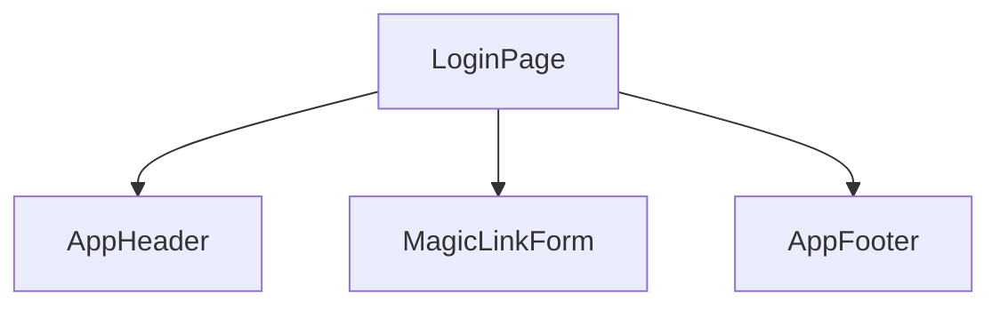

# HarmoNet 詳細設計書 - LoginPage (A-00) v1.4

**Document ID:** HARMONET-COMPONENT-A00-LOGINPAGE-DESIGN
**Version:** 1.4
**Supersedes:** v1.3
**Created:** 2025-11-11
**Updated:** 2025-11-19
**Author:** Tachikoma
**Reviewer:** TKD
**Status:** 

---

# 第1章 概要

## 1.1 目的

LoginPage (A-00) は HarmoNet の **ログイン画面トップレベルページ** であり、
画面上部 AppHeader、画面中央 MagicLinkForm、画面下部 AppFooter の 3 構成で実装される。

## 1.2 スコープ

* **対象コンポーネント:** `app/login/page.tsx`
* **対象 UI:** MagicLinkForm の親コンテナとしての LoginPage
* **対象外:** 認証ロジック（A-01 MagicLinkForm が保持）

## 1.3 前提条件

* 技術スタック v*.*
* A1 Login Screen Basic Design v*.*
* MagicLinkForm Detailed Design v*.*
* 公式ディレクトリ規則 v*.*

---

# 第2章 機能設計

## 2.1 機能要約

LoginPage の責務は **レイアウトのみ**：

* AppHeader（C-01）配置
* MagicLinkForm（A-01）配置
* AppFooter（C-04）配置
* 認証処理は一切保持しない

## 2.2 入出力仕様

| 種別 | 内容                                  |
| -- | ----------------------------------- |
| 入力 | URL `/login`                        |
| 入力 | i18n locale                         |
| 出力 | UI（Header / MagicLinkForm / Footer） |
| 委譲 | MagicLink ログイン処理 → A-01             |

## 2.3 画面構成

```
AppHeader
 └─ MagicLinkForm（中央 max-w-md）
AppFooter
```

※ Passkey UI なし。

## 2.4 非機能要件との関係

* 初期表示 3 秒以内（NFR）
* UI 応答良好
* 認証安全性は MagicLinkForm と Supabase Auth に委譲

## 2.5 副作用・再レンダー

* LoginPage 自体は **Pure Component**
* 再レンダーは locale 変更時のみ
* MagicLinkForm の状態変化は子コンポーネント内完結

## 2.6 UT 観点（LoginPage）

| 観点ID      | 内容                     |
| --------- | ---------------------- |
| UT-A00-01 | Header / Footer が表示される |
| UT-A00-02 | MagicLinkForm が描画される   |
| UT-A00-03 | i18n 切替で必要部分のみ更新される    |
| UT-A00-04 | レスポンシブ（中央に max-w-md）   |

---

# 第3章 構造設計

## 3.1 コンポーネント構成



## 3.2 依存関係

| Component     | 説明                    |
| ------------- | --------------------- |
| AppHeader     | 画面上部共通領域              |
| MagicLinkForm | メール入力＋MagicLink 送信 UI |
| AppFooter     | 固定フッター（コピーライト）        |

## 3.3 レイアウト構造

```tsx
<main className="min-h-screen flex flex-col bg-white">
  <AppHeader />
  <div className="flex-1 flex items-center justify-center px-4 py-8">
    <section className="w-full max-w-md">
      <MagicLinkForm />
    </section>
  </div>
  <AppFooter />
</main>
```

## 3.4 依存ライブラリ

* react
* next
* StaticI18nProvider

---

# 第4章 実装設計

## 4.1 ファイル配置

```
app/
  login/
    page.tsx
```

## 4.2 コード例

```tsx
'use client';
import React from 'react';
import { AppHeader } from '@/src/components/common/AppHeader/AppHeader';
import { AppFooter } from '@/src/components/common/AppFooter/AppFooter';
import { MagicLinkForm } from '@/src/components/auth/MagicLinkForm/MagicLinkForm';

const LoginPage: React.FC = () => {
  return (
    <main className="min-h-screen flex flex-col bg-white">
      <AppHeader />
      <div className="flex-1 flex items-center justify-center px-4 py-8">
        <section className="w-full max-w-md">
          <MagicLinkForm />
        </section>
      </div>
      <AppFooter />
    </main>
  );
};
export default LoginPage;
```

## 4.3 i18n

* layout.tsx に StaticI18nProvider を配置
* LoginPage 自身は文言を持たない（翻訳非対象）

## 4.4 アクセシビリティ

* `<main>` / `<header>` / `<footer>` を適切に使用
* MagicLinkForm が ARIA 対応

---

# 第5章 UI仕様（概要）

## 5.1 レイアウト

* Header → Content → Footer の縦並び
* 中央のフォームは max-w-md

## 5.2 スタイル

* 背景：`bg-white`
* 余白：`px-4 py-8`
* モバイル最適化

## 5.3 メッセージ表示位置

* すべて MagicLinkForm 内で表示

## 5.4 レスポンシブ

* 360px 幅で中央寄せ表示

---

# 第6章 ロジック仕様

## 6.1 状態管理

* LoginPage は state を持たない
* MagicLinkForm にすべて委譲

## 6.2 イベントフロー

1. `/login` にアクセス
2. LoginPage レンダリング
3. ユーザー操作（メール入力＋送信）は MagicLinkForm で処理
4. LoginPage は介在しない

## 6.3 エラー処理

* LoginPage は保持ゼロ
* MagicLinkForm がすべて処理

## 6.4 ログ

* LoginPage はログ非対象
* MagicLinkForm が処理単位で共通ログユーティリティを使用

---

# 第7章 テスト設計

## 7.1 単体テスト

* Header / Footer / MagicLinkForm の存在確認
* レイアウトの snapshot
* i18n 切替時の再レンダー確認

## 7.2 Storybook

* Default（ja）
* LocaleEn
* Mobile

## 7.3 結合テスト

* `/login` → MagicLink → `/auth/callback` のフローは別タスクで E2E

---

# 第8章 メタ情報

## 8.1 用語定義

* LoginPage：ログイン画面親コンポーネント
* MagicLink：メール OTP 認証
* A1：ログイン画面基本設計
* C-01/C-04：共通部品

## 8.2 関連資料

* A1 Login Screen Basic Design v*.*
* MagicLinkForm Detailed Design v*.*
* 技術スタック定義 v*.*
* 公式ディレクトリ構成 v*.*

## 8.3 ChangeLog

| Version | Summary                                       |
| ------- | --------------------------------------------- |
| v1.4    | MagicLink専用／Passkey完全廃止。実装済み LoginPage に完全整合。 |
| v1.3    | 旧仕様（MagicLink＋Passkey）版                       |

---

**End of Document**
