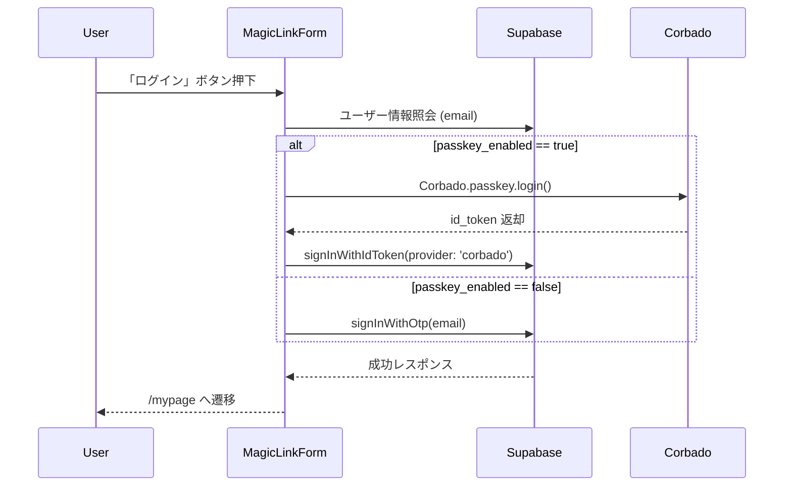

# HarmoNet 詳細設計書 - MagicLinkForm (A-01) v1.1

**Document ID:** HARMONET-COMPONENT-A01-MAGICLINKFORM-DESIGN
**Version:** 1.1
**Supersedes:** v1.0（Phase9初版）
**Created:** 2025-11-12
**Author:** Tachikoma
**Reviewer:** TKD
**Status:** ✅ 承認提案版（Passkey自動統合対応・正式11章構成）

---

## 第1章 概要

### 1.1 目的

本設計書は、HarmoNetログイン画面における **A-01: MagicLinkForm** の詳細設計を定義する。
v1.1では、**A-02 PasskeyButton** を廃止し、MagicLinkForm 内にパスキー自動判定機能を統合することで、より自然でシームレスなUXを実現する。ユーザーは1つの「ログイン」ボタンのみで、MagicLinkとPasskeyの両方式が自動切替される。

### 1.2 責務

| 項目       | 内容                                                                                     |
| -------- | -------------------------------------------------------------------------------------- |
| **目的**   | メールアドレス入力フォームからMagicLink送信またはPasskey認証を実行                                              |
| **依存**   | Supabase Auth (`signInWithOtp` / `signInWithIdToken`), Corbado SDK, StaticI18nProvider |
| **成功時**  | セッション確立後 `/mypage` に遷移                                                                 |
| **失敗時**  | ネットワーク・認証・入力エラーを状態遷移でハンドリング                                                            |
| **UI統一** | Apple風ミニマル構成。ボタン1つに統合。                                                                 |

---

## 第2章 機能設計

### 2.1 Props仕様

```ts
export interface MagicLinkFormProps {
  className?: string;
  onSent?: () => void;
  onError?: (error: MagicLinkError) => void;
  passkeyEnabled?: boolean;
}

export interface MagicLinkError {
  code: string;
  message: string;
  type: 'error_invalid' | 'error_network' | 'error_auth';
}
```

### 2.2 State仕様

| 状態            | 説明              |
| ------------- | --------------- |
| idle          | 初期状態            |
| sending       | APIリクエスト中       |
| sent          | MagicLink送信成功   |
| passkey_auth  | Passkey認証処理中    |
| success       | 認証完了（いずれの方式も成功） |
| error_invalid | 入力不正            |
| error_network | 通信・API失敗        |
| error_auth    | Passkey認証失敗     |

---

## 第3章 処理フロー



### 3.1 副作用設計

* `useEffect`: passkeyEnabledがtrueのユーザーは自動的にパスキー呼出可。
* `useCallback`: handleLogin関数でMagicLink/Passkey両方式を内部判定。
* `useErrorHandler`: API/認証例外時に共通エラーハンドラ発火。

---

## 第4章 依存関係

| コンポーネント                     | 役割                 |
| --------------------------- | ------------------ |
| StaticI18nProvider (C-03)   | 翻訳キー (`auth.*`) 提供 |
| ErrorHandlerProvider (C-16) | エラーハンドリング          |
| Supabase Client             | 認証API呼出            |
| Corbado SDK                 | Passkey認証API呼出     |

---

## 第5章 UI仕様

| 項目    | 値                          |
| ----- | -------------------------- |
| フォント  | BIZ UDゴシック                 |
| 背景    | `#F9FAFB`                  |
| ボタン高さ | 48px                       |
| ボタン色  | `#2563EB`（hover:`#3B82F6`） |
| 角丸    | rounded-2xl                |
| 影     | shadow-sm                  |
| トーン   | やさしく・自然・控えめ                |

### 5.1 統合UIレイアウト

```plaintext
┌──────────────────────────────┐
│ [メールアドレス入力欄]             │
│ [ログイン（MagicLinkまたはPasskey）] │
│ [メッセージ領域：送信完了/エラー]       │
└──────────────────────────────┘
```

---

## 第6章 ロジック仕様

### 6.1 コード抜粋

```tsx
const handleLogin = async () => {
  if (!email.includes('@')) {
    const e = { code: 'INVALID_EMAIL', message: t('error.invalid_email'), type: 'error_invalid' };
    setState(e.type);
    onError?.(e as any);
    return;
  }
  try {
    setState(passkeyEnabled ? 'passkey_auth' : 'sending');
    if (passkeyEnabled) {
      await Corbado.load({ projectId: process.env.NEXT_PUBLIC_CORBADO_PROJECT_ID! });
      const result = await Corbado.passkey.login();
      if (!result?.id_token) throw new Error('Passkey login failed');
      const { error } = await supabase.auth.signInWithIdToken({ provider: 'corbado', token: result.id_token });
      if (error) throw error;
    } else {
      const { error } = await supabase.auth.signInWithOtp({
        email,
        options: { shouldCreateUser: false, emailRedirectTo: `${window.location.origin}/auth/callback` },
      });
      if (error) throw error;
    }
    setState('success');
    onSent?.();
  } catch {
    const e = { code: 'NETWORK', message: t('error.network'), type: passkeyEnabled ? 'error_auth' : 'error_network' };
    setState(e.type);
    onError?.(e as any);
  }
};
```

---

## 第7章 テスト設計

| テストID     | シナリオ                       | 期待結果                            |
| --------- | -------------------------- | ------------------------------- |
| UT-A01-01 | passkey_enabled=false 正常送信 | MagicLink送信成功・状態=success        |
| UT-A01-02 | passkey_enabled=true 正常認証  | Corbado→Supabaseセッション確立         |
| UT-A01-03 | 入力不正                       | error_invalid 表示                |
| UT-A01-04 | passkey失敗                  | error_auth 表示                   |
| UT-A01-05 | 通信断                        | error_network 表示                |
| UT-A01-06 | i18n切替                     | UI文言が即時切替                       |
| UT-A01-07 | 再送防止                       | sending/passkey_auth 中はdisabled |

---

## 第8章 結合・運用設計

| 区分        | 内容                                                            |
| --------- | ------------------------------------------------------------- |
| Storybook | idle / sending / success / error_auth / error_network 状態を個別定義 |
| Jest結合    | Supabaseモック + Corbadoモック併用                                    |
| E2E       | login→mypage遷移テスト（Playwright）                                 |
| Windsurf  | CodeAgent指示書 v1.1 に従い実装生成                                     |

---

## 第9章 セキュリティ仕様

* HTTPS通信必須。
* Supabase側でMagicLink TTL60秒。
* `shouldCreateUser: false` により存在確認攻撃を防止。
* passkey認証はCorbado SDKのOrigin固定。
* Supabase RLSによりtenant_id分離を保証。

---

## 第10章 メタ情報

| 項目           | 内容                                                    |
| ------------ | ----------------------------------------------------- |
| 技術基盤         | Next.js 16 / React 19 / Supabase v2.43 / Corbado v2.x |
| デザイン指針       | Appleカタログ風 / やさしく・自然・控えめ                              |
| Author       | Tachikoma                                             |
| Reviewer     | TKD                                                   |
| Last Updated | 2025-11-12                                            |

---

## 第11章 改訂履歴

| Version | Date           | Author              | Summary                                |
| ------- | -------------- | ------------------- | -------------------------------------- |
| 1.0     | 2025-11-11     | TKD + Tachikoma     | 初版（MagicLink / Passkey分離構成）            |
| **1.1** | **2025-11-12** | **TKD + Tachikoma** | **PasskeyButton統合・自動判定対応。正式11章構成に拡張。** |

---

**Document Status:** HarmoNet Phase9 正式統合仕様書（MagicLink + Passkey 自動認証対応・v1.1）
