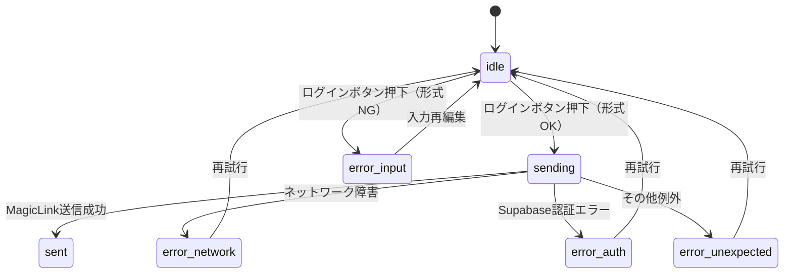
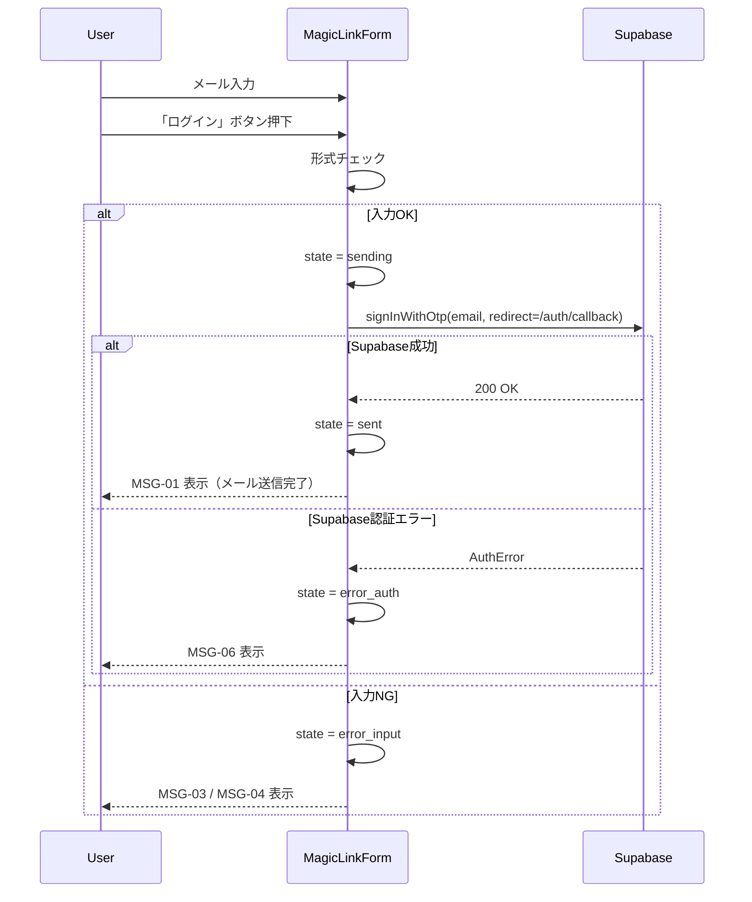

# HarmoNet 詳細設計書 - MagicLinkForm (A-01) v1.3

**Document ID:** HARMONET-COMPONENT-A01-MAGICLINKFORM-DESIGN
**Version:** 1.3
**Supersedes:** v1.2
**Created:** 2025-11-15
**Author:** Tachikoma
**Reviewer:** TKD
**Status:** Draft（A1 ログイン画面基本設計 v1.0 / MagicLink 基本設計 v1.0 / ログ設計 v1.1 反映版）

---

## 第1章 概要

### 1.1 コンポーネントの目的

MagicLinkForm（A-01）は、HarmoNet ログイン画面における **「メールでログイン」用カードタイル UI** を構成し、Supabase Auth の MagicLink 機能を利用してメール経由のログインリンク送信を行うフォームコンポーネントである。

本 v1.3 では、以下の仕様変更を反映する。

* **Passkey 認証との統合を廃止**し、MagicLinkForm は **MagicLink 専用フォーム** とする（Passkey は A-02 側の責務）。
* ログイン画面基本設計（A1）および MagicLink 基本設計 v1.0 に基づき、

  * 左側カードタイルとしての UI 構造
  * 入力〜送信〜結果表示までの状態遷移
  * 共通ログユーティリティ（`logInfo` / `logError`）によるイベント出力
    を再定義する。

### 1.2 責務

| 区分    | 内容                                                                                            |
| ----- | --------------------------------------------------------------------------------------------- |
| UI    | ログイン画面中央に表示される「メールでログイン」カードタイルの構成（タイトル、説明、メール入力欄、「ログイン」ボタン、メッセージ領域）。                          |
| ロジック  | メール形式チェック、Supabase への MagicLink 送信、状態管理（Idle / Sending / Sent / Error）。                       |
| メッセージ | A-00 LoginPage 詳細設計で定義された MSG-01〜MSG-06 をカード内で表示。                                             |
| ログ    | 共通ログユーティリティを使い、`auth.login.start` / `auth.login.success.magiclink` / `auth.login.fail.*` を出力。 |

Passkey に関する UI・ロジック・ログは **A-02 PasskeyAuthTrigger / Passkey ボタン側**で扱い、本コンポーネントでは一切扱わない。

### 1.3 前提・関連ドキュメント

* A1 Login Screen Basic Design
* Magic Link Basic Design
* A-00 LoginPage-detail-design
* HarmoNet 共通ログユーティリティ 詳細設計書

---

## 第2章 機能設計

### 2.1 Props 定義

MagicLinkForm は LoginPage 内で自己完結して動作するコンポーネントとし、Props は以下に限定する。

```ts
export interface MagicLinkFormProps {
  /** レイアウト調整用の追加クラス（任意） */
  className?: string;

  /** MagicLink 送信完了時の通知コールバック（任意） */
  onSent?: () => void;

  /** 重要なエラー発生時の通知コールバック（任意） */
  onError?: (error: MagicLinkError) => void;
}
```

* 旧版で使用していた `passkeyEnabled` Props は削除する（Passkey は A-02 側の責務）。

### 2.2 エラー型

ログイン画面ログ仕様の分類に合わせ、MagicLinkForm 内で扱うエラー種別を以下とする。

```ts
export type MagicLinkErrorType =
  | 'error_input'       // 入力バリデーションエラー
  | 'error_network'     // Supabase 通信エラー
  | 'error_auth'        // Supabase 認証エラー
  | 'error_unexpected'; // 想定外エラー

export interface MagicLinkError {
  code: string;    // Supabase error.code または内部コード
  message: string; // UI 表示用メッセージ（i18n 済）
  type: MagicLinkErrorType;
}
```

### 2.3 状態遷移

MagicLinkForm の内部状態は、MagicLink 基本設計のカード状態（Idle／Sending／Sent／Error）を詳細化して次のように定義する。

| 状態                 | 説明                           |
| ------------------ | ---------------------------- |
| `idle`             | 初期状態。メール入力待ち。                |
| `sending`          | MagicLink 送信中。ボタンは disabled。 |
| `sent`             | MagicLink 送信完了。MSG-01 を表示。   |
| `error_input`      | 入力バリデーションエラー（MSG-03/04）。     |
| `error_network`    | 通信エラー（MSG-05）。               |
| `error_auth`       | Supabase 認証エラー（MSG-06）。      |
| `error_unexpected` | 想定外の例外（MSG-09）。              |

状態遷移概要：



---

## 第3章 処理フロー

### 3.1 正常系（MagicLink 送信）



### 3.2 異常系フロー

* ネットワークエラー：`fetch` 例外や `Supabase` からのネットワークエラーコードを `error_network` にマッピングし、MSG-05 を表示。
* 想定外エラー：上記に分類できない例外は `error_unexpected` として扱い、MSG-09 を表示しつつ `auth.login.fail.unexpected` をログ出力する。

---

## 第4章 UI仕様

### 4.1 カードタイル構成

MagicLink 基本設計に基づき、カードタイルは以下の要素で構成される。

* アイコン：メールアイコン
* タイトル：`t('auth.login.magiclink.title')`（例：「メールでログイン」）
* 説明文：`t('auth.login.magiclink.description')`
* メール入力フィールド
* 「ログイン」ボタン
* メッセージ領域

### 4.2 JSX 構造（概要）

```tsx
<div className={cardClassName} data-testid={testId}>
  <div className="flex items-start gap-3">
    <MailIcon className="w-7 h-7 text-gray-500" aria-hidden="true" />
    <div className="flex-1">
      <h2 className="text-base font-medium text-gray-900">
        {t('auth.login.magiclink.title')}
      </h2>
      <p className="mt-1 text-sm text-gray-600">
        {t('auth.login.magiclink.description')}
      </p>
    </div>
  </div>

  <form className="mt-4 space-y-3" onSubmit={handleSubmit} noValidate>
    <label className="block text-sm font-medium text-gray-700" htmlFor="email">
      {t('auth.login.email.label')}
    </label>
    <input
      id="email"
      type="email"
      autoComplete="email"
      className={emailInputClassName}
      value={email}
      onChange={handleChange}
      disabled={state === 'sending'}
    />

    {state === 'error_input' && (
      <InlineFieldError>{inlineErrorMessage}</InlineFieldError>
    )}

    <button
      type="submit"
      className={loginButtonClassName}
      disabled={state === 'sending'}
    >
      {state === 'sending'
        ? t('auth.login.magiclink.button_sending')
        : t('auth.login.magiclink.button_login')}
    </button>

    <AuthErrorBanner
      kind={bannerKind}
      message={bannerMessage}
    />
  </form>
</div>
```

* カード自体のスタイルは A1 のカードタイル仕様（rounded-2xl、shadow 最小、高さ 80〜92px）に準拠。

### 4.3 メッセージ表示

A-00 詳細設計で定義されたメッセージ仕様と整合させる。

| 状態                 | 表示種別         | 使用メッセージ                            |
| ------------------ | ------------ | ---------------------------------- |
| `sent`             | Info         | MSG-01 `auth.login.magiclink_sent` |
| `error_input`      | Inline Error | MSG-03 / MSG-04                    |
| `error_network`    | Banner Error | MSG-05                             |
| `error_auth`       | Banner Error | MSG-06                             |
| `error_unexpected` | Banner Error | MSG-09                             |

---

## 第5章 ロジック仕様

### 5.1 コアロジック

```tsx
const handleLogin = async (): Promise<void> => {
  if (!validateEmail(email)) {
    const error: MagicLinkError = {
      code: 'INVALID_EMAIL',
      message: t('auth.login.error.email_invalid'),
      type: 'error_input',
    };

    setState('error_input');
    setInlineErrorMessage(error.message);
    logError('auth.login.fail.input', {
      screen: 'LoginPage',
      method: 'magiclink',
    });
    onError?.(error);
    return;
  }

  try {
    setState('sending');
    setBanner(null);

    logInfo('auth.login.start', {
      screen: 'LoginPage',
      method: 'magiclink',
      email, // 実際のログ出力時に共通ログユーティリティ側でマスキングされる前提。
    });

    const { error } = await supabase.auth.signInWithOtp({
      email,
      options: {
        shouldCreateUser: false,
        emailRedirectTo: `${window.location.origin}/auth/callback`,
      },
    });

    if (error) {
      const isAuthError = isSupabaseAuthError(error);
      const errorType: MagicLinkErrorType = isAuthError
        ? 'error_auth'
        : 'error_network';

      const messageKey = isAuthError
        ? 'auth.login.error.auth'
        : 'auth.login.error.network';

      const magicError: MagicLinkError = {
        code: error.code ?? 'SUPABASE_ERROR',
        message: t(messageKey),
        type: errorType,
      };

      setState(errorType);
      setBanner({ kind: 'error', message: magicError.message });

      logError(
        isAuthError
          ? 'auth.login.fail.supabase.auth'
          : 'auth.login.fail.supabase.network',
        {
          screen: 'LoginPage',
          method: 'magiclink',
          code: error.code,
        },
      );

      onError?.(magicError);
      return;
    }

    // 成功
    setState('sent');
    setBanner({ kind: 'info', message: t('auth.login.magiclink_sent') });

    logInfo('auth.login.success.magiclink', {
      screen: 'LoginPage',
      method: 'magiclink',
    });

    onSent?.();
  } catch (err: any) {
    const magicError: MagicLinkError = {
      code: err?.code ?? 'UNEXPECTED',
      message: t('auth.login.error.unexpected'),
      type: 'error_unexpected',
    };

    setState('error_unexpected');
    setBanner({ kind: 'error', message: magicError.message });

    logError('auth.login.fail.unexpected', {
      screen: 'LoginPage',
      method: 'magiclink',
      reason: err?.message ?? 'unknown',
    });

    onError?.(magicError);
  }
};
```

### 5.2 ローカルヘルパ

```ts
const validateEmail = (value: string): boolean => {
  if (!value) return false;
  // 簡易形式チェック。本格的な RFC 対応は不要。
  return /.+@.+\..+/.test(value);
};

const isSupabaseAuthError = (error: { code?: string }): boolean => {
  // 例: 'invalid_credentials', 'user_not_found' などを認証系とみなす
  return !!error.code && !['NETWORK_ERROR', 'FETCH_ERROR'].includes(error.code);
};
```

---

## 第6章 ログ出力仕様（A-01 観点）

A-00 / ログ詳細設計で定義されたイベントに従い、MagicLinkForm からは以下のタイミングでログを出力する。

| タイミング           | event 値                            | レベル   | 備考                                    |
| --------------- | ---------------------------------- | ----- | ------------------------------------- |
| フォーム初期表示（任意・拡張） | `auth.login.page.mount`            | INFO  | LoginPage 側で出力してもよい。                  |
| ログインボタン押下（形式OK） | `auth.login.start`                 | INFO  | `method: 'magiclink'` を context に含める。 |
| MagicLink 送信成功  | `auth.login.success.magiclink`     | INFO  | 成功時のみ。                                |
| 入力不備（形式NG）      | `auth.login.fail.input`            | ERROR | `type = 'error_input'`。               |
| Supabase 通信エラー  | `auth.login.fail.supabase.network` | ERROR | `type = 'error_network'`。             |
| Supabase 認証エラー  | `auth.login.fail.supabase.auth`    | ERROR | `type = 'error_auth'`。                |
| 想定外エラー          | `auth.login.fail.unexpected`       | ERROR | `type = 'error_unexpected'`。          |

ログ出力はすべて `logInfo` / `logError` を通じて行い、`console.*` を直接呼び出さない。

---

## 第7章 テスト設計

MagicLinkForm 単体の Jest + RTL テスト観点を整理する。

| ID        | シナリオ                        | 期待結果                                                                                        |
| --------- | --------------------------- | ------------------------------------------------------------------------------------------- |
| UT-A01-01 | 正常：有効なメールでログインボタン押下         | Supabase signInWithOtp が 1 回呼ばれ、state=`sent`、MSG-01 表示、`auth.login.success.magiclink` ログ出力。 |
| UT-A01-02 | 入力不正：空文字                    | state=`error_input`、InlineError 表示、`auth.login.fail.input` ログ出力。                            |
| UT-A01-03 | 入力不正：形式不正                   | 同上。                                                                                         |
| UT-A01-04 | Supabase 通信エラー              | state=`error_network`、MSG-05 表示、`auth.login.fail.supabase.network` ログ出力。                    |
| UT-A01-05 | Supabase 認証エラー              | state=`error_auth`、MSG-06 表示、`auth.login.fail.supabase.auth` ログ出力。                          |
| UT-A01-06 | 想定外エラー（例：throw new Error()） | state=`error_unexpected`、MSG-09 表示、`auth.login.fail.unexpected` ログ出力。                       |
| UT-A01-07 | i18n 切替                     | locale を `ja` → `en` に切替時、ボタンラベルとメッセージが切り替わる。                                               |

---

## 第8章 結合・運用設計（A-00 / A-02 との関係）

* LoginPage (A-00) は MagicLinkForm を 1 枚のカードタイルとして配置し、Passkey 用カードタイルは A-02 側の設計に従って別コンポーネントとして配置する。
* PasskeyAuthTrigger (A-02) は、Passkey ボタンからのみ呼び出され、MagicLinkForm からは呼び出さない。
* LoginPage 詳細設計に定義されたメッセージ・ログ仕様と完全に整合するよう、本書の状態・メッセージ・ログイベントを定義した。

---

## 第9章 セキュリティ・非機能

* MagicLink のトークン生成・検証は Supabase 側で行う前提とし、クライアント側にはトークン値を露出しない。
* エラー時のメッセージは内部情報を含まず、ユーザーに次のアクション（再入力・再試行）を伝えるレベルに留める。
* 連続送信によるスパム対策として、将来的にクールダウン時間や回数制限を導入する余地を残す（本 v1.3 では仕様のみ記載）。

---

## 第10章 改訂履歴

| Version | Date       | Author    | Summary                                                                                                         |
| ------- | ---------- | --------- | --------------------------------------------------------------------------------------------------------------- |
| 1.1     | 2025-11-12 | Tachikoma | Passkey 統合方式による単一ボタン設計（旧仕様）。                                                                                    |
| 1.2     | 2025-11-14 | Tachikoma | PasskeyAuthTrigger v1.2 と整合した自動判定ロジック（旧仕様・廃止）。                                                                  |
| **1.3** | 2025-11-15 | Tachikoma | **ログイン画面基本設計・MagicLink 基本設計に合わせ、MagicLink 専用カードタイルとして再定義。Passkey 統合を廃止し、ログ・メッセージ仕様を A-00 / ログ詳細設計 v1.1 と完全整合。** |

---

**End of Document**
