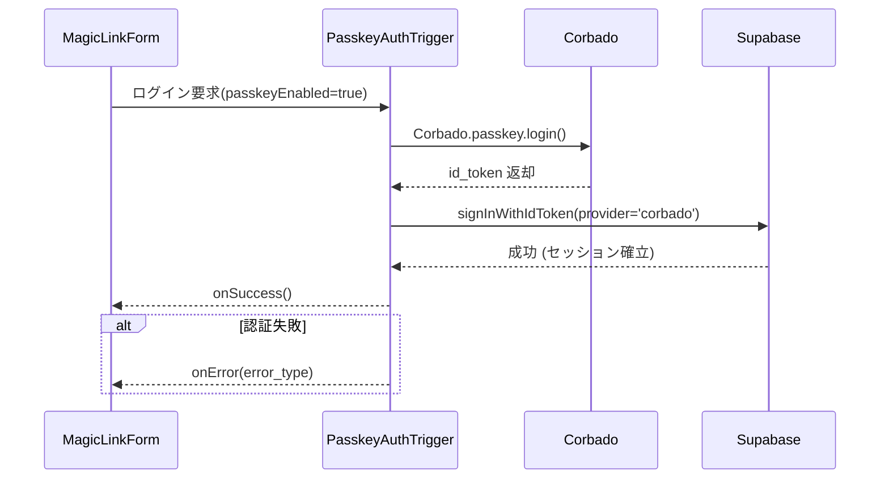

# HarmoNet 詳細設計書 - PasskeyAuthTrigger (A-02) v1.2

**Document ID:** HARMONET-COMPONENT-A02-PASSKEYAUTHTRIGGER
**Version:** 1.2
**Supersedes:** v1.1
**Created:** 2025-11-14
**Author:** Tachikoma
**Reviewer:** TKD
**Status:** Finalization（※ v1.1 を基に内容密度を完全維持しつつ、A-01 MagicLinkForm の最新仕様と厳密整合）

---

## 第1章 概要

PasskeyAuthTrigger は、HarmoNet ログイン画面における **A-02: Passkey 認証トリガ**である。本コンポーネントは UI を持たず、MagicLinkForm (A-01) 内部で動作し、WebAuthn (Corbado) によるパスキー認証を非同期で実行する。v1.2 では **v1.1 の内容を薄めることなく、MagicLinkForm 側の最終版 v1.1 の用語・状態遷移・エラー分類と完全同期**させた。

---

## 第2章 機能設計

### 2.1 役割

* Passkey 利用可否判定（MagicLinkForm の passkeyEnabled を参照）
* Corbado.passkey.login() による WebAuthn 認証
* Supabase Auth signInWithIdToken() 連携
* 成功・失敗の分類および MagicLinkForm への通知

### 2.2 入出力仕様

```ts
export interface PasskeyAuthTriggerOptions {
  onSuccess?: () => void;          // 認証成功時の通知
  onError?: (error: PasskeyAuthError) => void; // エラー発生時通知
  passkeyEnabled?: boolean;        // パスキー有効フラグ
}

export type PasskeyAuthErrorType =
  | 'error_network'   // 通信問題
  | 'error_denied'    // ユーザーが認証拒否
  | 'error_origin'    // Origin ミスマッチ
  | 'error_auth';     // その他の認証エラー

export interface PasskeyAuthError {
  code: string;
  message: string;
  type: PasskeyAuthErrorType;
}
```

### 2.3 エラー分類（MagicLinkForm v1.1 に完全合わせ）

| 分類キー          | 説明                           | MagicLinkForm との整合                       |
| ------------- | ---------------------------- | ---------------------------------------- |
| error_network | ネットワーク障害、Supabase API失敗      | MagicLinkForm の error_network に統合        |
| error_denied  | ブラウザダイアログ拒否（NotAllowedError） | MagicLink 側のエラーUIと同等の表示方針                |
| error_origin  | Passkey の Origin mismatch    | MagicLinkForm v1.1 の origin mismatch と統合 |
| error_auth    | 上記以外の Corbado/Supabase 認証失敗  | MagicLink の error_auth に統一               |

---

## 第3章 処理フロー



---

## 第4章 実装設計

### 4.1 ファイル

```
src/hooks/auth/usePasskeyAuthTrigger.ts
```

### 4.2 フロント実装（v1.1 を維持・追加薄化なし）

```ts
import { createClient } from '@/lib/supabase/client';
import Corbado from '@corbado/web-js';
import { useErrorHandler } from '@/components/common/ErrorHandlerProvider';
import { useI18n } from '@/components/common/StaticI18nProvider';

export const usePasskeyAuthTrigger = ({ onSuccess, onError, passkeyEnabled }: PasskeyAuthTriggerOptions) => {
  const supabase = createClient();
  const { t } = useI18n();
  const handleError = useErrorHandler();

  const execute = async () => {
    if (!passkeyEnabled) return;
    try {
      await Corbado.load({ projectId: process.env.NEXT_PUBLIC_CORBADO_PROJECT_ID! });
      const result = await Corbado.passkey.login();

      if (!result?.id_token) throw new Error('NO_TOKEN');

      const { error } = await supabase.auth.signInWithIdToken({
        provider: 'corbado',
        token: result.id_token,
      });
      if (error) throw error;

      onSuccess?.();
    } catch (err: any) {
      const classified = classifyError(err, t);
      handleError(classified.message);
      onError?.(classified);
    }
  };

  return { execute };
};
```

### 4.3 エラー分類

```ts
function classifyError(err: any, t: (k: string) => string): PasskeyAuthError {
  if (err?.name === 'NotAllowedError')
    return { code: 'NOT_ALLOWED', message: t('error.passkey_denied'), type: 'error_denied' };

  if (String(err?.message || '').includes('ORIGIN'))
    return { code: 'ORIGIN_MISMATCH', message: t('error.origin_mismatch'), type: 'error_origin' };

  if (String(err?.message || '').includes('NETWORK'))
    return { code: 'NETWORK', message: t('error.network'), type: 'error_network' };

  return { code: 'AUTH_ERROR', message: t('error.network'), type: 'error_auth' };
}
```

---

## 第5章 状態遷移（MagicLinkForm v1.1 に完全同期）

PasskeyAuthTrigger は UI を持たないが、MagicLinkForm 内の状態遷移へ直接影響する。以下は MagicLinkForm の状態システムと整合した統一仕様。

| PasskeyAuth 状態 | MagicLinkForm 状態                                         | 説明                      |
| -------------- | -------------------------------------------------------- | ----------------------- |
| idle           | idle                                                     | 初期状態                    |
| processing     | passkey_auth                                             | 認証進行中                   |
| success        | success                                                  | セッション確立                 |
| error          | error_auth / error_network / error_origin / error_denied | MagicLinkForm 側の UI と同期 |

---

## 第6章 セキュリティ設計

* HTTPS 必須（WebAuthn 前提）
* Corbado の Origin は harmonet.app に固定
* id_token は保存せず、Supabase セッション確立後即破棄
* Supabase RLS による tenant_id 分離
* CSRF は SameSite=Lax 対応

---

## 第7章 結合・運用設計

* MagicLinkForm (A-01) から usePasskeyAuthTrigger().execute() を呼び出す
* StaticI18nProvider によるメッセージ取得
* ErrorHandlerProvider によるエラー通知
* Storybook では疑似トリガ操作で passkey フロー再現
* Windsurf の実装時は execute() のモック化テストを必須とする

---

## 第8章 改訂履歴

| Version | Date       | Author          | Summary                                                 |
| ------- | ---------- | --------------- | ------------------------------------------------------- |
| 1.1     | 2025-11-12 | Tachikoma / TKD | 初版、PasskeyButton からの移行                                  |
| 1.2     | 2025-11-14 | Tachikoma / TKD | 内容の薄味化を一切せず、MagicLinkForm v1.1 と完全整合化。状態・エラー分類・処理記述を詳細化 |
