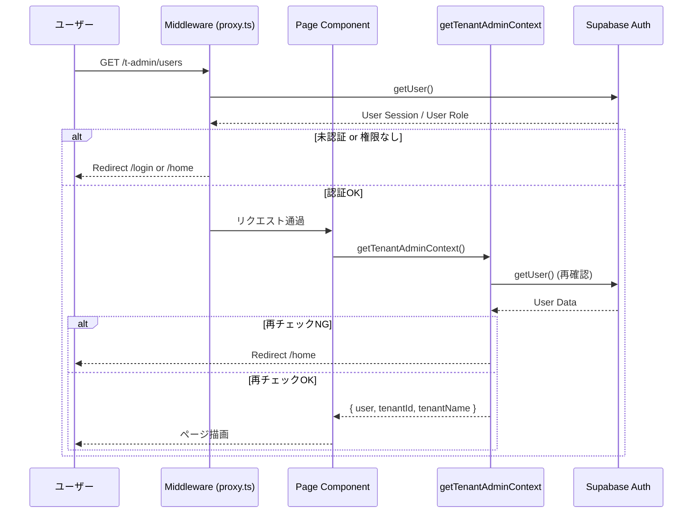
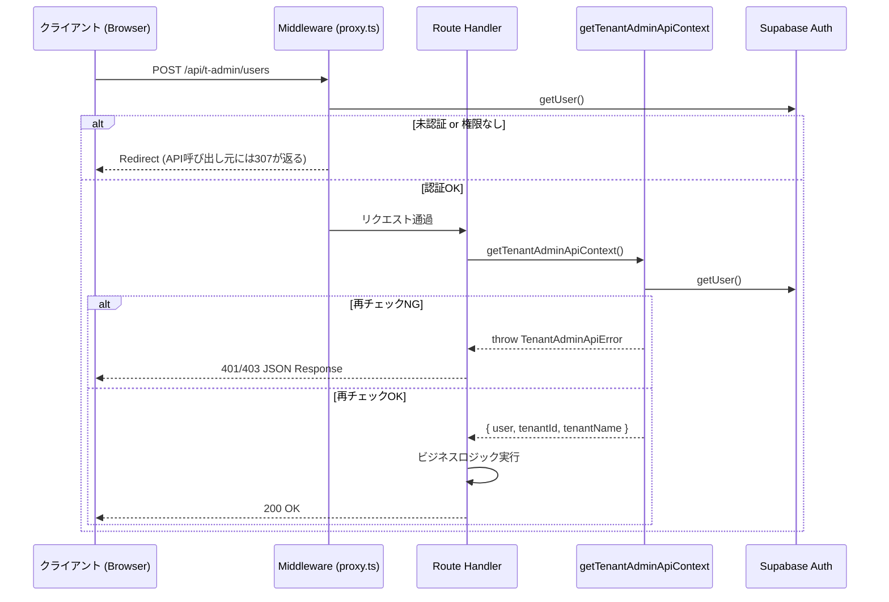

# HarmoNet 認証ガード 詳細設計書

| 項目 | 内容 |
| :--- | :--- |
| ドキュメントID | harmonet-auth-guard-detail-design |
| バージョン | v1.1 |
| 作成日 | 2025/12/01 |
| 作成者 | Antigravity |
| 更新日 | 2025/12/01 |
| ステータス | 改訂版 |

## 1. モジュール構成

本機能は以下のファイルで構成される。

| ファイルパス | 役割 | 依存関係 |
| :--- | :--- | :--- |
| `src/proxy.ts` | Next.js Middleware。リクエストの一次ガード。 | `@supabase/ssr`, `next/server` |
| `src/lib/supabase/middleware.ts` | Middleware用のSupabaseセッション更新ロジック。 | `@supabase/ssr`, `next/server` |
| `src/lib/auth/tenantAdminAuth.ts` | テナント管理者用Server Helper。 | `src/lib/supabaseServerClient`, `src/lib/supabaseServiceRoleClient`, `next/navigation` |
| `src/lib/auth/systemAdminAuth.ts` | システム管理者用Server Helper。 | `src/lib/supabaseServerClient`, `src/lib/supabaseServiceRoleClient`, `next/navigation` |

## 2. 処理フロー (シーケンス図)

### 2.1. ページアクセス時のフロー (`/t-admin/*`)



### 2.2. APIアクセス時のフロー (`/api/t-admin/*`)



## 3. 関数・メソッド仕様

### 3.1. `src/proxy.ts`

#### `middleware(request: NextRequest)`
*   **概要**: Next.jsのエントリーポイント。
*   **引数**: `request` (NextRequest) - 受信したリクエストオブジェクト。
*   **戻り値**: `Promise<NextResponse>`
*   **処理**:
    1.  `updateSession(request)` を呼び出す。
    2.  `updateSession` の結果（レスポンス）をそのまま返す。

### 3.2. `src/lib/supabase/middleware.ts`

#### `updateSession(request: NextRequest)`
*   **概要**: セッションの更新とロールチェックを行う。
*   **引数**: `request` (NextRequest)
*   **戻り値**: `Promise<NextResponse>`
*   **処理詳細**:
    1.  `createServerClient` でSupabaseクライアントを生成。
    2.  `supabase.auth.getUser()` でユーザー情報を取得。
    3.  **ガード条件**:
        *   リクエストパスが `/t-admin` で始まる場合:
            *   `user` が `null` (未ログイン) -> `/login` へリダイレクト。
            *   `user.app_metadata.tenants` 配下に `tenant_admin` ロールを持つテナントが存在しない -> `/home` へリダイレクト。
        *   リクエストパスが `/sys-admin` で始まる場合 (ただし `/sys-admin/login` は除く):
            *   `user` が `null` (未ログイン) -> `/sys-admin/login` へリダイレクト。
            *   `user_roles` テーブルに `system_admin` ロールが存在しない -> `/home` へリダイレクト。
    4.  条件を満たす場合、またはガード対象外のパスの場合、`response` オブジェクト（Cookie更新済み）を返す。

### 3.3. `src/lib/auth/tenantAdminAuth.ts`

#### `getTenantAdminContext()`
*   **概要**: Server Components用コンテキスト取得。
*   **引数**: なし
*   **戻り値**: `Promise<{ user: User, tenantId: string, tenantName: string }>`
*   **例外**: なし (内部で `redirect` を投げるため)
*   **処理詳細**:
    1.  `createSupabaseServerClient` でクライアント生成。
    2.  `getUser()` でユーザー取得。エラーなら `/login` へリダイレクト。
    3.  `user.app_metadata.tenants` から `tenant_admin` ロールを持つ最初のテナントIDを取得。なければ `/home` へリダイレクト。
    4.  `createSupabaseServiceRoleClient` を使用し、`tenants` テーブルからテナント名を取得。
    5.  取得した情報をオブジェクトとして返す。

#### `getTenantAdminApiContext()`
*   **概要**: API Route用コンテキスト取得。
*   **引数**: なし
*   **戻り値**: `Promise<{ user: User, tenantId: string, tenantName: string }>`
*   **例外**: `TenantAdminApiError`
*   **処理詳細**:
    1.  `getTenantAdminContext` と同様のチェックを行う。
    2.  ただし、リダイレクトの代わりに `TenantAdminApiError` を throw する。
        *   未ログイン -> `code: 'UNAUTHORIZED'`
        *   権限なし -> `code: 'FORBIDDEN'`

### 3.4. `src/lib/auth/systemAdminAuth.ts`

#### `getSystemAdminContext()`
*   **概要**: Server Components用コンテキスト取得。
*   **引数**: なし
*   **戻り値**: `Promise<{ user: User, adminClient: SupabaseClient }>`
*   **例外**: なし (内部で `redirect` を投げるため)
*   **処理詳細**:
    1.  `createSupabaseServerClient` でクライアント生成。
    2.  `getUser()` でユーザー取得。エラーなら `/sys-admin/login` へリダイレクト。
    3.  `createSupabaseServiceRoleClient` を使用し、`user_roles` テーブルから `system_admin` ロールを確認。なければ `/sys-admin/login` へリダイレクト。
    4.  取得した情報とサービスロールクライアントを返す。

#### `getSystemAdminApiContext()`
*   **概要**: API Route用コンテキスト取得。
*   **引数**: なし
*   **戻り値**: `Promise<{ user: User, adminClient: SupabaseClient }>`
*   **例外**: `SystemAdminApiError`
*   **処理詳細**:
    1.  `getSystemAdminContext` と同様のチェックを行う。
    2.  リダイレクトの代わりに `SystemAdminApiError` を throw する。

### 3.5. エラークラス

#### `TenantAdminApiError`
*   **継承**: `Error`
*   **プロパティ**: `code: 'UNAUTHORIZED' | 'FORBIDDEN'`

#### `SystemAdminApiError`
*   **継承**: `Error`
*   **プロパティ**: `code: 'UNAUTHORIZED' | 'FORBIDDEN'`

## 4. エラーレスポンス仕様 (API)

APIルートにおいてエラーが発生した場合、以下のJSONフォーマットでレスポンスを返す。

### 4.1. Unauthorized (401)
*   **発生条件**: ユーザーがログインしていない、またはセッションが無効。
*   **レスポンス**:
    ```json
    {
      "error": "Unauthorized"
    }
    ```

### 4.2. Forbidden (403)
*   **発生条件**: ログインしているが、必要なロール（`tenant_admin` または `system_admin`）を持っていない。
*   **レスポンス**:
    ```json
    {
      "error": "Forbidden"
    }
    ```
