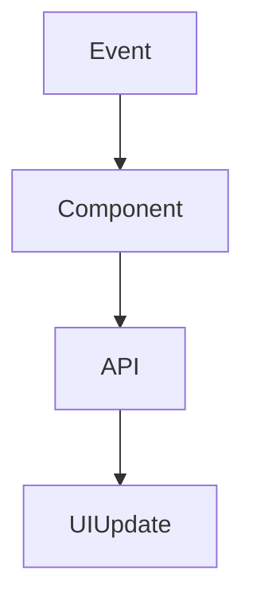

# HarmoNet 詳細設計書アジェンダ標準 v1.0

**Document ID:** HARMONET-DETAIL-DESIGN-AGENDA-STANDARD  
**Version:** 1.0  
**Created:** 2025-11-11  
**Author:** Tachikoma  
**Reviewer:** TKD  
**Status:** 正式共通テンプレート（安全テンプレートモード適用）  
**ContextKey:** HarmoNet_DetailDesign_Agenda_v1.0

---

## 第1章：概要

### 1.1 目的
本書は、HarmoNetプロジェクトにおける**詳細設計書の標準アジェンダ**を定義する。以後すべての詳細設計書は本構成を基準とし、章構成・記述密度・UT観点・ChangeLog構成を統一する。目的：
- 設計文書間の品質・粒度を均一化
- Claude / Windsurf / Gemini 間の相互参照精度を維持
- 開発工程での手戻りを最小化

### 1.2 責務・役割
| 区分 | 責任主体 | 内容 |
|------|-----------|------|
| 設計書作成 | Claude | 本アジェンダ基準で詳細設計作成 |
| レビュー | Gemini / Tachikoma | 技術整合・記述密度・UT観点検証 |
| 実装 | Windsurf | 本アジェンダ準拠でコード生成 |

### 1.3 背景・前提技術
- Next.js 16 / React 19 / TypeScript 5.6
- TailwindCSS 3.4 + shadcn/ui
- Supabase v2.43（PostgreSQL 17, RLS有効）
- StaticI18nProviderによる多言語化
- Corbado SDK（MagicLink + Passkey認証）

### 1.4 関連コンポーネント
`機能コンポーネント一覧.md` に準拠。各設計書は Component ID を冒頭に明記。

### 1.5 技術バージョン
本アジェンダは **harmonet-technical-stack-definition_v4.0** に完全整合。

### 1.6 ドキュメント構成
章番号・節番号は変更不可。以後すべての詳細設計書で固定。

---

## 第2章：機能設計

### 2.1 機能要約
- コンポーネントの責務・想定シナリオを明記
- 非機能要件（セキュリティ、性能、UX）への影響も含む

### 2.2 入出力仕様（Props / Context / Hooks）
- Props型・イベント・Context参照・返却値を定義
- TypeScript構文でコメント付き記述

### 2.3 処理フロー（Mermaid）

### 2.4 依存関係（内部・外部）
- 内部依存（共通部品）と外部依存（SDK/ライブラリ）を分離表で記載

### 2.5 副作用と再レンダー設計
- useEffect等の呼出条件・依存配列を表
- 不要再レンダー防止方針を明記（useCallback / memo）

### 2.6 人間操作に基づくUT観点（最小セット）
| 観点ID | 操作 | 期待結果 | テスト目的 |
|---|---|---|---|
| UT01 | 正常操作 | UI状態変化 | 人間操作で機能確認 |
| UT02 | 異常操作 | エラーUI表示 | 例外ハンドリング確認 |
| UT03 | 翻訳切替 | 言語即時切替 | StaticI18nProvider確認 |
| UT04 | ロール別表示 | 表示要素変更 | 権限依存確認 |
| UT05 | 再レンダー抑制 | 不要再描画なし | パフォーマンス確認 |

---

## 第3章：構造設計

### 3.1 コンポーネント構成図
- 親子・依存関係をMermaidまたはツリーで表現

### 3.2 Props定義・型仕様
- TypeScriptコードブロック＋解説表

### 3.3 Props制約仕様
- 必須 / 任意 / デフォルト値を明示
- 想定外入力の扱いも記載

### 3.4 イベント・ハンドラ設計
- UI操作→ロジック処理→状態更新を整理

### 3.5 Context・Provider連携
- StaticI18nProvider / ErrorHandlerProvider 等の接続関係を記載

### 3.6 i18nキー仕様
- 翻訳キー命名規則例：`auth.passkey.button`
- common.json との対応表を併記

---

## 第4章：実装設計

### 4.1 コード構成・ディレクトリ
- src配下の構成をパス付きで記載

### 4.2 主要ロジック（コード抜粋）
- 実装中核部分を抜粋・解説付き

### 4.3 状態管理・副作用制御
- useState, useEffect, useCallback の使用方針を明示

### 4.4 エラーハンドリング設計
- ErrorHandlerProvider / ErrorLoggerService 連携方針

### 4.5 セキュリティ仕様
- UI層・認証層・通信層の対策を明示

### 4.6 パフォーマンス設計
- 不要レンダー対策・遅延ロード・非同期抑制策を明記

---

## 第5章：UI仕様

### 5.1 JSX構造
- 親要素から子要素までのDOMツリー構造

### 5.2 スタイリング（Tailwind構成）
- クラス・色・余白・角丸・影・フォントなど基準を具体的に

### 5.3 状態別UI
- loading / success / error / disabled 状態の表示差を定義

### 5.4 アイコン仕様
- lucide-reactなどの使用アイコン名・意味

### 5.5 翻訳仕様（StaticI18nProvider）
- t('key') で取得、辞書は common.json に格納

### 5.6 アクセシビリティ仕様
- ARIA属性・キーボード操作・focus ring準拠

### 5.7 トランジション・アニメーション
- motion設定・遷移条件・時間指定（ms単位）

### 5.8 テスト設計（UI観点）
- UIステート・レスポンシブ・翻訳切替の確認表を記載

---

## 第6章：ロジック仕様

### 6.1 処理フロー詳細
- 各イベントに対する内部処理シーケンスを明示

### 6.2 エラー構造と再試行設計
- 例外分類・再試行ポリシー・UI連携

### 6.3 成功・失敗時処理
- API戻り値やイベント連携の成功・失敗処理を明記

### 6.4 状態遷移表
- 状態・入力イベント・遷移先・備考を整理

### 6.5 テスト設計（ロジック観点）
- Jestベースでロジック単体テスト項目を定義

### 6.6 セキュリティ考慮事項
- JWT / tenant_id / RLS対応の説明

### 6.7 パフォーマンス最適化
- キャッシュ・遅延ロード・メモ化の指針

---

## 第7章：結合・運用

### 7.1 他コンポーネント結合ポイント
- 呼出・親子構造・Provider依存関係

### 7.2 環境依存要素
- Supabase / SDK / 外部API / envキー

### 7.3 例外ログ出力方針
- ログ出力基準・出力先を明記

### 7.4 Storybook / Jest / E2E 結合設計
- Storybook構成・UI Snapshot・結合UT設計

### 7.5 リスク・制約事項
- ライブラリ制約・非同期リスク・ブラウザ差異

---

## 第8章：メタ情報

### 8.1 用語定義
- プロジェクト内用語・略称を明示

### 8.2 関連資料
- 参照ドキュメント一覧

### 8.3 ChangeLog
| Version | Date | Author | Summary |
|---------|------|--------|---------|
| 1.0 | 2025-11-11 | Tachikoma | 初版作成・全章構成確定 |

### 8.4 Reviewer / Author / Last Updated
| 項目 | 内容 |
|------|------|
| Reviewer | TKD |
| Author | Tachikoma |
| Last Updated | 2025-11-11 |

